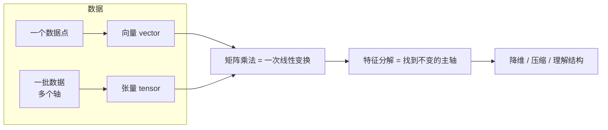
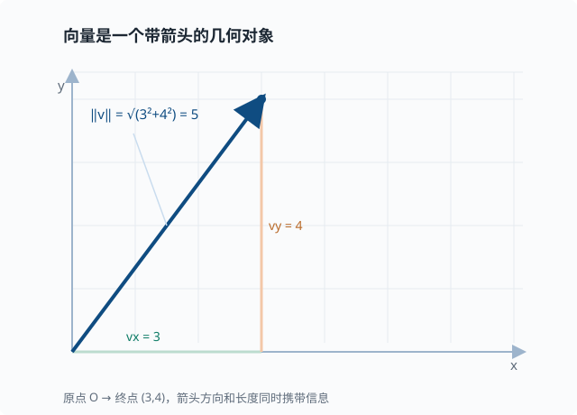
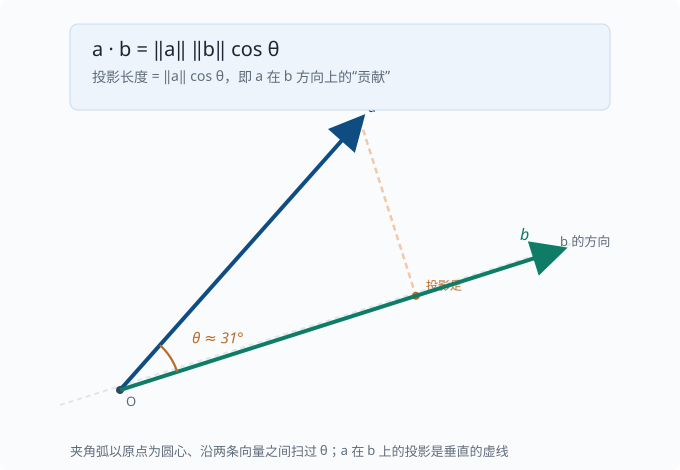
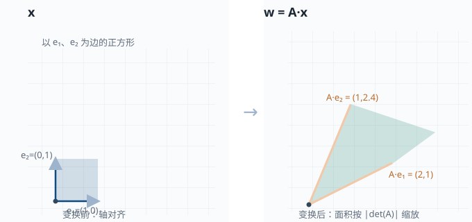
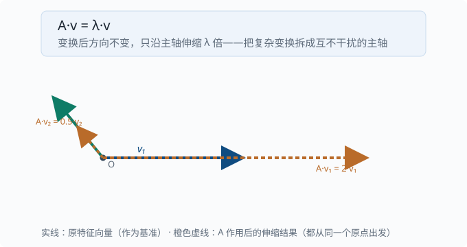

# 线性代数：向量、矩阵、张量

> 目标：从"考试符号"走向"数据表示的语言"。读完这一页，你能解释向量和矩阵的几何含义、张量与数据形状的关系、矩阵乘法为什么无处不在，以及特征分解在机器学习里解决什么问题。你还会看到，为什么训练一个语言模型（language model：给定前文、预测下一个词出现概率的模型——整套教程的主角，[05 章](../05-nlp-transformers/README.md) 起正式登场）时，唯一的运输工具就是"矩阵乘法"。

## 为什么线性代数是地基

先别想机器学习。想象你手边有几件日常的东西：

- 一张**超市小票**：每行是一种商品（苹果、牛奶、面包），每列是它的数量、单价、小计。
- 一**张照片**：所有像素点排成一个行列整齐的网格。
- 一份**通信录**：每行是一个联系人，每列是一个字段（姓名、电话、城市）。

这些看起来八竿子打不着的东西，有一个共同点：它们都是一串数字，整齐地排成**行和列**。散乱的数字很难被看清规律，可一旦排成矩形，每一格就有了明确的"身份"——它在第几行、第几列，读起来一目了然。

线性代数要做的，就是两件事：**用这种"数字矩形"去记录现实数据**，以及**研究"对整批数字做统一变换"的规则**。比如你给整张小票打个八折、把照片整体调亮、给通信录所有人换个城市字段——这些"对每一行做同一件事"的操作，正是线性代数最擅长的。

为什么它配得上"地基"这个称号？因为**把"一个东西"和"一批东西"统一起来处理**，是所有现代计算科学（包括机器学习）反复复用的模式：单个数据点是一个"向量"，一批数据就是一个"矩阵/张量"，一次统一变换就是"矩阵乘法"。先把这几块名字和含义对上，后面绝大多数符号都能挂上去。

这一页要建立的不是一堆孤立公式，而是一个贯穿后面所有章节的直觉骨架。先用一张图把四件最关键的事"串"起来：



把这四句话记牢，后面绝大多数符号都能挂上去：

```text
向量 = 一个数据点
张量 = 一批数据（带多个轴）
矩阵乘法 = 对数据做一次线性变换
特征分解 = 找到这个变换"不变的方向"
```

## 标量、向量、矩阵、张量

先分清四个"容器"，它们的区别只是**有多少个索引（轴）**：

| 名字 | 轴数 | 例子 | 一次"符号" | 直观含义 |
|---|---|---|---|---|
| 标量 scalar | 0 | 学习率 $0.001$ | $a$ | 单个数字 |
| 向量 vector | 1 | 一个人的身高体重 $(175,\,68)$ | $\mathbf{x}$ | 有序的一列数 |
| 矩阵 matrix | 2 | 一批样本 $3\times2$ | $\mathbf{X}$ | 二维表格 |
| 张量 tensor | $\ge 3$ | 一批图片 $32\times224\times224\times3$ | $\mathbf{T}$ | 更高维的排列 |

> 注意：在机器学习里，"张量"常用来泛指任何多维数组，包括向量和矩阵。NumPy 的 `ndarray`、PyTorch 的 `Tensor`、JAX 的 `Array` 本质都是同一个东西——多维数组外加专门的运算。（NumPy/PyTorch/JAX 是三个主流的数值计算库：NumPy 是 Python 里做数组运算的基础库，[02-02](../02-programming-basics/02-02-numpy.md) 会动手用它；PyTorch 与 JAX 是在它思想上加了 GPU 加速和自动求导的深度学习框架，[04 章](../04-deep-learning/README.md)起会反复出现。）

### 向量：既是数据点，也是几何箭头

先从一个很具体的问题说起：如果我想把"东西放在房间的哪个位置"告诉另一个人，光说"那儿"是不够的。更清楚的说法是"从门口进去，向右走 3 米、再朝里走 4 米"。这串"右 3、里 4"就是一条**信息**——它用两个数字，锁定了房间里的一个点。

像这样，用**一列有序的数字**去描述一个"位置"或一个"数据点"，这一列数就叫**向量**。我们规定（也写成惯例）：第一个数字表示横向，第二个表示纵向，顺序不能乱。比如二维向量

$$
\mathbf{v} = \begin{bmatrix} 3 \\ 4 \end{bmatrix}
$$

就在说"向右 3 格、向上 4 格"。把它从原点（门口）画到终点（那个位置），就得到一根**从原点出发的箭头**。所以向量有两副面孔：它既可以是一堆数据（身高、体重、价格），也可以是一个几何箭头（方向 + 长短）。

这个双重视角是后面所有内容的关键：**把数据当成箭头，就能用几何去"想"它**（朝哪个方向、有多长）；把箭头当成数据，就能用代数去"算"它（分量是几、加起来得几）。下面的图把"分量 + 长度"画在一起：箭头指向决定了方向，箭头的长短决定了模长。



它有两个基本量：

- **长度（范数）**：$\|\mathbf{v}\| = \sqrt{3^2 + 4^2} = 5$，是箭头从原点到终点的距离。
- **方向**：箭头指向的方向。

范数有很多种，最常用两个：

$$
\|\mathbf{v}\|_2 = \sqrt{v_1^2 + v_2^2 + \dots + v_n^2} \quad\text{L2，欧几里得长度}
$$

$$
\|\mathbf{v}\|_1 = |v_1| + |v_2| + \dots + |v_n| \quad\text{L1，曼哈顿距离}
$$

L1 在机器学习里很重要，因为它鼓励"稀疏"（很多分量恰好为 0），第 03 章的正则化（[03-04](../03-machine-learning/03-04-bias-variance.md)）会用到。

### 向量的内积（点积）与投影

还是从生活问题切入：你要判断**两根箭头是不是"顺着同一个方向"**。比如风是往东北吹，你要在同一段路线上骑车，风是推你还是挡你？只看风向还不够，还得看它跟你前行的方向**重合多少**。

把"重合多少"变成可以计算的量，就是**点积（内积）**想干的事。先别管它为什么叫这个名字，它的算法其实很朴素：把两个向量**对位相乘再相加**。

两个同长向量的内积是一个标量：

$$
\mathbf{a}\cdot\mathbf{b} = a_1 b_1 + a_2 b_2 + \dots + a_n b_n
$$

它返回的是**一个数**，而这个数恰好告诉你两件事：方向有多接近，以及各自的长度有多大。把长度的影响"剥掉"，剩下的部分由这个公式给出：

$$
\mathbf{a}\cdot\mathbf{b} = \|\mathbf{a}\|\,\|\mathbf{b}\|\,\cos\theta
$$

其中 $\theta$ 是两向量的夹角。读法：内积 = 甲的长度 × 乙的长度 × 夹角的余弦。当两向量长度固定时，内积的大小就完全由"夹角的余弦"决定——这正等于"方向重合度"。所以它能回答一个核心问题："一个向量在另一个方向上有多少贡献"。



绕着夹角转一圈，可以得到三个很好记的判据：

$$
\cos\theta > 0 \iff \text{方向相近};\quad
\cos\theta = 0 \iff \text{垂直（正交，orthogonal——即“垂直”的数学名字）};\quad
\cos\theta < 0 \iff \text{方向相反}
$$

> 深挖：投影与"相关性"。把 $\mathbf{a}$ 投影到 $\mathbf{b}$ 上，投影长度是 $(\mathbf{a}\cdot\mathbf{b})/\|\mathbf{b}\|$。如果我们把两个向量看成"两个变量的观测序列"，那么它们在"方向上的重合度"就和统计学里的相关性直接挂钩。这也是为什么后面的注意力机制（05 章）会反复算"两个向量的点积"——点积越大，两者越"相关"，值得更多关注。

### 矩阵：表格，也是变换规则

矩阵是向量按行拼起来的结果。一个 $m\times n$ 矩阵有 $m$ 行、$n$ 列。它的两种读法都很有用：

- **按行看**：每一行是一个数据样本，每列是一个特征。
- **按列看**：每一列是一个特征的取值序列。

```text
     病床数  年龄  体温
小明 [ 2    35   36.5 ]
小红 [ 3    42   37.1 ]
小刚 [ 1    28   36.2 ]
```

这是一个 $3\times3$ 矩阵：3 个样本（人），3 个特征。

### 张量：批量与形状

当数据有三个或更多轴时，就叫张量。张量的"形状"（shape）是一种被低估的强大工具——它本身就是信息。常见例子里，"批量"几乎总是最外层轴：

```text
一批灰度图： [batch, height, width]        e.g. [32, 224, 224]
一批彩色图： [batch, height, width, color] e.g. [32, 224, 224, 3]
一句话的向量序列：[seq_len, embedding]      e.g. [10, 512]
一批句子：     [batch, seq_len, embedding] e.g. [8, 10, 512]
```

Transformer 里到处是 `[batch, seq, d_model]` 这种三维张量——你会在 [05 章](../05-nlp-transformers/README.md) 反复见到。

## 矩阵乘法：一次变换

先回答一个"为什么"：既然我们能逐个数地相加、相乘，为什么还要发明一种更复杂的"矩阵乘法"？

回到小票的例子。假设你有一张账单（列：苹果、牛奶、面包），又有一张价格表（行：每样东西的单价）。你真正想要的是"这单一共多少钱"——可这需要**把每一行的数量分别乘以对应单价再求和**。如果订单有很多、商品也很多，这样逐行手算很快就乱。

矩阵乘法就是把这个"逐行 × 逐列 再累加"的机械劳动，压缩成一个统一的规则：**拿左边表格的一行，和右边表格的一列，对位相乘、再加起来，得到一个数，放进结果表格的对应位置。** 这一格就是"左边这一行与右边这一列的内积"（正好用上前面刚学的点积）。

正式地，给定矩阵 $\mathbf{A}$（$m\times k$）和 $\mathbf{B}$（$k\times n$），乘积 $\mathbf{C}=\mathbf{A}\cdot\mathbf{B}$ 是一个 $m\times n$ 矩阵，其中：

$$
C[i][j] = \sum_{p=1}^{k} A[i][p]\cdot B[p][j]
$$

也就是说，结果矩阵的第 $i$ 行第 $j$ 列，等于 $\mathbf{A}$ 的第 $i$ 行与 $\mathbf{B}$ 的第 $j$ 列的**内积**。

**维数要求**：$\mathbf{A}$ 的列数必须等于 $\mathbf{B}$ 的行数（都等于 $k$），否则乘法无定义。这是工程里最常见的报错来源之一。

### 直觉：为什么是"行乘列"

内积等于"投影大小"。所以矩阵乘法 $\mathbf{A}\cdot\mathbf{B}$ 可以理解为：

> $\mathbf{A}$ 的每一行是一个"观测器"，$\mathbf{B}$ 的每一列是"要观测的方向"，$\mathbf{C}$ 的每个元素就是所有方向上的累积投影。

还有另一种更实用、更强大的读法，叫作**线性变换**。什么是"变换"？想象你手里一整张照片：把它整体放大、旋转、倾斜，每个像素都跟着动，但**像素之间的相对排列不会被打乱**——直线还是直线，平行边还是平行边。这种"对整幅画面做一次统一操作"的规则，矩阵就能代表。

当一个矩阵 $\mathbf{A}$ 代表一种变换、"一批输入向量"（逐列）叠在它右边时，$\mathbf{A}\cdot\mathbf{B}$ 就是把这一批向量**逐列**各作用一次 $\mathbf{A}$ 的结果——等于"对整批数据同时做同一个变换"。下面这张图展示了"矩阵把一个单位正方形旋转并拉伸成平行四边形"——这就是"变换"的视觉含义。



### 三种等价的看待方式

同一个乘积，可以有三种读出，熟练后可在不同场景灵活切换：

1. **内积视角**：$C[i][j]$ 是行 $\times$ 列。
2. **线性组合视角**：$\mathbf{C}$ 的第 $j$ 列是 $\mathbf{A}$ 的各列按 $\mathbf{B}$ 第 $j$ 列的元素做加权组合。
3. **变换视角**：$\mathbf{A}$ 是一个变换，作用在 $\mathbf{B}$ 的每一列（或一批向量）上。

在神经网络里，一层网络通常可以写成

$$
\mathbf{z} = \mathbf{W}\cdot\mathbf{x} + \mathbf{b}
$$

其中 $\mathbf{W}$ 是权重矩阵，$\mathbf{x}$ 是输入向量。$\mathbf{W}$ 的每一行就是"这个神经元看重输入的哪些组合"。

### 一个手算例子

$$
\mathbf{A}=\begin{bmatrix}1&2\\3&4\end{bmatrix},\quad
\mathbf{B}=\begin{bmatrix}5&6\\7&8\end{bmatrix}
$$

$$
C[0][0]=1\cdot5+2\cdot7=19,\quad
C[0][1]=1\cdot6+2\cdot8=22
$$

$$
C[1][0]=3\cdot5+4\cdot7=43,\quad
C[1][1]=3\cdot6+4\cdot8=50
$$

所以 $\mathbf{A}\cdot\mathbf{B}=\begin{bmatrix}19&22\\43&50\end{bmatrix}$。自己拿笔算一遍，比看十遍都牢。

### 矩阵乘法的性质

- **不满足交换律**：$\mathbf{A}\cdot\mathbf{B}\ne\mathbf{B}\cdot\mathbf{A}$，顺序不可随便换。
- **满足结合律**：$(\mathbf{A}\cdot\mathbf{B})\cdot\mathbf{C}=\mathbf{A}\cdot(\mathbf{B}\cdot\mathbf{C})$。
- **满足分配律**：$\mathbf{A}\cdot(\mathbf{B}+\mathbf{C})=\mathbf{A}\cdot\mathbf{B}+\mathbf{A}\cdot\mathbf{C}$。
- **单位矩阵 $\mathbf{I}$**：$\mathbf{I}\cdot\mathbf{A}=\mathbf{A}\cdot\mathbf{I}=\mathbf{A}$，对角线为 1、其余为 0，作用像数字 $1$（"对角线"指从左上到右下那条斜线上的元素）。

> 术语卡：**对角矩阵**（diagonal matrix）指只有对角线（左上到右下的那条斜线）上可能有非零元素、其余全为 0 的方阵。单位矩阵是它最简单的特例（对角线全 1）。后面 01-08 会看到特征分解 $\mathbf{A}=\mathbf{Q}\Lambda\mathbf{Q}^{-1}$ 里的 $\Lambda$ 也是对角矩阵——对角线上正是各方向的特征值。
### 与逐元素乘积的区别

矩阵乘法（`@`）和逐元素乘积（`*`）是完全不同的两件事，初学者常混淆：

```python
import numpy as np
A = np.array([[1, 2], [3, 4]])
B = np.array([[5, 6], [7, 8]])

A @ B   # 矩阵乘法 (元素来自"行乘列"，需要形状匹配)
A * B   # 逐元素乘积：[[1*5, 2*6], [3*7, 4*8]]
```

在任何现代张量框架里，你会看到大量张量形状必须在 `@` 前对齐——形状不匹配通常是最常见的报错来源。

## 转置、逆与单位矩阵

### 转置

转置 $\mathbf{A}^\mathsf{T}$ 把矩阵的行和列互换：$A^\mathsf{T}[i][j]=A[j][i]$。

$$
\mathbf{A}=\begin{bmatrix}1&2&3\\4&5&6\end{bmatrix},\quad
\mathbf{A}^{\mathsf{T}}=\begin{bmatrix}1&4\\2&5\\3&6\end{bmatrix}
$$

转置在公式里到处都是，特别是把"行向量乘矩阵"和"矩阵乘列向量"来回转换时。两条必记性质：

$$
(\mathbf{A}^{\mathsf{T}})^{\mathsf{T}}=\mathbf{A};\qquad
(\mathbf{A}\mathbf{B})^{\mathsf{T}}=\mathbf{B}^{\mathsf{T}}\mathbf{A}^{\mathsf{T}}\ \text{（顺序反转）}
$$

第二条在反向传播（训练神经网络时"把误差从输出层逐层传回、算出每个参数该改多少"的算法，[04 章](../04-deep-learning/04-02-backpropagation.md)展开：$\partial L/\partial\mathbf{x}=\mathbf{W}^{\mathsf{T}}\mathbf{g}$）和注意力的 $\mathbf{Q}\mathbf{K}^{\mathsf{T}}$（[05 章](../05-nlp-transformers/05-05-attention.md)）里反复出现。

### 逆矩阵

如果存在矩阵 $\mathbf{A}^{-1}$ 使得 $\mathbf{A}\cdot\mathbf{A}^{-1}=\mathbf{A}^{-1}\cdot\mathbf{A}=\mathbf{I}$，就说 $\mathbf{A}$ 可逆。逆矩阵用来"解方程"：

$$
\text{若}\quad \mathbf{A}\cdot\mathbf{x}=\mathbf{b}\quad\text{且}\quad\mathbf{A}\ \text{可逆，则}\quad \mathbf{x}=\mathbf{A}^{-1}\cdot\mathbf{b}
$$

**直觉**：$\mathbf{A}$ 是一次变换，那么 $\mathbf{A}^{-1}$ 就是"把变换退回去"的操作。

注意：

- 只有方阵（行数=列数）才谈逆矩阵。
- 并非所有方阵都可逆——当某两行"线性相关"时，变换会把空间压扁，无法逆转。

## 线性相关、线性无关、秩

一组向量**线性相关**，是指其中某个能被其余向量线性组合出来：

```text
先看组合这个动作：3·[1,0] + 2·[0,1] = [3,2]（平面上的任何向量都能这样凑出来）
但 [1,0] 和 [0,1] 彼此是"无关"的（谁都凑不出谁——凑 [1,0] 只能靠它自己）
而 [1,2] 和 [2,4] 是"相关"的（后者是前者的 2 倍，留一个就够）
```

矩阵的**秩（rank）**是不相关行（或列）的最大数量。直觉上，秩告诉你有多少"真正独立的维度"：

- 满秩：信息没有丢失，变换可逆。
- 低秩：部分维度是冗余的，可以用更少的数据表达同样信息。

低秩是后面很多压缩技术的核心思想，比如 [01-08 矩阵分解](01-08-matrix-decomposition.md) 里的 SVD（奇异值分解——把一个矩阵拆成"三个简单矩阵的乘积"，从而看出哪些部分承载主要信息，到时候会展开）。

## 特征值与特征向量

再看一个看起来很具体的问题：当一张图被放大、旋转、倾斜之后，**有没有哪个方向上的箭头，方向完全没被改变，只是被拉长或缩短了**？

拿一根指针来说。把整幅画面旋转 30 度，这根指针被转到另一个方向——它"转"了。但如果这根指针恰好就沿着画面被拉伸的那个轴，它可能只是变长了一点，**方向保持没变**。找到这样的特殊方向，比盯着整幅画面省事得多：因为只要知道了"哪些方向不变、只是缩放"，整幅复杂变换的"骨架"就现形了。

矩阵语言就把这种"方向不变、只是缩放"的方向，叫作**特征向量**。给定方阵 $\mathbf{A}$，如果存在非零向量 $\mathbf{v}$ 和标量 $\lambda$ 满足

$$
\mathbf{A}\cdot\mathbf{v} = \lambda\cdot\mathbf{v}
$$

那么 $\mathbf{v}$ 叫 $\mathbf{A}$ 的**特征向量**，$\lambda$ 叫对应的**特征值**。

**含义**：$\mathbf{A}$ 作用在 $\mathbf{v}$ 上，只是把 $\mathbf{v}$ 拉长或压缩了 $\lambda$ 倍，方向不变。也就是说，$\mathbf{v}$ 是这个变换的一个"稳定方向"。



特征向量把复杂的变换拆成了几根互不干扰的"主轴"：

$$
\text{$\mathbf{A}$ 作用于任意向量} = \text{沿各主轴分别伸缩（伸缩量就是特征值）}
$$

这正是主成分分析（PCA）的原理：找数据方差最大、且彼此正交的几个特征向量，把高维数据投影到这些主轴上，实现降维。特征分解是理解很多模型的钥匙。

> 深挖：特征值的三种"量级语言"。$\lambda>1$ 表示拉伸、$0<\lambda<1$ 表示压缩、$\lambda<0$ 表示**反向**（先翻转方向再按 $|\lambda|$ 伸缩）。当特征值全是复数时，变换里还含着"旋转"成分——这正是后面理解注意力、以及复数值信号处理时的敏锐点。

> 进一步的延伸（SVD、PCA 的完整推导）放在 [01-08 矩阵分解](01-08-matrix-decomposition.md)，这一页先建立"特征值=伸缩量、特征向量=主轴"的直觉即可。

## 张量形状：被低估的调试工具

在实际工程里，张量**形状**几乎是最有用的第一手信息。养成习惯：写代码前后，先问"这个张量的 shape 是多少、每个轴代表什么"。读任何模型代码时，"这个数据长什么样、这一层接受什么、输出什么"都是最可靠的导航线索。

## 动手：把直觉变成代码

```python
import numpy as np

# 一个 3x2 的数据矩阵：3 个样本，2 个特征
X = np.array([[1.0, 2.0],
              [3.0, 4.0],
              [5.0, 6.0]])

print("shape:", X.shape)          # (3, 2)

# 权重矩阵：2 个输入特征 -> 3 个神经元
W = np.random.randn(2, 3)
Z = X @ W                          # 矩阵乘法，输出 (3, 3)
print("after linear layer:", Z.shape)

# 内积 = 方向相近程度
v1 = np.array([1.0, 0.0])
v2 = np.array([0.0, 1.0])
print("dot(v1,v2) =", v1 @ v2)     # 0.0，正交

# 一个 2x2 对角方阵的特征分解
M = np.array([[2.0, 0.0], [0.0, 0.5]])
vals, vecs = np.linalg.eig(M)
print("eigenvalues:", vals.round(3))   # [2, 0.5]
print("eigenvectors:\n", vecs.round(3))
```

## 思考题

1. 为什么矩阵乘法和逐元素乘积要用两个不同的运算符？举一个"必须用 `@`"的例子。
2. `[batch, seq, d_model]` 里批量为什么要放在最外层？如果放错会怎样？
3. 一个矩阵如果秩比行数小，说明数据里有什么现象？
4. 特征值 $\lambda$ 是负的，意味着这个方向上的变换做了什么？
5. 为什么"点积大 = 方向接近"能用来衡量两个向量/特征的相关性？这与后面注意力机制的直觉有什么呼应？

## 参考答案

1. 矩阵乘法 `@` 做的是"行 × 列"的**维度收缩**（把 $k$ 个分量线性组合成一个数），逐元素乘积 `*` 只是同位置相乘、维度不变。必须用 `@` 的场景：把一批输入 $\mathbf{X}$（`batch × d_in`）过一层权重 $\mathbf{W}$（`d_in × d_out`）得到 $\mathbf{Z}=\mathbf{X}@\mathbf{W}$（`batch × d_out`），因为每个输出神经元都对输入做一次线性组合、并让批量维平行传递。
2. 批量在最外层让你**一次**对整批样本做同样的变换，利用并行且形状好对齐。若放错轴，会把"属于不同样本"的分量混在一起，要么广播规则拒绝、要么结果语义全错，还得靠转置/重排手动纠正。
3. 秩小于行数，说明存在**线性相关**：某行可以由其他行组合出来，数据存在冗余，真实的独立维度少于行数，所有样本落在更低维的子空间里。
4. 特征值为负，说明该特征向量方向上变换后**被反向（沿原点翻转）**，同时以 $|\lambda|$ 的倍数伸缩。
5. 点积正比于 $\cos\theta$，衡量的是"方向上的重合度"；把两个向量看成特征/上下文时，重合度越大说明它们越一致。注意力机制（05 章）里 query 与 key 的点积，正是这种"相关度打分"，分数越大、分配的注意力权重越高。

## 下一步

- 想学概率这个"不确定性的语言" → [01-02 概率与分布](01-02-probability.md)。
- 想看到特征分解如何被主成分分析（PCA）用来降维 → [01-08 矩阵分解](01-08-matrix-decomposition.md)。
- 想看它在真实神经网络里怎么运转 → [04 深度学习](../04-deep-learning/README.md)。

[返回本章目录](README.md)
