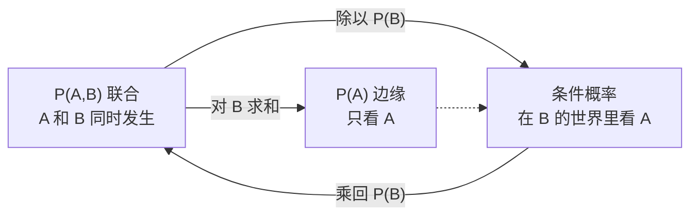
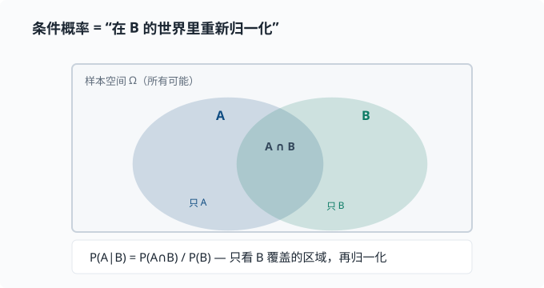
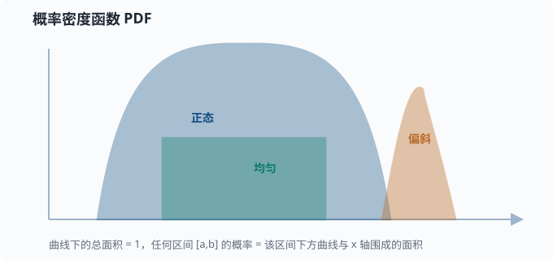

# 概率与分布

> 目标：把概率当成"量化不确定性的语言"。读完这一页，你能区分事件与随机变量、离散与连续分布、概率质量函数与概率密度函数，并说出最常用几种分布的样子、用途和形状。

## 为什么先学概率

先不从任何技术说起，只看你每天都在面对的生活。

- 明天会不会下雨？天气预报说"70% 概率有雨"。
- 这枚硬币抛起来，是哪一面朝上？
- 你走过一条马路，会不会恰好遇到红灯？

这些问题的共同点是：**我们没法百分百确定答案，却能给每一种可能分配一个"把握程度"**。70% 有雨、一半对一半、大概率遇到红灯——这些话虽然不保证某一次的结果，却能在决策前给出量化的判断。

概率论就是把"我拿不准"变成"我可以计算、可以更新"的那套语言。它不是"玄学"，而是一套严格、可计算的公理系统：先约定怎么用数字表达"可能性"，再研究这些数字之间如何互相转换。

为什么要费这么大劲去量化"不确定"？因为**真实世界的信息往往不是"是或否"，而是"有多大的可能"**。能分清"几乎确定"、"五五开"和"大概不行"，你就能在没有绝对把握的时候，仍然做出理性选择。许多现代系统（包括各种会"猜"的软件）之所以能工作，靠的就是这种"用数字表达可能性，再在可能之间做取舍"的能力。这一页先把这套语言本身学通，至于它具体怎么帮到某些系统，放到后面章节自然就接上了。

## 基本公理与记号

用 $\Omega$ 表示**样本空间**（所有可能结果的集合），用 $A$、$B$ 表示**事件**（结果的子集）。概率是给事件赋一个 $0$ 到 $1$ 之间数字的规则，满足三条公理：

$$
\text{1. } P(A)\ge 0;\qquad
\text{2. } P(\Omega)=1;\qquad
\text{3. 互斥事件并的概率 = 各概率之和}
$$

常用记号：

$$
P(A)\quad\text{事件 A 的概率}
$$

$$
P(A\mid B)\quad\text{在 B 已发生的条件下，A 的概率}
$$

$$
P(A,\,B)\quad\text{A 和 B 同时发生的概率（联合概率）}
$$

### 联合、边缘与条件概率

这是一个特别重要的三角关系，它们之间可以互相换算。用一张图沉淀它们的关系：



直观理解：$P(A\mid B)$ 是说"在 B 发生的那部分世界里，A 占了多大比例"。除法不过是"只看 B 这一列，重新归一化"。

把"重新归一化"画出来最清楚：条件概率不是"重置世界"，而是**把观察范围缩小到 B 已发生的那个子区域**，再问其中 A 占多少比例



图中的交叉区域 $A\cap B$ 是"同时发生"；$P(A\mid B)$ 不是全局里 $A$ 占多少，而是**在 B 里** $A$ 占多少——所以分母是 $P(B)$，把 B 的面积归一成 1。分子则是 $P(A\cap B)$。这就解释了为什么它必须写成 $P(A\cap B)/P(B)$ 而不是别的样子。

**全概率公式**是上面这张图里"把 B 的所有情况加起来"的正式写法。如果 $B_1,\dots,B_k$ 是互斥且覆盖整个样本空间（称其为**划分**），那么：

$$
P(A) = \sum_i P(A\mid B_i)\cdot P(B_i)
$$

这个公式是后面 [01-04 贝叶斯视角](01-04-bayesian.md) 里分母算法的地基，务必记牢。

### 独立

如果

$$
P(A,\,B) = P(A)\cdot P(B)
$$

就说 $A$ 和 $B$ **独立**——知不知道 $B$，对 $A$ 的概率没有影响。掷两次硬币，结果是独立的；但"今天下雨"和"我带了伞"不独立。

独立 $\ne$ 互斥，这是经典易错点：

- **互斥**：$A$ 和 $B$ 不能同时发生。
- **独立**：$A$ 的发生不影响 $B$ 的概率。

事实上，两个概率都非零且互斥的事件**不可能**独立：知道 $A$ 发生就排除了 $B$，这正是"极度依赖"。

## 随机变量

先澄清一个容易绕进去的名字。我们说"随机变量"，听起来像个"会随机变的数"，但它其实不是变量，而是一个**函数**：它的工作是**把一次随机试验的结果，翻译成一个数字**。

举例：抛一枚骰子，结果可能是"1 点、2 点……6 点"。这些结果本身不是数字，但你可以定义随机变量 $X$＝"这次掷出的点数"，于是 $X$ 把每一种结果对应到一个数字。再比如"抛硬币"，你可以定义 $X{=}1$ 表示正面、$X{=}0$ 表示反面——把正/反这个非数字结果，翻译成 0/1 两个数字。

为什么要费这一道工序？因为**数字才能进入计算**。一旦结果变成了数字，我们就能求和、求平均、比较大小、画分布。这也是概率和"普通"数学接轨的那座桥：概率告诉你"每个数字出现的可能性"，而接下来的整页就在研究这些"数字 + 概率"的配对。

按取值的方式，随机变量分两大类：有的只能取**离散的几个值**（骰子点数、正反），有的能取**连续的一段范围**（身高、温度、等待时间）。这两类描述方式不同，下面分别讲。

| 类型 | 取值 | 例子 | 描述它的函数 |
|---|---|---|---|
| 离散 | 可数 | 骰子点数、单词计数 | 概率质量函数 PMF |
| 连续 | 一段范围 | 身高、温度 | 概率密度函数 PDF |

### 离散：概率质量函数 PMF

$P(X=x)$ 给出每个具体取值的概率。比如抛硬币 $P(X{=}1)=0.5,\ P(X{=}0)=0.5$。

### 连续：概率密度函数 PDF

连续变量取到**精确某一点**的概率是 0（因为可以取值无穷多），所以我们讨论"落在一个区间内"的概率：

$$
P(a\le X\le b)=\int_a^b f(x)\,dx \quad\text{（密度曲线下的面积）}
$$

$f(x)$ 叫概率密度函数。它本身可以大于 1，但只要曲线下总面积等于 1 就合法。下面这张图把三种典型分布的"形状语言"画在一起：



> 常见误区：把 PDF 的取值 $f(x)$ 直接当概率。它不是——它是"单位长度上的概率密度"，真正概率是面积。密度高（曲线高）意味着"落在这一小段的概率密度大"，但概率要靠积分得到。

## 常见离散分布

### 伯努利分布 Bernoulli

单次二选一实验：成功 $1$、失败 $0$。

$$
P(X{=}1)=p,\qquad P(X{=}0)=1-p
$$

例子：一次点击是否发生、一个词是否出现。它是分类问题的最小积木。

### 二项分布 Binomial

把 $n$ 次独立的伯努利实验加总，得到成功次数 $X\sim\mathrm{Bin}(n,p)$：

$$
P(X{=}k)=\binom{n}{k}\,p^{k}(1-p)^{n-k}
$$

其中二项系数 $\binom{n}{k}=\frac{n!}{k!(n-k)!}$（$n!$ 是阶乘，$n!=n\times(n-1)\times\dots\times1$）表示"从 $n$ 次里选哪 $k$ 次成功"的组合数。例子：$n$ 个用户里有几个转化。当 $n$ 很大时，二项分布趋近正态分布（这正是**中心极限定理**——"大量独立随机量加总，总和趋近正态"，本页稍后的术语卡会正式讲它——的一个体现）。

### 分类 / 多项式分布 Categorical / Multinomial

实验取值不止两个，而是 $k$ 个类别。单个样本叫 **Categorical**，$n$ 次取样计数叫 **Multinomial**。

例子：一个词是"名词/动词/形容词"；一篇文档里各类词的计数。语言模型在每一步输出的正是"下一个词在词表上的多项式/分类分布"。理解它，就是理解大模型输出的最小单位。

## 常见连续分布

### 均匀分布 Uniform

$[a,b]$ 区间内处处密度相等：

$$
f(x)=\frac{1}{b-a},\qquad a\le x\le b
$$

例子：随机初始化权重的兜底、"无信息先验"（意思是对结果不预设立场、把各处看得同等可能；[01-04 贝叶斯](01-04-bayesian.md) 会正式讲先验这个概念）。

### 正态分布 Normal / 高斯

$$
f(x)=\frac{1}{\sigma\sqrt{2\pi}}\exp\!\left(-\frac{(x-\mu)^2}{2\sigma^2}\right)
$$

其中 $\mu$ 是均值（山峰位置），$\sigma$ 是标准差（胖瘦）。记作 $X\sim N(\mu,\sigma^2)$。

**为什么它无处不在？** 中心极限定理说：大量独立随机量之和，无论单个怎么分布，总和都趋近正态。测量误差、均值、噪声，常常都是正态。深度学习里权重的初始化也常假设近似正态。

> 术语卡：**中心极限定理**（Central Limit Theorem）就是这么一条结论——"很多独立的小随机扰动叠在一起，总和的分布趋近正态"。上面的公式 $f(x)$ 你现在不用记，只需记住它的两个旋钮：$\mu$（mu，读"缪"）定山峰的**位置**，$\sigma$（sigma，读"西格玛"）定山峰的**胖瘦**，写在一起 $N(\mu,\sigma^2)$ 就完整描述了一条正态曲线。

### 标准正态

$\mu=0,\ \sigma=1$ 的叫标准正态 $Z\sim N(0,1)$，查表和研究最方便。

## 用熵看分布（预告）

分布并没有"哪个更随机"的唯一答案，但可以量化。往后的 [01-05 信息论](01-05-information-theory.md) 会引入**熵**来度量"这个分布有多不确定"。现在只需记住：均值/方差管"位置和胖瘦"，熵管"有多随机"。

## 动手：采样与查看分布

```python
import numpy as np

# 伯努利：抛 10000 次，p=0.3
coins = np.random.binomial(1, 0.3, size=10000)
print("head ratio:", coins.mean())          # 约 0.3

# 正态：均值 5，标准差 2
x = np.random.normal(5, 2, size=5000)
print("sample mean:", x.mean().round(3))    # 约 5
print("sample std:",  x.std().round(3))     # 约 2

# 分类分布：词表大小 5，模拟"下一个词"
vocab = np.random.choice(5, size=1000, p=[0.1, 0.2, 0.5, 0.15, 0.05])
counts = np.bincount(vocab) / len(vocab)
print("empirical distribution:", counts.round(3))
```

## 思考题

1. "独立"和"互斥"各举一个生活中的例子，并说明为什么不能混用。
2. 为什么连续随机变量取到精确某点的概率是 0？这又如何解释 PDF 可以大于 1？
3. 掷两次骰子，第一次结果是 3 的条件下，两次和为 8 的概率是多少？
4. 语言模型每一步输出的"下一个词分布"更接近哪种分布？
5. 用全概率公式，"测阳性"这个事件，为什么要把"真阳 + 假阳"两项相加？

## 参考答案

1. **独立**：连续抛两次硬币，第一次的结果不影响第二次。**互斥**："今天是周一"和"今天是周二"不可能同时成立。二者不能混用：互斥强调"不能同时发生"，独立强调"一个发生与否不改变另一个的概率"。事实上两个互斥且非零概率的事件**不可能**独立——知道 A 发生就排除 B，正是极度依赖。
2. 连续变量取值不可数，落在"恰好某一点"这一段**宽度为 0 的区间**，所以概率是 0。PDF 是"单位长度上的概率密度"而非概率本身，只要曲线下的总面积等于 1，单点密度完全可以大于 1。
3. 已知第一次是 3，要两次和为 8，第二次必须掷出 5，概率是 $1/6$。
4. 更像**分类（Categorical）分布**：在固定词表上，对"下一个词到底是哪一个"给每个候选词一个概率。采样时按这个分布抽一个词，就得到一次"随机生成"。
5. 因为"测阳性"可以由两条互斥路径到达：确实有病且测阳（$P(+\mid\text{病})P(\text{病})$），或没病但误报阳性（$P(+\mid\text{健康})P(\text{健康})$）。这两条路径覆盖了所有"阳性"的来源，加起来就是全概率公式——这也是贝叶斯公式分母的由来。

## 下一步

- 想知道"平均"和"波动"如何用一个数字表达 → [01-03 期望与方差](01-03-expectation.md)。
- 想看"如何用数据更新信念" → [01-04 贝叶斯视角](01-04-bayesian.md)。
- 想在机器学习里正式用它做建模 → [03 机器学习](../03-machine-learning/README.md)。

[返回本章目录](README.md)
