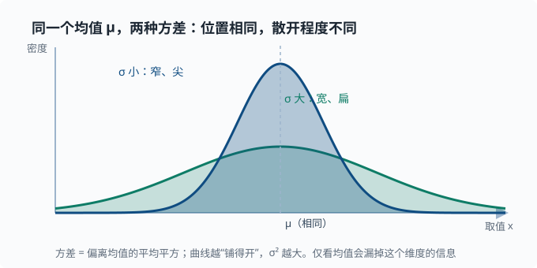

# 期望、方差与协方差

> 目标：把"平均"和"波动"变成精确的工具。读完这一页，你能定义期望与方差、区分总体参数和样本统计量、理解协方差与相关，并读懂后面所有出现在损失函数里的求和记号。

## 为什么要单独讲"数字特征"

一个随机变量的完整信息是它的分布，但分布往往太"胖"。很多时候我们只想知道两个数字：

- 它**平均**在哪个位置 → 期望（mean）
- 它**波动**有多大 → 方差（variance）

这两个量是几乎所有机器学习算法优化目标的零件——那个"要最小化的误差分数"叫**损失函数**（[03 章](../03-machine-learning/03-01-supervised-overview.md) 的四件套之一）。核心直觉只有一句话：**均值管位置，方差管散布**——两个分布可以均值相同，但一个集中、一个散开，只看均值会漏掉"散开程度"这个同样关键的信息。下面这张图把"均值相同、方差不同"的两个正态分布画在一起：

## 期望 Expectation

### 离散情形

先想一个不涉及符号的日常问题：你要给一门"平时分 + 考试分"的综合成绩打个平均。如果平时分占 30%、考试占 70%，你不会简单地把两个分数加起来除以 2——因为**它们的重要性不一样**。你真正做的是：每个分数乘上它的"权重"，再全部加起来。

这里的核心只有一个词：**加权**。数学上，一个随机变量 $X$ 的"平均"，最合理的定义就是"每个取值以它的概率为权重去平均"——出现概率越高，对最终的平均影响越大。这个加权平均就叫**期望（expected value）**，记作 $\mathbb{E}[X]$。

随机变量 $X$ 的期望是每个取值以**概率加权**的平均：

$$
\mathbb{E}[X]=\sum_x x\cdot P(X{=}x)
$$

注意它不是"所有取值的简单平均"，而是概率加权。抛硬币 $X\in\{0,1\}$、$p=0.5$：

$$
\mathbb{E}[X]=0\cdot 0.5+1\cdot 0.5=0.5
$$

### 连续情形

当随机变量能取连续的一段范围（身高、等待时间）时，就不再有"每一个单独取值"可以一一枚举了。把离散时的"求和"换成"积分"（可以先把积分理解成"把无数个无限薄的小段加起来"），其余思想完全一样：

$$
\mathbb{E}[X]=\int_{-\infty}^{\infty}x\,f(x)\,dx
$$

其中 $f(x)$ 是概率密度。

### 期望的性质

期望是**线性**的，这是它最好用的一点：

$$
\mathbb{E}[aX+b]=a\,\mathbb{E}[X]+b
$$

$$
\mathbb{E}[X+Y]=\mathbb{E}[X]+\mathbb{E}[Y]\quad\text{（哪怕 X、Y 不独立也成立）}
$$

线性性是机器学习的福音：很多损失求和可以直接拆开算。

> 深挖：期望不是"函数交换"——$\mathbb{E}[g(X)]$ 一般不等于 $g(\mathbb{E}[X])$。例如平方：$\mathbb{E}[X^2]\ge(\mathbb{E}[X])^2$，差值正是方差。这条"不等"的一般化叫 Jensen 不等式（"对凸函数，先取期望再套函数 ≥ 先套函数再取期望"——上面平方的例子正是它取 $g(x)=x^2$ 的特例），在理解"平均概率 vs 概率的平均"这类问题时非常重要。

## 方差 Variance

期望回答"平均在哪个位置"，但**只告诉位置是不够的**。想象两个班，平均分都是 80：A 班人人都在 78 到 82 之间，B 班有人考 40、有人考 100。它们的"平均"一样，可实际的"考察面貌"天差地别。所以除了"中心在哪"，我们还需要一个数字来回答第二个问题：**大家围绕中心到底散得多开**。

这个"散开程度"就是**方差（variance）**。它的定义思路很自然：先看每个值偏离均值多远（$X-\mathbb{E}[X]$），再把这些偏离量平均起来。可单纯的偏离可正可负、会相互抵消，于是我们先把偏离**平方**（既抹平了正负，又放大了"离得远"的程度），再求平均：

$$
\mathrm{Var}[X]=\mathbb{E}\!\left[(X-\mathbb{E}[X])^2\right]
$$

所以方差的字面含义是"偏离均值多少的平方"的平均。它衡量波动，但单位是"原单位的平方"（比如"平方分"），解释起来不太顺手。于是通常再取它的**平方根**，得到标准差 $\sigma=\sqrt{\mathrm{Var}}$——单位回到原样，也更易说"大约在均值上下多少"。两张"均值相同、散开不同"的正态分布放在一起看，位置与波动这两个维度就分开了：



注意图中的比例：小方差的曲线更高更尖，大方差的曲线更低更扁。因为概率密度曲线下的**总面积都必须等于 1**，所以"铺得越开"的那条只能"压得越低"。这是"方差大 = 更分散"在曲线形状上的直接体现——同一块概率质量被摊到了更大的区间上。

### 另一个常用公式

$$
\mathrm{Var}[X]=\mathbb{E}[X^2]-(\mathbb{E}[X])^2
$$

这个形式在推导里经常出现，也直接体现了上面那条"方差 = 二次矩减均值的平方"（$\mathbb{E}[X^2]$ 这种"幂次的期望"叫**矩**，moment——均值是一次矩、方差由二次矩算出，名字源自物理里力矩的类比）。

### 一个对比

两个班级平均分都是 80：

```text
A 班：78, 82, 80, 79, 81   → 方差小（大家都贴近 80）
B 班：55, 65, 80, 95, 105   → 方差大（成绩很分散）
```

只看平均会浪费大量信息。机器学习里"只优化均值"和"同时看波动"往往是两套完全不同的目标。

### 正态样本的经验法则

对正态分布，约：

$$
68\%\ \text{落在}\ \mu\pm\sigma;\quad
95\%\ \text{落在}\ \mu\pm 2\sigma;\quad
99.7\%\ \text{落在}\ \mu\pm 3\sigma
$$

这给了你从 $\sigma$ 立刻估计"正常范围有多宽"的直觉。

## 总体 vs 样本

这是经典误区，务必分清：

- **总体（population）**：所有数据。参数是真实的 $\mu$、$\sigma$。
- **样本（sample）**：抽到的一小部分。统计量是 $\bar{x}$、$s$。

$$
\text{总体方差}\ \sigma^2=\mathbb{E}[(X-\mu)^2];\qquad
\text{样本方差}\ s^2=\frac{1}{n-1}\sum_i (x_i-\bar{x})^2
$$

如果手里只有样本，估计方差时要除以 $n-1$ 而不是 $n$（称为**无偏估计**）。

> 深挖：为什么是 $n-1$？样本均值 $\bar{x}$ 是从同一批数据算出来的，它总是"贴着"这批数据，于是 $\sum_i(x_i-\bar{x})^2$ 系统性地**偏小**——因为 $\bar{x}$ 已经吸收了样本里的波动。这样体系里只剩 $n-1$ 个"独立"的偏差信息（最后一个偏差由前面决定），所以除以 $n-1$ 来补偿；不除会低估方差。任何统计库里的 `ddof=1` 参数就是在做这件事。

## 协方差与相关

期望和方差描述单个数，**协方差**描述两个随机变量**一起如何变化**：

$$
\mathrm{Cov}[X,Y]=\mathbb{E}\!\left[(X-\mathbb{E}[X])(Y-\mathbb{E}[Y])\right]
$$

符号含义：

- $\mathrm{Cov}>0$：$X$ 大时 $Y$ 也往往大（正相关）。
- $\mathrm{Cov}<0$：$X$ 大时 $Y$ 往往小（负相关）。
- $\mathrm{Cov}=0$：无线性关系（对独立变量一定成立，但反过来不成立）。

协方差的数值受单位影响，难比较。于是用**相关系数**归一化：

$$
\rho=\frac{\mathrm{Cov}[X,Y]}{\sigma_x\,\sigma_y}\quad\text{范围在}\ [-1,\,1]
$$

$$
\rho=1\ \text{完美正线性};\quad
\rho=-1\ \text{完美负线性};\quad
\rho=0\ \text{无线性关系}
$$

> 关键提示：相关 $\ne$ 因果。冰淇淋销量和大太阳正相关，不代表"吃冰淇淋导致晴天"。这个提醒对后面解读模型特征非常必要。

> 深挖：协方差出现在方差的"加法"里。对 $X+Y$ 有
> $$\mathrm{Var}[X+Y]=\mathrm{Var}[X]+\mathrm{Var}[Y]+2\,\mathrm{Cov}[X,Y]$$
> 这是理解"为什么独立变量相加时方差才简单相加"的关键，也是组合投资、集成学习里误差相关性的思想来源。

## 协方差矩阵

把多个特征两两之间的协方差排成矩阵，得到**协方差矩阵**：

$$
\Sigma[i][j]=\mathrm{Cov}[\text{feature}_i,\ \text{feature}_j]
$$

对角线是各自方差，非对角线是两两协方差。两个值得先记住的事实：

- 它是**对称**（$\Sigma[i][j]=\Sigma[j][i]$）且**半正定**的——任意方向的方差 $\mathbf{v}^{\mathsf{T}}\Sigma\mathbf{v}\ge 0$，因为方差本身不可能为负。这保证了它的特征值全部非负，是 [01-08 矩阵分解](01-08-matrix-decomposition.md) 里 PCA 能做的前提。
- PCA 正是在这个矩阵上做特征分解，找主成分方向——协方差矩阵是"数据内部相关性结构"的完整快照。

## 在损失函数里的联系（预告）

后面几乎所有"求平均误差"的写法，本质都是期望的估计：

$$
\frac{1}{n}\sum_i (\hat{y}_i-y_i)^2\ \approx\ \mathbb{E}\!\left[(\hat{y}-y)^2\right]
$$

我们不是真的遍历所有可能世界去算期望，而是用手里的 $n$ 个样本除以 $n$ 来近似它。这个"用样本平均近似期望"的直觉是统计学习的基石。

## 动手：数值验证

```python
import numpy as np

a = np.array([78, 82, 80, 79, 81], dtype=float)
b = np.array([55, 65, 80, 95, 105], dtype=float)
print("mean a/b:", a.mean().round(2), b.mean().round(2))   # 均值都 80
print("std  a/b:", a.std().round(2), b.std().round(2))     # 1.41 vs 18.44，差异巨大

# 样本方差（除以 n-1）与总体方差（除以 n）
print("sample var (ddof=1):", a.var(ddof=1).round(2))
print("pop    var (ddof=0):", a.var(ddof=0).round(2))

# 相关性
x = np.array([1, 2, 3, 4, 5], dtype=float)
y = 2 * x + 1
print("corr(x, 2x+1):", np.corrcoef(x, y)[0, 1].round(3))  # 1.0

# 方差加法：Var[X+Y] = Var[X]+Var[Y]+2Cov[X,Y]
X = np.array([1., 2, 3, 4, 5]); Y = X * 0.5 + 1
cov = np.cov(X, Y, ddof=1)[0, 1]
print("check:", (X+Y).var(ddof=1), X.var(ddof=1)+Y.var(ddof=1)+2*cov)
```

## 思考题

1. 为什么 $\mathbb{E}[X+Y]=\mathbb{E}[X]+\mathbb{E}[Y]$ 不需要独立，而方差 $\mathrm{Var}[X+Y]$ 通常需要？相关项会出现在哪？
2. 样本方差为什么除以 $n-1$？如果不除会偏大还是偏小？
3. 相关系数等于 0，能说两个变量无关吗？为什么？
4. 为什么常用的回归误差是"平方平均"，而不是"平均绝对偏差"？试想它们对离群点的反应差异。
5. 为什么 $\mathbb{E}[X^2]\ge(\mathbb{E}[X])^2$？这和一个"平方损失"为什么天然等于"方差 + 偏差的平方"有什么关系？

## 参考答案

1. 期望的线性性质直接从期望运算的线性展开得出，不需要独立性。方差则不同：$\mathrm{Var}[X+Y]=\mathrm{Var}[X]+\mathrm{Var}[Y]+2\,\mathrm{Cov}[X,Y]$，多出的"相关项"就是协方差项的 2 倍。若 $X$、$Y$ 独立，$\mathrm{Cov}[X,Y]=0$，才退化成两项之和——所以很多时候要加"通常需要独立"的前提。
2. 因为样本均值 $\bar{x}$ 是从同一批数据算出来的，会让偏差被系统性低估；除以 $n-1$ 做无偏修正（用 `ddof=1`）。若仍除以 $n$，估计会**偏小**（低估真实方差）。
3. 不能。相关系数只刻画**线性**关系；$Y=X^2$ 这类非线性依赖可能相关系数为 0，但两者远非无关。
4. 平方误差对离群点惩罚是**二次**的（大误差被放大），MAE 是线性的（更稳健）；平方误差处处可导、配合高斯噪声假设能得到最小二乘闭式解。代价是"一个离群点会被过度牵引"，这也是要结合数据是否干净来选择。
5. 因为 $\mathrm{Var}[X]=\mathbb{E}[X^2]-(\mathbb{E}[X])^2\ge0$，移项即得 $\mathbb{E}[X^2]\ge(\mathbb{E}[X])^2$。若 $\hat{y}$ 是随机预测，则 $\mathbb{E}[(\hat{y}-y)^2]=\mathrm{Var}[\hat{y}]+\text{bias}^2$（在 $y$ 固定、误差独立时）。这就是"误差 = 方差 + 偏差平方"的来历，是 [03-04 偏差-方差](../03-machine-learning/03-04-bias-variance.md) 的理论根基。

## 下一步

- 想学"如何用观察到的数据更新对世界的判断" → [01-04 贝叶斯视角](01-04-bayesian.md)。
- 想量化"一个事件有多不确定" → [01-05 信息论](01-05-information-theory.md)。
- 想看这在分类模型里如何被使用 → [03 机器学习](../03-machine-learning/README.md)。

[返回本章目录](README.md)
