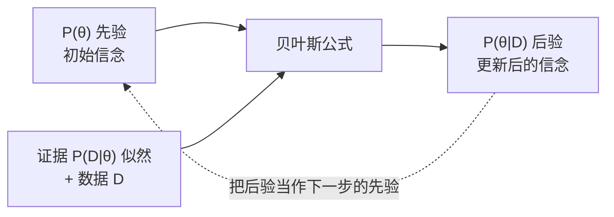
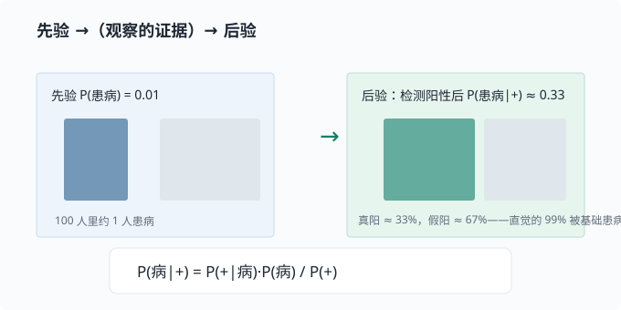

# 贝叶斯视角：用数据更新信念

> 目标：把概率从"能算出多少"升级成"如何被证据更新"。读完这一页，你能写出贝叶斯公式、讲清楚先验/似然/后验三个词，并理解为什么它是 Agent 和语言模型里"逐步推理"的思想源头。

## 两种看待概率的哲学

概率有两种理解方式：

| 视角 | 含义 | 例子 |
|---|---|---|
| 频率派 frequentist | 概率 = 长期发生的频率 | 抛硬币 10 万次，正面约一半 |
| 贝叶斯派 Bayesian | 概率 = 对某个命题的**信念程度** | "明天下雨的概率 70%" |

贝叶斯派特别适合机器学习：我们把"模型参数是某个值"当成一个**信念**，然后用数据去更新它。这正是"从数据中学习"的一种很干净的数学模型。

## 条件概率：一切的起点

回顾上一页：

$$
P(A\mid B)=\frac{P(A,\,B)}{P(B)}
$$

它问的是：在 $B$ 已经成立的世界里，$A$ 有多大比例。这是"证据改变了判断"的最小例子——知道 $B$ 之后，我们对 $A$ 的看法不再和原来一样。

## 贝叶斯公式

先看清我们要解决的一个"方向相反"的问题。上一页的条件概率 $P(A\mid B)$ 问的是"在 B 成立时 A 有多大"，它的方向是**从已知结果 B 去问原因 A**。可很多时候，我们手头能直接算的却是**反方向**：比如知道"健康人测出阳性"（$P(+\mid\text{Healthy})$），却想反着问"测出阳性的人是健康人的概率"（$P(\text{Healthy}\mid +)$）。

如何把"正方向"翻成"反方向"？关键想法是：**同一个"A 和 B 同时发生"的事件，可以从两个方向拆开。** 一方面 $P(A,B)=P(A\mid B)P(B)$，另一方面 $P(A,B)=P(B\mid A)P(A)$。把这两个等号连起来，就能把想要的"反方向"用"正方向"表达出来——这就是贝叶斯公式。

把符号换成"信念 $\theta$ 与数据 $D$"，写出核心公式：

$$
P(\theta\mid D)=\frac{P(D\mid\theta)\cdot P(\theta)}{P(D)}
$$

几个名字要记牢：

$$
P(\theta)\qquad\text{先验 prior：学之前对 }\theta\text{ 的看法}
$$

$$
P(D\mid\theta)\qquad\text{似然 likelihood：假设 }\theta\text{ 为真时，数据 D 有多像会发生}
$$

$$
P(\theta\mid D)\qquad\text{后验 posterior：看到数据 D 之后，对 }\theta\text{ 的更新}
$$

$$
P(D)\qquad\text{证据 evidence：归一化常数（让后验加起来是 1）}
$$

一句话版本：

> 后验 $\propto$ 似然 $\times$ 先验 —— "新的信念"由"旧信念"和"数据带来的证据"共同决定。

注意顺序：先验是**看数据之前**，后验是**看数据之后**。很多初学者把先验写在还没看数据时就已经错了。用一张图看整个"更新循环"：



最后那条虚线是贝叶斯的精华：**昨天的后验，就是今天的先验**。每来一批数据，信念被更新一次，而更新规则完全一致。这正是"持续学习"的数学骨架。

## 一个完整的手算例子：医生之问

假设某种罕见病的患病率是 $1\%$（先验），检测的准确率如下：

- 有病且测阳性：$P(+\mid\text{Sick})=0.99$（真阳率）
- 没病但测阳性：$P(+\mid\text{Healthy})=0.02$（假阳率）

问：一个人测出阳性，真有病的概率 $P(\text{Sick}\mid +)$ 是多少？

先算分母 $P(+)$（证据，两种情况都要算）：

$$
P(+) = P(+\mid\text{Sick})P(\text{Sick}) + P(+\mid\text{Healthy})P(\text{Healthy})
$$

$$
P(+) = 0.99\times 0.01 + 0.02\times 0.99 = 0.0099 + 0.0198 = 0.0297
$$

再算后验：

$$
P(\text{Sick}\mid +)=\frac{0.99\times 0.01}{0.0297}\approx 0.333
$$

**结果只有约 33%**，而不是 99%——因为假阳率相对患病率太高，大多数阳性其实来自健康人。这就是著名的"医生之问"：直觉会高估，贝叶斯给出精确修正。



这类问题在机器学习里有个正式名字：**精确率**（precision）——"给定模型预测阳性，其中真的是阳性的比例"，和上面的后验是同一个量。[03-05 评估指标](../03-machine-learning/03-05-evaluation-metrics.md) 会系统讲它，这里先埋个种子：你现在算的 33%，就是这台检测器在这一患病率下的精确率。

## 先验从哪来

先验常常是最大争议点：

- **有信息先验**：结合领域知识（如"患病率很低"）。
- **无信息先验**：不想偏向任何一方，用均匀分布。
- **共轭先验**：选一种让后验计算保持同一族分布的形式（比如先验是贝塔分布、算完的后验还是贝塔分布），方便手算。现在只需知道有这种"好算的搭配"存在，具体搭配留到需要时再查。

先验不是"拍脑袋的迷信"——它是你"看数据前已有的合理假设"，而且在数据足够多时，后验会越来越被数据主导，先验的影响会衰减。

> 深挖：为什么数据多了先验影响就变小？因为似然（数据提供的信息）会叠加到证据里，样本越多、似然越"尖"，先验的形状越显得平坦，后验被数据主导。这给了我们"先验是起点、数据是主角"的实用结论。

## 从贝叶斯到机器学习：MLE 与 MAP

贝叶斯视角给"学习"一个统一解释：

$$
\theta^{*}=\arg\max_{\theta}\ P(\theta\mid D)
$$

这叫做**最大后验估计 MAP**。如果忽略与 $\theta$ 无关的分母，并取对数：

$$
\log P(\theta\mid D)=\log P(D\mid\theta)+\log P(\theta)-\log P(D)
$$

最大化后验 $=$ 最大化"数据的似然 $+$ 先验"。去掉先验项（或假设均匀先验），就退化成**最大似然估计 MLE**：

$$
\theta^{*}=\arg\max_{\theta}\ \log P(D\mid\theta)
$$

这两者的对应关系极其整洁：

- 最大化似然 → 常见损失函数（如交叉熵）
- 加先验 → 正则化（如 L2 惩罚，即按权重的**平方**加罚——"L2"的 2 指平方），也就是"不要太复杂"

你会在 [03-04 偏差-方差与正则化](../03-machine-learning/03-04-bias-variance.md) 再看到这层联系。

## 与 Agent / LLM 的关联（预告）

贝叶斯思想还渗透在 Agent 的"逐步推理"里：

- 每多一条观察（工具结果、新消息），Agent 对任务的判断可以看作一次"信念更新"——这与贝叶斯更新在**结构上同构**（旧判断 + 新证据 → 新判断），尽管 Agent 并不做严格的概率计算。
- 语言模型按概率生成：每一步在下个词的分布上采样。注意这是一种**条件分布**（给定前文预测后文），与"用证据修正信念"的贝叶斯更新并不等同，但"用分布表达不确定性、随条件改变分布"的精神是相通的。
- 在 [06 LLM 原理](../06-llm-fundamentals/README.md) 你会看到，模型输出的正是"下一个 token 的概率分布"——用分布表达不确定性，正是这一页的核心。

## 动手：重现场景

```python
# 重演"医生之问"
sick_prior = 0.01
tpr = 0.99     # 真阳率
fpr = 0.02     # 假阳率

evidence = tpr * sick_prior + fpr * (1 - sick_prior)
posterior = tpr * sick_prior / evidence
print("P(Sick | positive) =", round(posterior, 3))   # ≈ 0.333

# 关键实验：观察先验对后验的影响
for prior in [0.001, 0.01, 0.1, 0.5]:
    ev = tpr * prior + fpr * (1 - prior)
    post = tpr * prior / ev
    print(f"prior={prior:>5}: posterior={post:.3f}")
```

试着改 `sick_prior`，观察后验如何变化。你会发现先验越低，阳性越"不值钱"（大量是假阳性）；先验越高，阳性越可信。

## 思考题

1. 为什么直觉会高估"阳性=有病"的概率？先验在这里起多大作用？
2. 如果给先验来一个大改变（比如患病率确实是 50%），结果怎么变？
3. "后验 ∝ 似然 × 先验"与"正则化"的联系是什么？
4. 语言模型每一步更新"下一个词概率"，为什么说它是贝叶斯式的信念更新？
5. MAP 与 MLE 的区别是什么？什么时候两者等价？

## 参考答案

1. 直觉会高估，是因为只盯着很高的真阳率 $99\%$，却忽略了很低的患病率 $1\%$ 和不可忽略的假阳率 $2\%$。先验（基础患病率）起决定性作用：发生率越低，绝大多数阳性其实来自健康人，阳性需被大幅"打折"。
2. 若患病率先验改为 $50\%$：$P(+)=0.99\times0.5+0.02\times0.5=0.505$，后验 $=0.99\times0.5/0.505\approx0.98$。在先验很高时，阳性变得更有信息量，后验接近真阳率。
3. $\log P(\theta\mid D)=\log P(D\mid\theta)+\log P(\theta)-\log P(D)$，其中 $\log P(\theta)$（先验对数）正是正则项。例如把权重先验设为高斯，就得到 L2 权重衰减——"别让参数太复杂"在贝叶斯里就是给先验。
4. 每生成一个 token，模型都在"给定全部前文"的条件下重新计算"下一个词"的分布：可以把"前文已确定后的预测分布"看作先验，新 token 的加入是新的条件。逐 token 条件生成与贝叶斯"用证据更新信念"在结构上相似，但要注意它只是条件分布的链式展开（自回归分解），并不等价于严格的贝叶斯后验更新。
5. MAP 最大化"后验"（含先验），MLE 只最大化"似然"（不含先验）。当先验是均匀分布（所有 $\theta$ 同等可能）时，$\log P(\theta)$ 是常数，MAP 与 MLE 等价。可以理解成"MLE 是无先验（或均匀先验）时的 MAP"。

## 下一步

- 想正式量化"不确定性有多少" → [01-05 信息论](01-05-information-theory.md)。
- 想看它如何变成交叉熵损失函数 → [03-03 逻辑回归](../03-machine-learning/03-03-logistic-regression.md)。
- 想了解怎样让"过于复杂"的模型受限 → [03-04 偏差-方差与正则化](../03-machine-learning/03-04-bias-variance.md)。

[返回本章目录](README.md)
