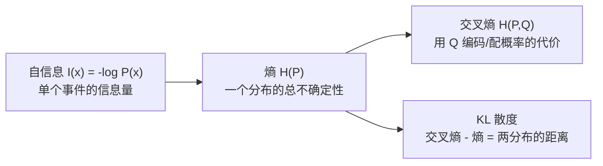
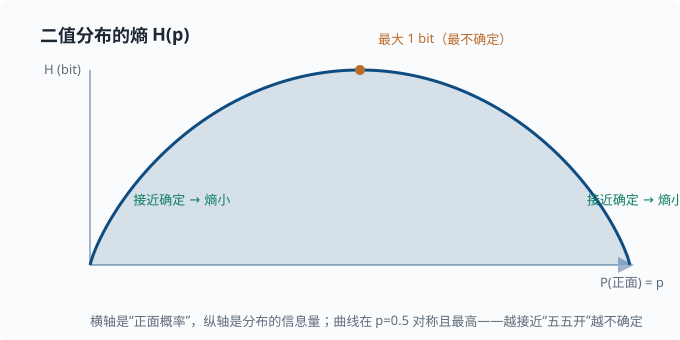

# 信息论：熵、交叉熵与 KL 散度

> 目标：把"信息量"和"不确定性"变成可计算的量。读完这一页，你能理解为什么交叉熵是几乎所有机器学习分类任务的默认损失，以及 KL 散度如何在语言模型对齐里扮演主角。

## 为什么信息论如此重要

这一页要回答一个听起来很"哲学"、其实非常实用的问题：**"一条消息里到底装着多少信息？"**

先别管任何技术，凭直觉想想这两句话：

- `明天太阳照常升起`
- `明天有日全食`

前者几乎人人都会说，听了也不觉得新鲜；后者很罕见，听到的人多半会"咦"一声。显然，**第二句话更有"料"**——它能改变你对世界的认知。所以"信息量"不取决于这句话"说了多少字"，而取决于它**有多超出你的预期**：越是意想不到、越是罕见的事件，带来的信息量越大。

把这条直觉严格化，再一步步推出"一个分布有多不确定"（熵）、"两个分布有多像"（交叉熵、KL 散度）这些概念，就能量化"差异有多远"。这就是信息论。它在许多需要"比较两种概率分布"的场合都非常有用（而不只是某些特定系统），从天气预报到信号压缩都能碰到；把它当作"度量信息与差异的尺子"来学，是最不容易迷路的心态。

四个概念从"一个事件"一路推到"两个分布有多远"，用一张图串起来：



## 自信息：一个事件的信息量

开头那个直觉现在要变成数学。我们想给"单个事件带来的信息量"一个函数：事件越罕见，数字越大。信息学给它的名字是**自信息（self-information）**。

数学定义（对离散事件 $x$，概率 $P(x)$）：

$$
I(x)=-\log_2 P(x)
$$

取负号，是因为概率小于 1 时 $\log<0$，加负号让信息量为正。用 $\log_2$ 时单位是**比特（bit）**。直觉上，$-\log_2 P(x)$ 也等于"为了确信地指出这个事件发生，平均还要问多少个 yes/no 问题"。

验证直觉：

$$
P(x)=0.5\ \Rightarrow\ I=1\ \text{bit}
$$

$$
P(x)=0.001\ \Rightarrow\ I\approx 9.97\ \text{bit（罕见，信息重大）}
$$

## 熵 Entropy

一个分布的"总不确定性"，就是把所有可能事件按概率加权的平均自信息：

$$
H(P)=\sum_x P(x)\,I(x)=-\sum_x P(x)\log_2 P(x)
$$

**直觉**：

- 分布越"平"（各种结果都有可能）→ 熵越大，越不确定。
- 分布越"尖"（几乎确定某结果）→ 熵越小。

极端检验：

$$
\text{确定性分布 } P(\text{正面})=1\ \Rightarrow\ H=-1\cdot\log 1=0\ \text{（完全确定，熵为 0）}
$$

$$
\text{均匀骰子 } P=1/6 \ \Rightarrow\ H=-6\cdot\tfrac16\log_2\tfrac16\approx 2.58\ \text{bit（最不确定）}
$$

熵是"平均还要问多少 bit 才能确定结果"的一种度量。

对最简单的"两结果"情形，熵随一边概率变化的样子就是下面这条曲线：



横轴是"事件一"的概率 $p$（另一边的概率就是 $1-p$），纵轴是熵。曲线在 $p=0.5$ 时达到最高点 $1$ bit；越往两头（越接近"几乎确定"），熵越小，直到端点归零。它直观地告诉你：**不确定性最大的地方，恰恰是各方五五开的时刻**——这正是"最均衡的分布携带最多平均信息"这一事实。

## 交叉熵 Cross-Entropy

现在引入两个分布：真实分布 $P$ 和模型预测分布 $Q$。**交叉熵**：

$$
H(P,Q)=-\sum_x P(x)\log Q(x)
$$

它度量"如果用 $Q$ 来给每个事件编码/赋值概率，相对真实 $P$ 平均要花多少 bit"。两个性质：

$$
H(P,Q)\ge H(P),\quad\text{当且仅当 }Q=P\text{ 时取等}
$$

让 $Q$ 贴近 $P$，就是在**最小化交叉熵**。

### 为什么交叉熵是常见的分类损失

分类任务里，我们有一组样本和对应的真实标签。把每个样本的真实标签看成"一个确定性分布"——正确类概率 1、其余 0 的向量（这种"只有一个 1、其余全 0"的写法叫 **one-hot** 编码，比如 3 类里答案是第 2 类就写成 $[0,1,0]$），模型输出 $Q$。此时交叉熵退化成一个熟悉的式子：

$$
\text{loss}=-\log Q(\text{正确类别})
$$

也就是说，**分类损失 = 让模型给正确类别赋尽可能高的概率**。你会在 [03-03 逻辑回归](../03-machine-learning/03-03-logistic-regression.md) 和所有神经网络的末尾看到它。

> 深挖：为什么偏要用 log？因为 $-\log$ 在概率接近 1 时缓慢趋向 0、在概率接近 0 时剧烈趋向无穷。这给了"类别近对但没完全对"温和惩罚，而对"把高概率给到错误类别"重罚——正好是分类要的梯度形状。

重要：$Q(x)$ 必须是"合法概率"（和为 1）。模型最后通常用 **softmax** 把任意实数得分变成概率分布，这和交叉熵几乎总是成对出现。

## 相对熵（KL 散度）

**KL 散度**度量两个分布的"差异"（从 $P$ 到 $Q$ 的非对称距离）：

$$
\mathrm{KL}(P\parallel Q)=\sum_x P(x)\log\frac{P(x)}{Q(x)}=H(P,Q)-H(P)
$$

也就是"交叉熵减去真实分布的熵"。性质：

$$
\mathrm{KL}(P\parallel Q)\ge 0,\quad\text{当且仅当 }P=Q\text{ 时为 0}
$$

$$
\text{不对称：}\ \mathrm{KL}(P\parallel Q)\ne\mathrm{KL}(Q\parallel P)
$$

几何直觉：KL 是"从 $Q$ 到 $P$ 还差多少信息"。

> 深挖：KL 的不对称性为什么重要？$\mathrm{KL}(P\parallel Q)$ 是"用 Q 覆盖 P 的代价"（$Q$ 不能漏掉任何 $P$ 支持的位置，否则惩罚很大），而 $\mathrm{KL}(Q\parallel P)$ 是"用 Q 去近似 P 时 Q 被浪费在哪"（$Q$ 给了 P 没支持的位置也会受罚）。优化方向不同，结果倾向也不同——这在变分推断（一类"用简单分布近似复杂分布"的近似方法，此处知道名字即可）与模型对齐里会反复出现。

### 为什么优化时常常只关心交叉熵

在训练里，真实分布 $P$ 是固定的（由数据决定），所以 $H(P)$ 是常数。最小化 $\mathrm{KL}(P\parallel Q)$ 和最小化 $H(P,Q)$ 等价——都让 $Q$ 逼近 $P$。这就是为什么大家直接说"最小化交叉熵"。

## 从熵到语言模型

语言模型的训练损失本质就是交叉熵：

```text
对每个位置，模型在词表上输出一个分布 Q，
我们希望它贴近"真实下一个词"构成的分布 P，
于是最小化 cross-entropy（等价于最大化正确词的对数概率）。
```

模型输出的"困惑度（perplexity）"就来自熵：

$$
\text{perplexity}=2^{\,H(P,Q)}\quad\text{（熵以 bit 计时，等价于自然对数版本 }e^{H_{\ln}}\text{）}
$$

直观读法：困惑度 = "模型每次生成时**相当于在多少个候选里均匀乱猜**"。一个完美模型困惑度为 1；在 10000 个词上均匀乱猜，困惑度就是 10000。困惑度越低，说明模型越"确定"、越贴近真实。你会在 [06 LLM 原理](../06-llm-fundamentals/README.md) 详细看到。

## 在 Agent/对齐里的角色（预告）

KL 散度还出现在模型对齐（如 RLHF/DPO——两种"用人类偏好数据微调模型"的主流方法，RLHF 全称"基于人类反馈的强化学习"，DPO 是它的简化替代方案；细节在 [07 LLM 工程](../07-llm-engineering/README.md)）里：当我们想微调一个模型，又不希望它偏离原始模型太远时，会给惩罚项加一个 $\mathrm{KL}(\text{新模型}\parallel\text{原模型})$——两全其美：学新任务，但不失控。

## 一个手算的熵

一个预测器对"明天是否下雨"输出 $P(\text{晴})=0.75,\ P(\text{雨})=0.25$：

$$
H=-(0.75\log_2 0.75+0.25\log_2 0.25)
$$

$$
H=-(0.75\times(-0.415)+0.25\times(-2))=0.311+0.5\approx0.81\ \text{bit}
$$

这比"完全不确定"（1 bit）略小，因为 0.75 让我们更倾向某一边。

## 动手：数值验证

```python
import numpy as np

def entropy(p, base=2):
    p = np.asarray(p, dtype=float)
    p = p[p > 0]                    # log(0) 无定义，跳过
    return -np.sum(p * np.log(p) / np.log(base))

print("fair coin:",   entropy([0.5, 0.5]).round(3))   # 1.0
print("biased 0.9:",  entropy([0.9, 0.1]).round(3))   # 0.469
print("certain:",     entropy([1.0, 0.0]).round(3))   # 0.0

# 交叉熵：真实 P=[0,1]，预测 Q=[0.3,0.7]
P = np.array([0.0, 1.0]); Q = np.array([0.3, 0.7])
ce = -np.sum(P * np.log(Q))
print("cross-entropy:", ce.round(3))                  # -log(0.7) ≈ 0.357

# KL 不对称：P→Q 与 Q→P 不同
def kl(p, q):
    p = np.asarray(p, dtype=float); q = np.asarray(q, dtype=float)
    return np.sum(p * (np.log(p) - np.log(q)))
a = np.array([0.9, 0.1]); b = np.array([0.5, 0.5])
print("KL(a||b):", round(kl(a, b), 3), "| KL(b||a):", round(kl(b, a), 3))
```

## 思考题

1. 为什么"越意外的事件信息量越大"？用 $-\log P(x)$ 验证两个极端。
2. 交叉熵和 KL 散度什么关系？训练时为什么只优化交叉熵就行？
3. 如果一个模型永远输出均匀分布，它的交叉熵损失会怎样？
4. 为什么说"困惑度越低模型越好"？困惑度和熵的关系是什么？
5. 为什么熵的最大值出现在均匀分布，最小值出现在确定性分布？

## 参考答案

1. 因为自信息 $I(x)=-\log_2 P(x)$：事件越罕见（$P$ 越小），$-\log$ 越大。验证：$P=0.5\Rightarrow I=1$ bit；$P=0.001\Rightarrow I\approx9.97$ bit。罕见事件携带更多信息。
2. $\mathrm{KL}(P\parallel Q)=H(P,Q)-H(P)$，即交叉熵减去真实分布的熵。训练时真实分布 $P$（由数据给定）是固定的，$H(P)$ 为常数，所以最小化 $H(P,Q)$ 等价于最小化 $\mathrm{KL}(P\parallel Q)$——两者都在让 $Q$ 逼近 $P$。
3. 若在 $K$ 类上输出均匀分布，对 one-hot 真实标签，交叉熵 $=-\log(1/K)=\log K$。它等于 $\log K$ 这一**具体数值**有特殊含义：这是最大熵分布在 one-hot 标签下的损失，也常作为"模型什么都没学到"的参照基线（损失从 $\log K$ 开始往下走）。注意它并非全局最大——把正确类概率赋到接近 0 的坏预测，损失可以任意大（无上界）。
4. 因为 $\text{perplexity}=2^{\text{熵}}$，与熵单调正相关。困惑度可读作"相当于在多少个等概率候选里乱猜"：均匀乱猜 $K$ 个词，熵 $\log_2 K$、困惑度 $2^{\log_2 K}=K$；完美预测熵 0、困惑度 1。所以困惑度越低 → 熵越小 → 模型越"确定"、预测分布越贴近真实分布，也就是"越好"。
5. 均匀分布把所有结果的概率拉平，平均自信息（熵）最大；确定性分布只有一个结果概率为 1，其余为 0，平均自信息是 0。可以证明对 $K$ 类，$H\le\log_2 K$，等号仅在均匀分布时成立——这就是"最不确定 = 最没信息"。

## 下一步

- 想看看 log 和指数在优化里怎么被反复用到 → [01-06 梯度与微分](01-06-gradient.md)。
- 想看交叉熵如何落到分类模型 → [03-03 逻辑回归](../03-machine-learning/03-03-logistic-regression.md)。
- 想了解这个损失在整个语言模型里怎么运转 → [06 LLM 原理](../06-llm-fundamentals/README.md)。

[返回本章目录](README.md)
