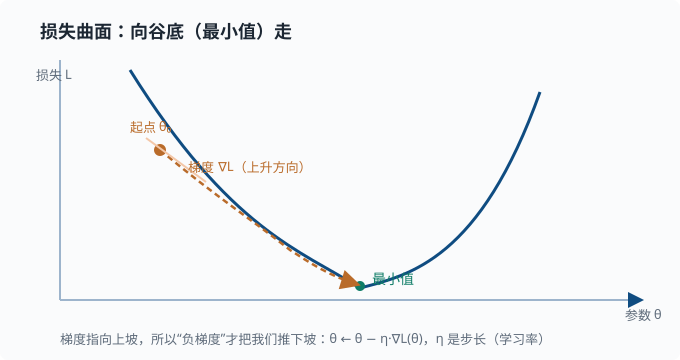
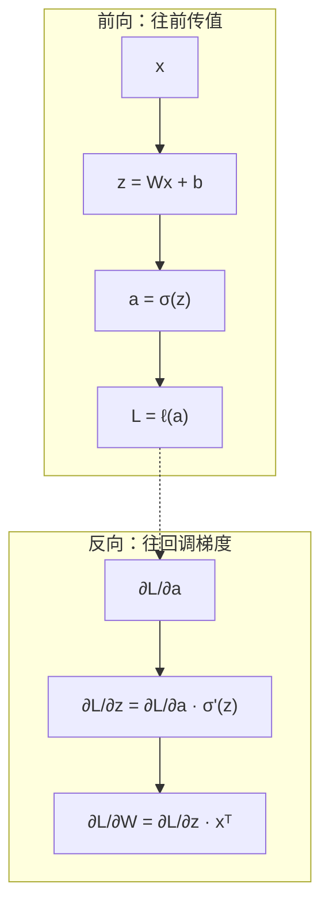

# 梯度与微分：学习是怎么发生的

> 目标：弄懂"下降"的数学。读完这一页，你能解释导数、偏导、梯度、链式法则、Jacobian，并理解深度学习里"反向传播"为什么本质上就是反复用链式法则算梯度。

## 为什么需要梯度

先讲一个你天天都在用、却没意识到的东西：**"变化有多快"**。

- 一辆车开得多快？那是"位置"随时间变化的快慢。
- 一段坡有多陡？那是"高度"随水平距离变化的快慢。
- 一件商品销量随价格怎么变？那是"销量"随"价格"变化的快慢。

生活中到处都要回答"一个东西跟着另一个东西变，变得有多急"，也就是**变化率**。导数（微分）就是给这个直觉一个精确、可计算的形状：它告诉你，当输入稍微动一点点时，输出跟着动多少。本质上等于"输入变动一个微小单位的瞬间，输出变化的比例"。

这个工具为什么"万能"？因为只要有"某个结果跟某个因变量有关"，就能问"改变因变量时结果怎么变"，而**"怎么变"正是决定"往哪调更有利"的向导**。举个例子：假如你想让某个结果变小，就先看它随某个输入如何变化——如果结果是随输入增大而增大的，那就往减小的方向调；反过来就往增大的方向调。这个"顺着变化方向去调整"的思路，正是后面所谓"让结果变小"类问题的通用骨架。

$$
\text{损失 }L(\theta)\ \text{对参数 }\theta\text{ 的导数}\ =\ \text{“}\theta\text{ 动一点点，}L\text{ 变多少”}
$$

$$
\text{顺梯度反方向走，}L\text{ 就会下降}
$$

所以，当一个系统有一堆"可调节的旋钮"，我们要找"让某个目标（错误、成本）变小"的拧法时，导数和梯度就给出了方向性的答案：顺着让目标变小的方向去调。这个思路就叫**梯度下降**，它是许多"靠数据来调旋钮"的场景共同的骨架。下面这张图给出"损失地形 + 梯度方向 + 谷底"的整体画面：



## 导数：瞬时变化率

把上面的直觉落到一元函数 $f(x)$。我们在 $x_0$ 处问：当 $x$ 从 $x_0$ 稍微挪一点点（记为 $h$，趋近于 0），$f$ 跟着变多少？"变化量之比"即 $\frac{f(x_0+h)-f(x_0)}{h}$。当 $h$ 无限缩小时得到的那个极限，就叫导数：

$$
f'(x_0)=\lim_{h\to0}\frac{f(x_0+h)-f(x_0)}{h}
$$

几何上，它是曲线在 $x_0$ 处**切线的斜率**。

常见导数公式，务必熟到脱口而出：

$$
\frac{d}{dx}[c]=0;\quad
\frac{d}{dx}[x^n]=n\,x^{n-1};\quad
\frac{d}{dx}[e^x]=e^x;\quad
\frac{d}{dx}[\ln x]=\frac1x
$$

$$
\frac{d}{dx}[\sin x]=\cos x;\quad
\frac{d}{dx}[a\,f(x)]=a\,f'(x);\quad
\frac{d}{dx}[f+g]=f'+g'
$$

两个非常常用的法则：

**乘积法则**：

$$
(fg)'=f'g+fg'
$$

**链式法则**：

$$
\frac{d}{dx}\big[f(g(x))\big]=f'\big(g(x)\big)\cdot g'(x)
$$

链式法则是整个深度学习的关键——反向传播就是它。先把它记牢。

> 深挖：为什么是乘积法则而非"各自求导再相乘"？对 $fg$ 来说，两边同时有一点改变，变化量既来自 $f$ 也来自 $g$，还来自两者同时变的二阶小量（可忽略），所以 $f'g+fg'$——一阶近似里要保留所有可能来源。

## 偏导数：多变量情形

当函数有多个输入 $f(x_1,x_2,\dots,x_n)$，我们只能在一个方向动。**偏导数**就是"固定其他变量，只看某个变量的导数"：

$$
\frac{\partial f}{\partial x_1}=\ \text{把 }x_2..x_n\text{ 当作常数，对 }x_1\text{ 求导}
$$

例子 $f(x,y)=x^2+3xy$：

$$
\frac{\partial f}{\partial x}=2x+3y;\qquad
\frac{\partial f}{\partial y}=3x
$$

每个偏导只回答"沿这一个坐标轴动，函数怎么变"。

## 梯度 Gradient

把所有偏导排成一个向量，就是**梯度**，记作 $\nabla f$：

$$
\nabla f=\left[\frac{\partial f}{\partial x_1},\,\frac{\partial f}{\partial x_2},\,\dots,\,\frac{\partial f}{\partial x_n}\right]
$$

梯度的关键性质：

$$
\text{梯度指向函数上升最快的方向};\quad
\text{负梯度指向下降最快的方向};\quad
\text{梯度的大小}=\text{这个方向的陡峭程度}
$$

这就是梯度下降的直接依据。一个直观但重要的观察：**梯度垂直于等值线**（因为在等值线上函数值不变，任何"往等值线方向"的移动都不改变函数值）。

## 链式法则：把复杂网络拆开

神经网络是一个函数嵌套：每层的输出进入下一层。用链式法则，我们可以把"最终损失对深层参数的导数"拆成一段段乘积。

假设

$$
\mathbf{z}=\mathbf{W}\mathbf{x}+\mathbf{b};\qquad
\mathbf{a}=\sigma(\mathbf{z});\qquad
L=\ell(\mathbf{a})
$$

那么

$$
\frac{\partial L}{\partial \mathbf{W}}=\frac{\partial L}{\partial\mathbf{a}}\cdot
\frac{\partial\mathbf{a}}{\partial\mathbf{z}}\cdot
\frac{\partial\mathbf{z}}{\partial\mathbf{W}}
$$

**反向传播**做的，就是从 $\partial L/\partial\mathbf{a}$ 开始，从后往前逐层乘上这些局部导数。梯度就像"误差信号"在每一层逐段传递。

用一张简图看清"前向传值、反向传梯度"这对镜像过程：



先是脑海中建立这个图：

```text
前向：输入 → 各层 → 损失
反向：损失 → 各层局部梯度 → 参数更新量
```

## Jacobian：一阶偏导的矩阵

当**输出也是向量**时，一阶偏导排成一个矩阵，叫 **Jacobian**：

$$
J[i][j]=\frac{\partial f_i}{\partial x_j}
$$

它把"输入的小变化"映射成"输出的小变化"：$\delta\mathbf{z}\approx J\,\delta\mathbf{x}$。在深度学习里，多层网络的梯度传播常写成 Jacobian 的连乘。

两条形状规则值得记牢（以一个把长度 $n$ 的输入 $\mathbf{x}$ 映射成长度 $m$ 的输出 $\mathbf{z}$ 的层为例）：

- 该层的 Jacobian 是 $m\times n$ 矩阵——**输出维度在前，输入维度在后**。
- 反向传播时，上游传来长度 $m$ 的误差向量 $\mathbf{g}=\partial L/\partial\mathbf{z}$，往回传给输入要左乘 Jacobian：$\partial L/\partial\mathbf{x}=J^{\mathsf{T}}\mathbf{g}$，形状 $(n\times m)\cdot m=n$，正好对上。**转置不是装饰，是让形状闭合的必然**。

你不用手推每个 Jacobian 的元素，但"高维导数是矩阵、反向传播是转置左乘、形状必须闭合"这三个事实，是第 04 章反向传播的全部骨架。

## 梯度下降更新法则

最常见的更新：

$$
\theta\leftarrow\theta-\eta\,\nabla L(\theta)
$$

其中 $\eta$ 是**学习率**：

- $\eta$ 太小 → 学得慢。
- $\eta$ 太大 → 越过最低点、反复震荡甚至发散。

这个 $\eta$ 的选择是训练里最需要调的超参数之一。后面 [03-05 评估与训练诊断](../03-machine-learning/03-05-evaluation-metrics.md) 和深度学习章节会反复谈到。

## 动手：数值验证梯度

用"差分"近似验证解析导数是工程里的常用手段。注意用**中心差分**误差更小：

```python
import numpy as np

def f(x):
    return x**3 + 2*x

# 解析导数：f'(x) = 3x² + 2
def df(x):
    return 3*x**2 + 2

x = 2.0
h = 1e-6
forward = (f(x + h) - f(x)) / h          # 前向差分
central = (f(x + h) - f(x - h)) / (2*h)  # 中心差分，误差更小
print("forward:",  forward.round(7))     # ≈ 14.000001
print("central:",  central.round(7))     # ≈ 14.000000
print("analytic:", df(x).round(7))       # 14.0

# 梯度下降：找 f 的最小值（一元演示）
# f(x) = (x - 2)²，最小值在 x = 2，f'(x) = 2(x - 2)
theta = 5.0
lr = 0.05
for _ in range(200):
    theta -= lr * 2 * (theta - 2)
print("converged theta:", round(theta, 4))   # → 2.0，落在导数为 0 的谷底
```

## 思考题

1. 为什么更新时用的是负梯度而不是正梯度？
2. 链式法则和反向传播是什么关系？
3. 学习率太大或太小时，训练曲线各会呈现什么样子？
4. 梯度为 0 的点意味着什么？它一定是全局最小吗？
5. 为什么数值验证梯度常用"中心差分"而不是简单的前向差分？

## 参考答案

1. 梯度指向函数**上升最快**的方向；要让损失下降，必须朝其**反方向**（负梯度）走。
2. 反向传播就是链式法则的系统化应用：从最终损失出发，把局部导数一层层向前（反向）相乘，得到每个参数的梯度。
3. 学习率太小：损失缓慢下降，训练"爬得很慢"；学习率太大：容易越过最低点来回震荡，甚至发散（损失不降反升）。
4. 梯度为 0 的点叫**驻点**（导数在该处"停住"了），它可能是局部最小、局部最大或鞍点（鞍点：某些方向看是谷底、另一些方向看是山顶，形状像马鞍；高维函数里大量驻点其实是鞍点）。要保证它是全局最小，需要函数具备凸性；对非凸函数，梯度为 0 并不能保证全局最优。
5. 前向差分 $(f(x+h)-f(x))/h$ 的误差大约是 $O(h)$（还含一阶偏差），中心差分 $(f(x+h)-f(x-h))/(2h)$ 的误差大约是 $O(h^2)$——同样步长下中心差分更准，所以工程里用于"验证梯度是否正确"时优先选它。

## 下一步

- 想深入了解"怎么高效地走到最低点" → [01-07 最优化](01-07-optimization.md)。
- 想看它在神经网络训练里的完整面貌 → [04 深度学习](../04-deep-learning/README.md)。
- 想懂贝叶斯与概率那边如何配合 → [01-04 贝叶斯视角](01-04-bayesian.md)。

[返回本章目录](README.md)
