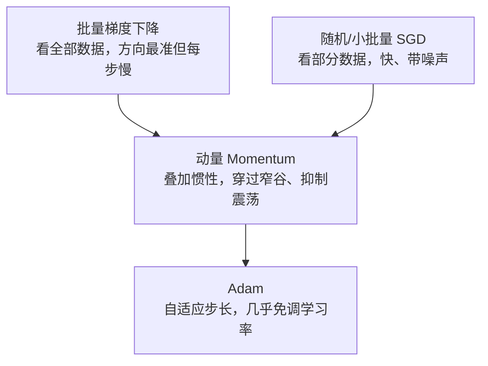

# 最优化：如何最小化损失

> 目标：把"找最优参数"变成一套方法论。读完这一页，你能讲清凸性与局部/全局最优、梯度下降与变体（随机梯度、带动量、Adam）、以及约束与惩罚如何在优化里运作。

## 最优化问题的骨架

先看一个不涉及任何技术的日常场景：你要从山顶走到山谷的最低点，但雾很大，只能看见脚下这一小块坡。这时你会怎么走？大概是这样——**感受一下脚下是上坡还是下坡，然后朝着下坡的方向迈一步，再重复**。你不需要看清整座山，只需要"每一步都让海拔降低一点"，方向大致对就能接近谷底。

这个"每一步朝着让目标变小的方向走"的通用套路，就是**最优化（optimization）**：我们要找一个输入，让某个目标函数尽量小（或尽量大）。目标函数可以是"走路的海拔"、"做某件事的总成本"、也可以是你想平衡或优化的任何数量。只要它能量化，就能问"怎么调输入才能让它最理想"。

数学上，把它写成：对输入 $\theta$，找到一个让它达到最小值（或接近最小）的选择 $\theta^{*}$：

$$
\min_\theta\ L(\theta)\qquad\text{subject to 可能的额外约束 }g(\theta)\le 0
$$

这里 $L$ 叫目标（也可以叫"代价/损失"），$\theta$ 是那些能调节的输入。我们希望找到让 $L$ 最小的 $\theta^{*}$。也许你还对"损失""参数"这些词有些陌生——先别急，这一页会把"怎么走下山"这套逻辑讲透，等你后面真正遇到需要"调一堆旋钮来让错误变小"的问题时，会自然认出它。这一页从"损失地形"出发建立直觉：


## 凸性与局部/全局最优

凸函数有非常美好的性质：**任何局部最小都是全局最小**。直观上它像一个碗，只有一个最低点；而凹函数/多峰函数像丘陵，可能有很多坑，掉进去未必是最低处。

$$
\text{凸函数：任意两点连线的值}\ge\text{函数值}\quad\Rightarrow\quad\text{只有一个谷底}
$$

$$
\text{非凸函数：有很多局部谷底}\quad\Rightarrow\quad\text{容易困在次优解}
$$

经典的线性回归损失是凸的（所以有唯一解）；而神经网络损失通常非凸（所以初始化、随机性、动量都很重要）。

> 深挖：如何判断凸性？一个常见判据是看二阶导数——多元情形下所有二阶偏导排成的矩阵叫 **Hessian**（海森矩阵）。若 $f''(x)\ge0$（一元）或 Hessian 半正定（多元），函数是凸的。举例：$x^2$ 凸（$f''=2>0$）、$-\log x$ 凸（$f''=1/x^2>0$）——这解释了为什么"平方损失"(01-03) 与"交叉熵"(01-05) 单独看都是凸的；但它们叠加进深度网络后整体却非凸。

### 为什么"凸"那么重要

- 凸问题有高效的确定算法。
- 非凸问题只能靠近似优化（如随机梯度下降），结果依赖初始点和超参数（**超参数**：你在训练**开始前**设定、训练中不被动学习的配置，如学习率、批大小——区别于模型自己学出来的"参数"）。
- 理解这一点，就能明白为什么深度学习训练"看运气 + 看调参"。

## 梯度下降及其变体

四种策略可以用一张对照图记住：



### 批量梯度下降 Batch GD

每次用**全部**数据算梯度再更新：

$$
\theta\leftarrow\theta-\eta\cdot\frac1n\sum_i\nabla L_i(\theta)
$$

优点：梯度方向最准；缺点：数据多时每步太慢。

### 随机梯度下降 SGD

每次只用**一个**样本（或一小批 mini-batch——比如每次取 32 个样本一起算，兼顾速度和稳定性）算梯度：

$$
\theta\leftarrow\theta-\eta\,\nabla L_i(\theta)
$$

优点：快、天然带噪声（有时能帮跳出浅坑）；缺点：方向抖。小批量（batch=32/64）是实践中的最佳平衡。

### 动量 Momentum

给更新叠加"上一步的方向惯性"：

$$
v\leftarrow\beta\,v-\eta\,\nabla L;\qquad\theta\leftarrow\theta+v
$$

$\beta$ 常见取值 $0.9$。它能平滑震荡、加速朝同一方向前进，尤其帮梯度下降穿过窄谷。

### Adam

实践里最常用的自适应优化器，它结合了动量（一阶矩）和梯度平方的衰减平均（二阶矩），自动给每个参数"按量放大/缩小"：

$$
m\leftarrow\beta_1 m+(1-\beta_1)g;\qquad
v\leftarrow\beta_2 v+(1-\beta_2)g^2
$$

$$
\hat{m}=\frac{m}{1-\beta_1^t};\qquad
\hat{v}=\frac{v}{1-\beta_2^t}
$$

$$
\theta\leftarrow\theta-\text{lr}\cdot\frac{\hat{m}}{\sqrt{\hat{v}}+\varepsilon}
$$

（$\text{lr}$ 就是学习率 $\eta$ 的代码写法——几乎所有深度学习框架里这个参数都叫 `lr`；$\varepsilon$ 是一个极小的常数，如 $10^{-8}$，只为防止除以 0。）其中 $t$ 是当前步数。$\hat{m},\hat{v}$ 是**偏差修正**：$m$、$v$ 都从 0 起步，前几步会系统性偏小，除以 $1-\beta^t$（训练初期接近 0，修正幅度大；随 $t$ 增大趋于 1，修正自动消失）把它们拉回真实量级，避免开局步长过小。

效果上，梯度长期大的参数分母大、步子被压小；梯度小而稳定的参数分母小、步子相对放大——"每个参数有自己的有效学习率"。它不是你非要手推的公式，但要知道它在"自动适配每一步的大小"。

## 学习率：最关键的超参数

学习率 $\eta$ 决定每一步跨多大：

| 现象 | 可能原因 |
|---|---|
| 训练曲线很久不下降 | 学习率太小 |
| 损失震荡甚至发散 | 学习率太大 |
| 训练后期"卡死" | 需要学习率衰减或更精细的调度 |

常见做法是**学习率调度**：先大后小，先在远处快速接近，再在最小值附近精细收敛。你会在深度学习章节反复见到 `warmup + decay`。

> 深挖：学习率与收敛的理论直觉。对凸函数，梯度下降以 $O(1/T)$ 收敛；学习率太大时更新会"跳过"最小值来回弹，太小则收敛极慢。实践里还常用**步长缩放**（learning rate warmup）先让小步适应梯度量级，再放大，最后按计划衰减。

## 约束与惩罚（正则化）

有时我们希望参数不只让损失小，还要"别太复杂"。常见做法是给损失加惩罚：

$$
L'(\theta)=L(\theta)+\lambda\,R(\theta)
$$

常见正则项：

$$
L2:\ R(\theta)=\tfrac12\|\theta\|^2\quad\Rightarrow\ \text{把大权重往 0 方向拉（权重衰减）}
$$

$$
L1:\ R(\theta)=\|\theta\|_1\quad\Rightarrow\ \text{鼓励稀疏（很多分量恰好为 0）}
$$

$\lambda$ 控制惩罚强度。大量参数、较大 $\lambda$ 会更"保守"。这和 [01-04 贝叶斯视角](01-04-bayesian.md) 里的"先验"直接对应——正则化是加了先验的优化。

## 约束优化：可行域与投影

有些时候参数必须落在某个区域内（如概率必须非负且和为 1）。两种思路：

- **投影法**：先更新，再"拉回"到可行域里。
- **softmax**：用可导函数直接输出满足"非负且和为 1"的向量——它是 soft argmax（软的最大值选取）的名字来源，得分最高的类别拿到最大概率。

softmax 是语言模型输出的默认收尾，因为 next-token 必须是一个合法概率分布。

## 一个可视化直觉

把损失想成地形，参数是位置，梯度是"最陡的坡"：

```text
批量 GD：看完整地图，走大方向，稳但慢
SGD：    随手抓一个点测坡，快但抖
动量：   带惯性冲，能穿过小坑
Adam：   自适应步长，几乎免调学习率
```

## 动手：一个小型优化演示

```python
import numpy as np

def loss(x):
    return (x - 3) ** 2        # 一个凸碗，最优点在 x=3
def grad(x):
    return 2 * (x - 3)

# 朴素梯度下降
x = 0.0; lr = 0.1
for _ in range(100):
    x -= lr * grad(x)
print("converged x:", round(x, 4))      # 3.0

# 模拟一个震荡场景：加大学习率看发散
x = 0.0; lr = 1.2
for _ in range(50):
    x -= lr * grad(x)
print("large lr final:", round(x, 4))   # 会来回弹甚至发散
```

## 思考题

1. 为什么凸优化的"全局最优"保证在神经网络里不成立？
2. 动量 $\beta$ 取大一点会让训练更稳还是更震荡？
3. L1 和 L2 正则化的效果分别是什么？它们的几何差异在哪？
4. 学习率一直太大，损失曲线常出现什么特征？
5. 为什么小批量 SGD 的"噪声"有时反而是优点？

## 参考答案

1. 凸优化能保证全局最优，是因为凸函数只有一个谷底。而神经网络损失通常是**非凸**的（多峰、多鞍点），所以只能保证收敛到某个局部最优点，结果依赖初始化、优化器与超参数。
2. 动量 $\beta$ 越大、"惯性"越强，能更平滑地穿过窄谷、抑制高频震荡；但取得过大也可能矫枉过正、在拐弯处冲过头造成震荡。实践里 $0.9$ 左右是常见平衡。
3. L2 把权重平滑地压向 0（处处变小），L1 会把一部分权重**恰好压成 0**（得到稀疏解）。几何上，L2 是圆形（球）约束，L1 是菱形约束——菱形有"角"，最优解常落在轴上，从而产生稀疏。
4. 损失曲线会**来回震荡甚至发散**：不下降、呈锯齿状，数值可能一直上升甚至溢出到 NaN。
5. 噪声让参数更新不是死板地朝"当前批的最陡坡"走，而是带随机扰动——有时能帮跳出浅的局部谷底或穿过鞍点，从而找到更平的局部最优。这也是 SGD 在深度网络上常优于朴素全批量梯度下降的原因之一。

## 下一步

- 想把这些工具真正落到"训练神经网络" → [04 深度学习](../04-deep-learning/README.md)。
- 想理解模型评估与诊断 → [03-05 评估指标](../03-machine-learning/03-05-evaluation-metrics.md)。
- 想看这在整个 Agent/LLM 训练链路怎么出现 → [07 LLM 工程](../07-llm-engineering/README.md)。

[返回本章目录](README.md)
