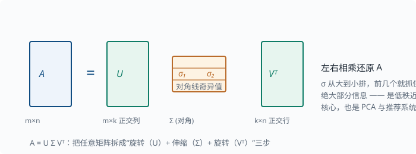
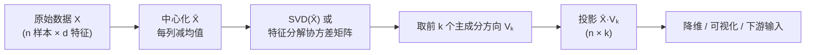

# 矩阵分解：SVD 与主成分分析

> 目标：把"怎么把一个矩阵拆成更简单、更有意义的几块"变成工具。读完这一页，你能说出特征分解与 SVD 的区别、理解主成分分析（PCA）是怎么降维的，并解释为什么"低秩近似"能压缩数据。

## 为什么要做矩阵分解

矩阵分解的动机很朴素：**一个大而乱的矩阵，往往可以被拆成几个小而有意义的矩阵相乘**。拆开之后：

- 能看出真正的信息有多少（秩）。
- 能用更少的数近似原矩阵（压缩）。
- 能找到数据变化最大的方向（降维、特征提取）。

一句话：理解一个矩阵的最好方式，是把它"解剖"成语义清晰的积。

## 复习：特征分解

在 [01-01 线性代数](01-01-linear-algebra.md) 里我们看到，方阵 $\mathbf{A}$ 若能找到特征向量 $\mathbf{v}$ 和特征值 $\lambda$ 满足 $\mathbf{A}\mathbf{v}=\lambda\mathbf{v}$，那么

$$
\mathbf{A}=\mathbf{Q}\,\Lambda\,\mathbf{Q}^{-1}
$$

其中 $\mathbf{Q}$ 的列是特征向量，$\Lambda$ 是对角矩阵、对角线是特征值。**意义**：$\mathbf{A}$ 等价于"沿特征向量方向，分别伸缩 $\lambda$ 倍"。

局限：**只有方阵**才有特征分解，且未必总能"对角化"（即未必能写成上式的乘积形式；直观原因是某些特征向量"黏在一起"分不开，如旋转矩阵）。现实中的数据矩阵（如"样本 × 特征"）几乎都是矩形，这就引出 SVD。

## 奇异值分解 SVD

任何 $m\times n$ 的矩阵 $\mathbf{A}$ 都能写成：

$$
\mathbf{A}=\mathbf{U}\,\Sigma\,\mathbf{V}^{\mathsf{T}}
$$

其中：

$$
\mathbf{U}:\ m\times m\ \text{正交矩阵，列叫“左奇异向量”}
$$

$$
\Sigma:\ m\times n\ \text{对角矩阵，对角线上是奇异值 }\sigma_1\ge\sigma_2\ge\dots\ge0
$$

$$
\mathbf{V}:\ n\times n\ \text{正交矩阵，列叫“右奇异向量”}
$$

两个术语先说清（[01-01](01-01-linear-algebra.md) 里铺垫过"正交 = 垂直"）：**正交矩阵**是列与列两两垂直、且每列长度恰为 1 的方阵——它代表的变换**只旋转/翻转、不拉伸**；**对角矩阵**是只有对角线上有非零元素的矩阵——它代表"沿各轴独立伸缩"。所以 $A=U\Sigma V^{\mathsf T}$ 的意思立刻可读：**任何矩阵的作用 = 旋转 → 伸缩 → 再旋转**。

下面这张图把"旋转 + 伸缩 + 旋转"的结构画出来：



**意义**（这是重点）：

```text
Vᵀ 的作用：把原空间旋转到一个新坐标系
Σ 的作用：沿新坐标系的各轴分别伸缩 σᵢ
U 的作用：把结果旋转到输出空间
```

奇异值 $\sigma_i$ 的大小，直接度量"这个方向承载了多少信息"。

> 特征分解与 SVD 的关系：对任意 $m\times n$ 矩阵，$\mathbf{A}\mathbf{A}^{\mathsf{T}}$ 与 $\mathbf{A}^{\mathsf{T}}\mathbf{A}$ 的特征值都是奇异值的平方 $\sigma^2$；奇异值恒非负，而特征值可正可负。SVD 是"适用于一切矩阵的更一般特征分解"。

## 截断 SVD：低秩近似

奇异值按大小递减，往往**前几个很大、后面迅速趋近 0**。于是我们可以只保留前 $k$ 个奇异值，并舍弃其余：

$$
\mathbf{A}\approx \mathbf{U}_k\,\Sigma_k\,\mathbf{V}_k^{\mathsf{T}}
$$

这叫**截断 SVD（truncated SVD）**，产生的矩阵秩为 $k$，是"用最少的块去最接近原矩阵"的最优近似之一。它直接带来：

- **压缩**：用远少于原矩阵的数字存下"近似版本"。
- **去噪**：小奇异值常是噪声，丢掉它们等于滤噪。
- **降维**：作为特征提取的前置。

直觉（以"样本 × 特征"数据矩阵为例，与下面 PCA 一节一致）：

$$
\underbrace{\mathbf{A}}_{\text{原数据}}\approx
\underbrace{\mathbf{U}_k}_{\text{样本在新坐标系下的坐标}}\times
\underbrace{\Sigma_k}_{\text{各方向的重要性}}\times
\underbrace{\mathbf{V}_k^{\mathsf{T}}}_{\text{主成分方向（行）}}
$$

## 主成分分析 PCA

PCA 是 SVD 在数据降维里的直接应用。目标：把高维数据点投影到**少数几个正交方向**上，同时尽量保留方差。完整管线用一张图串起来：



做法：

1. 把数据矩阵 $\mathbf{X}$ 中心化（每列减去均值），得到 $\bar{\mathbf{X}}$。
2. 对 $\bar{\mathbf{X}}$ 做 SVD（或等价地对协方差矩阵 $\bar{\mathbf{X}}^{\mathsf{T}}\bar{\mathbf{X}}$ 做特征分解）。
3. 取前 $k$ 个奇异向量作为"主成分方向"，把数据投影上去：

$$
\mathbf{X}_{\text{proj}}=\bar{\mathbf{X}}\,\mathbf{V}_k
$$

**为什么选方差最大的方向？** 保留方差 = 保留信息。第一个主成分是数据分布最"长"的方向，第二个是与之正交且次长的方向，依此类推。

### PCA 能干什么

- **降维**：从几百维压到几十维，仍保留大部分方差。
- **可视化**：投影到 2D/3D 便于观察聚类。
- **特征去相关**：主成分彼此正交。
- **作为下游算法的输入**（常配合 [03-07 无监督](../03-machine-learning/03-07-unsupervised.md)）。

局限：PCA 是**线性**变换，对线性结构有效；对弯曲的非线性结构（数据点铺在一张弯曲的曲面上，只是嵌在高维空间里），需要内核 PCA（先把数据用"核函数"抬到更高维，让它在高维里变得线性可分）或流形学习（直接学习那张低维曲面）等更强工具。这两个名字此刻知道存在即可。

## 与机器学习 / Agent 的联系

- **推荐系统**：用户-物品矩阵常常低秩，用 SVD 做**协同过滤**（collaborative filtering——"参考和你口味相似的用户打过的高分来推荐"这类推荐思路，因为靠的是用户之间的协作信息而非物品本身的描述）。
- **词向量 / 词嵌入**：把词表示成数值向量（"嵌入"就是"把离散的词放进连续向量空间"的意思）的技术。词共现矩阵的 SVD 是早期做法，代表叫 **LSA**（Latent Semantic Analysis，潜在语义分析——把"词 × 文档"计数矩阵分解，得到词和文档的潜在语义向量），指向 [05 NLP](../05-nlp-transformers/README.md)。
- **模型压缩**：把权重矩阵做低秩近似，是减少参数量的常见手段。
- "把一个复杂对象拆成语义清晰的几部分"作为一种思维，也适用于分析模块边界与依赖关系——后面读 [09 Agent 架构](../09-agent-architecture/README.md) 时可以体会。

## 动手：用 NumPy 做 SVD 与 PCA

```python
import numpy as np

np.set_printoptions(precision=3, suppress=True)

# 构造一个有强线性结构的二维数据（数据点基本落在一根线上）
rng = np.random.default_rng(0)
t = rng.uniform(-3, 3, size=200)
X = np.column_stack([2 * t + 0.3 * rng.normal(size=200), t])
X_center = X - X.mean(axis=0)

# SVD
U, s, Vt = np.linalg.svd(X_center, full_matrices=False)
print("singular values:", s.round(3))   # 第一个远大于第二个 → 主方向明显

# 降到 1 维
X_1d = X_center @ Vt[0]
print("projected shape:", X_1d.shape)

# 重建（低秩近似，去掉第二大奇异值方向）
X_approx = (X_1d[:, None] * Vt[0])
print("reconstruction error:", np.abs(X_approx - X_center).mean().round(3))

# 保存方差比例：前 k 个奇异值平方占总奇异值平方的比例
var_ratio = s[0]**2 / (s**2).sum()
print("variance kept by PC1:", round(var_ratio, 3))   # 通常 > 0.95
```

## 思考题

1. 特征分解和 SVD 在适用对象上的关键区别是什么？
2. 为什么奇异值越大，说明该方向承载越多信息？
3. 为什么 PCA 前要先做中心化？不中心化会怎样？
4. 截断 SVD "丢掉小奇异值方向"为什么通常等价于去噪？
5. 低秩近似为什么能压缩？以用户-物品矩阵为例说明。

## 参考答案

1. 特征分解要求方阵且未必可对角化；SVD 对**任意矩形矩阵**都成立，是更一般的分解。
2. 奇异值等于该方向上的"伸缩量"；伸缩越大，表示数据沿这个方向铺开得越开、能区分的差异越大，因此承载的主信息越多。
3. 中心化让原点落在数据均值处，主成分方向才能反映数据的**真实散布**；不中心化，第一个主成分会被"距原点较远"这个整体偏移主导，而偏离真正的方差结构。
4. 陡峭的小方差方向通常是随机噪声造成的，奇异值小说明信息弱、噪声占比高；丢掉它们保留主要结构，等于在最小均方误差意义下滤波。
5. 用户-物品矩阵通常是"少数潜在偏好因素"决定的，所以实际秩很低。截断 SVD 用 $k$ 个"潜在因子"（$\mathbf{U}_k,\Sigma_k,\mathbf{V}_k^{\mathsf{T}}$）来近似，存储从"用户数×物品数"降为"用较小的 $k$ 个因子"，还能把缺失评分预测出来，这正是协同过滤推荐的地基。

## 下一步

- 想在机器学习里把降维用于聚类与可视化 → [03-07 无监督](../03-machine-learning/03-07-unsupervised.md)。
- 想看词共现矩阵如何变成向量 → [05 NLP 与 Transformer](../05-nlp-transformers/README.md)。
- 想回顾从 01-01 带来的特征分解直觉 → [01-01 线性代数](01-01-linear-algebra.md)。

[返回本章目录](README.md)
