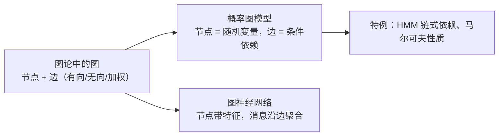
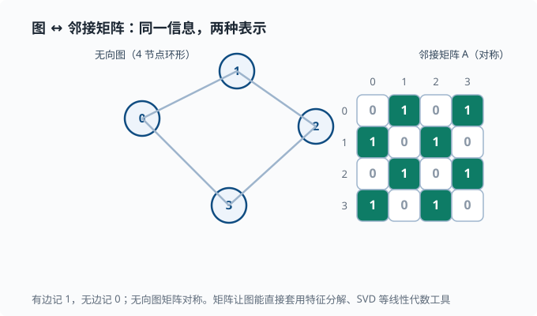
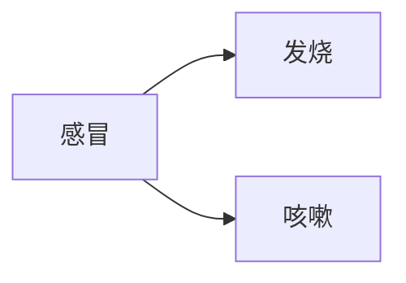
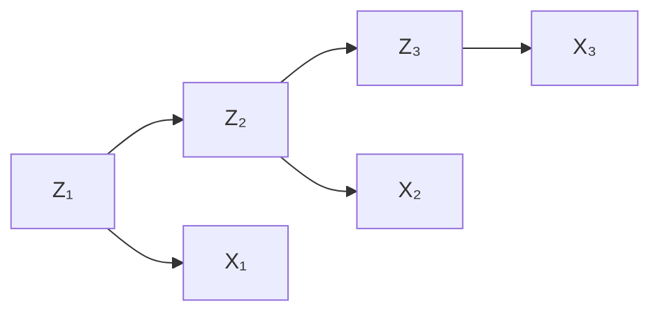
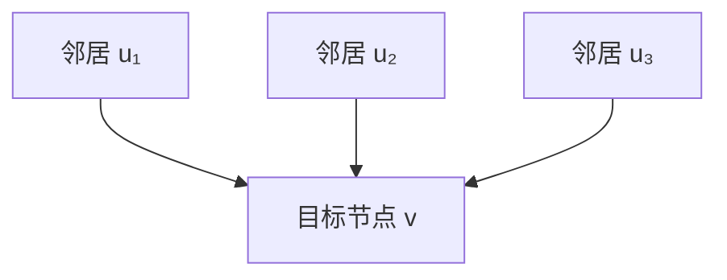

# 图与概率图模型

> 目标：把"关系"变成可计算的结构。读完这一页，你能用图描述数据与系统的依赖关系，理解有向/无向图的区别，掌握概率图模型如何压缩联合分布，并看到它和 Agent 拓扑的联系。

## 为什么需要图

前面讲的数据大多是"一行一个样本、一列一个特征"的表格，行与行之间**没有关系**。但现实里很多东西天生是"带关系"的：

- 社交网络里，人与人靠"好友关系"相连。
- 分子里，原子靠"化学键"相连。
- 网页靠"超链接"相连。
- 一个 Agent 系统里，不同能力、插件、消息流之间靠"依赖与调用"相连。

图就是表达"谁和谁有关"的标准语言。用一张图概括本页会覆盖的三类"图"：



## 图的基本概念

一张图由**顶点（节点）**和**边**组成：

$$
G=(V,\,E)
$$

$$
V:\ \text{顶点集合}\qquad E:\ \text{边集合}
$$

两个关键分类：

```text
有向图：边有方向   u → v   （依赖/流程，如"插件 A 调用插件 B"）
无向图：边无方向   u — v   （对称关系，如"好友"）
加权图：边上带数值（权重），如距离、调用次数
```

常用术语：

- **度（degree）**：一个节点连了多少条边。
- **邻居（neighbor）**：直接相连的节点。
- **路径与连通**：能否沿着边走通。
- **邻接矩阵（adjacency matrix）**：用矩阵记录节点是否相连，$A[u][v]=1$ 表示有边。
- **拉普拉斯矩阵（Laplacian）**：由邻接矩阵导出，$L=D-A$（$D$ 是把每个节点的度放在对角线上的矩阵），对它做特征分解（行话叫图的**谱分析**，"谱"就是特征值排成的序列）是图结构分析的核心工具。

邻接矩阵值得细说：它把"图"翻译回我们已经熟悉的矩阵世界，让线性代数工具（特征分解、SVD）能直接用到图上——这正是 [01-08 矩阵分解](01-08-matrix-decomposition.md) 和图之间的一座桥。下图是同一张无向图与它的邻接矩阵的一一对应：



读图时注意两件事：矩阵**对角线的格子**是"自己到自己"，这里全是 0（没有自环——即"从自己连回自己"的边）；而**非对角线对称**——因为无向图的边没有方向，$A[u][v]=A[v][u]$。有向图则会打破这种对称，$A[u][v]=1$ 只表示存在"从 $u$ 到 $v$"的边，不一定有反向。

## 图能表达什么

图的价值在于把**关系**纳入建模：

- **节点任务**：判断某个节点属于哪类（如用户是否为异常）。
- **边任务**：预测两节点间有没有关系（如推荐"可能认识的人"）。
- **图任务**：对整个图分类（如分子是否有某种活性）。
- **消息传递**：让信息沿边流动，这正是 Agent 里"任务在工具/子代理之间传递"的抽象。

## 概率图模型：把概率画成图

当图上的节点是**随机变量**、边表示**条件依赖**时，就得到概率图模型（Probabilistic Graphical Model, PGM）。它的核心优势：

$$
\text{用图结构把“巨大的联合分布 }P(X_1,\dots,X_n)\text{”压缩成“局部依赖的组合”}
$$

没有图结构的暴力写法要列出所有变量的联合概率，维数一高就爆炸；有了图，只需要给每个节点指定"它依赖少量父节点的条件概率"。

### 有向：贝叶斯网络

有向边 $X\to Y$ 表示"$X$ 影响 $Y$"。联合分布按图拆成：

$$
P(X_1,\dots,X_n)=\prod_i P\big(X_i\mid\text{parents}(X_i)\big)
$$

**直觉**：每个变量的概率，只取决于它的直接父节点。这大幅减少要存的概率数。

例：一个简单的"生病-症状"网络，用 Mermaid 画出来就是它：



联合概率：

$$
P(\text{感冒},\text{发烧},\text{咳嗽})=P(\text{感冒})\cdot P(\text{发烧}\mid\text{感冒})\cdot P(\text{咳嗽}\mid\text{感冒})
$$

### 条件独立：图的另一半价值

图不仅压缩存储，还显式告诉我们"谁和谁条件独立"。仍以上面的网络为例：一旦知道"感冒"是否成立，发烧和咳嗽就**条件独立**了——它们共同受感冒解释，知道感冒后，发烧不再带来咳嗽的额外信息。

$$
P(\text{发烧},\text{咳嗽}\mid\text{感冒})=P(\text{发烧}\mid\text{感冒})\cdot P(\text{咳嗽}\mid\text{感冒})
$$

这种"给定父节点后，非子孙节点条件独立"的性质（称为**有向分割/d-separation** 的一种表现）是贝叶斯网络推断的引擎，也是 Agent 里"按依赖关系拆分任务"的思想源头。

### 隐马尔可夫模型 HMM（预告）

贝叶斯网络里一个非常常见的特例是**隐马尔可夫模型**（Hidden Markov Model，HMM）：一排随时间演化的**隐状态**（hidden state——真实存在但看不见的内部状态，如下面图里的 $Z$）组成链，每个隐状态又产生一个看得见的**观测**（observation，如 $X$——我们实际拿到的数据）。"隐"字就点明了"原因是隐的、结果才是可见的"：



它是 [05 NLP](../05-nlp-transformers/README.md) 里序列建模的直接前身。

### 马尔可夫性质：未来的关键简化

一个刻画"只依赖最近"的性质：

$$
P(Z_{t+1}\mid Z_t,\,Z_{t-1},\dots)=P(Z_{t+1}\mid Z_t)
$$

这被称为**马尔可夫性质**。它把"无限依赖"压成"一阶依赖"，是大量模型省内存、可计算的基石。你会在 Agent 状态机和序列模型里反复见到它。

## 图神经网络 GNN（预告）

当图的节点带特征、且我们要用神经网络学习时，就用**图神经网络**（Graph Neural Network，GNN）。核心操作是**消息传递**——每个节点把自己的向量"寄"给邻居，邻居收齐后汇总、更新自己：

$$h_v\leftarrow\text{Update}\Big(h_v,\ \text{Aggregate}\big(\{h_u: u\in\text{neighbors}(v)\}\big)\Big)$$

其中 $h_v$ 是节点 $v$ 的特征向量（一开始是原始输入，每轮更新一次），Aggregate 是"把收到的一堆向量合成一个"（求和、平均都行），Update 是"把汇总结果与自己的旧向量融合"的变换。一句话：**每个节点不断聚合邻居的信息，更新自己的表示**。

一棵树上的消息聚合可以这样看：



GNN 是 [04 深度学习](../04-deep-learning/README.md) 在图数据上的延伸，理解"消息沿边流动"这个直觉，比背公式更重要。

## 与 Agent 系统的联系

图几乎就是 Agent 系统的天然语言：

- **依赖图**：插件之间"谁依赖谁"，可以用有向图表达。
- **调用拓扑**：一个任务如何在工具、子代理、消息间流转，就是一张动态图。
- **记忆与上下文**：一段对话里消息之间的引用/回复关系，可建模为图。
- 插件化架构里"注册、失效、作用域、能力缝"这些关系，都可以先画成图再读代码。

读代码时的建议：把一个复杂系统先画成"节点 + 边"的关系图，再逐块深入——这套思维方式贯穿 [09 Agent 架构](../09-agent-architecture/README.md)。

## 动手：用邻接矩阵感受图

```python
import numpy as np

# 一个 4 节点无向图：0-1、1-2、2-3、3-0
edges = [(0,1), (1,2), (2,3), (3,0)]
N = 4
A = np.zeros((N, N))
for u, v in edges:
    A[u][v] = A[v][u] = 1   # 无向 → 对称

print("adjacency:\n", A)

# 度 = 每行的和
degree = A.sum(axis=1)
print("degrees:", degree)

# 拉普拉斯 L = D - A
D = np.diag(degree)
L = D - A
print("laplacian:\n", L)

# 谱分解（SVD/特征分解在图上也能用）
print("eigvals of L:", np.linalg.eigvalsh(L).round(3))
```

## 思考题

1. 有向图和无向图分别适合表达哪种关系？各举一例。
2. 邻接矩阵为什么天然适合配合线性代数工具？
3. 概率图模型为什么能把巨大的联合分布压缩成很小的表示？
4. 马尔可夫性质"只依赖最近状态"如何让模型更可行？
5. 在上面的"感冒-发烧-咳嗽"网络里，为什么给定感冒后发烧和咳嗽条件独立？

## 参考答案

1. 有向图适合表达**方向性依赖**，如"A 插件调用 B 插件"；无向图适合表达**对称关系**，如"两人是好友"。前者信息更多，后者更简单。
2. 邻接矩阵就是一张普通矩阵，可以直接套用特征分解、SVD 等线性代数工具，让"图结构"与"矩阵运算"统一起来（拉普拉斯矩阵的谱分解尤其如此）。
3. 因为它不存"全联合概率"，只存"每个节点依赖其父节点的局部条件概率"；图结构把维数灾难从指数级压缩成线性级。
4. 马尔可夫性质把"无限历史依赖"压成"只看最近一个状态"，状态空间和转移矩阵都有限、可计算，模型才能被训练与推断。
5. 发烧和咳嗽都只受"感冒"这个共同父节点影响；一旦感冒状态确定，二者之间就没有剩下的依赖通道了（它们分叉的共同原因已被"固定"）。所以给定感冒，二者条件独立。这正是贝叶斯网络"父节点解释公共原因"的典型结构。

## 下一步

- 想把这些线性代数工具用在图/降维上 → [01-08 矩阵分解](01-08-matrix-decomposition.md)。
- 想看序列建模如何用图/链式依赖 → [05 NLP 与 Transformer](../05-nlp-transformers/README.md)。
- 想理解 Agent 系统如何用依赖与调用关系组织起来 → [09 Agent 架构](../09-agent-architecture/README.md)。

[返回本章目录](README.md)
