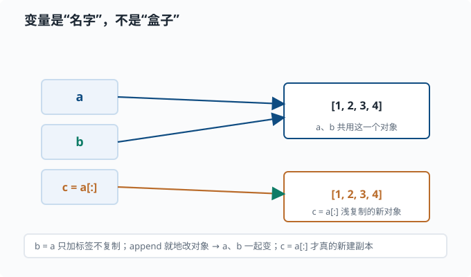
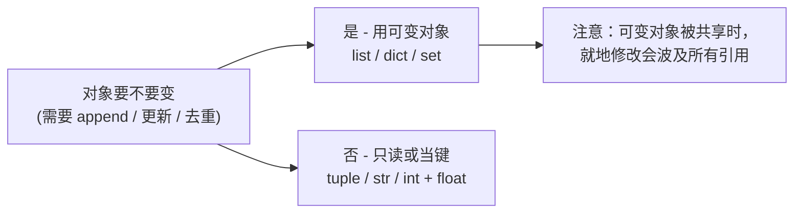

# Python 基础：语法、类型、函数

> 目标：快速但扎实地回顾 Python，不假设你零基础。读完这一页，你能读懂并写出一段干净、类型正确、可复现的 Python 代码，理解变量、容器、控制流、函数与作用域，并知道如何在 agent 工程里把它用对地方。

## 为什么先学 Python

先把它当成一门普通的编程语言来认识，而不是先贴"人工智能专用"的标签。Python 的特点是**读起来特别像大白话**：它不靠花括号和分号堆砌语法，而是用缩进和接近英语的单词，把"做一件事"的过程写得几乎可以自然朗读。这让初学者能更快地把精力放在"想清楚要做什么"，而不是"伺候编译器的脾气"。

一个关键心态：

> Python 的哲学是"可读性优先"。它不逼你写得很短，而是逼你写得**能被人读懂**。你要学的不是炫技，而是写出别人（包括三个月后的自己）能看懂的代码。

至于它为什么"值得学"：因为语言的价值很大程度看生态——**谁能方便地办成很多事**。Python 在数据处理和科学计算上积累了几十年非常成熟的库（后面会逐个用到），这也是它常被选来写分析、实验脚本的原因。你不必一上来就关心某个具体行业，先掌握"用 Python 把事情写清楚"这个通用本事，将来无论做什么实验、查什么数据，都能上手。

## 变量与对象模型

### 变量是"名字"，不是"盒子"

这是 Python 新手最容易踩的第一个坑。在 C/C++ 里，变量像一个装值的盒子；在 Python 里，**变量只是一个指向对象的标签**。

```python
a = [1, 2, 3]
b = a           # b 和 a 指向同一个列表对象，不是复制！
b.append(4)
print(a)        # [1, 2, 3, 4]  ← a 也被改了
```

要真的复制，得显式调用：

```python
c = a[:]        # 浅复制一份列表
d = list(a)     # 同样浅复制
```

把"名字 vs 对象"画出来，区别一目了然：



上面这张图的意思是：**`b = a` 根本没有复制列表**，它只是在"名字"这一列新增了一个标签 `b`，指向和 `a` 完全相同的那个对象。之后无论是 `a` 还是 `b`，改的其实是同一个 `[1, 2, 3, 4]`。只有当你想真正独立一份时才用 `a[:]` 或 `list(a)`，那会创建一个**新的**列表对象。这个直觉在后面看 NumPy 的视图、PyTorch 的 tensor 引用时全都一样：赋值和切片的默认行为是"共享底层"，不想要共享就显式复制。

理解"名字 vs 对象"这件事，是避免一大批诡异 bug 的钥匙。它和后面 NumPy 的视图、PyTorch 的 tensor 引用都有关系。

顺着"名字 vs 对象"还有一个必学的操作符区分：`==` 和 `is`。

```python
a = [1, 2, 3]
b = [1, 2, 3]
a == b    # True   值相等（内容一样）
a is b    # False  不是同一个对象（两块不同的内存）

c = a
c is a    # True   两个名字指向同一个对象
```

读法：`==` 问"长得一样吗"，`is` 问"是同一个吗"。日常比较值用 `==`；只有一个地方必须用 `is`——**判断 None**：

```python
if acc is None:       # 正确
    ...
if acc == None:       # 能跑但不要这样写
    ...
```

原因是 `==` 会调用对象自己的比较方法，理论上可以被自定义类改写出任何行为；而 `is` 只做"是不是同一个对象"的身份判断，不受任何自定义逻辑影响。`None` 是全局单例，判它只关心身份，所以约定 `is None` / `is not None`。

### 可变 vs 不可变

对象分两类：

| 类型 | 可变？ | 例子 |
|---|---|---|
| 不可变 | 否 | 整数、浮点、字符串、元组 `tuple` |
| 可变 | 是 | 列表 `list`、字典 `dict`、集合 `set` |

可变性决定了"修改会不会影响到别的引用"：



不可变对象"改了"其实是换了个新对象；可变对象可以就地修改。这影响函数传参的直觉：

```python
def f(x):
    x = x + 1     # 重新绑定局部名，不影响外面
    return x

a = 3
print(f(a), a)    # 4 3

def g(lst):
    lst.append(1)  # 就地修改，影响外面

b = []
g(b)
print(b)          # [1]
```

### 动态类型与类型标注

Python 变量没有固定类型（这点和 TypeScript 不同），但**你仍然应该写类型标注**：

```python
from collections.abc import Sequence


def mean(xs: Sequence[float]) -> float:
    """返回均值。"""
    return sum(xs) / len(xs) if xs else 0.0
```

`xs: Sequence[float] -> float` 这样的标注不改变运行行为（Python 不强制），但它让你的代码变成**可读的文档**，也让 IDE（编程编辑器的智能提示）和 mypy、pyright（两个最常用的"静态类型检查器"——不运行代码、只读代码就能报告类型不匹配的工具）能帮你提前抓错误。后面读 TypeScript 仓库时你会发现，静态类型检查的作用非常大。

顺带一个约定：类型标注从 `collections.abc` 导入（`Sequence`、`Iterable`、`Mapping`）。老代码里的 `from typing import Sequence` 还能工作，但官方已把它标记为弃用路线——新代码统一走 `collections.abc`。

## 常用内置容器

| 容器 | 特点 | 例子 |
|---|---|---|
| 列表 `list` | 有序、可变、可以重复 | `[1, 2, 3]` |
| 元组 `tuple` | 有序、不可变、可以重复 | `(1, 2, 3)` |
| 字典 `dict` | 键值对、键必须可哈希 | `{"a": 1}` |
| 集合 `set` | 无序、无重复 | `{1, 2, 3}` |

选容器的第一原则：**需求决定结构**。要按顺序访问 → 列表；要快速按键查找 → 字典；要去重 → 集合；要当函数返回多个值 → 元组。选择对了，代码自然简洁。

## 控制流

Python 用缩进表示代码块，没有花括号。条件、循环都靠 `:` 加缩进：

```python
scores = [70, 90, 55, 82]
passed = []
for s in scores:
    if s >= 60:
        passed.append(s)
    else:
        print("不及格:", s)
```

几个写得很地道的惯用法：

```python
# 带索引的循环：enumerate
for i, s in enumerate(scores):
    pass

# 同时遍历两个列表：zip
names = ["a", "b"]
for name, s in zip(names, scores):
    pass

# 列表推导式：简洁且通常更快
passed = [s for s in scores if s >= 60]
```

回看上面那段手写循环：先建一个空列表 `passed`，再 `for` 遍历、`if` 判断、`append` 进去。这三步其实是一个很固定的"套路"——**从一堆东西里挑出符合条件的，变成一个新列表**。Python 给这种套路准备了一个更直接的写法，把"要什么"和"怎么过滤"浓缩成一行，就是**列表推导式**。读法也像说话：`[s for s in scores if s >= 60]` 就是"对 `scores` 里的每个 `s`，如果 `s >= 60` 就放进新列表"。

语法骨架是 `[表达式 for 项 in 序列 if 条件]`，其中 `if 条件` 可以省略。它把"取、过滤、变换"压进一行，而且通常更快；但要克制：推导式嵌套过深会牺牲可读性，两层以上就该考虑换回清晰的循环。

## 函数与作用域

函数是 Python 组织逻辑的最小单位。要点：

- `def 名字(参数) -> 返回类型:` 定义函数。
- 参数可以有默认值，但**默认值只求值一次**，别用可变对象当默认值。
- 函数内对变量的查找规则：局部 → 外层函数 → 全局 → 内置（四个词的首字母 L-E-G-B，合称 LEGB 规则——函数里用一个名字时，Python 按这个由近及远的顺序找它定义在哪）。

经典的默认参数陷阱：

```python
def add(x, acc=[]):     # 危险！acc 只创建一次
    acc.append(x)
    return acc

print(add(1))           # [1]
print(add(2))           # [1, 2]  ← 居然记录了上一次！
```

正确做法是 `acc=None`，在函数体里再初始化：

```python
def add(x, acc=None):
    acc = [] if acc is None else acc
    acc.append(x)
    return acc
```

## 异常处理

猜一个值会不会出错不如**直接尝试并捕获**——这正是 Python 的"请求原谅优于请求许可"（EAFP）风格：

```python
def safe_div(a: float, b: float) -> float | None:
    try:
        return a / b
    except ZeroDivisionError:
        return None
```

要点：

- `try/except` 捕获异常；`else` 在没有异常时执行；`finally` 无论如何都执行（常用于关闭资源）。
- 捕获具体异常类型，别用裸 `except:` 吞掉所有错误——那会掩盖 bug。
- `raise` 主动抛出异常，用于"这个状态不应该发生"。

## 模块与导入

把代码拆成多个文件，用 `import` 组织：

```python
# 文件 mymath.py
def square(x):
    return x * x

# 另一个文件
import mymath
mymath.square(3)        # 9

from mymath import square
square(3)               # 9
```

`import 模块` 引入的是模块名字；`from 模块 import 名字` 直接引入某个名字。推荐 `import 模块` 再用 `模块.名字` 调用，因为命名空间清晰、不易冲突。

## 动手：一段研究脚本

把前面的点串起来，写一个能反复运行的研究脚本：

```python
from __future__ import annotations
from typing import Sequence


def stats(xs: Sequence[float]) -> dict[str, float]:
    """返回均值、最小、最大、个数。"""
    n = len(xs)
    if n == 0:
        return {"n": 0.0}
    return {
        "n": float(n),
        "mean": sum(xs) / n,
        "min": min(xs),
        "max": max(xs),
    }


if __name__ == "__main__":
    data = [1.0, 2.0, 3.0, 4.0, 5.0]
    print(stats(data))
```

末尾的 `if __name__ == "__main__":` 保证"直接运行这个文件"才执行主逻辑，作为模块被导入时不执行——这是研究脚本的标准写法。

## 思考题

1. `a = [1,2,3]; b = a; b.append(4)` 之后 `a` 是什么？为什么？
2. 为什么 Python 函数不要用可变对象当默认参数？
3. `import 模块` 和 `from 模块 import 名字` 有什么差别，各适合什么场景？
4. 下列代码输出什么，为什么？

```python
x = 10
def f():
    x = 20
f()
print(x)
```

## 参考答案

1. `a` 是 `[1, 2, 3, 4]`。因为 `b = a` 只是让 `b` 指向 `a` 所指的同一个列表对象，`append` 是**就地修改**对象，所以通过 `b` 的修改会反映在 `a` 上。
2. 因为默认值在**函数定义时只求值一次**，并在多次调用间被共享。如果默认值是可变对象（如列表），第一次调用就地修改后，第二次调用看到的是"脏"的旧状态。用 `None` 哨兵并在函数体内初始化可避免。
3. `import 模块` 引入模块本身，用 `模块.名字` 访问，命名空间清晰、不易冲突，适合广泛使用某个模块。`from 模块 import 名字` 直接引入具体名字，代码更短，但当名字与本地冲突或来自不同模块同名时会遮蔽，适合只用到少数名字时。
4. 输出 `10`。函数内部 `x = 20` 创建的是**局部变量** `x`，不会改到全局的 `x`。函数返回后全局 `x` 仍是 `10`。除非在函数里显式声明 `global x`，否则赋值总是绑定为局部名。

## 下一步

- 想让矩阵运算又快又直观 → [02-02 NumPy](02-02-numpy.md)。
- 想理解"选对数据结构"对性能的影响 → [02-03 数据结构](02-03-data-structures.md)。
- 想用 Python 做完整的研究工作流 → [02-07 用 Python 做研究](02-07-python-for-research.md)。
- 想温习数学侧 → [01-01 线性代数](../01-math-foundations/01-01-linear-algebra.md)。

[返回本章目录](README.md)
