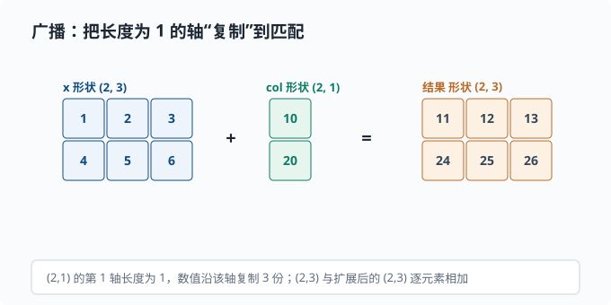
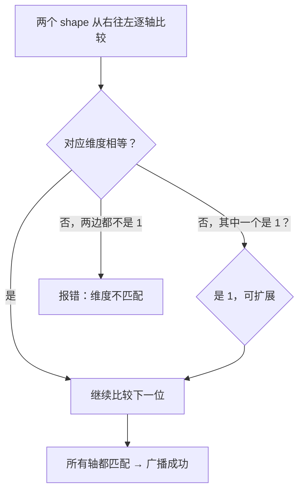

# NumPy：数组与向量化

> 目标：把"逐元素循环"换成"对整个数组的一次运算"。读完这一页，你能创建数组、做矢量化运算、广播、切片与视图，并把矩阵乘法表达成一行代码——这是你后续所有机器学习练习的计算引擎。

## 为什么先学 NumPy

Python 原生列表做数值计算又慢又笨。慢是因为解释器逐条执行；笨是因为没有矩阵语义。NumPy 的核心是一个 **`ndarray`（多维数组）**，它把数据存在连续的底层内存里，配合 C 语言实现的高效循环，让"对整个数组一起算"变得又快又清晰。

一个关键心态：

> 用 NumPy 时，"一次想一批"，而不是"一个一个想"。**向量化**就是让代码看起来像数学公式，而不是像嵌套的 for 循环。

## 创建数组

```python
import numpy as np

a = np.array([1, 2, 3])          # 一维数组
m = np.array([[1, 2], [3, 4]])   # 二维数组（矩阵）

zeros = np.zeros((2, 3))         # 2×3 全 0
ones = np.ones(4)                # 长度 4 全 1
eye = np.eye(3)                  # 3×3 单位阵
arange = np.arange(0, 10, 2)     # [0, 2, 4, 6, 8]
linspace = np.linspace(0, 1, 5)  # 0 到 1 均匀等分 5 个点
```

`shape` 和 `dtype` 是两个最该先认识的属性：

```python
print(m.shape)      # (2, 2)  每个轴的尺寸
print(m.dtype)      # int64   每个元素的类型
```

`shape` 就是数据形状的"地图"。三维数组 `(batch, seq, dim)` 的三个轴一一对应"批、序列长度、维度"。读代码时，第一步永远是搞清楚**轴的顺序**。

## 形状与维度

数组的 `ndim` 表示轴数，`shape` 给出每轴长度：

```python
x = np.zeros((8, 10, 512))
x.ndim      # 3
x.shape     # (8, 10, 512)
x.size      # 8*10*512 = 40960 元素总数
```

标量形状是 `()`，向量是 `(n,)`，矩阵是 `(m, n)`。注意 `(n,)` 和 `(1, n)` / `(n, 1)` 是**不同**的形状——这是新手极易踩的坑。`(n,)` 是一维，而 `(1, n)` 是二维，广播行为完全不同。

## 向量化运算

数组之间的 `+ - * /` 是**逐元素**操作：

```python
a = np.array([1, 2, 3])
b = np.array([10, 20, 30])
print(a + b)      # [11 22 33]
print(a * b)      # [10 40 90]  逐元素乘，不是矩阵乘！
```

标量与数组混合时，标量会被"广播"到每个元素：

```python
print(a * 2)      # [2 4 6]
```

### 点积与矩阵乘法

逐元素乘 `*` 和**矩阵乘法**是两回事。矩阵乘法用 `@` 或 `np.dot`：

```python
m = np.array([[1, 2], [3, 4]])
v = np.array([1, 1])
print(m @ v)          # [3 7]    矩阵×向量
print(m @ m)          # [[7 10] [15 22]]   矩阵×矩阵
```

在一行线性回归 `y = Xw + b` 里，矩阵乘正好表达"一次变换"：

```python
X = np.array([[1, 2], [3, 4], [5, 6]])   # 3 个样本，2 个特征
w = np.array([0.5, -1.0])                # 2 个权重
b = 0.1
y = X @ w + b                            # 3 个预测值
print(y)                                 # [-1.4 -2.4 -3.4]（如 0.5·1+(-1.0)·2+0.1 = -1.4）
```

## 广播 Broadcasting

先想一个很常见却又有点麻烦的情形：一个 $3\times4$ 的表格，你想给**每一行**都加上同一个偏置向量（长度 4）。最笨的办法是写嵌套循环，一个格子一个格子加；稍微好一点是先手动把它重复成 $3\times4$ 再相加。可这两种都不够优雅——前者慢，后者要手工造一堆重复数据、占内存。

NumPy 的答案是**广播（broadcasting）**：当两个数组形状不完全一致时，它会在运算时**自动把某个长度为 1（或缺失）的轴"复制"成需要的大小**，让两者形状对齐后再做逐元素运算，而底层不用真的多占内存：

```python
x = np.array([[1, 2, 3],
              [4, 5, 6]])        # (2, 3)
col = np.array([[10], [20]])     # (2, 1)
print(x + col)
# [[11 12 13]
#  [24 25 26]]
```

把这次广播的"逐元素扩展"画出来：



图中的 `col` 形状是 `(2, 1)`，它的列维长度为 1——NumPy 在求和时会**沿这个轴把每个值复制一份**，变成和 `x` 一样的 `(2, 3)`，再逐元素相加。注意这只是"逻辑上的复制"：底层不会真的多占内存，而是复用同一个数值在多个位置参与运算。这也是广播能省内存的原因。

`(2,3)` 与 `(2,1)`：末尾的 3 与 1 不冲突，`col` 的列维 1 被扩展到 3，于是每行都加上了同一个行偏移（10 加到第一行，20 加到第二行）。这里正好和开头的例子是一对镜像：偏置向量形状 `(n,)` 沿**行方向**复制（每行加同一个向量），`col` 形状 `(m,1)` 沿**列方向**复制（每行加各自的标量）——取决于哪个轴的长度是 1。广播是"省内存"的隐形复制——它不真的产生大数组，只是复用。

广播规则的**逐轴比较**：

```text
从右往左对齐两个 shape
两个维度要么相等，要么其中一个为 1，要么缺失（视作 1）
否则报错
```

用一张分支图记住"能不能广播"的判断顺序：



最常见的用法：给矩阵的每一行加一个偏置向量 `X + bias`（bias 形状 `(n,)` 广播成 `(m, n)`）。

## 索引、切片与视图

Python 列表的切片**复制**，但 NumPy 的切片返回的是**视图**——引用同一块底层数据：

```python
a = np.arange(10)
b = a[2:5]        # 视图，不是复制！
b[0] = 999
print(a[2])       # 999  ← a 也变了
```

要真复制用 `.copy()`：

```python
c = a[2:5].copy()
```

自带坐标的多维索引：

```python
m = np.arange(12).reshape(3, 4)
print(m[1, 2])          # 取第 1 行第 2 列
print(m[0])             # 第 0 行（一个一维数组）
print(m[:, 1])          # 所有行的第 1 列
print(m[1:, :2])        # 行 1 起、列 0~1 的子块
```

布尔掩码是筛选的利器：

```python
x = np.array([1, 5, 3, 9])
print(x[x > 3])         # [5 9]
```

## 归约操作

"对某个轴求和/求均值"是最高频操作：

```python
m = np.array([[1, 2, 3],
              [4, 5, 6]])
m.sum()          # 21         全部和
m.sum(axis=0)    # [5 7 9]     按列（沿第 0 轴塌缩）
m.sum(axis=1)    # [6 15]      按行（沿第 1 轴塌缩）
m.mean(axis=1)   # [2. 5.]     每行均值
```

关键直觉：**`axis=k` 表示"把第 k 个轴消掉"**。`axis=0` 消掉第 0 轴（纵向，得到每列结果），`axis=1` 消掉第 1 轴（横向，得到每行结果）。这个直觉在神经网络里全是 `softmax(axis=...)`、`mean(axis=...)` 时极其重要。

> 深挖：NaN 会传染。真实数据里缺测值常被填成 NaN（not a number），而 NaN 有个恼人的性质——**任何数和它运算结果都是 NaN**。于是 `arr.mean()` 只要混进一个 NaN，整批数据的均值就变成 NaN。两个应对：算之前 `np.isnan(arr).sum()` 数一数缺了多少；想直接忽略 NaN 就用 `np.nanmean` / `np.nansum` / `np.nanmax`（前缀 `nan` 的归约家族）。做数据清洗时，"均值突然变 NaN"几乎总是这个原因。

## 高维数组与真实形状

Transformer 里的一个常见张量是 `(batch, seq_len, d_model)`。比如 `(8, 10, 512)`：8 个句子，每句 10 个词，每词一个 512 维向量。

```python
token_embs = np.ones((8, 10, 512))
mean_seq = token_embs.mean(axis=1)   # (8, 512) 每句平均成一个向量
```

理解每一层"把形状变成了什么"是读懂深度学习代码的硬技能。写代码前先算一遍 shape，写完后 `print(shape)` 验证。

## 性能意识

为什么向量化快？因为 `x + 1` 让 C 层一次性处理整个内存块，而 Python 的 for 循环每步都要经历解释器开销。经验法则：

```text
优先向量化（numpy 整体运算）
不得已再用 numba（一个把 Python 函数即时编译成机器码的库）或改写编译
尽量避免 Python 层 for 循环遍历大数组
```

数组是连续内存，随机访问快；但拼接、频繁 reshape 也可能产生复制开销。初学阶段记住"尽量写成整体运算"就够。

## 动手：手写线性预测

把小节串起来，用广播 + 矩阵乘做一次拟合预测：

```python
import numpy as np

X = np.array([
    [1.0, 2.0],
    [3.0, 4.0],
    [5.0, 6.0],
])                     # (3, 2) 三个样本
w = np.array([0.7, -0.3])
b = 0.5
y = X @ w + b          # 广播 b

# 损失：均方误差
target = np.array([1.0, 0.0, -1.0])
mse = ((y - target) ** 2).mean()
print("预测:", y.round(3))
print("MSE:", mse.round(3))
```

## 思考题

1. `x * w` 和 `x @ w` 在 NumPy 里含义有何不同？
2. `a[2:5]` 返回的切片是视图还是复制？想修改原数组应该怎么做？
3. 形状为 `(4,)` 和 `(4, 1)` 的数组，与 `(3, 4)` 数组做加法时广播结果有什么不同？
4. 数组形状 `(8, 10, 512)`，`mean(axis=2)` 输出什么形状？

## 参考答案

1. `x * w` 是**逐元素相乘**（长度需匹配或可广播），`x @ w` 是**矩阵乘法**（要求内部维度匹配）。对矩阵 `(m,k)` 和 `(k,n)`，`@` 得到 `(m,n)`；而 `*` 只是对应位置相乘，不改变形状。
2. 切片是**视图**，和原数组共享底层数据，修改切片会改到原数组。若想修改后不影响原数组，用 `.copy()` 得到独立副本。
3. `(3,4)` 与 `(4,)`：从右往左，4=4 匹配，缺的第 0 轴视作 1，再扩展为 3，结果 `(3,4)`，bias 对每一行加同一向量。`(3,4)` 与 `(4,1)`：右轴 4 与 1 可扩展为 4，左轴 3 与 1 可扩展为 3，结果 `(3,4)`，但第二组每列是不同值、每行重复——即"列向量"沿行扩展。二者结果通常不同。
4. `axis=2` 消掉第 2 轴（512 那维），剩下 `(8, 10)`。

## 下一步

- 想学会"选对结构控制复杂度" → [02-03 数据结构](02-03-data-structures.md)。
- 想用 Python 做完整研究流程 → [02-07 用 Python 做研究](02-07-python-for-research.md)。
- 想在概率上真正算起来 → [01-03 期望与方差](../01-math-foundations/01-03-expectation.md)。

[返回本章目录](README.md)
