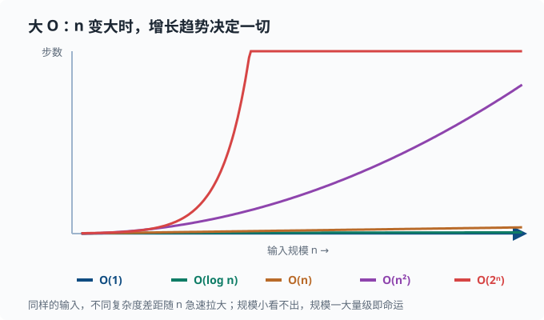
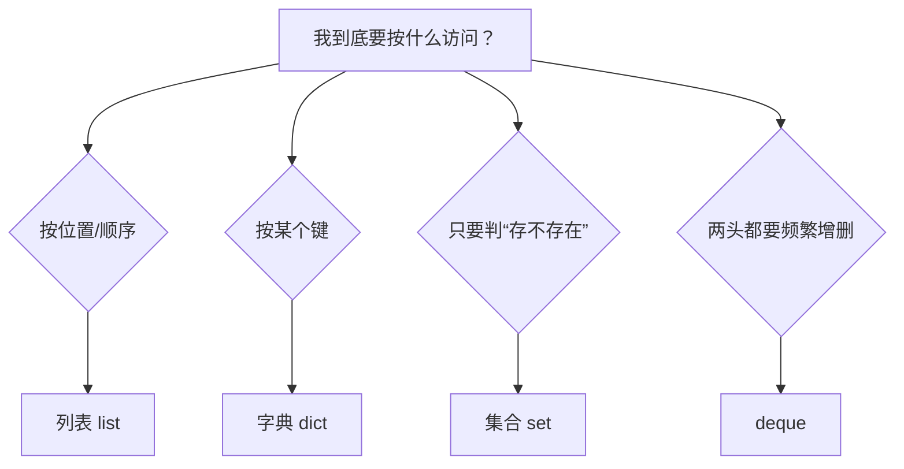

# 数据结构：复杂度与常用容器

> 目标：从"能用"走向"选对"。读完这一页，你能说出常见容器的存取复杂度，理解大 O 记号的意义，懂得为什么同样的操作在不同数据结构上快慢天差地别，并在写代码时下意识地选对结构。

## 为什么先学数据结构

程序做的事，绝大部分可以归成几类简单的"操作"：在一条记录里**找到某个东西**、按某种顺序**依次处理**、判断**某个东西出现过没有**、往集合里**加入或删除**。

先不看任何代码，想一想用手翻一本厚厚的通信录：如果你的通讯录按名字排好了，找人会很快（翻到大概位置就行）；如果它乱序堆着，你只能一页一页扫，人越多越慢。再比如检查一串名字里有没有重复：随手拿纸记下看过哪些，比每来一个就重扫前面所有名字快得多。

这些"怎么存、怎么找"的选择，正是**数据结构**要研究的事。它们决定了同一个操作在不同存法下**要花多少时间**。选错结构，数据量小的时候可能毫无感觉，数据量一上来就明显变慢甚至卡死。所以学数据结构的核心不是背名字，而是建立一种直觉：**针对你打算怎么访问数据，挑一个"省时"的存法**。

一个关键心态：

> 数据结构的本质是"用空间换时间"或"用时间换空间"的权衡。没有银弹，只有"针对你的访问模式，哪个更合适"。

## 大 O 记号：衡量"增长"

接上通信录的例子：几页纸和几万页纸，翻完的速度差别巨大，但"按名字翻"和"从头扫"在规模变大时的表现完全不同。为了比较这种差异，我们需要一个描述"**数据规模一大，操作会慢到什么程度**"的度量——这就是**大 O 记号**。

大 O 关心的是**增长趋势**：随着输入规模 `n` 增大，操作时间大致按什么速度涨，而不是某个精确到毫秒的数字。这样我们就能抛开机器快慢的干扰，只看"结构本身拖不拖后腿"。

| 记号 | 含义 | 例子 |
|---|---|---|
| O(1) | 常数时间，与规模无关 | 按索引取列表元素 |
| O(log n) | 对数时间，增长很慢 | 有序列表里的二分查找（每次砍掉一半：翻 20 页书找词条，对半翻，20 次就能在 100 万页里定位） |
| O(n) | 线性时间，随规模线性增长 | 遍历整个列表 |
| O(n log n) | 常见于排序 | 归并排序、快排 |
| O(n²) | 平方时间，双重循环 | 双层嵌套遍历 |
| O(2ⁿ) | 指数时间，极快爆炸 | 枚举子集 |

注意事项：

- 大 O 忽略常数系数：`3n` 和 `100n` 都记作 O(n)。
- 关心的是**增长趋势**，n 很大时的差距才是致命的。
- 一个操作是"平均情况"还是"最坏情况"很关键。哈希表平均 O(1)、最坏 O(n)。

直观感受：`n=10000` 时，O(n) 是 1 万步，O(n²) 是 1 亿步，O(2ⁿ) 则大到天文数字。**规模一变，量级就决定一切。**

把几种复杂度的"增长曲线"画在同一条坐标轴上，差距看得最清楚：



注意这张图的重点不是某个具体数字，而是**斜率**：O(1) 是平线，O(log n) 一开始涨得快、后面几乎不再涨，O(n) 是一条直线，O(n²) 是抛物线，O(2ⁿ) 则近乎垂直地冲向天花板。这就是为什么 n 一旦到几百万，O(n²) 和 O(n log n) 的差别会变成"几分钟 vs 几秒钟"甚至"跑不完 vs 跑得完"。

## Python 内置容器及复杂度

### 列表 list

- 按索引访问：O(1)。
- 末尾 append：**均摊** O(1)——大多数时候瞬间完成，偶尔触发"扩容搬家的额外工作"，平摊到每次 append 上仍是常数。
- 头部插入/删除（`insert(0, ...)`、`pop(0)`）：O(n)，因为要移动后面的元素。
- 查找某个值（`in`）：O(n)，线性扫描。

列表适合"按顺序追加 + 按索引访问"。**别用列表做"频繁头部插入"或"频繁查找某个元素"**——那些是别的结构的强项。

### 元组 tuple

和列表一样支持索引，O(1)，但**不可变**。不能增删改。它更轻量，能当字典的键（因为可哈希）。

### 字典 dict

键值对的**哈希表**实现。哈希表的原理一句话：对键算一个"哈希值"（把任意内容映射成一个数字的函数），用这个数字直接定位到存储位置——所以查找不用逐个翻，一步定位：

- 按键查找、插入、删除：平均 O(1)。
- 遍历键/值：O(n)。
- 键必须"可哈希"（不可变），所以 `list` 不能当键，`tuple` 可以。

字典是 Python 里最常用的"索引"结构：**想按某个键快速取值，就用字典。**

### 集合 set

本质是"只有键没有值"的字典：

- 成员判断 `x in s`：平均 O(1)。
- 插入/删除：平均 O(1)。
- 适合去重、快速判断"是否存在"。

```python
s = set()
s.add(3)
3 in s      # True
```

### 队列与栈

Python 里：

- **栈**（后进先出 LIFO）：用列表，`append` + `pop()`，均摊 O(1)。
- **队列**（先进先出 FIFO）：`collections.deque`，两端增删 O(1)，而列表 `pop(0)` 是 O(n)。

```python
from collections import deque

q = deque([1, 2, 3])
q.append(4)     # 右侧入队
q.popleft()     # 左侧出队，O(1)
```

## 复杂度对照表

| 结构 | 按索引/键取 | 查找成员 | 头部增删 | 尾部增删 |
|---|---|---|---|---|
| 列表 list | O(1) | O(n) | O(n) | 均摊 O(1) |
| 字典 dict | O(1) 按键 | O(1) 按键 | — | — |
| 集合 set | — | O(1) | — | — |
| deque | O(n) 中部 | O(n) | O(1) | O(1) |

这张表回答了 90% 的日常选择：**要按索引 → 列表；要按键取 → 字典；要判存在 → 集合；要两端操作 → deque。**

把选择过程画成一张决策树，写代码时按这条路径走即可：



## 选择结构的思考过程

写代码前问自己三个问题：

1. **我最后要按什么访问？** 按键 → 字典；按位置 → 列表。
2. **我要做多少次"存在性"检查？** 多次 → 用集合而不是列表。
3. **我要在哪一端增删？** 头部也频繁 → deque，别用列表。

例子：统计每个词在文本里出现多少次。

```python
from collections import Counter

words = "the cat the dog the cat".split()
counts = Counter(words)
print(counts["the"])   # 3
```

`Counter` 本质就是一个按词计数的字典，底层就是哈希表的 O(1) 存取。

## 当 n 变得很大

数据规模决定了你该用什么策略：

- 小数据（几百）：几乎所有结构都能跑，别过度优化。
- 中等（几百万）：用字典/集合来避免 O(n) 查找，别用列表做 `in` 判断。
- 大数据：要考虑内存（能不能装下）、是否是瓶颈、要不要外部排序/批处理。

成熟的建议是"先写对，再加测，再优化"。过早优化通常是浪费；但**一开始就选错结构**（比如在几百万元素的列表里频繁 `in`）则是可以提前避免的坏账，因为它改起来伤筋动骨。

## 动手：看不同复杂度的差别

```python
import time

n = 200_000
lst = list(range(n))
s = set(lst)

probe = n - 1

t0 = time.perf_counter()
_ = probe in lst          # 列表：O(n)
t1 = time.perf_counter()
_ = probe in s            # 集合：O(1)
t2 = time.perf_counter()

print(f"list in: {t1 - t0:.4f}s")
print(f"set  in: {t2 - t1:.6f}s")
```

在这个规模下你会清楚看到列表的 `in` 慢了不止一个量级。这就是"选对结构"最直观的证据。

## 进阶：什么时候需要自定义结构

内置结构覆盖了绝大多数需求。需要自定义时，往往是这几类：

- **堆 / 优先队列**：始终取当前最小/最大，用 `heapq`，插入和取顶都是 O(log n)。比如按优先级调度 agent 的任务。
- **链表 / 树 / 图**：表达"关系"或"层级"。图在概率图（[01-09](../01-math-foundations/01-09-probabilistic-graphs.md)）、流程图、依赖拓扑里非常常见。
- **前缀树 Trie**：快速做前缀匹配、词典自动补全。

优先队列的直觉例子——始终处理"最紧急"的任务：

```python
import heapq

tasks = []
heapq.heappush(tasks, (3, "普通"))
heapq.heappush(tasks, (1, "紧急"))
heapq.heappush(tasks, (2, "一般"))

while tasks:
    pri, name = heapq.heappop(tasks)
    print(pri, name)    # 1 紧急 → 2 一般 → 3 普通
```

## 思考题

1. 为什么在很大的列表里频繁用 `x in lst` 很慢，而集合 `x in s` 很快？
2. 一个需求："按学号快速找到学生信息"。你会选列表还是字典？为什么？
3. `pop(0)` 与 `popleft()` 的复杂度分别是多少？各自用什么结构？
4. 什么情况下需要优先队列（堆）而不是普通列表？

## 参考答案

1. 因为 `lst` 的 `in` 是线性扫描，最坏要遍历所有 n 个元素，复杂度 O(n)；而集合是哈希表，直接对元素做哈希定位到桶，平均 O(1)。n 越大差距越明显。
2. 用**字典**，键是学号，值是学生信息。因为"按学号快速找"正是"按键取"的哈希表场景，O(1)，而列表按值查找是 O(n)。
3. 列表 `pop(0)` 是 O(n)，因为要前移后面所有元素；deque 的 `popleft()` 是 O(1)。频繁在头部操作要用 `collections.deque`。
4. 当你需要一个"始终取当前最优（最小/最大）"、且会反复插入新元素的结构时，优先队列更合适。它能让"取出最值"从 O(n) 降到 O(log n)。例如按优先级处理大量动态加入的任务。

## 下一步

- 想知道"让研究代码可复现、可测试"的纪律 → [02-04 工程习惯](02-04-engineering-habits.md)。
- 想管理代码版本、回滚与协作 → [02-05 版本控制](02-05-version-control.md)。
- 想理解图结构在概率模型里的角色 → [01-09 图与概率图](../01-math-foundations/01-09-probabilistic-graphs.md)。

[返回本章目录](README.md)
