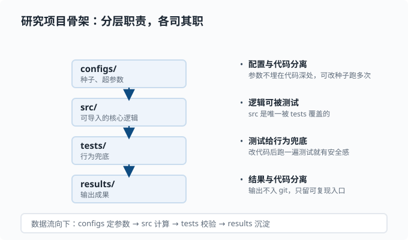

# 工程习惯：可复现、测试与日志

> 目标：把"能跑"变成"能复现、能定位、能改、能兜底"。读完这一页，你会有意识地固定随机种子、组织项目、写测试、加日志与错误处理——这些是研究型 agent 工程里最容易崩、也最值得培养的纪律。

## 为什么需要工程习惯

代码"眼前能跑"和"半年后还能复现"是两件事。研究的本质是可复现：别人（或未来的你）照着同样的输入应该得到同样的结果。工程习惯不是加分项，而是让结果可信的最低成本。

一个关键心态：

> 你不是在写给机器看的，而是在写给**未来的自己和协作者**看的。环境、种子、输入、步骤都要能追踪。

工程纪律可以想成一条把"信任"串起来的链条，每一环都堵住一个复现的漏洞：


## 固定随机种子

机器学习和 agent 流程里处处有随机性：采样、初始化、扰动。不固定种子，你永远无法判断"结果变好是方法好，还是运气好"。

```python
import random
import numpy as np

random.seed(42)
np.random.seed(42)
```

深度学习框架通常也有独立种子设置（例如 PyTorch 的 `torch.manual_seed`）。种子最好从**配置或命令行参数**传入，而不要硬编码在代码深处——这样你可以改种子跑多次实验看方差。

要特别小心：**固定了种子不保证完全可复现**，因为还有硬件、库版本、线程调度等因素。种子是"至少跑同一环境时结果稳定"的第一步，不是绝对保证。

## 环境即结果的一部分

代码依赖库版本。今天能跑，换一台机器或升级了某个包就可能结果不同。所以要同时记录：

- 用到的包和版本（`requirements.txt`，或 `pyproject.toml` 配套的 `lockfile`——把每个依赖的**确切版本号**固定下来的文件，别人照它安装就能得到完全一致的环境）。
- Python/Node 版本。
- 操作系统、CPU/GPU。

在 deepseek-harness 这种 monorepo（一个仓库里装多个子项目/包，[02-06](02-06-reading-typescript.md) 会细讲）里，`package.json` 加 `pnpm-lock.yaml` 就是"锁定版本"的机制——`lockfile` 保证别人 `pnpm install` 得到一致的依赖。你在自己项目里也要养成"锁版本"的习惯。

## 项目的目录组织

研究项目的一份简单但完整的骨架：

```text
project/
  src/          代码（可导入的模块）
  tests/        测试
  data/         数据（可不进 git）
  configs/      配置（种子、超参数）
  scripts/      运行入口脚本
  results/      输出
  README.md     说明如何跑
```

这张骨架的本质是**给每类东西一个明确的家**，让"参数从哪来、逻辑在哪、结果去哪"都可追踪：



四个关键分界（对应图里的四层）：`configs/` 只放配置、`src/` 只放可导入的核心逻辑、`tests/` 专门校验行为、`results/` 放产出物。这样做的回报是：改参数不用翻代码，测逻辑不用跑全流程，结果和代码不互相污染——也就是"配置与代码分离、结果与代码分离"。

原则：

- 代码与数据分离，结果与代码分离。
- 配置要能覆盖默认值，别把参数埋在代码深处。
- 每个脚本顶部有清晰的 `if __name__ == "__main__":` 入口。

## 写测试：给行为兜底

测试的价值是"我改了代码，旧的期望是否还成立"。研究型项目最常用的是**单元测试**：对一个小函数给定输入，断言输出。

用 Python 标准库 `unittest` 或简洁的 `pytest`：

```python
# test_stats.py
from mymath import stats

def test_mean():
    assert abs(stats([1.0, 2.0, 3.0])["mean"] - 2.0) < 1e-9

def test_empty():
    assert stats([]) == {"n": 0.0}
```

测试的原则：

- 测**行为**而不是实现细节：断言"输入 → 输出"成立。
- 覆盖边界：空输入、单元素、极值。
- 用浮点比较加容差 `1e-9`，不要直接比较 `==`（浮点误差）。
- 先写会失败的测试再让它通过——这是 TDD（测试驱动开发）的反馈法：测试先描述"期望的行为"，红（失败）→ 绿（实现）→ 重构，循环前进。

一旦你能"改代码后跑一下测试"，你就敢动任何模块了——这就是后续读 deepseek-harness、想改它时的安全感。

## 日志：让程序自己说话

`print` 调试在脚本里够用，但当你程序长、并发、运行许久时就该上日志。Python 标准库 `logging`：

```python
import logging

logging.basicConfig(level=logging.INFO,
                    format="%(asctime)s %(levelname)s %(message)s")
logger = logging.getLogger(__name__)

logger.info("开始处理批次 %d", batch_id)
logger.warning("样本不足，跳过")
logger.error("读取失败: %s", path)
```

级别从低到高：`DEBUG < INFO < WARNING < ERROR < CRITICAL`。设置阈值可以过滤噪音。**用 `logger` 而不是 `print` 的原因**：可分级、可带时间戳、可写入文件、可区分"调试信息"和"出错信号"。

好的日志习惯：

- 记下"关键状态变化"和"异常路径"，别刷屏。
- 错误日志带上足够上下文（哪个文件、哪个批次、什么输入）。
- 避免把密钥、隐私数据写进日志。

## 错误处理：失败要响亮

"静默吞错"是研究型代码里最隐蔽的坑。它让程序看似正常运行，其实已经跑偏。原则：

- 捕获**具体异常**，给它有意义的名字和消息。
- 无法继续时就 `raise` 或 `sys.exit(1)`，别让错误悄悄溜过。
- 可重试的操作（如网络超时）用重试策略，但别无限重试。

```python
def load(path: str) -> dict:
    if not os.path.exists(path):
        raise FileNotFoundError(f"配置文件缺失: {path}")
    with open(path) as f:
        return json.load(f)
```

失败的哲学：**不出错不代表没问题，没察觉的错误才是问题。** 出错时要让它可见、可定位。

## 把纪律串起来：一个可复现的脚本

```python
import argparse
import json
import logging
import random
import numpy as np

logging.basicConfig(level=logging.INFO)
logger = logging.getLogger("experiment")


def main(seed: int, data_path: str) -> None:
    random.seed(seed)
    np.random.seed(seed)
    data = load_json(data_path)          # 定义在 src/ 里：读入并校验数据
    logger.info("加载 %d 条样本，seed=%d", len(data), seed)
    result = run_pipeline(data)          # 定义在 src/ 里：核心计算逻辑
    with open("results.json", "w") as f:
        json.dump(result, f, ensure_ascii=False)
    logger.info("已写入 results.json")


if __name__ == "__main__":
    ap = argparse.ArgumentParser()
    ap.add_argument("--seed", type=int, default=42)
    ap.add_argument("--data", required=True)
    args = ap.parse_args()
    main(args.seed, args.data)
```

`argparse` 让参数通过命令行传入，`logging` 记录进度，固定种子，输出持久化——这就是"研究型工程习惯"的最小完整样本。`load_json` 和 `run_pipeline` 故意只给注释不给实现：真实项目里它们住在 `src/` 里、被 `tests/` 覆盖，入口脚本只负责"接线"——这正是上面"配置、逻辑、测试分层"的实践。

## 动手：给一个函数补上测试与日志

目标：把本章的三样纪律（测试、日志、响亮的失败）落到同一个小函数上。

```python
# calc.py —— 被测对象
import logging

logger = logging.getLogger("calc")


def harmonic_mean(xs):
    """计算正数的调和平均数：n / sum(1/x)。"""
    if not xs:
        raise ValueError("输入为空，调和平均数无定义")
    inverses = []
    for x in xs:
        if x <= 0:
            raise ValueError(f"出现非正数 {x}，调和平均数要求全为正")
        inverses.append(1 / x)
    logger.debug("倒数和 = %.6f", sum(inverses))
    return len(xs) / sum(inverses)
```

任务：

1. 写 `test_calc.py`，覆盖三条路径：正常值（`[1, 2, 4]` 应得 `12/7`）、空列表（应抛 `ValueError`）、含零（应抛 `ValueError`）。用 `pytest.raises` 断言异常。
2. 跑 `pytest test_calc.py -v`，确认三条全绿。
3. 故意把 `x <= 0` 改成 `x < 0`，再跑一次——应该有一条测试变红。这就是"测试给行为兜底"的直接体验。改回来。
4. 运行 `python -c "import logging, calc; logging.basicConfig(level=logging.DEBUG); print(calc.harmonic_mean([1,2,4]))"`，观察 DEBUG 日志出现；把 level 换成 `INFO` 再跑，日志消失——这就是"分级过滤"。

参考断言写法：

```python
import pytest
from calc import harmonic_mean


def test_normal():
    assert harmonic_mean([1, 2, 4]) == pytest.approx(12 / 7)


def test_empty():
    with pytest.raises(ValueError):
        harmonic_mean([])


def test_zero():
    with pytest.raises(ValueError):
        harmonic_mean([1, 0, 2])
```

做完你会体会：异常在最早的分支抛出（失败要响亮），测试断言的是行为而非实现，日志能按需开合。

## 思考题

1. 为什么研究代码要固定随机种子？它是不是可复现的绝对保证？
2. 测试应该断言"实现方式"还是"行为结果"？为什么？
3. 为什么在长程序中用 `logging` 而不是满屏 `print`？
4. 一个函数读取失败但程序继续"假装成功"，可能是哪里出了问题？

## 参考答案

1. 不固定种子，采样和初始化带来的随机性会让结果在每次运行间抖动，你无法判断效果来自方法还是运气。固定种子保证"同一环境、同一输入"下结果稳定，便于对照。但它不是绝对保证——硬件、库版本、线程调度等仍可能带来差异，所以还要锁依赖并记录环境。
2. 测试应该断言**行为结果**（输入 → 期望输出），而不是实现方式。因为测试的意义是"行为是否仍然成立"；断言实现细节会让测试在改内部结构时无辜失败。
3. `logging` 能分级过滤（DEBUG/INFO/WARNING/ERROR）、带时间戳、可写入文件、可追溯来源模块；`print` 无法区分噪音与关键信号，长程序里信息淹没问题、也难检索。
4. 可能是异常被裸 `except:` 或空 `except: pass` 吞掉，导致读取失败被静默忽略而继续往下走。应当捕获具体异常、记录上下文并尽快失败，让问题在最早、最明确的地方暴露。

## 下一步

- 想学会版本管理与回滚 → [02-05 版本控制](02-05-version-control.md)。
- 想知道怎么组织完整研究流程 → [02-07 用 Python 做研究](02-07-python-for-research.md)。
- 想在动手前理解"什么时候该写测试"的原则 → 回到 [02-03 数据结构](02-03-data-structures.md)。

[返回本章目录](README.md)
