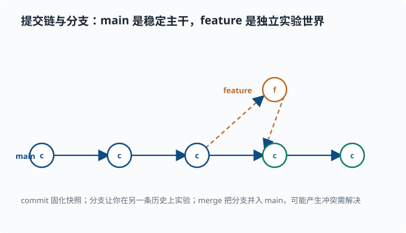
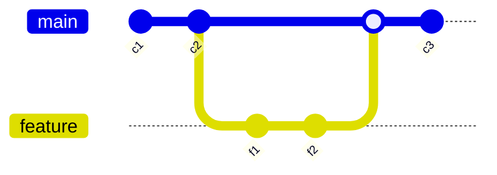

# 版本控制：Git 基础

> 目标：让"改坏了能回滚、写错了能追溯、多人能协作"成为本能。读完这一页，你能理解仓库/提交/分支/暂存区的关系，熟练完成提交、查看历史、回滚分支、解决合并，并理解为什么 .gitignore 与 lockfile 如此重要。

## 为什么先学 Git

写代码一定会改：今天这句对，明天你想试验另一版。如果没有版本控制，你只能靠复制文件（`final_v2.py`、`final_v3_final.py`）——迟早崩溃。Git 让你**放心地改**：每次改动都留下可回退的快照，还能在独立分支上试实验，不影响主线。

一个关键心态：

> Git 记录的不是"文件的当前状态"，而是一串**提交（commit）**——每个提交是某一时刻整个项目的一次快照，附带作者、时间、消息和父提交。

## 三个核心区域

理解 Git 最关键的是三个状态区域：

```text
工作区 working dir   →  暂存区 staging   →  仓库 history
   你编辑的文件             git add 之后           git commit 之后
```

- **工作区**：你正在编辑的文件。
- **暂存区（索引）**：`git add` 把改动"登记"进来，准备打包成提交。
- **仓库历史**：`git commit` 把暂存区的内容固化成一个不可变的快照。

日常流程：

```bash
git status            # 看当前哪些文件改了/新增了
git add file.py       # 把 file.py 加入暂存区
git commit -m "msg"   # 把暂存区固化成一次提交
git log               # 查看提交历史
```

`git status` 永远是你第一个该敲的命令——它告诉你"我现在在哪、有什么未提交的改动"。

## 一次完整的小循环

```bash
# 初次在一个目录里启用版本控制
git init

# 改了一些代码后
git add src/ readme.md
git commit -m "实现向量化内积"

# 看历史
git log --oneline
```

提交消息要有意义：说明"做了什么改动、为什么"，而不是"改了一下"。好的提交是一份项目自己的历史档案。

## 分支：并行世界

分支让你能在不影响主线的独立"世界"里试东西。想象 `main` 是稳定的主干，你在 `experiment` 分支上实验：

```bash
git branch experiment     # 创建分支
git checkout experiment   # 切到该分支
# 或一条命令：
git switch -c experiment
```

切到别的分支时，工作区会**变成该分支的内容**。在你自己的地方反复实验、提交，最后合并回主线：

```bash
git switch main
git merge experiment
```

如果两个分支改了同一处，Git 会报**冲突（conflict）**。冲突时编辑文件、解决后 `git add` 再提交。

分支的价值：**让"尝试"零成本**。在 agent 工程里，"换个方案试一下"最自然的方式就是开分支，不污染主线。

把"主干 + 实验分支 + 合并"画成一张提交时间线，结构就清楚：`main` 是一串向后衔接的提交，`feature` 从某个点分出、改完再并回 `main`。



每颗圆点是一次 `commit`；实线是 `main` 主干，虚线箭头是 `feature` 从主干流出又并入。`merge` 之后，`feature` 上的改动就并进了主干历史，而那条分支本身可以留着、也可以删掉。

想在自己的仓库里亲眼看到这张图，用：

```bash
git log --graph --oneline --all
```

`--graph` 让 Git 在文字里画出提交之间的分叉与合并线，`--oneline` 压缩成每提交一行，`--all` 把所有分支都画进来。做过几次分支实验后跑一遍它，上面这张示意图就会在你的终端里"活"过来。

用 `gitGraph` 语法也能直接画出同样的时间线（docsify 的 Mermaid 支持）：



## 查看与回滚

```bash
git diff              # 未暂存的工作区改动
git diff --staged     # 已暂存但未提交的改动
git log --oneline     # 提交历史
git show <commit>     # 看某次提交改了什么
```

回滚要分清楚两种情况：

- **还没提交**：`git restore file.py` 丢弃工作区对某文件的改动（回到最近提交）。
- **已经提交**：`git revert <commit>` 生成一个"撤销该提交"的新提交，保留历史，可追溯，是安全做法。

```bash
git restore broken.py          # 丢掉未提交的改动
git revert abc123              # 安全撤销某次已提交的改动
```

**关键警告**：`git reset --hard` 会不可逆地丢弃工作区改动，务必极其谨慎，初学阶段尽量不用。

## .gitignore：哪些不该进版本库

不是所有文件都该提交。生成物、密钥、缓存、大数据通常要排除：

```text
# .gitignore 示例
node_modules/
__pycache__/
.venv/
*.log
.env            # 密钥，绝不要提交！
results/
```

尤其 `.env` 常含密钥，**绝不能进 git**。`lockfile` 则相反，恰恰应该提交——它锁定依赖版本，保证别人安装一致。

## 与远端协作（GitHub 等）

本地分支要推到远端、把远端改动拉回来：

```bash
git remote add origin <仓库地址>
git push -u origin main       # 第一次推送并记住对应关系
git pull                      # 拉取远端改动
git clone <地址>               # 把远端仓库完整复制到本地
```

协作的基本循环：

```bash
git pull          # 先同步远端
# 改代码、add、commit
git push          # 推送我的提交
```

协同的常见流派：

- **主干开发**：直接小步提交到 `main`（主干就是主线分支），团队小或自动化强时简单。
- **分支 + PR（Pull Request，拉取请求）**：每个改动开分支，提 PR（本质是"请仓库主人审查并拉取我的分支"的正式请求，页面上可以逐行评论、讨论）评审后再合并。deepseek-harness 等中型项目基本用这种方式，保证代码经过 review 和 CI（持续集成——每次推送自动跑构建与测试的流水线，改动有问题立刻报警）。

> 深挖：`git log --graph --oneline --all` 是看分支结构的第一命令，但有些场景更好用：`git branch -vv` 看每个本地分支跟踪哪个远端分支、`git log main..experiment` 只看"experiment 比 main 多出的提交"。读别人的仓库时，先用这几个命令建立"分支地图"。

## 一个常见误区

"我 commit 了但 push 了没有？" `commit` 只落到本地仓库，`push` 才同步到远端。两者是分开的两步。**`git status` 和 `git log` 能帮你确认当前真正在哪、推进了多少。**

## 动手：在你的实验上走一遍

假设你在写一个 agent 实验脚本：

```bash
git init
git add experiment.py requirements.txt
git commit -m "初始实验：随机基线"

git switch -c add-planning
# 改 experiment.py 加入规划步骤
git add experiment.py
git commit -m "加入规划步骤并固定种子"

git switch main
git merge add-planning
git log --oneline
```

现在你有了两条提交历史，可以随时 `git show` 看哪一步改了什么。

## 思考题

1. 工作区、暂存区、仓库历史分别对应什么 Git 命令？
2. `commit` 和 `push` 有什么区别？
3. 为什么 `.env` 要进 `.gitignore`，而 lockfile 反而要提交？
4. 在另一分支实验后，应该如何把改动带回来？

## 参考答案

1. 工作区是当前编辑但未登记的文件（`git status` 显示为 modified/untracked）；暂存区是 `git add` 后"准备提交"的改动（`git diff --staged` 可见）；仓库历史是 `git commit` 固化后的不可变快照（`git log` 可见）。
2. `commit` 是把暂存区固化成本地仓库的一个提交，**只影响本地**；`push` 是把本地已有的提交同步到远端仓库。所以 commit 后不 push，远端并没有你的改动。
3. `.env` 含密钥等敏感信息，提交会泄露凭据，必须排除；lockfile 锁定了所有依赖的确切版本，提交后别人才能 `pnpm install`/`pip install` 得到一致的环境，是可复现的关键。
4. 切回目标分支（通常是 `main`），用 `git merge 分支名` 把实验分支的提交并进来；若产生冲突，解决后 `git add` 并提交。也可以开 PR 进行 review 后合并。

## 下一步

- 想读懂中型 TypeScript 仓库的心智模型 → [02-06 读 TypeScript 仓库](02-06-reading-typescript.md)。
- 想用 Python 组织研究项目 → [02-07 用 Python 做研究](02-07-python-for-research.md)。
- 想建立可复现的纪律 → [02-04 工程习惯](02-04-engineering-habits.md)。

[返回本章目录](README.md)
