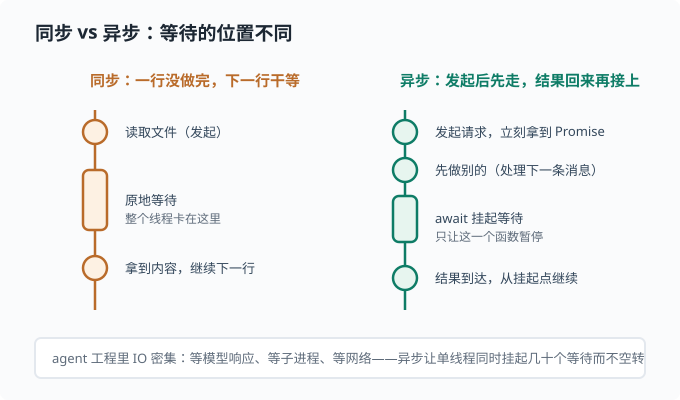
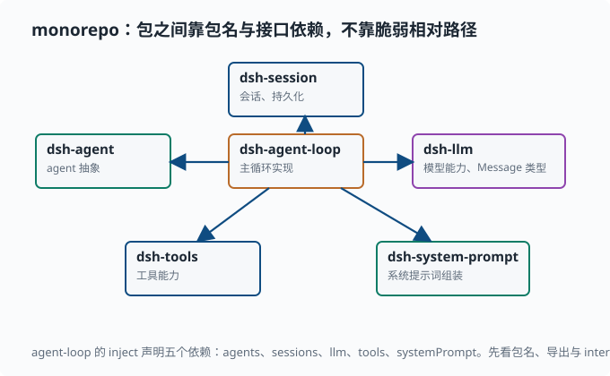
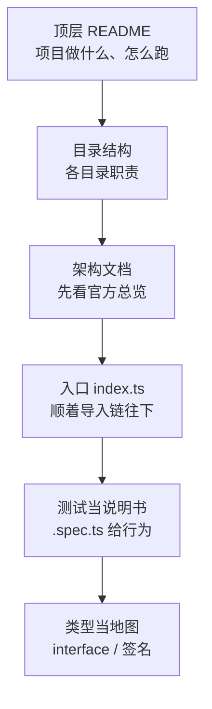

# 读 TypeScript 仓库：TS/Node 心智模型

> 目标：建立读懂 `deepseek-harness`（TypeScript / Node + pnpm monorepo）的最低门槛。读完这一页，你能看懂一行 TypeScript 的类型标注、理解模块与导入、认识 monorepo 布局和"一切皆插件"的组织方式，并知道从哪里开始读一个中型仓库而不迷路。

## 为什么先学读 TypeScript

deepseek-harness 是 **TypeScript** 写的。如果你只会 Python，第一眼会有点慌，但两者背后是同一套编程思想，只是语法和类型系统不同。这一页不教你写完整 TypeScript，而是教你怎么**读懂它**——这正是你后续拆解这个仓库时需要的能力。

一个关键心态：

> TypeScript 是"带类型的 JavaScript"。它的核心价值是**类型系统**：在很多错误真正发生之前，编译器就能替你抓出来。读懂 TS，一半是读懂它记录的类型意图。

## 从 Python 到 TypeScript：快速映射

| Python | TypeScript / JavaScript | 说明 |
|---|---|---|
| `def f(x):` | `function f(x) {}` | 函数定义 |
| `x = 1` | `let x = 1` / `const x = 1` | `let` 可变，`const` 不可重新赋值 |
| `if x:` | `if (x) { }` | 括号加花括号 |
| `for x in xs:` | `for (const x of xs) { }` | 遍历 |
| `import m` | `import ... from 'm'` | 导入 |
| `dict` | `object` / `Map` | 键值容器 |
| `list` | `Array` | 数组 |
| `def f()` 同步阻塞 | `async f(): Promise<T>` | 异步返回"将来才有"的值 |

TypeScript 的关键差别：

- **`const` / `let`** 区分"只读绑定"与"可重新赋值绑定"（类似 Python 的元组 vs 列表直觉）。
- **类型标注**写在冒号后：`let n: number = 1`。
- **花括号和分号**，缩进不参与语法（缩进只是风格）。
- JavaScript 有**异步**的独特玩法（`async/await`、`Promise`），这在 agent 工程里无处不在，因为 IO 操作大量是异步的。

## 异步：读 agent 仓库绕不开的一关

上面最后一条值得单独展开，因为它没有 Python 对应物（`asyncio` 有但用得少），却是读懂 agent 仓库的**必经关卡**：agent 每一步都在等——等模型吐下一个 token、等子进程跑完、等网络返回。如果每等一次就把整个线程冻住，一个服务同时只能伺候一个请求。

JavaScript 的解法是**异步**：发起 IO 后不原地干等，函数先返回，结果到达时再"接回来"继续。先认识两个符号：

```ts
// fetch 发起网络请求，立刻返回一个 Promise——"将来才会有结果"的凭据
const pending: Promise<Response> = fetch(url)

// await 只能写在 async 函数里：在这里挂起，等结果到达后继续往下走
async function getText(url: string): Promise<string> {
  const response = await fetch(url)      // 挂起，直到响应到达
  return await response.text()           // 再挂起一次，等正文解析完
}
```

读法要点：**`await` 暂停的是这个函数，不是整个程序**。挂起期间，事件循环（event loop）去跑别的任务；结果一到，函数从挂起点原地继续。同步与异步的差别画出来是这样：



> 深挖：为什么"挂起函数而不是线程"很划算？因为一个 agent 服务可能同时挂着几十个对话，每个都在等各自的模型响应。异步让单线程在几十个等待之间切换——谁的结果到了就先处理谁——没有线程切换开销，也没有空转烧 CPU。你后面在 deepseek-harness 里看到的几乎所有服务方法都是 `async`，原因就在这里。

Python 读者的对照：`async def` / `await` 在 Python 里也存在（`asyncio`），语义几乎一样；差别在于 Python 的生态默认同步、异步要显式选择，而 Node 生态从底层 API 起就是异步的。

## 类型标注：读懂意图

一段带类型的函数：

```ts
function mean(xs: number[]): number {
  return xs.reduce((a, b) => a + b, 0) / xs.length
}
```

`xs: number[]` 说"参数是数字数组"，`: number` 说"返回值是数字"。`reduce` 是"把数组逐项累积成一个值"的函数（这里从 0 出发逐项相加，角色类似 Python 的 `sum`），`(a, b) => a + b` 是箭头函数——JS 的匿名函数写法，对应 Python 的 `lambda a, b: a + b`。这就是读代码时的"意图地图"：不用追进函数体，你已经知道它输入什么、输出什么。

常见的类型关键词：

```ts
let name: string = "a"
let count: number = 1
let ok: boolean = true
let tags: string[] = ["x", "y"]
let maybe: number | undefined = undefined   // 联合类型
```

`number | undefined`（可空）在 TS 里写得很显式，提醒你"这个值可能不存在"——读代码时看到 `| undefined` 就要留意空值分支的处理。这比 Python 隐式地到处 `None` 更明确。

### interface：描述对象的形状

TS 用 `interface` 描述一个对象"长得什么样"：

```ts
interface AgentOptions {
  model: string
  maxTokens?: number   // ? 表示可选
}
```

读源码时看到 `interface`，就是在声明"这类对象有哪些字段、什么类型"。deepseek-harness 里大量用 `interface` 描述 agent、session、配置的形状。

### 泛型与实际例子

**泛型**（generics）是"类型的占位符"：写代码时先不定死类型，用 `T` 这样的字母代替，用的时候再填进来——类似 Python 里 `def f(x: T) -> T` 的效果。deepseek-harness 里你能看到这样的用法：

```ts
const exactIdentities = new Map<SessionId, string>()
```

`Map<SessionId, string>` 读作"一个映射，键填的是 SessionId 类型，值填的是 string"——`Map<K, V>` 里的 K、V 就是两个类型占位符，尖括号里填什么类型，它就装什么。这就是 TS 里读代码的核心习惯：**先看类型，再猜行为**。

## 模块与包：pnpm monorepo

一个仓库包含多个独立"包"（package），用 pnpm 统一管理，叫 **monorepo**。deepseek-harness 的 `packages/core/` 下就是一组包，例如：

```text
packages/core/
  agent/           agent 抽象与分发
  agent-loop/      agent 主循环实现
  agent-default-model/
  agent-tool-presentation/
  scope/           作用域
  session/         会话
  system-prompt/   系统提示词组装
  tools/           工具
```

每个包通常有：

- `src/`：源码（TypeScript）。
- `tests/`：单元测试（`*.spec.ts`），用 **vitest** 跑——TS 世界里最流行的测试框架之一，角色相当于 Python 的 pytest。
- `package.json`：包的元数据、依赖、脚本。

跨包引用用包名，而不是相对路径。比如在 `agent-loop/src` 里：

```ts
import type { Agent } from '@deepseek-ai/dsh-agent'
```

`@deepseek-ai/dsh-agent` 是 `agent` 包的包名。这种"包名导入"让仓库各模块通过清晰、稳定的接口互相连接——这就是为什么它能拆成很多小块各自维护。

monorepo 里小包之间的依赖是一张有向图：`agent-loop` 依赖 `agent`、`session`、`llm` 和 `tools`，每个包通过 `@deepseek-ai/dsh-xxx` 这样的稳定包名互相引用：



读这张图时抓住一点：**依赖是"接口级"的，不是"文件级"的**。一个包对外暴露什么，由它的 `index.ts` 导出决定；别的包只认这些导出，不关心内部实现。所以你能单独替换某个包、单独测试它，而不用牵一发动全身——这正是 deepseek-harness 能拆成这么多个小包还能在一起工作的原因。

## "一切皆插件"的组织方式

deepseek-harness 的核心哲学是**一切皆插件**：每个能力（agent 循环、工具、shell、会话……）都作为一个插件提供，通过一个叫 Cordis 的框架挂载到一起（Cordis 是一个插件式依赖注入框架——负责"声明需要什么、由谁提供什么、什么时候启动和清理"的底层机制）。读代码时你会反复看到 `ctx`（context，上下文——每个插件拿到的"接线板"，需要什么服务都从它身上取）：

```ts
export class AgentLoop extends Service implements AgentFactory {
  static inject = ['agents', 'sessions', 'llm', 'tools', 'systemPrompt']
  ...
}
```

`inject` 声明了这个服务"依赖哪些别的东西"（`Service` 和 `AgentFactory` 是框架提供的基类与接口：前者让这个类成为可被框架管理的服务，后者承诺"我能生产 agent"）。这种"声明依赖、由框架注入"的模式，读起来很抽象，但好处是模块之间靠接口连接，可以单独替换。

作为初学者，你不必一开始就吃透这些框架语义。关键是建立两个习惯：

1. **先看包名和导出**：`index.ts` 里 `export class ...` / `export function ...` 告诉你这个包对外提供什么。
2. **先看类型和接口**：构造函数参数、`interface` 字段，比追实现更快理解"这个模块在做什么"。

## 读一个中型仓库的方法

遇到陌生仓库，别从 `src` 最深处开始。按这个顺序：

1. **读顶层 README**：项目是做什么的、怎么跑。
2. **读目录结构**：`packages/`、`docs/`、`scripts/` 各自职责。
3. **读架构文档**：deepseek-harness 的 `docs/architecture.md` 是官方推荐的第一站。
4. **从入口往内**：`index.ts` / `main` 入口怎么组织，再顺着导入链往下。
5. **用测试当说明书**：`*.spec.ts` 用"输入 → 输出"告诉你某模块行为，比读实现更快。
6. **用类型当地图**：`interface` 和函数签名告诉你数据长什么样、函数做什么。

正确的阅读单位是**"一个行为"**：先问"有哪个测试覆盖了它？这个接口的契约是什么？"，再读实现。

把"从哪切入陌生仓库"的先后顺序画成一条路径，避免一头扎进源码最深处：



## 动手：读一个跨包引用

假设你打开 `packages/core/agent-loop/src/agent.ts`，开头是这样：

```ts
import type { Agent, AgentStatus } from '@deepseek-ai/dsh-agent'
import { Inbox, agentEvents } from '@deepseek-ai/dsh-agent'
import type { Message } from '@deepseek-ai/dsh-llm'
```

你要抓住的信息：

- `Agent`、`AgentStatus` 来自 `dsh-agent` 包，是类型（`import type` 表示只用于类型标注）。
- `dsh-llm` 提供 `Message` 类型——agent 循环依赖 LLM 的消息结构。
- 顺着 `Message` 找到它的定义文件，你就知道"一次发给模型的消息长什么样"。

这串起来就是 agent 循环的第一条主线：**agent 从会话/工具拿输入，拼成 Message，发给 LLM，再执行返回的工具调用**。

## 思考题

1. TypeScript 里 `number | undefined` 想表达什么？读代码时看到它要留意什么？
2. `import type { Agent } from '@deepseek-ai/dsh-agent'` 中 `@deepseek-ai/dsh-agent` 是什么？
3. `await` 暂停的是什么？为什么"同时挂起几十个模型请求"不需要几十个线程？
4. `interface AgentOptions { maxTokens?: number }` 里的 `?` 表示什么？

## 参考答案

1. 表达"这个值要么是 number，要么是 undefined（不存在）"。读代码时要留意空值分支：使用前必须判空，否则运行时会出错。
2. 它是 `agent` 这个包的**包名**。用包名导入让仓库各模块通过稳定接口互相连接，而不是依赖脆弱的相对路径。
3. `await` 暂停**当前这个 async 函数**，不是整个程序也不是线程。挂起期间事件循环去推进其他任务；单线程就能同时维持几十个挂起的等待，谁的结果先到就先恢复谁——没有线程切换开销，这是 Node 用少量线程扛住大量 IO 的核心机制。
4. `?` 表示该字段**可选**，调用方可以省略。缺少 `?` 时该字段是必须提供的。

## 下一步

- 想用 Python 快速做研究 → [02-07 用 Python 做研究](02-07-python-for-research.md)。
- 想在后续真正拆解 deepseek-harness → [10 实战 Lab](../10-practical-lab/README.md)。
- 想回到数学直觉 → [01-01 线性代数](../01-math-foundations/01-01-linear-algebra.md)。

[返回本章目录](README.md)
