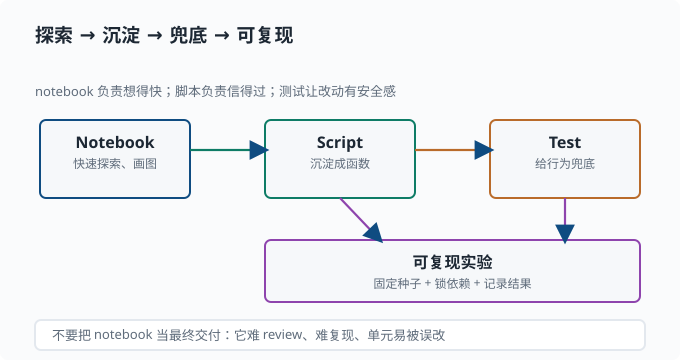

# 用 Python 做研究：Notebook、绘图与复现

> 目标：把前面学的语法、NumPy、工程纪律组合成一套"快速验证想法"的工作流。读完这一页，你能用一个 notebook 做交互探索、用 matplotlib 画图、把临时脚本整理成可复现的实验，并知道在哪里停下、在哪里抽象。

## 为什么研究需要一套固定工作流

研究不是"写一个大程序一次跑完"，而是**一连串小实验**：改个参数、看个图、验证一个假设、再调整。如果每次都要重写整个脚本，你很快就会疯。好的研究工作流让你能"快速试、清楚看、可信复现"。

一个关键心态：

> 交互探索（notebook）负责"想得快"，脚本和测试负责"信得过"。两者不是替代关系，而是探索 → 沉淀的一条路径。

## Notebook 与脚本的分工

**Jupyter Notebook / VS Code 的交互单元**适合：

- 快速试一段代码、看中间结果。
- 画图、可视化、总结经验。
- 教学和探索：边想边跑。

**普通 Python 脚本**适合：

- 可重复运行的正式实验。
- 被测试覆盖的模块逻辑。
- 需要长时间运行、无人值守的任务。

经验法则：**在 notebook 里探索，确认可行后沉淀成脚本 + 函数 + 测试。** 不要让 notebook 成为最终交付物——它难 review、难复现、单元很容易被误改。

把"探索 → 沉淀 → 兜底 → 可复现"这条路径画出来，就能看出 notebook 只占其中最灵活、也最"临时"的一环：



notebook 的价值在**想得快**：改一行、看一个图、验证一个假设。一旦想法成立，就把它从"临时交互"沉淀成"可被测试的脚本逻辑"——这样它才能被正式运行、被测试覆盖、被版本管理。箭头指向的单向性正是提醒你：好的研究代码是"从探索里长出来"，而不是"把整本 notebook 变成最终代码"。

### 让 notebook 可复现

如果非要用 notebook，至少做到：

- 每个 notebook 开头固定随机种子。
- 用 `print(shape)` / 明确的输出标记关键结果。
- 注明依赖版本和执行顺序。
- 不要藏着"隐式修改全局状态"——每个单元要尽量独立。

## 绘图：让数据说话

`matplotlib` 是最常用的绘图库。最小例子：

```python
import matplotlib.pyplot as plt
import numpy as np

x = np.linspace(0, 10, 100)
y = np.sin(x)

plt.figure(figsize=(6, 4))
plt.plot(x, y, label="sin(x)")
plt.xlabel("x")
plt.ylabel("y")
plt.title("正弦曲线")
plt.legend()
plt.tight_layout()
plt.show()
```

研究绘图的要点：

- **加标签**：坐标轴、图例、标题一个不能少，否则图谁看都看不懂。
- **用 `scatter` 画散点、`hist` 画直方图、`imshow` 画矩阵/图片**——选对图型。
- 保存时 `plt.savefig("xxx.png", dpi=150)` 带上 `dpi`，保证清晰。
- 别在 loop 里反复 `plt.show()` 阻塞，批量出图用 `savefig`。

图像的本质就是矩阵：灰度图是二维数组，彩色图是 `(H, W, 3)` 的三维数组。`plt.imshow` 直接展示数组，这就是你后面看"权重可视化""注意力热力图"（[05](../05-nlp-transformers/README.md)）的入口。

## 一个完整的研究小流程

把探索、计算、画图、保存串起来：

```python
import json
import numpy as np
import matplotlib.pyplot as plt


def run(seed: int, n: int = 5000):
    rng = np.random.default_rng(seed)
    samples = rng.normal(loc=5.0, scale=2.0, size=n)

    # 计算数字特征
    summary = {
        "n": int(n),
        "mean": float(samples.mean()),
        "std": float(samples.std()),
    }

    # 出图
    fig, ax = plt.subplots()
    ax.hist(samples, bins=50, alpha=0.6)
    ax.axvline(summary["mean"], color="red", label="mean")
    ax.legend()
    ax.set_title(f"正态样本 seed={seed}")
    fig.savefig("hist.png", dpi=150)

    # 持久化结果
    with open("summary.json", "w") as f:
        json.dump(summary, f, indent=2)
    print(summary)


if __name__ == "__main__":
    run(seed=42)
```

注意这里用了 **`np.random.default_rng(seed)`**——这是比 `np.random.seed` 更推荐的写法，它能创建独立的随机数生成器，避免污染全局状态。研究里"每个实验一个独立的 rng"是很干净的习惯。

## 从探索到沉淀：什么时候抽象

不是所有代码都要立刻抽象成函数，但出现以下信号就该抽象：

- 同一段逻辑出现了两次以上。
- 一段逻辑你**要测试**它（比如一个数值计算函数）。
- 一段逻辑需要**复用**（比如在多个实验之间共用）。

判断标准很简单：**你会不会想单独测它、会不会想在别处用它。** 会，就抽成带类型标注的函数；不会，就留在原地。

这套"探索 → 沉淀"的节奏可以用一个循环来概括，研究就是在它里滚动前进：


## 依赖与虚拟环境

研究项目要在隔离环境里装依赖，避免不同项目互相污染：

```bash
python -m venv .venv
source .venv/bin/activate      # Windows: .venv\Scripts\activate
pip install numpy matplotlib jupyter
pip freeze > requirements.txt   # 记录版本
```

用虚拟环境的理由：不同项目可能需要不同版本的同一库，互相独立。记录 `requirements.txt` 是为了可复现。在 pnpm 的世界里，`pnpm-lock.yaml` 起同样的作用——锁定版本，保证一致。

## 写一个研究阶段的脚本骨架

随着项目成长，你值得一个更完整的骨架：

```text
research/
  src/
    __init__.py
    pipeline.py        核心逻辑（可测试）
  tests/
    test_pipeline.py
  config.py            种子与参数
  run_experiment.py    入口脚本
  output/
    hist.png
    summary.json
  README.md
```

跑实验时记下：**种子、参数、输入数据、依赖版本、输出**。有了这套，你就能回答研究里最常问的三个问题："怎么跑？" "上次用了什么？" "这个结果可信吗？"

## 动手：把一次探索沉淀成可复现实验

目标：走完"notebook 探索 → 固定成脚本 → 记录环境"的最小闭环，体验研究工作流的完整一圈。

任务：

1. 在任意环境（脚本或 notebook 均可）里探索：用 `np.random.default_rng(42)` 生成 100 个正态样本 `x`，再生成 `y = 2*x + 1 + rng.normal(0, 0.5, 100)`。画出散点图，直观确认线性关系。

   ```python
   import numpy as np
   import matplotlib.pyplot as plt

   rng = np.random.default_rng(42)
   x = rng.normal(0, 1, 100)
   y = 2 * x + 1 + rng.normal(0, 0.5, 100)

   plt.scatter(x, y, alpha=0.7, label="样本")
   plt.xlabel("x"); plt.ylabel("y"); plt.title("线性关系探索")
   plt.legend(); plt.savefig("explore.png", dpi=120)
   ```

2. 把探索结论固化成脚本 `run_experiment.py`：参数（种子、样本数、斜率）放命令行或配置，输出写进 `output/`（图 + `summary.json`）。
3. 用最小二乘（`np.polyfit(x, y, 1)`）估计斜率和截距，写进 `summary.json`，并断言 `abs(斜率 - 2) < 0.3`——把"探索发现"变成"可检验的结论"。
4. 记录环境：`pip freeze > requirements.txt`（或 `uv pip freeze`）。再跑一遍脚本，确认两次 `summary.json` 完全一致——这就是可复现。

检验标准：换一个目录、重新运行脚本，能凭 `summary.json` + `requirements.txt` 说出"跑了什么、结果是什么、依赖是什么"。

## 思考题

1. Notebook 和正式脚本的分工是什么？为什么最终交付不建议只依赖 notebook？
2. 绘图时为什么要加图例、坐标轴标签和标题？
3. `np.random.default_rng(seed)` 相比 `np.random.seed` 有什么好处？
4. 什么时候应该把一段临时代码抽象成函数？

## 参考答案

1. Notebook 适合交互探索、可视化、快速试错；正式脚本适合可重复运行、可测试、长期运行的实验。最终交付不应只依赖 notebook，因为它难以 review、单元易被误改、复现和版本管理都较弱；应把验证过的逻辑沉淀成函数 + 测试。
2. 因为图是给别人（包括未来的自己）看的。没有图例、坐标轴标签和标题，读者无法知道横纵轴是什么、曲线代表什么，图就失去了传达信息的意义。
3. `default_rng(seed)` 创建**独立的随机数生成器**，不会污染全局随机状态，适合在多个实验间隔离；`np.random.seed` 直接改动全局，可能会被别处代码影响。推荐研究代码用独立 rng。
4. 当一段逻辑出现两次以上、需要单独测试、或需要在多个实验间复用时，就应该抽成带类型标注的函数。判断标准是"你会不会单独测它、会不会在别处用它"。

## 下一步

- 想在概率上做更多计算 → [01-03 期望与方差](../01-math-foundations/01-03-expectation.md)。
- 想在数学上补齐工具 → [01-06 梯度与微分](../01-math-foundations/01-06-gradient.md)。
- 到这里，编程基础已经够你开始跑后面的机器学习练习 → [03 机器学习](../03-machine-learning/README.md)。
- 想在架构层面真正读懂 deepseek-harness → [10 实战 Lab](../10-practical-lab/README.md)。

[返回本章目录](README.md)
