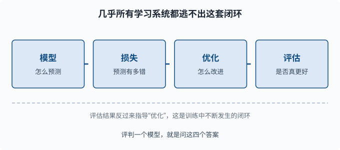

# 监督学习全景：问题设定与方法

> 目标：建立"几乎所有机器学习都是同一套四件套"的总框架。读完这一页，你能区分监督/无监督/强化学习，看懂回归与分类的问题设定，并掌握贯穿后续所有章节的统一心智模型。

## 为什么先建立全景

机器学习概念满天飞，但真正在学习系统里反复出现的骨架只有一套。如果你一开始就陷进具体算法（线性回归、决策树、神经网络），很容易只见树木不见森林。这一页给你一张"地图"：后续每一章讲的具体方法，都只是这张地图上的一种实现。

一个关键心态：

> 不要问"这个模型叫什么"，要问"它用什么预测、用什么损失、怎么优化、怎么评估"。四个答案齐了，你就真的理解了它。

## 三类学习的划分

机器学习按"训练时有没有答案"分成三大类：

| 类型 | 训练时有答案？ | 目标 | 例子 |
|---|---|---|---|
| 监督学习 | 有（标签 y） | 学到输入→输出的映射 | 图片分类、房价预测 |
| 无监督学习 | 无 | 发现数据里的结构 | 聚类、降维、异常检测 |
| 强化学习 | 无（只有奖励信号） | 学会做出一串好决策 | 下棋、对话策略 |

（**标签** y 就是每个样本的"标准答案"——图片对应的类别名、房价数据里那套房子的成交价。）

语言模型的"预训练"用**自监督**方式从海量文本中自己造出目标（预测下一个词：输入是前文、答案就是原文的下一个词，不需要任何人工标注），本质上是把无标签文本变成监督任务。你后面在 [06 章](../06-llm-fundamentals/README.md) 会看到这一点。这一章先聚焦最核心的**监督学习**，因为它最容易建立完整的四件套直觉。

## 监督学习的四件套

一切监督模型都长这样：

```text
模型：     y_hat = f(x)                    给定输入，怎么预测
损失：     L(y, y_hat)                     预测离答案有多远
优化：     调整模型参数使损失变小         怎么改进
评估：     在没见过的数据上测效果         是否真的更好
```

把这四件套串起来，就是监督学习反复转动的那个闭环：



### 1. 模型：怎么预测

模型是一个把输入 `x` 映射到预测 `y_hat` 的函数。输入可以是图片、文本、表格特征；输出可以是连续数（预测房价）或类别概率（判断是猫还是狗）。参数多的模型表达能力更强，但也更容易"背答案"（过拟合）——这就是为什么要配套后面的评估。

### 2. 损失：预测有多错

损失函数 `L(y, y_hat)` 把"预测与真实答案的差距"变成一个数字。好的损失要满足：

- 预测越准，损失越小。
- 可求梯度（这样优化才能做）。
- 对"错误的方向"给足够大的惩罚，让优化有方向。

回归常用**均方误差**，分类常用**交叉熵**。这一页先记住"损失是把错误量化的尺子"，具体公式在 [03-02](03-02-linear-regression.md) 和 [03-03](03-03-logistic-regression.md) 展开。

### 3. 优化：怎么改进

给定损失，我们用**梯度下降**调整参数：算损失对参数的导数，然后朝"让损失变小"的方向迈一小步。这一步的数学你在 [01-06](../01-math-foundations/01-06-gradient.md) 和 [01-07](../01-math-foundations/01-07-optimization.md) 已经具备。

```text
新参数 = 旧参数 - 学习率 × 梯度
```

优化是"反复试、逐步变小"的循环。不是所有损失都能一步解出最优解，往往要迭代很多轮。

### 4. 评估：是否真的更好

优化是在**训练数据**上让损失变小。但真正重要的是在**没见过的数据**（测试集）上表现如何——这种"在没见过的数据上依然准"的能力叫**泛化**（generalization）。这是机器学习的核心伦理：

```text
能记住训练数据的模型 = 没学会，只是背答案
能在新数据上泛化的模型 = 真学会了
```

一切"过拟合"问题都源于混淆了"训练损失小"和"真的会"。评估就是不断提醒你这两件事不一样。

## 回归 vs 分类

监督学习再往下分两大类，差别只在**输出类型**：

| | 回归 | 分类 |
|---|---|---|
| 输出 | 连续数 | 离散类别（或类别概率） |
| 例子 | 预测房价、温度 | 猫/狗、垃圾/正常邮件 |
| 常见损失 | 均方误差 MSE | 交叉熵 |
| 衡量 | 离真实值多近 | 是否分对、分错代价多大 |

回归的输出是"数值有多接近"，分类的输出是"属于哪一类、有多确信"。

### 从回归到分类：把概率请进来

分类模型通常不直接输出"是猫"，而是输出"是猫的概率 `0.87`"。这样：

- 可以表达不确定。
- 能输出排名（比如把最可能的三个答案列出）。
- 能配合阈值调整"宁可不判 vs 宁可错判"。

这正是语言模型输出的方式：它不直接"决定下一个词"，而是输出整个词表上的概率分布。你会在 [03-03](03-03-logistic-regression.md) 建立这个机制的最小版。

## 监督学习的一般流程

一个典型监督学习项目不是"一句 fit 就完事"，而是一条流水线：

1. **整理数据**：收集样本，分成"特征 `x`"和"标签 `y`"。
2. **划分数据**：训练/验证/测试三份，各自职责不同。
3. **设计模型+损失**：选一个能表达问题的预测函数。
4. **训练（优化）**：在训练集上迭代调参让损失变小。
5. **验证**：用验证集调超参数（**超参数**=训练开始前由人设定的"设置项"，如模型大小、学习率、正则强度——它们不由数据学出来，区别于模型自己学出的权重参数）。
6. **测试**：在所有调参完成后，用从没动过的测试集做最终评估。

关于划分多说两句（这是最容易做错的地方）：

- **训练集**：模型学习的素材。
- **验证集**：你用来"选超参数、看中间表现"的，**会间接影响你的决定**，所以不能当最终成绩。
- **测试集**：只测一次、测完就归档。用测试集反复调参 = 变相把测试集的信息泄漏给模型。


## 泛化：机器学习的真正目标

整个监督学习的核心矛盾是：**训练损失要小，但更要在没见过的数据上表现好。** 这两个目标会冲突。

当模型太简单，连训练数据都学不好 → **欠拟合**（underfitting）。
当模型太复杂，把训练数据背下来、但新数据表现差 → **过拟合**（overfitting）。

```text
欠拟合：训练差，测试也差   → 模型不够力
过拟合：训练好，测试差     → 模型背答案
刚合适：训练好，测试也好   → 学会了泛化
```

这一页先建立"存在这个张力"的意识。具体怎么量化、怎么在中间找到平衡点，是 [03-04](03-04-bias-variance.md) 和 [03-09](03-09-learning-curves.md) 的核心。

## 动手：一眼看出"基线的价值"

任何模型都要跟一个**基线（baseline）**比，否则你不知道它是不是真的有用。最简单的基线是"永远预测训练集里最常见的类别"（分类）或"永远预测平均值"（回归）：

```python
import numpy as np

# 模拟一个分类标签集
y = np.array(["猫", "猫", "狗", "猫", "猫"])
most_common = max(set(y), key=list(y).count)
print("基线预测:", most_common)
print("基线准确率:", (y == most_common).mean().round(3))
```

如果某个"高级模型"的准确率只比这个基线高一点点，它的价值就很可疑。基线是"空手也能做到的成绩"，是衡量一切模型的天花板下的下限。

## 思考题

1. 监督、无监督、强化学习的核心区别是什么？
2. 模型、损失、优化、评估四件套里，哪一个负责"在没见过的数据上判断是否真的更好"？
3. 为什么分类模型输出"概率"而不是直接输出"唯一答案"？
4. 训练集、验证集、测试集各自的作用是什么？为什么测试集不能反复用来调参？

## 参考答案

1. 区别在训练信息：监督学习有输入和标签，学到输入到输出的映射；无监督学习只有输入、没有标签，目标是发现数据自身结构；强化学习没有标签，只有一步一步的奖励信号，目标是学会一整串好决策。
2. 评估（第四件）。模型负责预测，损失负责在训练上量化错误，优化负责让损失变小；而"是否真的在没见过的数据上更好"只能靠评估在测试集上回答。
3. 因为输出概率能表达不确定性、能提供多个候选的排名、能配合阈值做取舍（比如"宁可漏报不可误报"）。而且概率能和交叉熵损失无缝衔接，让优化有平滑的梯度。语言模型正是靠输出整个词表上的概率分布来工作的。
4. 训练集供模型学习参数，验证集用于调超参数并观察中间表现，测试集用于最终、一次性的泛化评估。测试集不能反复用来调参，因为一旦用它调过，结果就包含了从测试集偷来的信息，就不再是"没见过的数据"，泛化评估也就失去意义。

## 下一步

- 想看最简单的可解释模型 → [03-02 线性回归](03-02-linear-regression.md)。
- 想理解"为什么越复杂不一定越好" → [03-04 偏差-方差与正则化](03-04-bias-variance.md)。
- 想补梯度下降的数学 → [01-07 最优化](../01-math-foundations/01-07-optimization.md)。

[返回本章目录](README.md)
