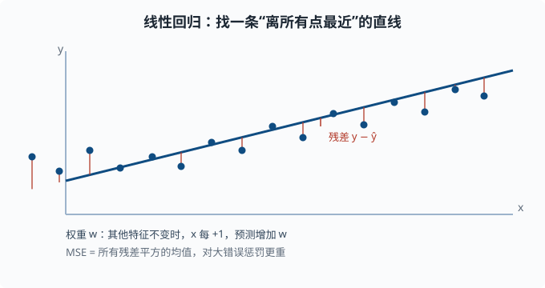

# 线性回归：最简单也可解释的模型

> 目标：把四件套中最简单的完整实例走一遍。读完这一页，你能写出线性回归的假设、推导出最小二乘解、理解它的误差假设与局限，并用 sklearn/NumPy 亲手拟合、预测、评估。

## 为什么先学线性回归

线性回归是理解一切模型的最佳入口：它足够简单，你能完整看到"模型、损失、优化、评估"如何串成一条链；它又足够可解释，系数直接告诉你"每个特征对结果的影响方向和大小"。很多更复杂的模型只是在线性的骨架上加了非线性。

一个关键心态：

> 线性回归不是"一个公式"，而是一整套**假设 + 推导 + 验证**。学会它，你就学会了一种"我该信任这个模型到什么程度"的完整思维。

## 模型：用一条 (超)平面预测

对单个特征 `x`，线性回归预测：

```text
y_hat = w * x + b
```

`w` 是斜率（权重），`b` 是截距（偏置）。对多个特征 `x = (x₁, x₂, ..., x_n)`，预测是每个特征乘以对应权重再加总：

```text
y_hat = w₁x₁ + w₂x₂ + ... + w_n x_n + b
```

用向量写法（[01-01](../01-math-foundations/01-01-linear-algebra.md) 的矩阵乘法）：

```text
y_hat = X·w + b
```

```
X: 每行一个样本，每列一个特征
w: 权重向量
b: 偏置（可并入权重，加一列全 1 的特征）
```

几何上，单一特征时它是一条直线，两个特征时是一个平面，更多特征时是超平面。**权重 `w_i` 的直接含义**：其他特征不变时，`x_i` 每增加 1，预测增加 `w_i`。这就是它"可解释"的来源。



图中蓝色的点是一个个样本，红色的竖线是每个样本的**残差**（预测与真实的差距）；目标就是让所有这些残差整体的平方和尽量小。

## 损失：均方误差 MSE

预测和真实值之间的差距叫**残差** `y - y_hat`。均方误差把所有样本残差的平方取平均：

```text
MSE = (1/n) · Σ (y_i − y_hat_i)²
```

为什么用**平方**而不是绝对误差？

- 平方对"大错误"惩罚更重（差 2 是差 1 的 4 倍惩罚）。
- 平滑、处处可导，方便求梯度。
- 在"误差是高斯噪声"的假设下（高斯 = 正态分布的另一个名字，[01-02](../01-math-foundations/01-02-probability.md) 讲过：大量独立小扰动叠加的结果就是它），最小化 MSE 等价于**最大似然估计**——"似然"指"在这组参数下，恰好观察到手上这批数据的概率"，最大似然就是挑让这批数据出现概率最大的参数（[01-04](../01-math-foundations/01-04-bayesian.md) 的视角）。

代价是它对**离群点敏感**——一个极端的样本会拉扯整条线。

## 优化：最小二乘的两种路径

线性回归的优点是：MSE 对参数是**凸的**（凸函数只有一个"谷底"：不管从哪里出发往下走，最后都落到同一个最低点，不存在中途卡住的局部坑），全局最优唯一。有两种解法：

### 法一：解析解（闭式解）

把偏置并进权重，记设计矩阵 `X`（每行一个样本）——之所以叫"设计矩阵"，是因为它的每一列是你**设计**出来的特征（原始特征、常数 1 等），解析解是：

```text
w = (XᵀX)⁻¹ Xᵀ y
```

这来自"对 w 求导并令其为 0"。闭式解的意思是"答案能写成一个公式、一步算出"，不需要迭代。它一步到位，但要求 `XᵀX` 可逆（没有"奇异"问题——奇异指矩阵不可逆，通常因为特征之间线性重复或样本太少），且矩阵求逆在大数据上代价高。

### 法二：梯度下降（迭代）

对每个参数，沿负梯度更新：

```text
w ← w − η · ∂MSE/∂w
b ← b − η · ∂MSE/∂b
```

其中 `η`（学习率）控制步长。梯度下降不要求 `XᵀX` 可逆，也适用于更大规模的数据——这正是后面深度学习的标配优化方式。

## 误差假设与信任边界

线性回归给出的置信区间依赖一组假设：

- **线性**：真实关系确实是线性的（或近似）。
- **独立性**：样本之间不相关。
- **同方差**：误差的波动各处相同（不会"这一段预测很准、另一段忽高忽低"）。
- **正态误差**：残差近似高斯。

这些假设在真实数据里常常不成立。所以严谨的做法是**检查残差**：把残差画出来，看是否有明显模式。如果残差有模式（比如弯曲、变大），说明模型漏掉了非线性——线性假设不成立。

这不是说线性回归只能用于完美数据，而是提醒你：**一个模型在数据上"拟合得好"，不等于它的假设在数据上成立。** 这就是 [03-09](03-09-learning-curves.md) 要系统诊断的起点。

## 动手：线性回归完整流程

用随机生成的数据拟合、预测、评估：

```python
import numpy as np

# 生成数据：y = 3x + 2 + 高斯噪声
rng = np.random.default_rng(42)
x = rng.uniform(0, 10, size=100)
y = 3.0 * x + 2.0 + rng.normal(0, 2.0, size=100)

# 用最小二乘解析解（加一列 1 表示偏置）
X = np.stack([x, np.ones_like(x)], axis=1)     # (100, 2)
w, *_ = np.linalg.lstsq(X, y, rcond=None)

slope, intercept = w
print(f"拟合: y = {slope:.2f}x + {intercept:.2f}")   # 接近 3x + 2

# 预测与 MSE
y_hat = X @ w
mse = ((y - y_hat) ** 2).mean()
print(f"MSE: {mse:.3f}")
```

用 sklearn 是同行更常用的写法：

```python
from sklearn.linear_model import LinearRegression
model = LinearRegression().fit(x.reshape(-1, 1), y)
print(model.coef_[0], model.intercept_)
```

## 从线性到非线性：它为何重要

真实世界很少是纯线性的。线性回归的局限在于它捕捉不到"弯曲"。好在它打开了通往更复杂模型的门：

- 在特征里加入 `x²`、`x³` 等 → **多项式回归**，用线性方法拟合非线性关系。
- 把线性输出接个激活/非线性 → 神经网络的最小单元（[04 章](../04-deep-learning/README.md)）。
- 加个逻辑函数把输出压到 `[0,1]` → 逻辑回归（[03-03](03-03-logistic-regression.md)）。

线性回归不是终点，而是"用一套严谨框架从最简单起步"的模板。

## 思考题

1. 线性回归的权重 `w_i` 的直观含义是什么？
2. MSE 为什么比绝对误差更常用？代价是什么？
3. 线性回归为什么能用解析解一步求解？什么情况下不行？
4. 残差出现"弯曲"模式意味着什么？

## 参考答案

1. 在其他特征保持不变时，`x_i` 每增加 1 个单位，预测值 `y_hat` 增加 `w_i`。权重既给出了影响大小，也给出了方向（正/负）。
2. 更常用因为平方对大错误惩罚更重、平滑可导、误差呈高斯时等价于最大似然。代价是对离群点敏感：一个极端样本偏差平方后被放大，会显著拉动拟合线。
3. 因为 MSE 对参数是凸函数，目标只有一个全局最小值，令梯度为零可解出闭式解 `w = (XᵀX)⁻¹Xᵀy`。当 `XᵀX` 奇异（特征冗余或样本不足）时不可逆，无法用此法；这时用梯度下降或加正则化。
4. 意味着线性假设不成立，模型漏掉了数据中的非线性结构。残差"有模式"说明信息还没被模型捕获，应引入非线性特征或换更灵活的模型，而不是继续调线性模型。

## 下一步

- 想让线性模型做分类 → [03-03 逻辑回归](03-03-logistic-regression.md)。
- 想理解"为什么更复杂的模型反而更差" → [03-04 偏差-方差与正则化](03-04-bias-variance.md)。
- 想补矩阵与最小二乘的数学 → [01-01 线性代数](../01-math-foundations/01-01-linear-algebra.md) 与 [01-08 矩阵分解](../01-math-foundations/01-08-matrix-decomposition.md)。

[返回本章目录](README.md)
