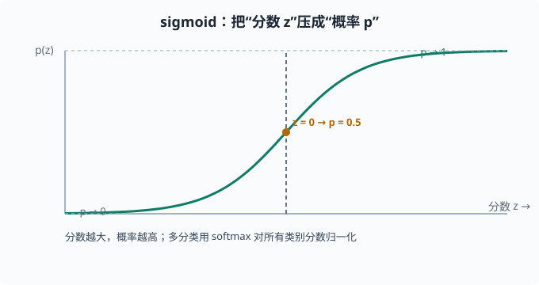
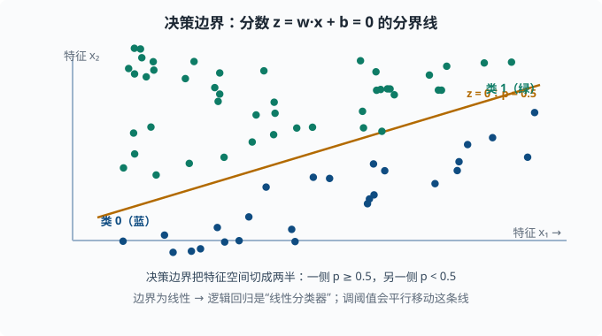
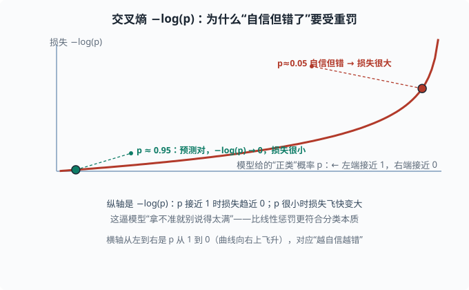

# 逻辑回归：分类与交叉熵

> 目标：理解分类问题如何用概率建模。读完这一页，你能说出 sigmoid 的作用、二分类的交叉熵损失为什么合理、逻辑回归如何得到类别概率，并理解它是语言模型"在词表上输出概率分布"的最小原型。

## 为什么分类需要"概率"

分类的目标是判断一个输入属于哪个类别。但"直接断言是猫/狗"过于武断——如果拿不准，模型应该表达"有多确信"。这一页讲的就是：把分类变成一个**在类别上输出概率**的过程，而概率又能无缝地被一个合理损失函数训练。

一个关键心态：

> 分类模型的主体（把输入变成一个"分数"的线性层）和回归很像；区别在于分数被压成概率，并用**交叉熵**（而不是 MSE）来训练。

## 模型：从分数到概率

### 先算一个"分数"

和线性回归一样，先用特征算一个线性分数：

```text
z = w·x + b
```

这个 `z` 可以取任意实数（正、负、很大、很小）。它表示"这个样本偏向正类的强度"，但还不是概率。

### 用 sigmoid 压到 [0,1]

需要把任意实数 `z` 映射到 `[0,1]` 的概率。标准做法是 **sigmoid 函数**：

```text
p(y=1|x) = σ(z) = 1 / (1 + e^(-z))
```

sigmoid 的性质：

- `z → +∞` 时 `p → 1`（极度偏向正类）。
- `z → -∞` 时 `p → 0`（极度偏向负类）。
- `z = 0` 时 `p = 0.5`（分界点）。
- 处处平滑、可导，方便优化。

"分数越大 → 概率越高"这个单调关系，让 sigmoid 把概率和线性分数优雅地连接起来。



可以看到：分数 `z` 趋向正负无穷时，概率分别逼近 1 和 0；`z = 0` 恰好是"正负各半"的分界点。

### 从二分类到多分类：softmax

二分类只有两个类，一个概率就够（另一类概率是 `1-p`）。多分类（比如 `k` 个类别）用 **softmax**：

```text
p(类别 j) = e^(z_j) / Σ_k e^(z_k)
```

它对所有类别的分数做指数（`e^z`，把任意实数变成正数且保序：分数大的指数后仍大），再归一化成"总和为 1"的概率分布。softmax 是 sigmoid 的多分类推广，也**正是**语言模型每一步在词表上输出下一个词概率的方式（[05 章](../05-nlp-transformers/README.md)）。所以逻辑回归 = 语言模型输出层的最小版本。

## 决策边界

逻辑回归的分类依据是概率是否超过某个阈值（默认 `0.5`）：

```text
p ≥ 0.5 → 判为正类
p <  0.5 → 判为负类
```

`p = 0.5` 对应 `z = 0`，即 `w·x + b = 0`，这是一条**线性决策边界**（"决策边界"就是把特征空间切成"判 A"和"判 B"两半的那条线）。特征越多，边界是越高维的（超平面）。

注意阈值可以调：调低阈值会"更愿意判正类"（召回高、误报多），调高则相反。这正是 [03-05](03-05-evaluation-metrics.md) 里精确率/召回率权衡的入口。



这条斜线就是"分界"：它把特征空间切成两半，蓝绿两类大致落在两侧。分类的本质不是"硬切一刀"，而是"在这条线附近 p 从 0.5 向两侧滚落"；阈值一变，这条线就平行平移。

## 损失：交叉熵

为什么分类不用 MSE？因为预测概率经过 sigmoid 压缩后，MSE 在"分数极对/极错"时梯度会变得很小（sigmoid 两端很平，导数接近 0，误差传不回去），训练很慢。**交叉熵**（cross entropy——衡量"预测的概率分布"和"真实答案"差多远的一个数，源自 [01-05 信息论](../01-math-foundations/01-05-information-theory.md) 里衡量两个分布差异的同名概念）与概率建模天然匹配。

对二分类，用真实标签 `y ∈ {0,1}` 和预测概率 `p`：

```text
L = -[ y·log(p) + (1−y)·log(1−p) ]
```

拆开看：

- 若 `y = 1`，损失是 `-log(p)`：`p` 越接近 1（预测对），损失越接近 0；`p` 越接近 0（预测错得离谱），损失越大。
- 若 `y = 0`，损失是 `-log(1-p)`：同理惩罚"预测接近 1"。

**为什么是 log？** 对"很自信但错了"给非常重的惩罚。例如 `y=1` 但 `p=0.01`，`-log(0.01)≈4.6`，比线性惩罚更狠。这逼模型"拿不准就别说得太满"，非常符合分类的本质。



图中红色曲线就是 `−log(p)`：预测概率越接近 1，损失趋近 0；一旦自信地给出很低概率（`p=0.05`）却其实该判正类，损失就飞快冲到 3 左右。这条"右上翘起"的曲线，正是 log 惩罚比线性惩罚更严苛的地方。

交叉熵的另一个名字是**负对数似然（NLL）**——它正是"在真实标签上取对数概率的负值"，和贝叶斯/最大似然的气息相同（[01-04](../01-math-foundations/01-04-bayesian.md)）。

## 动手：二分类完整流程

```python
import numpy as np


def sigmoid(z):
    return 1 / (1 + np.exp(-z))

# 造两簇数据：负类中心 (1,1)、正类中心 (5,5)
rng = np.random.default_rng(0)
neg = rng.normal([1, 1], 0.8, size=(50, 2))
pos = rng.normal([5, 5], 0.8, size=(50, 2))
X = np.vstack([neg, pos])
y = np.array([0]*50 + [1]*50)

# 快速梯度下降（手写最小版）
Xb = np.hstack([X, np.ones((len(X), 1))])   # 加偏置列
w = np.zeros(3)
lr = 0.05
for _ in range(200):
    p = sigmoid(Xb @ w)
    grad = Xb.T @ (p - y) / len(y)          # 交叉熵梯度
    w -= lr * grad

print("权重:", w.round(3))
print("决策边界截距:", (-w[2]/w[1]).round(3))   # w[1] 是 x2 的系数、w[2] 是偏置
```

用 sklearn 更省心：

```python
from sklearn.linear_model import LogisticRegression
model = LogisticRegression().fit(X, y)
model.predict_proba(X[:2])   # 每个样本的 [P(0), P(1)]
model.predict(X[:2])
```

## 从逻辑回归到神经网络

逻辑回归相当于一个"输入层 + 单个神经元 + sigmoid"的极简网络（**神经元**指"加权求和再过一个非线性函数"的单元，[04 章](../04-deep-learning/README.md)的主角）。把多个这样的神经元并联、再堆叠几层，就构成了**多层感知机**（多层感知机 = 神经元逐层相连组成的基础神经网络，也叫 MLP），也就是 [04 深度学习](../04-deep-learning/README.md) 的起点。逻辑回归的价值正在于：你在这里理解了"线性层 + 概率输出 + 交叉熵"这三个零件，它们会反复出现在整个深度学习里。

## 思考题

1. sigmoid 的作用是什么？为什么 `z=0` 时概率是 0.5？
2. 交叉熵对"自信但错了"的预测有什么惩罚特点？为什么我们需要这种惩罚？
3. softmax 和 sigmoid 的关系是什么？
4. 调整分类阈值会怎样改变结果？

## 参考答案

1. sigmoid 把任意实数分数 `z` 压缩到 `(0,1)`，作为"正类概率"。`σ(0)=1/(1+e⁰)=1/2=0.5`，所以分数为 0 时正负类各 50%，正好是分类的分界。
2. 交叉熵对"预测很自信（概率接近 1 或 0）但实际错了"的样本给接近无穷的重罚，例如 `-log(0.01)≈4.6`。这种非线性惩罚能逼模型不要"拿不准却说得满"，也更贴近分类的本质：宁可保守。它同时提供了良好的梯度，避免 sigmoid 饱和区梯度消失。
3. softmax 是 sigmoid 的多分类推广。sigmoid 处理两类（一个概率即可），softmax 处理 k 类，把所有类别的分数指数化后归一化成总和为 1 的概率分布。sigmoid 可由二类 softmax 等价推出。
4. 阈值决定"多确信才判成正类"。调低阈值会更愿意判正类，提高召回但增加误报；调高则相反，更保守、误报少但可能漏掉正样本。这个取舍由具体任务代价决定。

## 下一步

- 想理解分类的"到底分对了没"怎么衡量 → [03-05 评估指标](03-05-evaluation-metrics.md)。
- 想理解"模型太复杂为何更差" → [03-04 偏差-方差与正则化](03-04-bias-variance.md)。
- 想补概率与贝叶斯的视角 → [01-04 贝叶斯视角](../01-math-foundations/01-04-bayesian.md)。

[返回本章目录](README.md)
