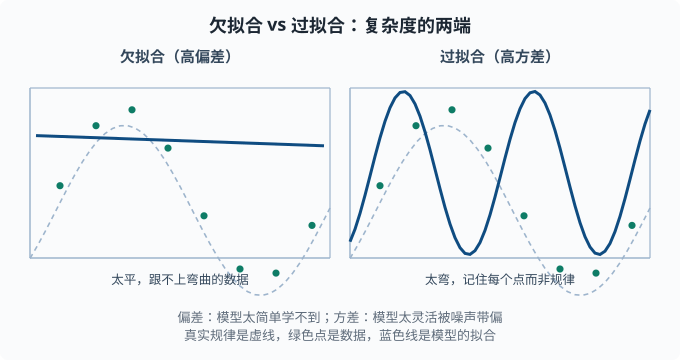
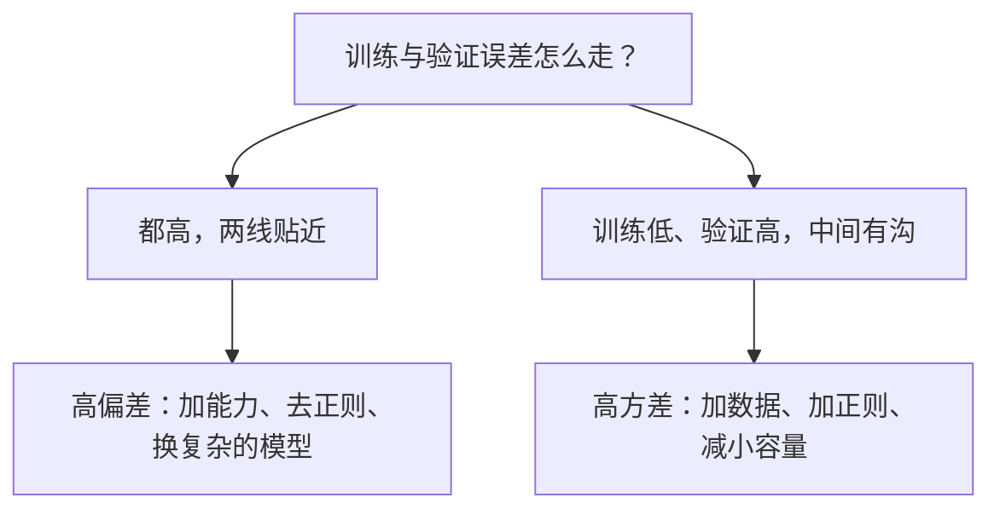

# 偏差-方差与正则化：越复杂不一定越好

> 目标：理解机器学习最核心的张力——过拟合与欠拟合。读完这一页，你能拆解"误差 = 偏差 + 方差 + 噪声"，解释 L1/L2 正则化分别怎么起作用、各有什么偏好，并知道如何用它们控制模型复杂度。

## 为什么"越复杂不一定越好"

一个直觉：模型越复杂，它在训练数据上往往越准。但如果它只是把训练数据**背下来**，拿到新数据就失灵。这里的核心问题是**权衡**：模型要有足够能力学到真实规律（不能太简单），又不能太灵活到把噪声也当规律（不能太复杂）。

一个关键心态：

> 误差不是单一来源。真正专业的做法是把它拆成"因为太简单没学会"和"因为太灵活被噪声带偏"两部分，然后对症下药。

## 误差三件套：偏差 + 方差 + 噪声

一个模型在测试集上的总误差可以分解成三部分：

```text
总误差 = 偏差²(bias) + 方差(variance) + 不可约噪声(noise)
```

换个通俗说法：

- **偏差**：模型"固有的天真程度"。简单模型常假设不对，偏离真实规律 → 高偏差。
- **方差**：模型"对训练数据变化的敏感程度"。复杂模型换个训练集结果就大变 → 高方差。（这里借用了 [01-03 期望与方差](../01-math-foundations/01-03-expectation.md) 里"方差衡量波动"的直觉：把"换一批训练数据"当成随机性，预测结果随之晃动越剧烈，方差越大。）
- **噪声**：数据本身不可预测的部分，任何模型都无法消除。

### 直觉例子：打靶

- **高偏差、低方差**：弹孔都集中在偏离靶心的一小片——很稳定但整体打偏（欠拟合，总是错）。
- **低偏差、高方差**：弹孔围绕靶心但四散——平均准但每次不稳定（过拟合，换数据就变）。
- **低偏差、低方差**：弹孔稳定地集中在靶心——这才是理想的。

这个"精准 vs 稳定"的对比是理解全部复杂度的钥匙。

## 过拟合与欠拟合

| | 欠拟合 | 过拟合 |
|---|---|---|
| 训练误差 | 高 | 很低 |
| 测试误差 | 高 | 高 |
| 原因 | 模型太简单 | 模型太复杂 |
| 偏差 | 高 | 低 |
| 方差 | 低 | 高 |
| 对策 | 加能力/换复杂模型 | 加正则/减复杂度/加数据 |

关键信号：**测试误差的走向**。

- 训练和测试都差 → 欠拟合，还不够力。
- 训练很好但测试差 → 过拟合，太能背。
- 训练好、测试也好 → 状态合适。



左图是太简单的模型：虚线表示真实规律，蓝线过于平坦，跟不上弯曲的数据（高偏差）；右图是太复杂的模型：蓝线弯弯绕绕穿过每个训练点，把噪声也记住了（高方差）。两个极端都不是我们想要的。



## 如何"调复杂度"

复杂度不是二选一，而是一个旋钮，可以从两个方向拧：

1. **改变模型容量**：特征更多、层更多、树更深 → 容量变大。**容量**（capacity）指"模型能表达多复杂的关系"——容量小的模型只画得出直线，容量大的能画出任意弯的曲线。
2. **正则化**：不改变模型结构，但**惩罚过度复杂**的参数（正则化 = 往损失里额外加一项"参数太大致罚"，逼模型保持简单）。

对深度模型，容量通常通过调结构（层数/宽度）来变；对表格模型，往往靠**正则化**来抑制过拟合而不牺牲表达能力。

## L2 正则化（岭回归）

L2 是在损失函数里给"权重的平方和"加惩罚（这个方法叫**岭回归**，ridge regression——名字里的"岭"指损失曲面被 λ 项垫起了一道脊，把极端权重压下去）：

```text
L_target = MSE + λ · Σ w_i²
```

这里 `λ`（正则强度）越大，越逼权重往 **0 附近缩**——但不完全等于 0，只是整体变小。L2 的效果：

- 惩罚"参数很大"的模型 → 权重向 0 收缩。
- 让模型更"平滑"、对噪声的每个特征不那么敏感 → 降方差。
- 好处是损失仍可导、凸性好，优化稳定。

直觉：L2 让模型"不要把所有赌注押在某个特征上"，把权重均匀地分摊、压小。

## L1 正则化（Lasso）

L1 惩罚的是权重的**绝对值之和**：

```text
L_target = MSE + λ · Σ |w_i|
```

L1 的独特之处：它会迫使部分权重**精确地变成 0**，实现**特征选择**（自动挑出有用的特征、丢弃没用的）。**Lasso** 就是"用 L1 正则化的线性回归"的名字（lasso 意为"套索"——它像套索一样把一部分系数整个套住拖到 0），lasso 自己会"挑出"哪些特征真正有用，把没用的清零。

为什么 L1 会让权重为零而 L2 不会？

- L2 的惩罚是平方，越靠近 0 惩罚越小，权重停在"小但不为 0"。
- L1 的惩罚是绝对值，在 0 处有一个"尖角"，梯度恒定；最小化会在尖锐处把权重压到 0。

几何上，L1 的约束区域是"菱形"（角落在轴上），最优解更容易落在轴上（稀疏）；L2 是"圆"，最优解一般不在轴上。**[01-01](../01-math-foundations/01-01-linear-algebra.md) 里提过 L1 鼓励稀疏**——正是这里。

## 两种正则对比

| | L1 (Lasso) | L2 (Ridge) |
|---|---|---|
| 惩罚项 | `Σ\|w_i\|` | `Σ w_i²` |
| 权重要么 | 可能精确变 0（稀疏） | 变小但一般不为 0 |
| 主要作用 | 特征选择、稀疏解 | 权重收缩、防过拟合 |
| 合适场景 | 特征多、怀疑很多无关 | 各特征都有一点用 |

实操里常两者组合（**ElasticNet**——L1 与 L2 按比例混合的正则化，兼得"稀疏选择"与"稳定收缩"）。而"深度学习里的**权重衰减**（weight decay）"——每步更新后把权重按一个小比例整体缩小——本质就是 L2 正则化，你会不断在 [04 章](../04-deep-learning/README.md) 看到它。

## 正则化不只是权重惩罚

正则化的精神是"抑制过拟合"，手段不止 L1/L2 一种：

- **Dropout**：训练时随机"关掉"部分神经元，强迫网络不依赖单个神经元（[04 章](../04-deep-learning/README.md)）。
- **早停（early stopping）**：验证集误差开始上升就停止训练（详见 [03-09](03-09-learning-curves.md)）。
- **数据增强**：对输入做合理变换造更多样本（如图片旋转裁剪、文本同义改写）。
- **降低模型容量**：更小的层/树深，最直接的"惩罚"。

在语言模型领域，正则化思想也贯穿：标签平滑（把"完全确定的正确答案"软化为"绝大多数概率给正确答案、留一小撮给其他词"，防止模型过度自信）、权重衰减、dropout 都会在 [06/07 章](../06-llm-fundamentals/README.md) 出现。理解"抑制过拟合"这个通用目标，你就能一眼看懂这些看似不同的技术想解决同一个问题。

## 动手：过拟合的可视化与正则化对比

```python
import numpy as np

rng = np.random.default_rng(1)
x = rng.uniform(-3, 3, size=40)
y = np.sin(x) + rng.normal(0, 0.3, size=40)

# 高维多项式特征 → 容易过拟合
from numpy.polynomial import polynomial as P
X = P.polyvander(x, 15)          # 15 阶，容易过拟合

w_lstsq, *_ = np.linalg.lstsq(X, y, rcond=None)

# 加上 L2 惩罚 (λ) 的岭回归解法：w = (XᵀX + λI)⁻¹ Xᵀ y
lam = 1.0
XTX = X.T @ X + lam * np.eye(X.shape[1])
w_ridge = np.linalg.solve(XTX, X.T @ y)

# 比较对训练数据的拟合程度
pred_train = X @ w_lstsq
print("无正则训练MSE:", ((y - pred_train)**2).mean().round(4))
print("无正则权重范数:", np.linalg.norm(w_lstsq).round(2))
print("L2正则权重范数:", np.linalg.norm(w_ridge).round(2))
print("L2正则 权重范数更小:", np.linalg.norm(w_ridge) < np.linalg.norm(w_lstsq))
```

你会看到加正则后权重范数明显变小、预测更平滑——这就是"牺牲一点训练拟合，换取更稳的泛化"。

## 思考题

1. 高偏差、高方差分别对应什么现象？分别应该怎么办？
2. L1 和 L2 正则化在效果上的核心区别是什么？
3. 为什么把 λ 调得太大反而会变差？
4. 一个模型"训练好、测试差"，它是过拟合还是欠拟合？该往哪个方向调整？

## 参考答案

1. 高偏差是模型太简单，训练测试都差（欠拟合），应增加能力、换更复杂模型；高方差是模型太复杂，训练好测试差（过拟合），应加正则、减容量或加数据。
2. L2 把权重整体向 0 收缩但不精确变 0；L1 会把部分权重**精确压成 0**，从而实现特征选择、得到稀疏解。
3. 因为 λ 太大时惩罚压过拟合信号，模型被迫把权重全部压向 0，失去了学习真实规律的能力，偏差大增，整体又变差（从过拟合滑向欠拟合）。
4. 是**过拟合**。因为训练好而测试差说明它记住了训练数据但没有泛化。应增加正则（L1/L2、dropout、早停）、减小模型容量或增加数据。

## 下一步

- 想知道"泛化好不好"怎么公平衡量 → [03-05 评估指标](03-05-evaluation-metrics.md)。
- 想系统地诊断模型"卡在哪" → [03-09 学习曲线与诊断](03-09-learning-curves.md)。
- 想在深度模型里用同样的思想 → [04 深度学习](../04-deep-learning/README.md) 的权重衰减与 Dropout。

[返回本章目录](README.md)
