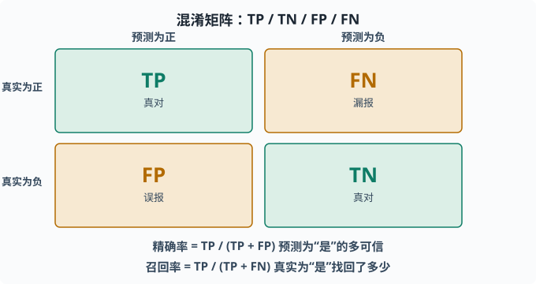
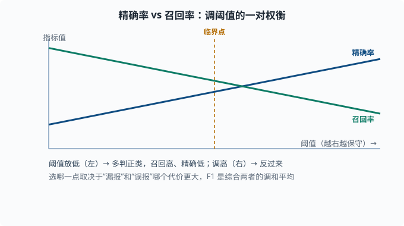
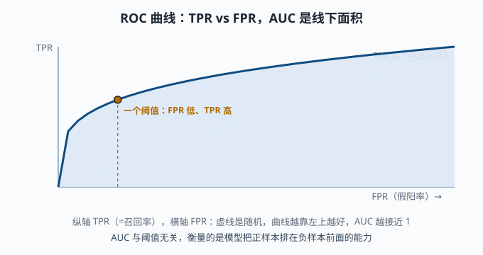

# 评估指标：公平衡量模型好坏

> 目标：从"准确率够高"走向"用对的尺子量对的事"。读完这一页，你能解释混淆矩阵、精确率、召回率、F1、ROC/AUC 与回归的 MSE/MAE，并知道什么时候该选什么指标——这是一切"我做对了没有"判断力的地基。

## 为什么"准确率"常常不够

最自然的评估指标是准确率：测对的样本比例。但它在两类任务上会严重误导：

- **类别不平衡**：垃圾邮件只占 1%，一个"永远判正常"的模型准确率 99%，却毫无用处。
- **不同错误的代价不同**：把癌症病人误诊为没病，比把健康人误诊为有病严重得多。

一个关键心态：

> 指标不是"越高越好"这么简单，而是"选一把能量出任务真实代价的尺子"。同一个模型，不同指标下"好不好"可以完全不同。

## 混淆矩阵：一切的起点

把预测和真实值交叉分类，得到一个四格表：

```text
                真实为正          真实为负
预测为正        True Positive (TP)  False Positive (FP)
预测为负        False Negative (FN) True Negative (TN)
```

四个含义：

- **TP**：真的正类，也被预测为正类（对）。
- **TN**：真的负类，也被预测为负类（对）。
- **FP**：真的负类，被预测成正类（误报）。
- **FN**：真的正类，被预测成负类（漏报）。

所有分类指标几乎都能用这四个格子表达。所以先把混淆矩阵记牢，后面全是它的组合。



横错与竖错各成两个格子：对角线上是"判断正确"的 TP 与 TN，反对角线上是"判断错误"的 FP 与 FN。精确率与召回率就是从这四个数字里算出来的。

## 精确率与召回率：一对权衡

从混淆矩阵定义两个最常被一起讨论的指标：

```text
精确率 Precision = TP / (TP + FP)   预测为正的里，多少真是正
召回率 Recall    = TP / (TP + FN)   真实为正的里，多少被找出来
```

通俗理解：

- **精确率**：模型说"是"的多可信？（慎，宁可不报）
- **召回率**：真实存在的正类，模型找回了多少？（全，宁可多报）

两者是矛盾的：想召回高（不漏），就要多判正类 → 误报变多 → 精确率下降；想精确率高（不错报），就要保守 → 漏报变多 → 召回率下降。

### 例子：垃圾邮件

- 高精确：判为垃圾的绝大多数确实是垃圾（你担心误杀重要邮件）。
- 高召回：绝大多数垃圾都被拦下（你担心垃圾漏网）。

选哪个取决于"错哪种损失更大"。这正是[03-03](03-03-logistic-regression.md)里调阈值那件事：往下调阈值 → 召回升、精确降；往上调 → 相反。



图中蓝线是精确率、绿线是召回率，横轴是"调得越来越严格"的阈值。阈值很松时，模型肯多判正类 → 召回率高、精确率低；阈值收紧后反过来。两条线永远不会同时都很高，这正是"权衡"二字的意思。

## F1：综合的调和平均

当你想用一个数同时反映两者时，用 **F1**：

```text
F1 = 2 · Prec · Rec / (Prec + Rec)
```

它是精确率和召回率的**调和平均**（harmonic mean——先用倒数求平均、再倒回来；效果是"短板说了算"：`1 / (½·(1/P + 1/R))`。对比算术平均 `(P+R)/2`，调和平均对较小的那个值敏感得多）：

- 两个都高才高；一个很低会被狠狠拉低。
- 比算术平均更严格，避免"一个奇高一个奇低"被掩盖。

`F1` 有一个参数 `β` 的推广（`Fβ`）：`β>1` 更看重召回、`β<1` 更看重精确，相当于在公式里给召回加权。默认 `β=1` 即两者等重。

## ROC 与 AUC：跨所有阈值

精确率/召回率依赖一个**具体阈值**。很多时候你想知道"不管阈值怎么定，这个模型整体上区分正负的能力如何"。这时用 **ROC 曲线**（Receiver Operating Characteristic——名字来自二战雷达操作员："真目标报出来了多少、误报了多少"，衡量的是"分辨能力"本身）：

- 横轴：假阳率 `FPR = FP/(FP+TN)`（负类被误报的比例）。
- 纵轴：真阳率 `TPR = TP/(TP+FN)`（=召回率）。
- 改变阈值，就得到曲线上不同点。



曲线上的每个点对应一个阈值：左下是"保守、几乎不判正类"，右上是"激进、判很多正类"。曲线越靠左上，说明在同样误报下能找到越多真正的正类。

**AUC**（Area Under the Curve，曲线下的面积——即 ROC 曲线与两轴围出的那块区域占整个正方形的比例）是 ROC 曲线下的面积：

- `AUC = 1`：完美区分。
- `AUC = 0.5`：跟抛硬币一样（随机）。
- `AUC` 越大，模型把"随机一个正样本"排到"随机一个负样本"前面的概率越高。

AUC 的优点：**与阈值无关**，是模型"排序能力"的整体度量，非常适合类别不平衡。它的注意点：它衡量的是"排序是否好"，不是"在某个实际业务阈值下效果如何"。

## 回归的评估指标

回归没有"对错"，只有"离多远"。常用：

```text
MSE = (1/n)Σ(y - y_hat)²     对离群点敏感
MAE = (1/n)Σ|y - y_hat|       更稳健
```

- **MSE**：惩罚大误差更重（同 [03-02](03-02-linear-regression.md)）。
- **MAE**：对离群点更不敏感，反映"典型误差大小"。

还要注意单位：MSE 是误差的平方，单位是 `y` 单位的平方；MAE 单位与 `y` 相同，更直观。`R²`（读"R 方"，决定系数）则是"相对只预测平均值，模型解释了多大比例的方差"，`R²=1` 完美、`R²=0` 相当于只猜均值。

## 选指标的决策框架

不要拿到指标就用，先问：

1. **类别平衡吗？** 不平衡时别只看准确率，看精确率/召回率/F1 或 AUC。
2. **两种错误代价一样吗？** 不一样时用能反映代价的指标，或给不同类别加权。
3. **我要"整体排序能力"还是"某个业务阈值下的表现"？** 前者用 AUC，后者要有阈值相关的精确/召回。
4. **回归还是分类？** 回归看 MSE/MAE/R²，分类看混淆矩阵那条链路。

对语言模型和 agent 的评估（[07 章](../07-llm-engineering/README.md)）会更复杂，但会反复用到这些基础：判断一个 LLM 回答"对错"经常要引入人工/专家或另一个模型来打标签，本质仍是先定义清楚"什么算对分对"。

## 动手：手算混淆矩阵指标

```python
import numpy as np

y_true = np.array([1, 1, 0, 1, 0, 0, 1, 0])
y_pred = np.array([1, 1, 1, 0, 0, 0, 1, 0])

tp = ((y_true == 1) & (y_pred == 1)).sum()
fp = ((y_true == 0) & (y_pred == 1)).sum()
fn = ((y_true == 1) & (y_pred == 0)).sum()
tn = ((y_true == 0) & (y_pred == 0)).sum()

prec = tp / (tp + fp)
rec = tp / (tp + fn)
f1 = 2 * prec * rec / (prec + rec)

print(f"TP={tp} FP={fp} FN={fn} TN={tn}")
print(f"P={prec:.2f} R={rec:.2f} F1={f1:.2f}")
```

sklearn 可以一行算：

```python
from sklearn.metrics import precision_recall_fscore_support, roc_auc_score
p, r, f, _ = precision_recall_fscore_support(y_true, y_pred, average="binary")
auc = roc_auc_score(y_true, y_pred)
```

## 思考题

1. 为什么类别不平衡时准确率会误导人？举个极端例子。
2. 精确率和召回率分别回答什么问题？为什么它们通常互为取舍？
3. F1 为什么用调和平均而不是算术平均？
4. AUC 衡量的是模型的什么能力？它适合什么场景、不适合回答什么问题？

## 参考答案

1. 因为准确率只看"预测对的占比"。若正类只占 1%（如少数异常、垃圾邮件），一个"永远判正常类"的模型准确率可达 99%，但它一个真正想抓的正类都没抓到，毫无价值。应该看正类相关的精确率/召回率或 AUC。
2. 精确率回答"模型说『是』的可信度有多高"；召回率回答"真实正类被找回了多少"。二者互为取舍，因为改变阈值朝一个方向优化（多判正类提升召回、少判正类提升精确）必然朝反方向损害另一个。
3. 调和平均对两个值都设为严格惩罚：任何一个很低都会被整体拉得很低，避免"精确率高但召回极低"或反之被算术平均掩盖。两根"木桶的短板"都要高，F1 才高。
4. AUC 衡量模型在**所有阈值**下把正样本排在负样本前面的整体排序能力，与阈值无关。它适合类别不平衡和比较模型整体判别力；它不适合回答"在某个具体业务阈值下误报/漏报的实际代价是多大"。

## 下一步

- 想看表格数据的常胜模型 → [03-06 树与集成](03-06-trees-ensemble.md)。
- 想系统诊断模型卡在哪 → [03-09 学习曲线与诊断](03-09-learning-curves.md)。
- 想在 LLM/agent 里复用这套评估思想 → [07 LLM 工程](../07-llm-engineering/README.md)。

[返回本章目录](README.md)
