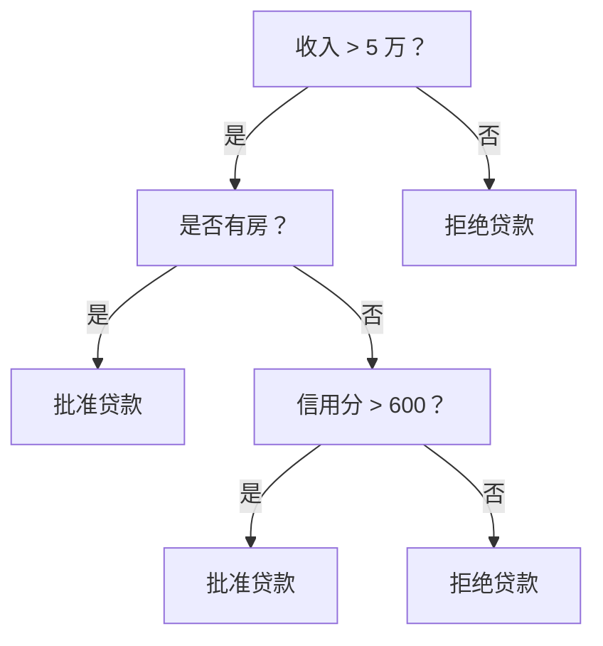
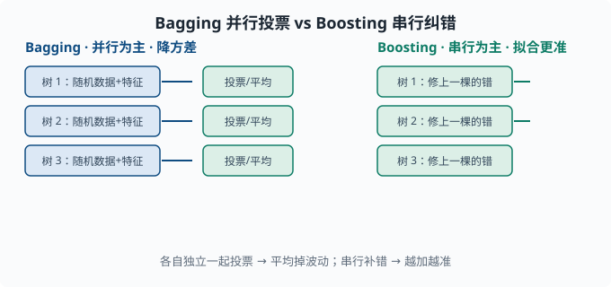

# 树与集成：表格数据的常胜模型

> 目标：理解为什么"很多树的投票"常比"一棵好树"更强。读完这一页，你能解释决策树怎么分裂、随机森林与 GBDT 的区别、它们如何降低偏差与方差，并知道表格数据上该往集成模型靠。

## 为什么学树与集成

线性模型（[03-02](03-02-linear-regression.md)）很可解释，但捕捉不了复杂的非线性结构。深度学习（[04 章](../04-deep-learning/README.md)）很强大，但表格数据上未必最适合。**决策树及其集成**在结构化/表格数据上长期是场上主角——它们对特征尺度不敏感、能捕捉非线性、且常常不需要大量精心调参。

一个关键心态：

> 单棵树容易"记太死"或"记太粗"；与其纠结一棵完美的树，不如让**一大群各不相同但都还不错的树**投票，平均下来往往更强、更稳。

## 一棵决策树：向下的提问链

决策树通过一连串"if-else"式的提问把样本分到叶子：

```text
是否收入 > 5万？
   ├─ 是：是否有房？
   │     ├─ 是 → 批准贷款
   │     └─ 否 → 看信用分 > 600？ → ...
   └─ 否 → 拒绝贷款
```

每个内部节点问"某个特征是否满足某个条件"，把数据往左右分；叶子节点给出最终预测（分类给多数类，回归给均值）。



### 怎么选"问哪个、怎么分"

节点分裂的目标是让分出来的子集**更纯**（同类别更集中）。分类树用**不纯度**衡量（不纯度 = "一个节点里类别混杂的程度"，越混越不纯）：

```text
Gini 不纯度 = 1 - Σ p_i²
熵  Entropy = -Σ p_i·log(p_i)
```

其中 `p_i` 是子集中第 i 类占比。两者在"全体同一类"时都是 0（最纯），在"各类均匀"时最大（最乱）。（熵正是 [01-05 信息论](../01-math-foundations/01-05-information-theory.md) 里"不确定度"的度量，在这里被借来数"节点里有多乱"。）做分裂时，选择"分裂后不纯度下降最多"的特征和阈值。

决策树的优势：**特征间有交互**也能表达（比如"收入和是否有房同时决定"），不用手动造交互特征；无需特征标准化。但它单棵容易：

- **过拟合**（树太深就背数据）。
- **不稳定**（训练数据略变，树结构大变，方差大）。

这正是集成要解决的。

## 集成：很多模型的智慧

"三个臭皮匠顶一个诸葛亮"在机器学习里是真的。把很多略弱的模型组合起来，往往比单个强模型更稳，这种组合就叫**集成**（ensemble）。两类主流：

- **Bagging（并行）**：并行训练很多模型，结果投票/平均 —— 典型是**随机森林**，主要**降方差**。
- **Boosting（串行）**：逐个训练，每个专注纠前面错了的样本 —— 典型是 **GBDT/XGBoost/LightGBM**，既能降偏差又能降方差。（GBDT = 梯度提升树，原理见下节；XGBoost、LightGBM、CatBoost 是它在工程上的三个高速实现。）



左边 Bagging 让各树独立、一起投票，方差被平均掉；右边 Boosting 一棵接一棵地修上一棵的错，预测越加越准。

## 随机森林：Bagging + 随机特征

随机森林训练很多棵决策树，但每棵只：

- 用**随机重采样**得到的训练子集（bootstrap——有放回地随机抽同样多条数据，于是每棵树看到的是一份略有差异的"翻版"训练集）。
- 每次分裂只看**随机挑的一部分特征**（而不是全部）。

这制造了树的"多样性"：每棵看到的数据略不同、能用的特征略不同，于是各有所长、各有所偏，组合起来方差大降。预测时：

- 分类：所有树投票（多数表决）。
- 回归：所有树的预测取平均。

为什么"随机特征"重要？如果所有树都只看最强特征，它们会高度雷同，组合就没有意义了。多样性才是集成的力量来源——这和 [03-04](03-04-bias-variance.md) 的"降方差"直接对应。

## GBDT：Boosting 纠错链

GBDT（梯度提升树，Gradient Boosted Decision Trees）走的是另一条路：**串行地补偿错误**。"提升"指的就是这种"一棵不够就再补一棵、逐级抬高"的思路；"梯度"指每棵新树拟合的是当前损失的负梯度方向（回归问题里恰好就是残差）。

1. 先训练一棵树，得到预测。
2. 算出它**错在哪**（残差/负梯度）。
3. 训练下一棵树去**预测这些残差**，试图修正。
4. 重复，把很多棵弱树**相加**成强模型。

```text
最终预测 = f₁(x) + f₂(x) + ... + f_T(x)
```

关键区别：

- Bagging 重采样降方差，各树**独立并平均**。
- Boosting 聚焦错误，各树**串行补偿**、相加，能更精确拟合（对参数、学习率敏感，也更易过拟合）。

工程上 XGBoost、LightGBM、CatBoost 是 GBDT 的高效实现，加了正则化、直方图加速（把连续特征分桶成直方图再找分裂点，加速十倍以上）、缺失值处理，是 Kaggle（一个举办数据竞赛的著名平台）表格数据的主流工具。

## 与深度学习的对照

| | 树/集成 | 深度学习 |
|---|---|---|
| 最适合 | 结构化表格数据 | 图像、文本、序列 |
| 特征尺度 | 不敏感 | 常需标准化 |
| 数据量 | 中规模数据很有效 | 海量数据才显威力 |
| 可解释性 | 单树极好，集成较弱 | 弱（黑盒） |
| 捕捉非线性 | 内建 | 靠层与激活 |

在 agent 工程里，很多"简单决策"（该调用哪个工具、该不该继续）也可以用树/集成做快速基线；但文本理解的主力仍是深度模型。选型原则是**数据形态决定模型**。

## 动手：随机森林 vs 单棵 CART

（**CART** = Classification And Regression Tree，"分类与回归树"，即上面讲的那种"逐节点二分提问"的决策树的标准实现。）

```python
from sklearn.ensemble import RandomForestClassifier
from sklearn.tree import DecisionTreeClassifier
from sklearn.model_selection import train_test_split
from sklearn.datasets import make_classification
from sklearn.metrics import accuracy_score

X, y = make_classification(n_samples=1000, n_features=20,
                           n_informative=8, random_state=0)
X_tr, X_te, y_tr, y_te = train_test_split(X, y, test_size=0.3,
                                          random_state=0)

tree = DecisionTreeClassifier(random_state=0).fit(X_tr, y_tr)
forest = RandomForestClassifier(n_estimators=200, random_state=0).fit(X_tr, y_tr)

print("单树测试准确率:", accuracy_score(y_te, tree.predict(X_te)).round(3))
print("随机森林测试准确率:", accuracy_score(y_te, forest.predict(X_te)).round(3))
```

通常随机森林的测试表现比单棵满深度树好，因为它用多样性抑制了单树的方差。

## 思考题

1. 决策树分裂的目标是什么？用什么衡量"纯不纯"？
2. 随机森林为什么要"每棵树只看一部分随机特征"？
3. Bagging 与 Boosting 的核心区别是什么？分别主要降偏差还是方差？
4. 表格数据 vs 图像/文本，通常分别该优先考虑哪类模型？

## 参考答案

1. 目标是让分裂后的子集更"纯"，即同一节点内类别更集中。用不纯度衡量：Gini 不纯度 `1-Σp_i²` 或熵 `-Σp_i·log p_i`，全同类别时为 0，各类均匀时最大；分裂选使不纯度下降最多的特征与阈值。
2. 因为如果都用最强特征，所有树会高度雷同、失去多样性，平均起来就退化成不那么强的单模型。随机特征制造了各树的差异，集成才能靠"互补"显著降方差。
3. Bagging 是并行独立训练、结果投票/平均，主要**降方差**（典型随机森林）；Boosting 是串行聚焦错误、相加补偿，既能降偏差（拟合更准）也需防过拟合（典型 GBDT）。
4. 结构化表格数据通常优先考虑树/集成模型（不敏感特征尺度、捕捉非线性、中规模很有效）；图像、文本、序列等非结构化数据通常优先深度学习，因为它能自动学习层次化表示且海量数据时表现更好。

## 下一步

- 想在没有标签时发现结构 → [03-07 无监督](03-07-unsupervised.md)。
- 想让模型事半功倍 → [03-08 特征工程](03-08-feature-engineering.md)。
- 想系统诊断为什么模型卡住 → [03-09 学习曲线与诊断](03-09-learning-curves.md)。

[返回本章目录](README.md)
