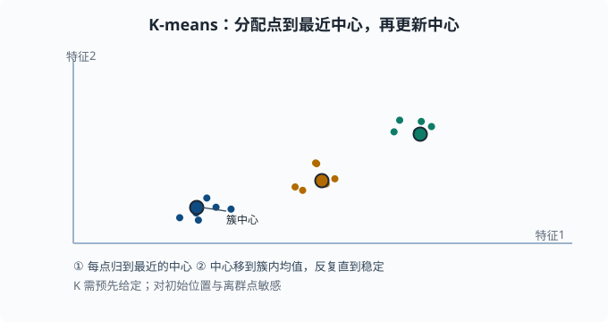
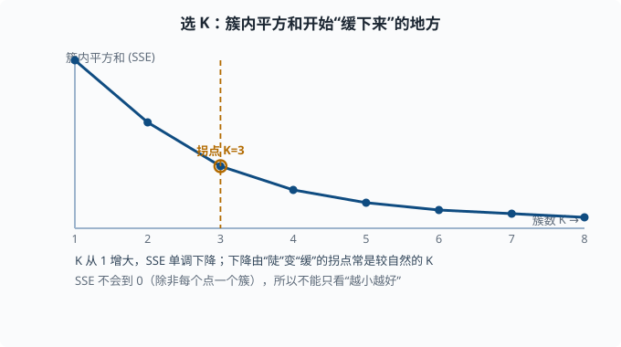
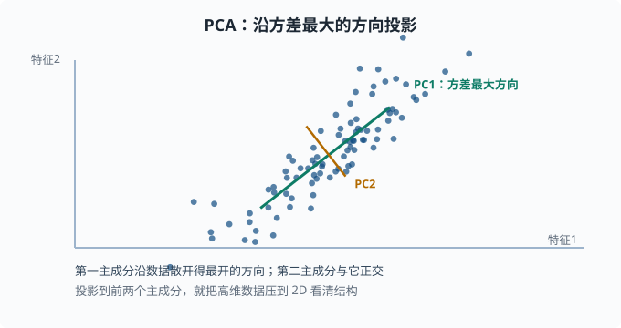

# 无监督：聚类、降维与异常检测

> 目标：在没有标签时也能发现结构。读完这一页，你能解释聚类的目标与 K-means 的迭代过程、PCA 降维的本质、异常检测的思路，并知道这些技术在没有标注数据时扮演什么角色。

## 为什么没有标签也要学

真实世界的绝大多数数据**没有标签**：一堆日志、一组用户行为、一批未标注图片。给所有数据打标签既贵又慢。无监督学习的目标是**从数据自身发现结构**，不靠"正确答案"。

无监督也常是监督的前置：先用聚类把数据分组、用降维看清结构，再决定怎么打标签、怎么建模。语言模型的海量预训练同样是"没有人工标签，让模型自己从文本中预测下一个词造出目标"——这是 [06 章](../06-llm-fundamentals/README.md) 会展开的自监督思想。

一个关键心态：

> 无监督没有"标准答案"，所以它的价值取决于**是否帮你看到了有用的结构**，而不是"得分高不高"。评估方式也和监督不同。

## 聚类：把相近的归为一组

聚类的目标是让**组内样本彼此接近、不同组彼此远离**。常用 **K-means**：

1. 选 `K` 个中心（初始随机）。
2. 把每个样本分给最近的中心。
3. 用每个簇的均值更新中心。
4. 重复 2、3 直到中心不再明显变化。

### K-means 的直觉

```text
反复做两件事：
  分配：每个点归给它最近的那个中心
  更新：把中心移到它簇内所有点的均值
```

它是一个**交替优化的启发式**：固定中心分配、固定分配更新中心，反复迭代直到收敛。因此：

- 对初始位置敏感，建议多跑几个随机起点选最好。
- 对离群点敏感（均值会被拉偏）。
- `K` 要你预先给定——这是"超参数"。



这里把数据分成了三簇。每个实心圆是簇中心：每次迭代先把点分配给最近的中心，再把中心移到簇内均值的位置，反复几次就稳定下来。

### 怎么选 K

没有一个"正确"答案，但有启发式：

- **肘部法则（elbow）**：画"簇内平方和"（SSE——每个点到它所在簇中心的距离平方加总，衡量"簇内挤不挤"）随 K 的变化，找拐点。
- 结合业务：你到底想分成几组，取决于用途。



看图就能理解为何叫"肘部"：K 从 1 增大时 SSE 一路下降，先陡后缓，弯折处（K=3）往后改善越来越小。拐点往往意味着"再多分一簇的收益已经不明显"，这个位置就是较自然的 K。

距离度量决定"相近"的含义，欧氏距离是默认（即直线距离，`√(Σ(a_i-b_i)²)`）；但高维下欧氏距离会变得不可靠——**维度灾难**（curse of dimensionality：维数一高，任意两点之间的距离都差不多远，"最近"和"最远"失去区分度，这也是为什么要降维）。

## 降维：去掉冗余、看清结构

高维数据很难看、很难算，而且很多维度其实高度相关。**降维**在保留主要信息的前提下把数据压到更低维（比如 2D 方便可视化）。

### PCA：找到方差最大的方向

主成分分析（PCA，Principal Component Analysis）的核心思想：

```text
找一组正交方向，使数据沿这些方向依次有最大方差，
用前几个方向近似原数据。
```

第一个主成分是"数据投影后方差最大的方向"（最能区分样本的方向），第二个是与它正交的次大方差方向，以此类推。保留下来的主成分就是**低维表示**。



图中绿色箭头是第一个主成分，指向数据散开得最开的那个方向；橙色箭头是第二个主成分，与它正交。数据在这个方向上的投影能被拉到 2D，方便画出来看结构。

### 与矩阵分解的关系

PCA 的数学基础正是 [01-08 矩阵分解](../01-math-foundations/01-08-matrix-decomposition.md) 讲的 SVD：数据矩阵的右奇异向量就是主方向。这版预告的"低秩近似 / 降维"就在这里落地。

为什么降维有用：

- **去相关/去噪**：投影到主方向能压制噪声维度。
- **可视化**：压到 2D/3D 便于看分布和簇。
- **提高效率**：计算在前几个主成分上更快，也更稳健。

注意：PCA 是**线性**的。对非线性结构，可用 t-SNE/UMAP 等（两者都是"保持邻近关系、把高维点摆到 2D"的可视化专用方法），但它们在可视化上强、在"保留全局距离"上较弱，且不适合当作可逆的特征变换。

## 异常检测：找出"不一样"的

异常检测目标是从大量"正常"里找出少数"异常"。常见思路：

- **密度/距离**：异常点离多数点很远（孤立森林——随机切几刀，正常点挤在一起要切很多刀才分开、异常点孤零零几下就被隔出；kNN 距离——数第 k 个近邻有多远）。
- **重建误差**：先学会压缩/重建正常数据的模型，重建得差的样本视为异常。
- **概率视角**：在正常数据分布下概率低的点视为异常（结合 [01-02](../01-math-foundations/01-02-probability.md)）。

异常检测在 agent/工程里很实用：日志异常、指标异常、入侵检测、数据质量。它常是**单类问题**（训练时只见过"正常"长什么样，没有异常样本可对照），与"少数类是正类"的分类略有不同。

## 动手：K-means 与 PCA

```python
import numpy as np
from sklearn.cluster import KMeans
from sklearn.decomposition import PCA

rng = np.random.default_rng(0)
# 造三个簇
c0 = rng.normal([0, 0], 0.5, (60, 2))
c1 = rng.normal([5, 0], 0.5, (60, 2))
c2 = rng.normal([2, 5], 0.5, (60, 2))
X = np.vstack([c0, c1, c2])

km = KMeans(n_clusters=3, n_init=10, random_state=0).fit(X)
print("簇标签数量:", len(set(km.labels_)))

# 降维到 2D 并解释方差比
pca = PCA(n_components=2).fit(X)
print("前两个主成分解释方差比例:", pca.explained_variance_ratio_.round(3))
```

## 无监督如何融入更大格局

无监督不是监督的替代，而是互补：

- **预训练**：语言模型在海量无标签文本上自监督预训练，再接监督/偏好微调。
- **表征学习**：用自编码器（一个"压缩再还原"的网络，中间的窄层就是学到的紧凑表示）/对比学习（拉近相似样本的表示、推远不相似的）学到好表示，再往下游任务用。
- **探索**：先聚类、降维看清数据再设计监督任务。

你会在 [05 章](../05-nlp-transformers/README.md) 和 [06 章](../06-llm-fundamentals/README.md) 不断看到"无标签数据 → 自监督造目标 → 学表示"这条主线。理解这里"没有标准答案、靠发现结构"的思维方式，是读懂那一切的伏笔。

## 思考题

1. K-means 的核心迭代是什么？它有什么局限？
2. PCA 找的方向满足什么性质？为什么第一个主成分最重要？
3. 异常检测的"密度/距离"思路大概怎么做？
4. 无监督学习为什么没有标准答案？这如何影响评估方式？

## 参考答案

1. 反复"分配"（每个点归最近中心）和"更新"（中心移到簇内均值）两步，直到收敛。局限包括：对初始位置敏感、对离群点敏感（均值被拉偏）、必须预先给定 K、且假设簇近似凸（对复杂形状簇效果差）。
2. PCA 找正交方向使数据投影后依次有**最大方差**。第一个主成分方差最大，最能区分样本、信息最集中；后续按方差递减且互相正交。它本质是 SVD 的低秩近似。
3. 认为"正常"样本聚集在密度高的区域，异常样本远离多数点。做法如：用 kNN 计算点到最近邻居的距离、孤立森林随机切分看样本被孤立的快慢、或以"能否被正常数据重建模型重建好"来判别。
4. 因为没有"正确答案"标签，无法像监督那样算"预测对错"。所以无监督的评估要回到**结构是否合理有用**：簇是否分开、降维后是否可理解、异常是否真有价值，常用内部一致性或下游任务表现间接判断。

## 下一步

- 想让特征事半功倍 → [03-08 特征工程](03-08-feature-engineering.md)。
- 想补 SVD 的数学基础 → [01-08 矩阵分解](../01-math-foundations/01-08-matrix-decomposition.md)。
- 想看降维/表征在语言模型里怎么放大 → [05 NLP 与 Transformer](../05-nlp-transformers/README.md)。

[返回本章目录](README.md)
