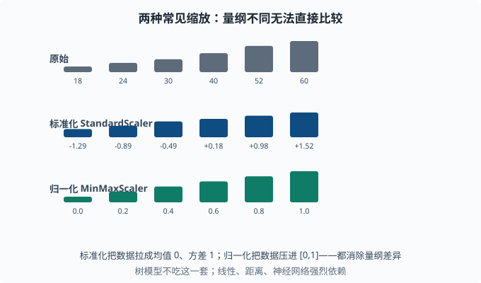
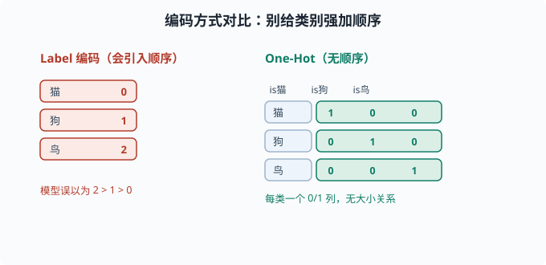

# 特征工程：小数据的杠杆

> 目标：理解"好特征让模型事半功倍"。读完这一页，你能做数据清洗、处理缺失、数值缩放、类别编码、构造新特征，并知道树模型与线性/深度模型在特征尺度上的不同需求。

## 为什么特征工程仍是关键

深度学习能自动学特征，但在表格数据、小数据、以及可解释性要求高的场景里，**你给模型的输入质量**仍然决定成败。同样的模型，喂干净、有信息量的特征和喂原始脏数据，结果可能天差地别。

一个关键心态：

> 特征工程是把"领域已知"塞进模型。你不需要让模型重新发现"周末销量更高"——直接把"是否是周末"作为特征给它，模型要学的就少了一层。

## 清洗：先把垃圾清掉

模型对脏数据很敏感。常见问题与处理：

- **重复样本**：去重，避免某类被过度加权。
- **离群点**：先判断是测量错误还是真有价值的极端；改正或标记，别让均值被拉偏。
- **错误类型**：一个数字列里混进字符串、单位不一致，转换时就会出错。
- **不一致命名**：统一类别名（`USA`/`US`/`United States` → 同一个值）。

清洗的原则：**记录你做了什么**。清洗本身就是"特征政策"的一部分，可复现（对应 [02-04](../02-programming-basics/02-04-engineering-habits.md) 的纪律）。

## 处理缺失值

缺失值不能直接送给大多数模型。策略：

| 策略 | 做法 | 适用 |
|---|---|---|
| 删除 | 删行/删列 | 缺失极少，或列基本全空 |
| 均值/中位数填充 | 填统计量 | 数值简单兜底 |
| 众数填充 | 填最常见类 | 类别特征 |
| 单独标记 | 加"是否缺失"标志 | 缺失本身可能带信息 |
| 模型预测填充 | 用其他特征预测缺的 | 更有信息但更复杂 |

关键提醒：缺失本身可能携带信息（比如"改天未填写金额"这件事本身有意义）。用"是否缺失"作为额外特征，往往能帮到模型。

## 数值缩放

不同特征量纲差很多（年龄 0-100，收入 0-百万）。线性模型和基于距离的方法（K-means、PCA）、神经网络，都需要特征**在同一尺度**，否则大尺度特征会主导。

两种主流缩放：

- **标准化（StandardScaler）**：`(x - mean) / std`，让每个特征均值 0、方差 1。
- **归一化（MinMaxScaler）**：`(x - min)/(max - min)`，压到 `[0,1]`。

```python
from sklearn.preprocessing import StandardScaler
Xs = StandardScaler().fit_transform(X)
```

重要：**只用训练数据的统计量去 fit**，再 transform 训练和测试。否则把测试集的均值用进去会泄漏信息。

注意：**树模型对尺度不敏感**（[03-06](03-06-trees-ensemble.md)），缩放对它们通常无影响；但线性回归、逻辑回归、神经网络、K-means、PCA 都强烈依赖尺度。



同一组数据，三种尺度的样子：原始值量纲差很多（18 到 60），标准化后变成以 0 为中心、方差为 1 的数值，归一化后压进 [0,1]。选哪种看场景，但都要记得"只用训练集去 fit"。

## 类别编码

模型只能吃数字，类别特征要转成数字：

- **Label 编码**：`猫=0, 狗=1, 鸟=2`——但这是**错误做法**，因为模型会以为 2>1>0（隐含排序）。
- **One-Hot 编码**：每个类别一个 0/1 列，无隐式排序。适合类别少的情况。
- **目标编码（target encoding）**：用"该类别在训练集里的目标均值"当编码值（如城市 A 的平均房价），信息强但要防过拟合（小样本城市的均值不可靠）。



左边给"猫狗鸟"硬编上 0/1/2，模型会误以为它们有大小顺序；右边用一个独热向量表示，各类别地位平等，不会引入假的次序。

```python
import pandas as pd
df = pd.get_dummies(df, columns=["color"], prefix="color")
```

类别值很多时（比如几百个城市），one-hot 会爆炸成高维稀疏特征，这时考虑目标编码、embedding（把每个类别映射成一个学出来的稠密向量，[05 章](../05-nlp-transformers/README.md) 的词嵌入就是它在"词"上的应用）或降维。

## 构造新特征：把信息显式化

好的新特征通常来自领域知识：

- **交互特征**：`收入 × 负债`（linear 模型无法自动表达交互，手动加）。
- **特征组合**：`年龄区间 × 地区`。
- **时间派生的**：是否是周末、一天中的时段、距上次购买的天数。
- **统计聚合**：用户历史均值、频次、标准差。

在语言/NLP 里，"特征"演变成"token/词嵌入"（[05 章](../05-nlp-transformers/README.md)），但"把有用信息显式化"的思想一致。对深度学习，模型能学特征，但把领域约束先塞进去通常仍有帮助。

## 图 与 文本 特征

场景更进阶：

- **图特征**：节点度、PageRank（"被越多重要节点指向就越重要"的网页/节点重要度打分，是 [01-09](../01-math-foundations/01-09-probabilistic-graphs.md) 图概念的经典落地）、社区归属，供图模型用。
- **文本特征**：词袋/Bag-of-words（一篇文档 = 词表上每个词出现几次的计数向量）、TF-IDF、词嵌入。TF-IDF 给"常见但对区分没用"的词降权。

这些在 agent 工程的检索、文本分类里都很常见。TF-IDF 是理解"文本怎么变成特征"的一个清晰入口（TF = 词在本文档出现得勤不勤，IDF = 这个词在全体文档里稀有不稀有，两个一乘）：

```text
TF-IDF = 词频 × (文档数 / 含该词的文档数)的对数
```

高频且普遍出现的词（"的""是"）被压低，而"出现在少数文档但出现多次"的词权重高——它度量"一个词对区分文档有多大价值"。

## 特征工程的原则

- **从领域出发**：先想清楚"什么信息会影响结果"，再想办法喂给模型。
- **可复现**：清洗、编码、缩放都写成代码管道，别手工改数据。
- **防泄漏**：只用训练信息 fit 缩放/编码；别让未来的信息渗进训练。
- **与模型匹配**：树不吃尺度，线性/深度/距离类需要尺度。
- **适度**：特征太多未必更好，常需要配合 [03-04](03-04-bias-variance.md) 的正则或特征选择。

## 动手：标准化 + one-hot 的最小管道

```python
import pandas as pd
from sklearn.preprocessing import StandardScaler

df = pd.DataFrame({
    "age": [25, 30, 60, 45],
    "income": [30000, 50000, 120000, 90000],
    "city": ["A", "B", "A", "C"],
})

# One-hot 编码类别
df = pd.get_dummies(df, columns=["city"], prefix="city")

# 只对数值列标准化（测试时用同一 fit，此处略）
num_cols = ["age", "income"]
sc = StandardScaler().fit(df[num_cols])
df[num_cols] = sc.transform(df[num_cols])
print(df.round(3))
```

## 思考题

1. 为什么"是否是周末"这种特征值得手动加给线性模型？
2. 什么时候需要标准化特征，什么时候不需要？
3. 为什么 one-hot 编码通常优于 label 编码？何时 one-hot 会失效？
4. "只用训练数据 fit 缩放器"是为了防止什么？

## 参考答案

1. 因为线性模型无法自动表达"周末/工作日"这样的非线性跳跃，只能靠线性组合。把这些领域已知直接作为特征，模型就不用自己从数据里重新发现，任务变简单。
2. 线性回归、逻辑回归、神经网络、K-means、PCA 等基于尺度/距离/梯度的方法需要标准化，避免大尺度特征主导；树模型、随机森林、GBDT 对特征尺度不敏感，不需要标准化。
3. Label 编码会给类别强加数字顺序（如 2>1>0），误导模型以为存在大小关系；one-hot 用独立 0/1 列，无隐式排序，更适合名义类别。当类别基数很大时 one-hot 会变成高维稀疏特征，此时更适合目标编码或 embedding。
4. 防止**数据泄漏**。如果用测试集的均值/方差去 fit 缩放器，等于在训练时偷看了测试信息，测试集就不再是"没见过的数据"，泛化评估会虚高且不真实。

## 下一步

- 想系统性找出模型卡在哪 → [03-09 学习曲线与诊断](03-09-learning-curves.md)。
- 想把文本变成特征 → [05 NLP 与 Transformer](../05-nlp-transformers/README.md)。
- 想理解"特征多了为何要正则" → [03-04 偏差-方差与正则化](03-04-bias-variance.md)。

[返回本章目录](README.md)
