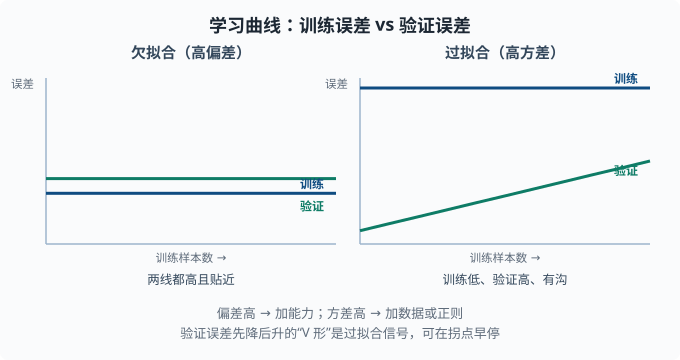
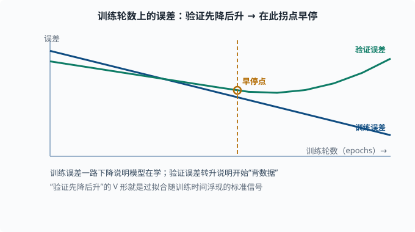
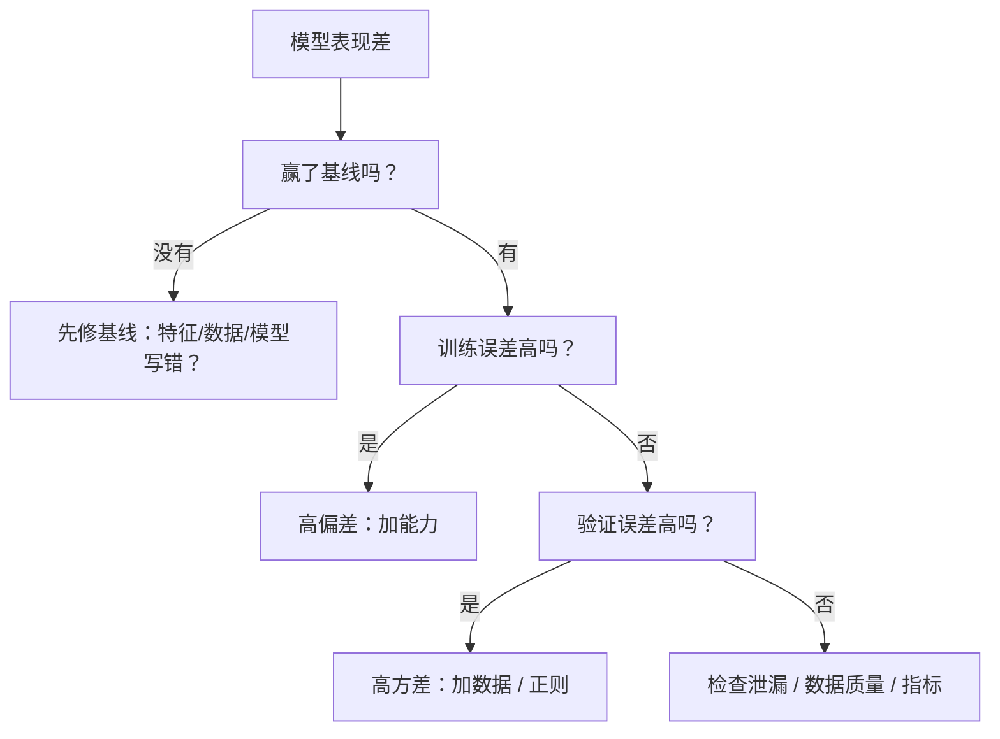

# 学习曲线与诊断：找到模型卡在哪

> 目标：把"模型不好"变成一个可定位、可对症的问题。读完这一页，你能用学习曲线判断是欠拟合还是过拟合、识别高偏差或高方差的信号，并按部就班地决定"该加数据、加特征、加复杂度还是加正则"。

## 为什么需要诊断

模型表现不好时，最常见的第一反应是"换更强的模型"或"狂加数据"——但很多时候是在错误的方向使劲。**系统性诊断**让你先判断"问题出在偏差还是方差"，再对症下药，省时省力。

一个关键心态：

> 别问"它为什么不好"，要问"它是在欠拟合还是在过拟合"。这两个判断指向完全不同的对策。

## 复习：误差拆成偏差和方差

[03-04](03-04-bias-variance.md) 讲过：

```text
总误差 = 偏差² + 方差 + 噪声
```

- 偏差太高 → 模型学不动训练数据（欠拟合）。
- 方差太高 → 模型背训练数据、新数据不行（过拟合）。

诊断的目标就是判断**当前主要矛盾是偏差还是方差**。

## 学习曲线：一对信号

**学习曲线**画的是"训练集大小（横轴）"对"训练误差和验证误差（纵轴）"。这是诊断的利器。

### 欠拟合（高偏差）的特征

```text
训练误差 和 验证误差 都很高，二者曲线接近，几乎贴在一起
即使数据更多，误差也不明显下降
```

含义：模型太简单，"连训练都学不好"。此时**加更多数据通常没用**——问题是表达力不足，不是数据不够。

对策：加复杂度（更多特征/更大模型）、减少正则（λ 调小）、必要时换更强的模型。

### 过拟合（高方差）的特征

```text
训练误差 很低，验证误差 明显更高，两线之间有一条大"沟"
当训练数据增多时，这条沟会缩小
```

含义：模型"背下了训练数据"，没有泛化。此时**加数据通常很有用**，因为更多样本让模型难以死记。

对策：加正则、减小模型容量、加数据、或用早停。

### 关键读法口诀

```text
两线都高且贴得近  → 偏差问题，加能力
训练很低、验证高、两线分得开 → 方差问题，加数据/正则
```



左图两条曲线都偏高、彼此贴近，是"模型学不动"的高偏差信号；右图训练误差压得很低、验证误差却明显更高、中间留出一道沟，是"背下训练数据"的高方差信号。

## 误差在"训练轮数"上的变化

除了数据的量，还可以看**训练进行中的误差曲线**：

- 训练误差持续下降 → 模型在学。
- 验证误差先降后升 → 开始过拟合（这是"早期停止"的依据），应在验证误差拐点停。

这张"验证先降后升"的 V 形，就是过拟合随训练时间浮现的标准信号。



图上蓝线（训练误差）一路下降说明模型在学；绿线（验证误差）一开始也跟着降，到某个点（早停点）后反而掉头向上。那个掉头点就是"开始背数据"的时刻——早停就在这个拐点打住，保住泛化最好的一版模型。

## 一个更细的排查清单

当模型表现差，按这个顺序排查：

1. **先看基线**：模型有没有打败最简单的基线？（[03-01](03-01-supervised-overview.md)）
2. **看训练误差**：训练都学不好 → 欠拟合/偏差问题，去加能力。
3. **看验证差距**：训练好但验证差 → 过拟合/方差问题，去加正则/数据。
4. **检查泄漏**：是不是验证/测试信息漏进了训练（[03-08](03-08-feature-engineering.md)）？这是隐藏而致命的。
5. **检查数据质量**：标签错了吗？重复样本？该清洗了（[03-08](03-08-feature-engineering.md)）。
6. **检查评估是否合理**：是不是指标选错了（[03-05](03-05-evaluation-metrics.md)）？类别不平衡？阈值不对？



诊断的价值在于**按证据分支**：每一步都用一个信号把候选方向砍掉一半。

## 动手：画出学习曲线

```python
import numpy as np
from sklearn.model_selection import learning_curve, train_test_split
from sklearn.ensemble import RandomForestRegressor
from sklearn.metrics import mean_squared_error

# 生成非线性数据
rng = np.random.default_rng(0)
x = rng.uniform(-4, 4, size=400)
X = x.reshape(-1, 1)
y = np.sin(x) + rng.normal(0, 0.3, size=400)

# 用很简单的模型 → 大概率欠拟合（偏差）
model = RandomForestRegressor(n_estimators=50, max_depth=2, random_state=0)

train_sizes, train_scores, val_scores = learning_curve(
    model, X, y, train_sizes=np.linspace(0.1, 1.0, 8),
    cv=3, scoring="neg_mean_squared_error")

train_mse = -train_scores.mean(axis=1)
val_mse = -val_scores.mean(axis=1)

for size, te, ve in zip(train_sizes, train_mse, val_mse):
    print(f"样本数 {size:4d}: 训练MSE {te:.3f} 验证MSE {ve:.3f}")
```

你会看到"很深/很浅的树"产生不同的两线形态：浅树两线都高（偏差），深树训练很低验证高（方差）。把两行结果对比，就能直观读出偏差与方差。

## 决策速查表

| 症状 | 判断 | 对症 |
|---|---|---|
| 训练高、验证高、两线贴近 | 高偏差 | 加能力/去正则/换强模型 |
| 训练低、验证高、沟大 | 高方差 | 加数据/加正则/减容量 |
| 两个都还行但仍不满意 | 已到模型与数据上限 | 换思路、加有用特征、换数据 |
| 验证泄漏 | 微妙的错判 | 修管道，重新评估 |

## 思考题

1. 欠拟合的学习曲线长什么样？为什么此时加数据通常没用？
2. 过拟合的学习曲线长什么样？加数据为什么有用？
3. 训练误差低、验证误差也低但仍不满足业务要求，问题可能在哪？
4. 为什么第一步要先跟基线比？

## 参考答案

1. 训练误差和验证误差都高且彼此贴近，几乎不随数据增多而下降。此时模型连训练都学不好，说明是表达能力不足（偏差问题），加数据无法弥补，应加复杂度或去正则。
2. 训练误差很低而验证误差明显更高，两线之间有明显"沟"，且随数据增多沟变窄。此时模型在背训练数据，更多样本让它难以死记、被迫学到可泛化规律，所以加数据有效。
3. 可能：模型和数据的表达已达上限，此时需要注入新信息——更有用的特征、更好的数据、或换一个更贴合的模型与损失；也可能是业务指标与当前评估指标不完全一致，需要重新审视评估是否量对了真实代价。
4. 因为基线是"空手也能做到"的下限。不与基线比，你无法知道"看似不低的指标"其实只是运气或类别不平衡造成的虚高（如 [03-05](03-05-evaluation-metrics.md) 里"永远判多数类"）。基线让你判断模型是否真的带来增益。

## 下一步

- 想在深度学习里用同一套诊断 → [04 深度学习](../04-deep-learning/README.md) 的训练曲线、早停、正则。
- 想补正则化的数学 → [03-04 偏差-方差与正则化](03-04-bias-variance.md)。
- 想系统评估 LLM/agent → [07 LLM 工程](../07-llm-engineering/README.md)。

[返回本章目录](README.md)
