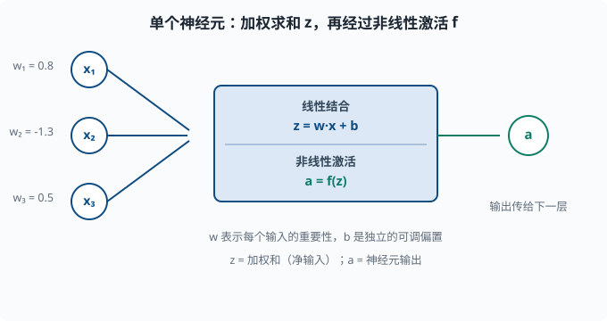
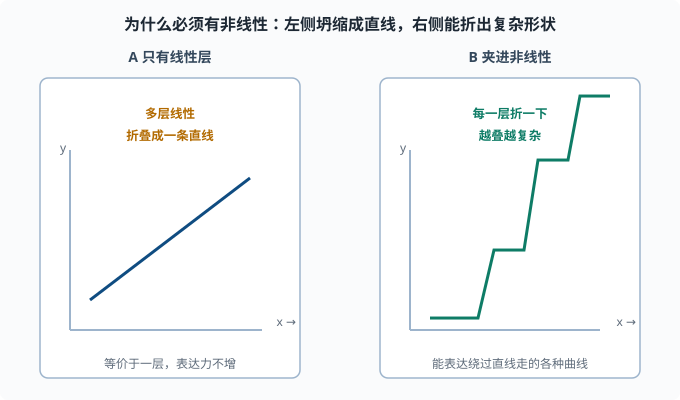

# 神经网络直觉：从神经元到一整个可学习的函数

> 目标：搞懂"把很多小函数串起来"为什么能表达几乎任何映射。读完这一页，你能徒手描述一次完整的前向传播：输入如何加权、加偏置、过激活函数，一层层流到输出。

## 为什么先建立直觉

你已经会线性回归（[03-02](../03-machine-learning/03-02-linear-regression.md)）和逻辑回归（[03-03](../03-machine-learning/03-03-logistic-regression.md)）。线性回归只能拟合直线，逻辑回归加了一个 sigmoid 也只是一条 S 形曲线。现实生活中几乎没有这么平坦的数据：图片、语音、文本、用户行为，全都是弯弯绕绕的高维表面。

神经网络的第一个想法是朴素到近乎天真的：

> 我能不能把大量简单的"小函数"按某种方式叠加起来，让它们共同拟合任意复杂的曲线？

答案是可以。而且你不需要每个小函数多聪明——把它们堆叠、连接、叠加出合适的数量，复杂的函数就自然涌现。这一页就把这个"叠加"的过程讲清楚。

## 从一个"神经元"说起

受生物神经元启发（但只是名字和粗糙结构上的启发，不必当真），深度学习里最基本的计算单元叫**神经元（neuron）**或**单元（unit）**。它做的数学非常简单，只有两步：先做一次线性组合（乘权重求和、加偏置），再过一个非线性函数。"线性组合"就是 [01-01](../01-math-foundations/01-01-linear-algebra.md) 里学的"每项乘系数再相加"，没有任何弯。

```text
第一步（线性组合）：z = w1*x1 + w2*x2 + ... + wn*xn + b
第二步（非线性激活）：a = f(z)
```

其中：

- `x1, x2, ..., xn` 是输入（上一层的输出，或最原始的输入特征）。
- `w1, w2, ..., wn` 是**权重（weights）**，每个输入配一个，表示这个输入有多重要。
- `b` 是**偏置（bias）**，一个独立的可调常数，让神经元有"不靠输入也能起反应"的自由度。
- `z` 是加权和（也叫净输入）。
- `f` 是**激活函数（activation function）**，一个非线性函数。
- `a` 是这个神经元的**输出**，会继续传给下一层。



这张图把这个单元画成两个连续的步骤：左侧若干输入各自乘一个权重再求和（加偏置后得到 `z`），右侧再过一个非线性函数得到 `a`。权重决定每个输入的重要性，偏置给神经元"不靠输入也能起反应"的自由度。

### 一个神经元和人眼熟的东西一样

你其实早就见过这个结构。顺便认识一个词：**logits** 指网络最后一层线性变换的原始输出（还没过 sigmoid/softmax 的裸数值），后面章节会常用：

- 去掉激活函数，`z = w·x + b` 就是 [03-02](../03-machine-learning/03-02-linear-regression.md) 的线性模型。
- 把激活函数换成 sigmoid，`a = σ(z)` 就是 [03-03](../03-machine-learning/03-03-logistic-regression.md) 的逻辑回归。

所以**单个神经元 = 线性回归 + 一个非线性激活**。神经网络真正的新东西，是把很多这样的神经元层层叠起来。

## 层：把神经元排成队

单个神经元只输出一个数。但真实任务里我们往往需要一组"中间表示"，而不是一个数。于是我们把很多神经元平行地摆成一排，它们共享同样的输入，各自输出一个数。

这一排神经元叫一个**层（layer）**。假如这一层有 `m` 个神经元，输入有 `n` 个维度，那么：

- 这一层有 `n × m` 个权重（每个输入到每个神经元都有一条）。
- 有 `m` 个偏置（每个神经元一个）。
- 输出是一个 `m` 维向量。

把所有权重排成一个矩阵 `W`（形状 `m × n`），加一个偏置向量 `b`（长度 `m`），这一层的完整计算就是：

```text
z = W·x + b
a = f(z)
```

`W·x + b` 是矩阵乘法加向量加法，`f` 逐元素作用在 `z` 的每个分量上。这就是深度学习中反复出现的一行公式：**一个线性变换，跟着一个非线性激活**。

### 为什么叫"深度"

把多个这样的层一个接一个串联起来就是**深度网络（deep network）**：

```text
输入 x → 层1 → 层2 → ... → 层L → 输出 y_hat
```

每一层的输出成为下一层的输入。从输入流到输出的整个计算过程叫**前向传播（forward pass 或 forward propagation）**。

"深度"指的是层数多。现代大语言模型动辄几十上百层，输出维度几千上万，参数量以百亿计。但不管多大，它们最底层的基本单元都是上面这个"线性 + 非线性"的堆叠。

## 为什么必须有"非线性"这步（关键！）

这里有一个很容易被忽略、却决定一切的问题：

> 如果去掉激活函数，把多层纯线性变换叠起来，会发生什么？

答案是：**一点用都没有。** 因为矩阵乘法满足结合律，任意多个线性层的复合 `W_L·(...·(W_1·x)...)` 仍然可以写成一个**单一**的线性变换 `W·x`。也就是说，没有非线性的"深度网络"在数学上和一层线性模型是等价的——加多少层都白搭，它还是只能画直线。

非线性激活函数打破了这种坍缩。一旦每层之间夹着 `f(z)=ReLU(z)` 或类似函数，复合函数就不再是线性的，层的堆叠才能表达超出线性模型的形状。

一个直观的理解：

```text
线性层：只能把空间做旋转、缩放、平移（直线映射到直线）
非线性激活：把空间"折"一下（直线变成折线/曲线）
一层层折下去，最后能折出非常复杂的形状
```



左图展示"全线性"最坏的情况：无论叠多少层，矩阵乘可以合并成一个，最终还是只能画一条直线，深度白叠。右图展示夹进非线性后的效果：每一层把空间折一次，线段变成折线，折得越多，能表达的形状就越复杂——这正是"深度"的意义来源。

这就是为什么神经网络"表达能力"来自非线性激活。也是为什么[04-03 激活函数](04-03-activations.md)如此重要。

## 反向连接你的旧知识

把"四件套"搬过来，神经网络并没有逃出你熟悉的心智模型，只是模型部分变得更复杂：

| 四件套 | 神经网络里的对应 |
|---|---|
| 模型 | 一个很深的、带非线性的复合函数 `y_hat = f_L(...f_1(x)...)` |
| 损失 | 输出和答案的差距（MSE / 交叉熵，见 [04-04](04-04-loss-functions.md)） |
| 优化 | 梯度下降，更新所有层里的权重和偏置（见 [04-02](04-02-backpropagation.md) 与 [04-05](04-05-optimizers.md)） |
| 评估 | 在没见过的测试数据上量效果（沿用 [03-05](../03-machine-learning/03-05-evaluation-metrics.md)） |

所以在直觉层面，你可以把深度学习理解为：**把"模型"从一条直线升级成一台能弯曲的高维机器，其余三件套照旧。**

## 手算：一个 2 层小网络的前向传播

用一个具体的数字例子把你真正"算懂"。假设网络只有两层，中间那层叫**隐藏层（hidden layer）**——"隐藏"只是说它既不是输入也不是输出，处在网络内部：

```text
输入 x = [1, 2]（2 维）
隐藏层：2 个神经元，激活函数用 ReLU
输出层：1 个神经元，激活函数恒等（回归场景，直接输出数）
```

权重和偏置随意给一组（真实网络里这些是被训练学出来的，这里先手工固定）：

```text
隐藏层权重 W1 = [[0.5, -1.0], [0.3, 0.7]]   # 2x2
隐藏层偏置 b1 = [0.1, -0.2]
输出层权重 W2 = [1.5, -0.5]                    # 2 个（输入到输出的权重）
输出层偏置 b2 = 0.2
```

第 1 步，算隐藏层的两个净输入：

```text
z1_1 = 0.5*1 + (-1.0)*2 + 0.1 = 0.5 - 2.0 + 0.1 = -1.4
z1_2 = 0.3*1 + 0.7*2 + (-0.2) = 0.3 + 1.4 - 0.2 = 1.5
```

第 2 步，过 ReLU 激活（`ReLU(z) = max(0, z)`）：

```text
a1_1 = max(0, -1.4) = 0
a1_2 = max(0, 1.5)  = 1.5
```

隐藏层输出向量 `a1 = [0, 1.5]`。第 3 步，算输出层的净输入（此时是最后一层，恒等激活，直接输出）：

```text
z2 = 1.5*0 + (-0.5)*1.5 + 0.2 = 0 - 0.75 + 0.2 = -0.55
```

所以对于输入 `[1, 2]`，这个 2 层小网络的输出是 `-0.55`。整个流程就是：**加权 → 加偏置 → 激活 → 再加权 → 再激活 → 输出。** 每多一层，就多一轮"线性 + 非线性"。

用代码验证一遍，确保数字对得上：

```python
import torch

x = torch.tensor([1.0, 2.0])
W1 = torch.tensor([[0.5, -1.0], [0.3, 0.7]], requires_grad=True)
b1 = torch.tensor([0.1, -0.2])
W2 = torch.tensor([1.5, -0.5])
b2 = 0.2

z1 = W1 @ x + b1
a1 = torch.relu(z1)
out = W2 @ a1 + b2
print("净输入 z1:", z1.tolist())
print("激活后 a1:", a1.tolist())
print("输出:", out.item())
```

如果这段代码让你第一次见到 PyTorch，别慌——它只是把上面公式用张量和 `@`（矩阵乘法）写了一遍，`requires_grad=True` 是为了后面自动求导留的钩子（[04-02](04-02-backpropagation.md) 细讲）。

## 为什么"深"比"一个特大层"更好：特征的层级复用

你可能想问：既然多个线性层坍缩成一层，那多个**非线性**层能不能合并成一个超大的单隐层？理论上，只要隐层足够宽，单隐层网络在很宽松的条件下也能逼近很多函数（这就是"万能逼近定理"的大意）。那为什么现实里大家都用"深而窄"的网络，而不是"浅而宽"的？

答案在**效率与可组合的层次结构**：深层网络每一层都在学习不同抽象层次的表示（"表示"= 网络内部对输入的一套数值刻画，[03-07](../03-machine-learning/03-07-unsupervised.md) 的降维输出就是一种）——

```text
第 1 层：边缘、纹理、字母笔画这类低级特征
第 2 层：把这些组合成形状、音节、局部模式
更高层：组合成物体、单词、语义概念
```

深层的优势不是"原则上更强"，而是**同样的参数量下，往往能学得更好、拟合得更高效**。就像人类理解句子，不是把一个词直接映射到整句含义，而是字→词→短语→句义逐层组合。层级结构是自然界普遍存在的组织方式，深层网络天然贴合这种结构。

## 三种视角：把网络看成什么

不同场景可以换着视角看同一个网络，帮你更灵活：

1. **函数视角**：网络是一个从输入到输出的复合函数，参数就是它的"形状旋钮"。这是最直白的定义，也是优化（调整旋钮）的视角。
2. **特征提取视角**：网络前几层是在自动"做特征工程"（[03-08](../03-machine-learning/03-08-feature-engineering.md)）。传统 ML 要人手设计特征，深度学习让网络在训练中自己学出特征。这是"深度学习能端到端学习"的灵魂。
3. **概率视角**：配合 softmax（[03-03](../03-machine-learning/03-03-logistic-regression.md)），网络输出可以被解读为"给定输入，属于每个类别的概率"，加总为 1。这让你能讲"模型有多确信"。

## 一个必须现在建立的直觉：参数多 ≠ 一定好

一个普通网络可能就有几十万、几百万个参数。深层网络动辄上亿。参数这么多，"过拟合"（[03-04](../03-machine-learning/03-04-bias-variance.md)）风险天然很大。深度网络能学出复杂形状，也意味着它**很容易把训练数据背下来**。

所以从这一页开始，请把下面这组问题作为"每次看到一个大网络"时的默认检查清单：

```text
它的训练集数据足够多吗？     （数据太少，参数越多越容易背）
有没有验证/测试集在盯它？   （没有评估就是盲训）
有没有正则化手段？          （dropout/权重衰减，见 04-06）
最优停止点在哪里？          （训练多久该停？）
```

这解释了为什么深度学习章节里大量篇幅在讲[训练技巧](04-06-training-tricks.md)、[优化器](04-05-optimizers.md)、[评估](04-06-training-tricks.md)——模型变大之后，"如何让它不炸、不背答案"比"如何表达复杂函数"更难也更关键。

## 思考题

1. 单个神经元的两步计算分别是什么？它和线性回归、逻辑回归是什么关系？
2. 为什么去掉非线性激活、只叠加线性层会"坍缩"成一层？用矩阵运算的角度解释。
3. 一次前向传播，数据在一层内部经历了什么样的计算顺序？
4. "深而窄"的网络相比"浅而宽"的网络，被广泛认为好在哪里（从特征层级复用角度）？
5. 给定下面的小网络输入 `x = [0, 1]`：

```text
W1 = [[1, -1], [0.5, 2]]，b1 = [0, 0]
激活：ReLU
W2 = [2, -1]，b2 = 0
输出层恒等激活
```

前向传播算到最终输出（手算，给出每步值）。

## 参考答案

1. 第一步线性组合 `z = W·x + b`，第二步非线性激活 `a = f(z)`。去掉激活就是一个线性模型（同线性回归）；把激活换成 sigmoid 并做分类，就是逻辑回归。所以神经元是"线性模型 + 非线性激活"。
2. 矩阵乘法满足结合律，任意个线性层复合 `W_L·...·W_1·x` 仍可合并成一个单一矩阵 `W·x`，等价于一层线性模型，只能表达直线类映射，深度堆叠不增加表达能力。非线性激活破坏这种可合并性。
3. 先做线性变换（矩阵乘权重 + 加偏置），再逐元素过激活函数，把结果作为下一层的输入，如此逐层直到输出。
4. 深层网络让每一层学习不同抽象层级的特征（低级→中级→语义），同一套特征可以被下游复用，参数效率通常更高；这是物种和语言都普遍存在的层级组织方式。
5. 隐藏层净输入：`z1_1 = 1*0 + (-1)*1 = -1`，`z1_2 = 0.5*0 + 2*1 = 2`。激活后：`a1_1 = max(0,-1)=0`，`a1_2 = max(0,2)=2`。输出层：`out = 2*0 + (-1)*2 + 0 = -2`。最终输出 `-2`。

## 下一步

- 想知道"权重到底怎么从随机值变成好用值" → [04-02 前向与反向传播](04-02-backpropagation.md)。
- 想看不同激活函数的取舍 → [04-03 激活函数](04-03-activations.md)。
- 想用代码把"模型/损失/优化/评估"串成一个可运行的小网络 → [04-05 优化器](04-05-optimizers.md) 末尾有完整训练循环。

[返回本章目录](README.md)
