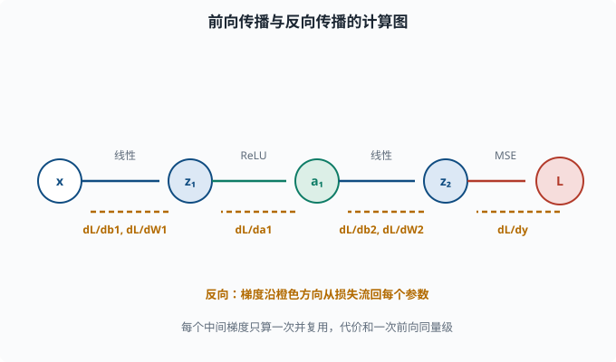

# 前向与反向传播：每个参数到底怎么被更新

> 目标：把"梯度下降更新权重"这句话落到每一个参数上。读完这一页，你能从一条链式法则出发，手推一个 2 层网络的梯度，并理解为什么"层很多时逐层反推"是唯一现实的算法。

## 为什么这一页是深度学习的"心脏"

前面说过，训练的本质是：反复让损失变小。而让损失变小的引擎是**梯度下降**（[01-07](../01-math-foundations/01-07-optimization.md)）：

```text
新参数 = 旧参数 - 学习率 × 损失对参数的偏导
```

问题来了：神经网络有几十万到几千亿个参数，损失要经过几十上百层复合函数才能到达这些参数。**怎么高效地算出"损失相对于每一个参数"的导数？**

对于一个 2 参数的小函数，你可以手算。但几千亿个参数、几百层嵌套——逐个暴力展开根本不可行。**反向传播（backpropagation）**就是回答这个问题的高效算法。它只有一句话的精髓：

> 从输出往前，利用链式法则，把"损失对当前层输出的梯度"一层层回传，沿途算出对每个权重和偏置的偏导。

它不改变"梯度是什么"，只改变"算梯度的顺序"，让整体复杂度从"逐参数重复展开长链"降到"和一次前向传播同量级"。

## 先复习：多元链式法则

反向传播的数学基础只有一条——**链式法则（chain rule）**。

一元版本你已经知道：

```text
若 y = f(g(x))，则 dy/dx = f'(g(x)) * g'(x)
```

多元版本稍微扩展。若 `z` 依赖 `y`，而 `y` 依赖 `x`，那么中间变量 `y` 把梯度"接力"传给 `x`：

```text
dz/dx = (dz/dy) * (dy/dx)
```

关键的观察是：在一条很长的链 `x → a → b → ... → L` 里，

```text
dL/dx = (dL/...)*(.../db)*(db/da)*(da/dx)
```

每一项都是一个"局部分数"。**链式法则让你只需要算相邻两层的局部导数，再相乘传递。** 这就是反向传播"每一层只需和邻居打交道"的原因。

## 一个具体的计算图

为了让链条可见，我们把一个网络画成**计算图（computational graph）**：把计算拆成一串小步骤，每个圆圈是一个运算或变量，箭头表示"谁依赖谁"，损失在最末端。

```text
x →(W1,b1)→ z1 →(ReLU)→ a1 →(W2,b2)→ z2 →(恒等)→ y_hat →(损失)→ L
```

正向看，这是**前向传播（forward pass）**：从 `x` 一路算到 `L`。

反转方向看梯度，就是**反向传播（backward pass）**：先算 `dL/dy_hat`，再算 `dL/dz2`、`dL/dW2`、`dL/db2`，再往回流到 `dL/dz1`、`dL/dW1`、`dL/db1`。



注意这张图里两条相反的方向：蓝色路径是前向计算（从 `x` 到损失 `L`），橙色虚线是反向传播（从损失 `L` 逐层回传到各参数）。反向只利用相邻两层之间的"局部导数"相乘接力，因此每个中间梯度只需算一次，整体代价和一次前向同量级——这就是反向传播高效的原因。

## 一个能手算的完整例子

我们用一个最小网络把所有数字都算一遍。结构：

```text
输入 x = 2（单个数字，方便手算）
隐藏层：1 个神经元，权重 w1，偏置 b1，激活 ReLU
输出层：1 个神经元，权重 w2，偏置 b2，恒等激活
损失：均方误差 L = 0.5*(y_hat - y)^2
真实标签 y = 1
```

初始化参数为：`w1 = 0.5`，`b1 = 0`，`w2 = -1.0`，`b2 = 0`。

### 前向传播

```text
z1 = w1*x + b1 = 0.5*2 + 0 = 1.0
a1 = ReLU(z1) = max(0, 1.0) = 1.0
z2 = w2*a1 + b2 = (-1.0)*1.0 + 0 = -1.0
y_hat = z2 = -1.0
L = 0.5*(y_hat - y)^2 = 0.5*(-1.0 - 1.0)^2 = 0.5*4 = 2.0
```

目前预测 `-1`，离真实值 `1` 很远，损失 `2.0`。接下来反推梯度。

### 反向传播：从末端往回走

**第 1 步：`dL/dy_hat`**

损失 `L = 0.5*(y_hat-y)^2`，对 `y_hat` 求导：

```text
dL/dy_hat = (y_hat - y) = -1.0 - 1.0 = -2.0
```

（`0.5` 倍的系数和平方求导的 2 抵消了，很常见的教科书选择。）

**第 2 步：回传到输出层权重和偏置**

`y_hat = z2 = w2*a1 + b2`，因此：

```text
dy_hat/dw2 = a1 = 1.0
dy_hat/db2 = 1
dy_hat/da1 = w2 = -1.0
```

用链式法则乘上 `dL/dy_hat = -2.0`：

```text
dL/dw2 = dL/dy_hat * dy_hat/dw2 = (-2.0)*1.0 = -2.0
dL/db2 = (-2.0)*1 = -2.0
```

**第 3 步：把梯度回传到隐藏层的输出 `a1`**

```text
dL/da1 = dL/dy_hat * dy_hat/da1 = (-2.0)*(-1.0) = 2.0
```

这一步就是"反向传播"的名字由来：`2.0` 作为"上游梯度"传给了隐藏层。

**第 4 步：经过 ReLU 回传到 `z1`**

`a1 = ReLU(z1)`。ReLU 在 `z1 > 0` 处的导数是 `1`，在 `z1 < 0` 处是 `0`。这里 `z1 = 1.0 > 0`，所以：

```text
dL/dz1 = dL/da1 * ReLU'(z1) = 2.0 * 1 = 2.0
```

（如果 `z1 < 0`，ReLU 会把上游梯度直接"杀死"成 0——这是 ReLU 神经元可能"死掉"的一个来源，[04-03](04-03-activations.md) 会讲。）

**第 5 步：回传到隐藏层权重和偏置**

`z1 = w1*x + b1`，其中 `x = 2`：

```text
dz1/dw1 = x = 2
dz1/db1 = 1
dL/dw1 = dL/dz1 * dz1/dw1 = 2.0*2 = 4.0
dL/db1 = dL/dz1 * dz1/db1 = 2.0*1 = 2.0
```

### 四件事合在一起

一次反向传播得到了四个梯度：

```text
dL/dw1 = 4.0，  dL/db1 = 2.0
dL/dw2 = -2.0， dL/db2 = -2.0
```

假设学习率 `η = 0.1`，一次梯度下降更新：

```text
w1 ← w1 - η*dL/dw1 = 0.5 - 0.1*4.0 = 0.1
b1 ← b1 - η*dL/db1 = 0 - 0.1*2.0 = -0.2
w2 ← w2 - η*dL/dw2 = -1.0 - 0.1*(-2.0) = -0.8
b2 ← b2 - η*dL/db2 = 0 - 0.1*(-2.0) = 0.2
```

注意符号：`dL/dw1 > 0` 说明"增大 w1 会让损失变大"，所以往反方向（减小）走；`dL/dw2 < 0` 说明"增大 w2 会让损失变小"，所以往正方向走。**梯度下降总是朝梯度的反方向移动**，因为梯度指向"损失增长最快的方向"。

## 用代码验证：自动求导替你算一遍

用 PyTorch 的价值在于，你只需描述前向计算，它会自动追踪计算图并帮你算所有梯度（这就是"**自动求导**"：框架按反向传播规则自动完成求导，你一行导数都不用手写）。我们来复现上面的数字：

```python
import torch

x = torch.tensor(2.0)
y = torch.tensor(1.0)
w1 = torch.tensor(0.5, requires_grad=True)
b1 = torch.tensor(0.0, requires_grad=True)
w2 = torch.tensor(-1.0, requires_grad=True)
b2 = torch.tensor(0.0, requires_grad=True)

z1 = w1 * x + b1
a1 = torch.relu(z1)
z2 = w2 * a1 + b2
y_hat = z2
L = 0.5 * (y_hat - y) ** 2

L.backward()
print("dL/dw1 =", w1.grad.item())
print("dL/db1 =", b1.grad.item())
print("dL/dw2 =", w2.grad.item())
print("dL/db2 =", b2.grad.item())
print("损失 =", L.item())
```

运行输出应与手算一致：`4.0`、`2.0`、`-2.0`、`-2.0`。**这验证的不是 PyTorch 多聪明，而是你对链式法则的理解正确。** 自己先算，再用它验证，是学习梯度最快的方式。

## 为什么反着算？正向链式法则为什么不行

你可能会问：既然链式法则正向也能展开，为什么非要"反向"？

设想只看一个参数 `w1`（最靠近输入的权重）。正向用链式法则要一路从 `x` 传到 `L`，把中间所有项都乘进去。要算 N 个参数，你就要做 N 次这样的长链。当网络有几亿个参数时，这是灾难性的重复计算——而且很多中间梯度会被反复重算。

反向传播的做法是"公共子表达式复用"：

```text
从 L 出发，只算一遍 dL/dy_hat
用它一次算出所有最靠近输出的参数梯度
再把同一个上游梯度继续往下传，沿途算更浅层的参数梯度
```

每个中间梯度只算一次，总共和一次前向传播同量级。**这是反向传播成为深度学习标配的根本原因：不是它算的东西不一样，而是它算得高效。**

### 于是训练循环长这样

整个训练一个 batch 的完整循环：

```python
import torch

# 明确的参数（示意）
w1 = torch.tensor(0.5, requires_grad=True)
b1 = torch.tensor(0.0, requires_grad=True)
w2 = torch.tensor(-1.0, requires_grad=True)
b2 = torch.tensor(0.0, requires_grad=True)
eta = 0.1

for step in range(3):
    z1 = w1 * 2.0 + b1
    a1 = torch.relu(z1)
    y_hat = w2 * a1 + b2
    L = 0.5 * (y_hat - 1.0) ** 2

    # 真正训练时每步前要清零梯度
    if w1.grad is not None:
        w1.grad.zero_(); b1.grad.zero_()
        w2.grad.zero_(); b2.grad.zero_()

    L.backward()          # 算所有梯度
    with torch.no_grad(): # 更新参数时不追踪梯度
        w1 -= eta * w1.grad
        b1 -= eta * b1.grad
        w2 -= eta * w2.grad
        b2 -= eta * b2.grad

    print(f"step {step}: 损失={L.item():.4f} 预测={y_hat.item():.4f}")
```

每步四件事：**前向算损失 → 清零旧梯度 → 反向算梯度 → 沿反方向更新参数。** 这就是 [04-05](04-05-optimizers.md) 里优化器出现之前，最朴素的训练骨架。

## 反向传播中藏着的几个"内功心法"

反向传播比一句"链式法则"藏得更深。这几条会决定你之后调试模型时能不能看懂报错：

1. **梯度是对"损失"的**：`requires_grad=True` 的参数，`grad` 里存的永远是 `d(损失)/d参数`，不是别的。
2. **清零很重要**：PyTorch 默认累加梯度（`grad +=`），不清零就会把不同 batch 的梯度混在一起。所以每个 batch 前都要 `optimizer.zero_grad()`（自动化的做法见 [04-05](04-05-optimizers.md)）。
3. **ReLU 会把反向梯度砍成 0**：当净输入为负，ReLU 导数为 0，上游梯度传到这就断掉，结果这个神经元"死了"（再也不更新）。这就是著名的"dead ReLU"问题，[04-03](04-03-activations.md) 专门讲。
4. **数字爆炸/消失**：梯度在深层反向传播时会逐层相乘。如果每层乘的数都大于 1，梯度会指数爆炸；都小于 1，会指数消失。这叫**梯度爆炸/梯度消失**，是训练深层网络的第一大敌人，[04-06](04-06-training-tricks.md) 会讲对抗手段。

## 思考题

1. 反向传播要解决的核心问题是什么？它和朴素"对每个参数展开链式法则"差在哪？
2. 用你自己的话复述反向传播的信息流动方向：梯度和输入是"同向流"还是"反向流"？
3. 在上面的手算例子里，为什么要往 `w2` 的**正方向**（增大）更新，往 `w1` 的**反方向**（减小）更新？
4. 如果手算例子中改把隐藏层激活换成"在 `z1` 处的导数恒为 0.5"的函数，`dL/dw1` 会变成多少？（`dL/dz1` 用新的导数重算再乘 `dz1/dw1`）
5. 在训练循环里，为什么每次 `backward()` 之前要把梯度清零？不清零会发生什么？

## 参考答案

1. 解决"高效计算损失对每个参数的偏导"。朴素做法对每个参数都展开一整条链式法则，中间梯度反复重算，成本是参数数量的若干倍；反向传播从输出开始把公共梯度算一次并逐层复用，整体和一次前向同量级。
2. 反向流。输入从前向传到输出，梯度从输出（损失）反向传回各层参数。这就是"backprop"名字的来源。
3. 因为梯度指向"损失增长最快的方向"，要让损失变小就要沿梯度的反方向走。`dL/dw2 = -2 < 0`，说明增大 w2 会减小损失，所以正方向更新；`dL/dw1 = 4 > 0`，说明增大 w1 会增加损失，所以反方向更新。
4. 若隐藏层激活导数恒为 `0.5`，则 `dL/dz1 = dL/da1 * 0.5 = 2.0*0.5 = 1.0`，于是 `dL/dw1 = 1.0 * x = 1.0*2 = 2.0`（原来 ReLU 时是 4.0）。这体现"激活函数的导数会缩放回传梯度的量级"。
5. 因为框架默认把梯度累加到 `.grad`（相当于 `grad += 新梯度`）。不清零，第二个 batch 的梯度会叠加在第一个 batch 之上，得到错误的总梯度，训练方向被污染。每个 batch 前清零保证梯度只代表当前 batch。

## 下一步

- 想让网络能"折空间"、又避免 ReLU 死亡 → [04-03 激活函数](04-03-activations.md)。
- 想看梯度下降在现代框架里的规范化版本（动量、Adam）→ [04-05 优化器](04-05-optimizers.md)。
- 想搞懂"梯度爆炸/消失"的具体危害和对抗手段 → [04-06 训练技巧](04-06-training-tricks.md)。

[返回本章目录](README.md)
