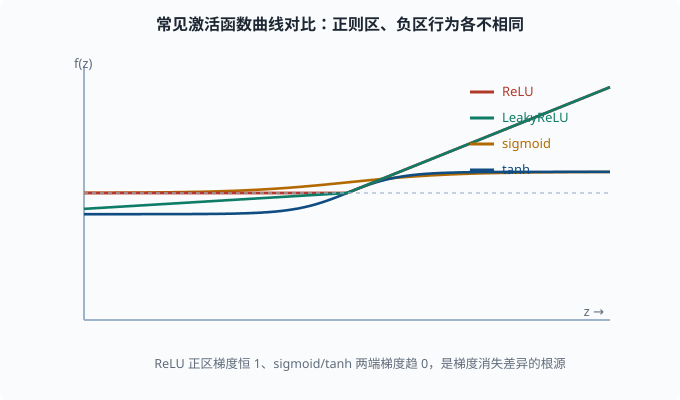

# 激活函数：非线性从哪来，又会带来什么坑

> 目标：把每个常见激活函数用"表达式 + 形状直觉 + 导数行为 + 适用场景"四个维度看透。读完这一页，你能说清为什么深度网络几乎统一用 ReLU 及其变体，也知道 sigmoid/tanh 的历史角色和踩过的坑。

## 为什么单独一章讲激活函数

[04-01](04-01-neural-net-intuition.md) 已经说清楚：没有非线性激活，层层线性会坍缩成一层，深度网络就失去意义。所以激活函数不是装饰，它是"深度"的前提。

但激活函数的选择还会带来许多**副作用**，尤其是它如何对待反向传播的梯度：

```text
激活函数会缩放（甚至叫停）回传的梯度。
→ 选得不好，训练会爆炸或消失。
```

这一页把主力激活函数的"修形能力"和"梯度行为"都讲清楚。

## 前提：激活函数的两种诉求

任何激活函数 `f(z)` 都要同时服务两个阶段：

1. **前向**：给线性结果 `z` 加上非线性，突出有用信号、压制无关信号。多数激活函数还有**有界性**或**归一性质**的属性。
2. **反向**：提供导数 `f'(z)`，回传梯度。导数的**量级**和**是否恒不为零**直接决定梯度能否顺利流到浅层。

最理想的是"前向非线性够、反向梯度不消失不爆炸"。可惜没有免费的午餐，每个函数各有利弊。

## Sigmoid：从 S 形到"梯度杀手"

**表达式**：

```text
σ(z) = 1 / (1 + e^(-z))
```

**形状直觉**：把任意实数压到 `(0, 1)` 区间，形成平滑的 S 形。`z` 很大时逼近 1，`z` 很小时逼近 0，`z=0` 时是 0.5。

**导数**（这是关键）：

```text
σ'(z) = σ(z) * (1 - σ(z))
```

这个导数有个致命问题：**最大值只有 0.25，而且两端趋近 0。**

```text
σ(0) = 0.5 → σ'(0) = 0.5*0.5 = 0.25
σ(5) ≈ 1   → σ'(5) ≈ 1*0 ≈ 0
```

后果：深层网络里 sigmoid 的梯度每过一层就要乘一个 `≤ 0.25` 的数。叠几层之后，梯度指数级缩小，浅层参数几乎学不动。这就是**梯度消失（vanishing gradient）**。

再加上 sigmoid 输出**不以 0 为中心**（永远在 0 到 1 之间），会让后一层的输入都是正的，可能引入不必要的偏移。现在 sigmoid 只留在两个地方：**输出层做二分类概率**，以及作为**门控机制**（用 0-1 之间的值当"阀门开度"去缩放另一路信号，[04-08](04-08-rnn-lstm.md) 的 LSTM 门就是它）的零件，而不再作为隐藏层主力。

## Tanh：零中心版本的 sigmoid

**表达式**：

```text
tanh(z) = (e^z - e^(-z)) / (e^z + e^(-z)) = 2σ(2z) - 1
```

**形状直觉**：和 sigmoid 相似，但把输出压到 `(-1, 1)`，**以 0 为中心**。`z=0` 时输出 0。

**导数**：

```text
tanh'(z) = 1 - tanh(z)^2
```

在 `z=0` 处，`tanh'(0) = 1 - 0 = 1`，比 sigmoid 的 0.25 好得多。零中心也让后层输入不再全是正的。所以在 ReLU 普及之前，tanh 曾是隐藏层常用主力。

**局限**：两端导数仍趋近 0，深层仍有梯度消失倾向，且计算涉及指数。它如今更多出现在 RNN 门控（[04-08](04-08-rnn-lstm.md)）等特定场景。

## ReLU：现代深度学习的事实标准

**表达式**：

```text
ReLU(z) = max(0, z)
```

**形状直觉**：负的砍成 0，正的原样保留。极其简单："负数归零，正数放行"。

**导数**：

```text
ReLU'(z) = 1  （z > 0）
ReLU'(z) = 0  （z < 0）
（在 z = 0 处通常取 0 或 1，工程上无足轻重）
```

为什么它赢了：

- **导数恒为 1（当 z>0）**，不会像 sigmoid/tanh 那样主动给梯度乘一个小数，梯度消失问题大幅缓解。
- **计算极便宜**：只有一次比较，没有指数。
- **稀疏激活**：大量神经元输出为 0，既省计算，又像天然的"特征选择"。

### ReLU 的著名坑：Dead ReLU

代价是：只要 `z < 0`，导数就是 0，**回传的梯度在这个神经元被完全截断**。如果一个神经元的净输入长期为负，梯度永远到不了它的权重，它就"死"了——永远输出 0，再也不参与学习。

发生原因常与**学习率过大**或**初始化不当**有关（[04-06](04-06-training-tricks.md) 讲）。于是有一整族"带修复的 ReLU"。

## Leaky ReLU 与 PReLU：给"死区"留条缝

**Leaky ReLU**：负数不再砍成 0，而是放一个小斜率 `α`（通常 0.01）：

```text
LeakyReLU(z) = z       （z ≥ 0）
LeakyReLU(z) = α·z     （z < 0）
```

这样负数区也有微小的非零导数，神经元不会彻底"死"，梯度能缓慢流过。

**PReLU**：把 `α` 从固定常数改成**可学习参数**，网络自己学"负区该有多斜"。PReLU 表达力更强，但也更容易过拟合、稳定性稍差。

## ELU / SELU：把负区修成"软饱和"

**ELU（Exponential Linear Unit）**：

```text
ELU(z) = z                  （z ≥ 0）
ELU(z) = α·(e^z - 1)        （z < 0）
```

负区用指数"软饱和"，既保留梯度又不让负输出无限大。SELU 是其带缩放、能自动归一化的变体，曾用于自归一化网络。

这些变体的存在提醒你一件事：**ReLU 的"死亡"不是小概率事件，重要网络里要不就得用变体，要不就得配好初始化与学习率。**



放在同一条横轴上看四者的形状：ReLU 在正区是一条单位直线、负区直接归零，正区梯度恒为 1；LeakyReLU 只是把负区从归零改成一条很缓的斜线，留出非零梯度；sigmoid 把输出压进 `(0,1)`，tanh 压进 `(-1,1)`，二者在两端斜率都趋近 0。正是"正区梯度恒 1 vs 两端趋 0"的区别，造成了梯度消失程度的巨大差异。

## Softmax：不是"隐藏层激活"，是输出层概率器

严格讲 softmax 不是给隐藏层用的激活函数，而是把一整个向量压成**概率分布**的输出层工具：

```text
softmax(z)_i = e^(z_i) / Σ_j e^(z_j)
```

性质：

- 所有输出在 `(0, 1)` 之间，且**加起来等于 1**。
- 输入大的分量对应输出概率大。
- 指数让差距放大（"赢家更赢"），配合**温度**（除在指数上的一个缩放系数 T：T 大输出更平缓、T 小更尖锐）可调节尖锐程度。

softmax 在 [03-03](../03-machine-learning/03-03-logistic-regression.md) 已经见过，它的经典搭配是**交叉熵损失**（[04-04](04-04-loss-functions.md)），二者的复合导数极其干净。语言模型的"下一个词概率"正是对整个词表做 softmax。

## 对比表格：一眼看清取舍

| 激活函数 | 表达式速记 | 输出范围 | z=0 处导数 | 梯度行为 | 主要用途 |
|---|---|---|---|---|---|
| ReLU | max(0,z) | [0, ∞) | 0 或 1 | 正区恒 1，负区断流 | 隐藏层标准主力 |
| LeakyReLU | max(0.01z, z) | (-∞, ∞) | 1 | 负区仍有小梯度 | 防 Dead ReLU |
| ELU | z 或 α(e^z-1) | (-α, ∞) | 1 | 负区软饱和 | 追求更稳的变体 |
| tanh | 2σ(2z)-1 | (-1, 1) | 1 | 两端趋 0 | 早期隐藏层、RNN 门 |
| sigmoid | 1/(1+e^-z) | (0, 1) | 0.25 | 两端趋 0（强消失） | 二分类输出、门控 |
| softmax | e^z/Σ | (0,1) 且和=1 | - | - | 多分类输出层 |

## 用代码观察梯度消失

亲手验证 sigmoid 的"梯度越小越危险"。构造 `z=5` 和 `z=0` 两个点看导数量级：

```python
import torch

for z in [torch.tensor(0.0), torch.tensor(5.0), torch.tensor(-5.0)]:
    x = z.clone().requires_grad_(True)
    s = torch.sigmoid(x)
    s.backward()
    print(f"z={x.item():>5}: sigmoid={s.item():.4f}, 导数={x.grad.item():.4f}")
```

你会看到：`z=0` 处导数约 0.25，`z=±5` 处导数几乎为 0。把它乘上几十层，梯度就以指数级缩到 0——这就是深度网络不敢再在隐藏层用 sigmoid 的实证理由。

## 怎么选：一张足够用的决策流程

```text
隐藏层（默认）：ReLU；若担心 Dead ReLU，换 LeakyReLU
输出层-二分类：sigmoid
输出层-多分类：softmax
输出层-回归：无激活（恒等），或 ReLU 若要求非负
RNN / 门控：tanh / sigmoid
```

记住：这是**工程起点**，不是终点。架构探索常从这些默认值出发，再按验证集表现微调。

## 思考题

1. sigmoid 的最大导数是多少？这个数值如何导致深层网络的梯度消失？
2. Dead ReLU 是怎么发生的？LeakyReLU 和 PReLU 分别如何缓解？
3. tanh 相比 sigmoid 在隐藏层的两个优势是什么？
4. softmax 激活的"输出加起来等于 1"属性，为什么适合多分类？
5. 一个隐藏层用了 sigmoid 的网络在 6 层后，梯度量级大致会被缩放多少倍（粗略、假设每层都遇上最不利的 0.25）？这说明什么？

## 参考答案

1. sigmoid 导数为 `σ(z)(1-σ(z))`，最大值在 `z=0` 取 0.25。深层反向传播每过一层就乘一次 ≤0.25 的因子，层数一多梯度指数缩小到几乎为 0，浅层参数几乎不再更新。
2. ReLU 在 `z<0` 时导数为 0，回传梯度被截断，参数得不到更新，神经元固定输出 0 即"死"。LeakyReLU 把负区换成小斜率 `α`，保留非零梯度；PReLU 让 `α` 变成可学习参数，由网络自己决定负区坡度。
3. 一是输出以 0 为中心，避免后层输入全为正、引入偏移；二是 `z=0` 处导数为 1，比 sigmoid 的 0.25 大得多，梯度消失没那么剧烈。
4. 多分类需要"每个类别一个正概率，且所有类别概率加起来为 1"，softmax 天然满足，还能用指数放大类别间的差距，让输出可被解释为该输入属于各类的概率。
5. 每层最不利乘 0.25，6 层共乘 `0.25^6 ≈ 0.00024`，即约缩小到原梯度的四千分之一。这说明 sigmoid 几乎不可能支撑深层网络，梯度消失是结构性的，而非调整学习率能弥补。

## 下一步

- 想知道"模型输出有多错"该用哪个损失与激活匹配 → [04-04 损失函数](04-04-loss-functions.md)。
- 想解决梯度消失/爆炸在手算之外的工程手段（初始化、归一化）→ [04-06 训练技巧](04-06-training-tricks.md)。
- 想看 softmax+交叉熵的复合导数为什么"干净" → [04-04 损失函数](04-04-loss-functions.md) 的推导。

[返回本章目录](README.md)
