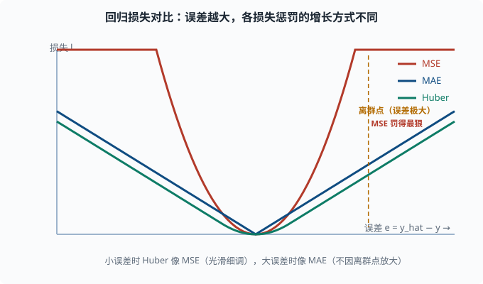

# 损失函数：把"模型有多错"变成一个能求导的数

> 目标：把回归、分类、多分类、稀疏目标的核心损失讲透，特别讲清"实际训练用什么、为什么"。读完这一页，你能为任务选对损失，并看懂 softmax+交叉熵复合导数为什么"干净"。

## 损失函数在深度学习里的角色

回顾四件套（[04-01](04-01-neural-net-intuition.md)）：损失是"预测离答案有多远"的尺子。深度学习的优化唯一目标就是"让损失变小"，所以损失函数决定了整个网络"什么才叫好"。

选损失有两个硬要求：

1. **可求导**：没有导数，反向传播（[04-02](04-02-backpropagation.md)）就做不了。绝大多数经典损失都是平滑的。
2. **好梯度**：就算可导，如果梯度在"远离答案"时很小，训练会龟速甚至卡死。

第二个要求非常反直觉，却很关键：**损失函数不仅要"数值上"惩罚错，还要在"梯度上"提供方向。** 我们马上会看到，这正是分类用交叉熵、而不用均方误差的根本原因。

## 回归：均方误差（MSE）与非对称的 MAE/Huber

### MSE：最经典

对单个样本：

```text
L = (y_hat - y)^2
```

对应批量时取平均。导数：

```text
dL/dy_hat = 2*(y_hat - y)
```

注意一个隐患：**误差越大，梯度线性放大。** 当一个 `y_hat` 和 `y` 差得极远（比如比真实值大 100 倍），梯度会非常大，可能触发梯度爆炸；同时一个极端离群样本会主导整个 batch 的更新。所以 MSE 对离群点（outlier）非常敏感。

### MAE：对离群点更稳

```text
L = |y_hat - y|
```

导数在零点之外是常数 `±1`，不会因离群点放大。但它有两个代价：零点不可导（工程上用次梯度处理）；梯度量级固定，最后阶段收敛慢、容易在最优附近震荡。

### Huber Loss：取两者之长

```text
L = 0.5*(y_hat - y)^2     （当 |y_hat-y| ≤ δ）
L = δ*(|y_hat-y| - 0.5*δ) （当 |y_hat-y| > δ）
```

小误差时像 MSE（光滑、细调），大误差时像 MAE（对离群点鲁棒）。`δ` 决定切换阈值。工程上回归的稳妥默认是 Huber。



横轴是预测与真实值的误差 `e`，纵轴是损失。MSE 是抛物线，误差越大惩罚以平方速度上升，一个极端离群点就能把梯度推到很大、主导整个 batch 的更新；MAE 是 V 形线性增长，对离群点更稳但末端收敛慢；Huber（灰色直线处切换到线性）在小误差区像 MSE 那样光滑细调、在大误差区像 MAE 那样不再被离群点放大，所以常作回归默认。

## 二分类：二元交叉熵（BCE）

二分类里 `y ∈ {0, 1}`，模型输出 `p = σ(z) ∈ (0,1)`，表示"类别为 1 的概率"。

单样本交叉熵：

```text
L = -[ y*log(p) + (1-y)*log(1-p) ]
```

拆开看更直观：

- 若 `y=1`，损失是 `-log(p)`。`p` 越接近 1 损失越小，`p` 接近 0 时损失趋于无穷。
- 若 `y=0`，损失是 `-log(1-p)`。`p` 越接近 0 损失越小。

这就是"**模型确信错误答案**受重罚、**模型犯错但有保留**处罚较轻"的设计。

### 为什么分类不用 MSE

这是本节最重要的点。若在二分类用 MSE，`L = (p - y)^2`，求对 `z` 的梯度，因为 `p=σ(z)`：

```text
dL/dz = dL/dp * dp/dz = 2(p-y) * σ(z)(1-σ(z))
```

当模型**错得很离谱**时，`p→0` 而 `y=1`：

```text
p→0 时 σ(z)(1-σ(z)) → 0
```

梯度被 sigmoid 的导数（趋近 0）死死压住。**你的模型错得越离谱，梯度越小，学习越慢。**

交叉熵避免了这个问题。把 sigmoid 和 BCE 的复合导数直接算出来，会得到一个惊艳的干净结果——这正是 [04-03](04-03-activations.md) 提到的"复合导数干净"。

### sigmoid+BCE 的复合导数

令 `L = -[ y log σ(z) + (1-y) log(1-σ(z)) ]`。逐项求导，利用 `σ'(z)=σ(z)(1-σ(z))`：

```text
dL/dz = -[ y/σ(z) - (1-y)/(1-σ(z)) ] * σ'(z)
      = -[ y/σ(z) - (1-y)/(1-σ(z)) ] * σ(z)(1-σ(z))
      = -( y(1-σ(z)) - (1-y)σ(z) )
      = σ(z) - y
```

也就是说：

```text
dL/dz = p - y
```

一个美到几乎"白拿"的结果：**梯度就等于"预测概率减真实标签"。** 错得越离谱（p 离 y 越远），梯度越大；靠近答案时梯度自然缩小。没有任何 sigmoid 饱和的副作用。这是分类任务深度学习训练顺畅的重要基础。

## 多分类：softmax + 交叉熵

多分类 (K 类) 时，模型输出 **logits** `z = [z_1, ..., z_K]`（最后一层的原始分值），经 softmax（[04-03](04-03-activations.md)）变成概率 `p = [p_1, ..., p_K]`。真实标签是一个 one-hot 向量（正确类为 1，其余 0；"one-hot"即"只有一位是 1"的 0/1 向量，[03-08](../03-machine-learning/03-08-feature-engineering.md) 见过它的编码用法）。

交叉熵：

```text
L = -Σ_k t_k * log(p_k)
```

由于 `t` 是 one-hot（只有正确类 `c` 为 1），这简化成：

```text
L = -log(p_c)
```

**把它读成人话：多分类交叉熵 = 真实类别的预测概率取负对数。** 预测对且确信（p_c 接近 1）→ 损失接近 0；预测错或不确定 → 损失大。

softmax+交叉熵的复合导数同样干净：

```text
dL/dz_i = p_i - t_i
```

对正确类，`t_c = 1`，`p_c - 1` 是负数（提示"把正确类概率调大"）；对错误类 `t_i = 0`，`p_i - 0` 是正数（提示"把错误类概率调小"）。

这就是整个现代分类深度学习乃至语言模型训练里被反复使用的那个梯度。**一张表**：

| 任务 | 输出层激活 | 损失 | 复合导数 |
|---|---|---|---|
| 回归 | 恒等 | MSE / Huber | `2(y_hat - y)`（MSE；系数 2 只是常数倍） |
| 二分类 | sigmoid | BCE | `p - y` |
| 多分类 | softmax | CrossEntropy | `p_i - t_i` |

## 为什么语言模型也用交叉熵

大语言模型做的是"词表多分类"：给定前文，预测下一个词的分布，词表体量常达几万甚至十几万。真实的下一个词就是一个 one-hot 标签，损失就是 `-log(预测这个真实词的 softmax 概率)`。你会在 [05 NLP 与 Transformer](../05-nlp-transformers/README.md) 和 [06 LLM 原理](../06-llm-fundamentals/README.md) 反复看到这个概念——**因果语言建模本质上就是非常大规模的 softmax+交叉熵。**

这也是为什么"**困惑度（perplexity）**"是 `exp(交叉熵)`：把概率视角的损失还原成"平均来说模型在多少个词之间拿不定主意"（[05-01](../05-nlp-transformers/05-01-lm-basics.md) 会正式定义）。

## 稀疏目标与"该不该加权"

类别不平衡（[03-05](../03-machine-learning/03-05-evaluation-metrics.md)）时要考虑加权重：

- **类别权重**：给少数类更高权重，让少数类样本的错误更贵。
- **Focal Loss**：给"已经分类得很好"的样本压低权重，让模型专注难分类的少数类。常用于目标检测。

语言模型里，Pad 位置的损失通常被 mask 掉（不计入），否则填充令牌会稀释真实文本的学习信号。

## 一个用代码验证"梯度=预测减标签"的例子

```python
import torch
import torch.nn.functional as F

# logits 模拟 3 分类的模型输出，标签是第 2 类
logits = torch.tensor([1.2, -0.5, 3.0], requires_grad=True)
target = torch.tensor(1)  # 正确的类索引 = 1

p = F.softmax(logits, dim=0)
loss = F.cross_entropy(logits, target)
loss.backward()

print("softmax 概率 p:", p.detach().tolist())
print("损失:", loss.item())
print("导数 grad = p - onehot:", logits.grad.detach().tolist())
onehot = torch.tensor([0.0, 1.0, 0.0])
print("手算 p - onehot:", (p.detach() - onehot).tolist())
```

你会看到 `logits.grad` 恰好等于 `p - onehot`，实证了"复合导数 = 概率减标签"那句口诀。

## 思考题

1. 为什么 MSE 对离群点敏感？Huber Loss 如何兼顾 MSE 和 MAE 的优点？
2. 用物理直觉解释：为什么分类用 MSE 时"错得越离谱，梯度越小"？哪部分在"压住"梯度？
3. sigmoid + BCE 的复合导数是多少？它和 softmax + 交叉熵的复合导数的关系是什么？
4. 语言模型的"预测下一个词"损失本质上是什么？为什么 Pad 位置要 mask 掉？
5. 一个二分类样本真实标签 `y=1`，模型输出 `p=0.9`。sigmoid+BCE 下，`dL/dz` 是多少？这个数字比你"预测错了"（比如 p=0.1）时的梯度大还是小？

## 参考答案

1. MSE 的梯度是 `2(y_hat-y)`，误差越大梯度线性放大，一个极端离群点会主导更新并可能触发梯度爆炸。Huber 在小误差时用 quadratic（细调稳定）、大误差时切换到线性（不因离群点放大），通过阈值 `δ` 兼顾两者。
2. 因为 `dL/dz = 2(p-y)·σ(z)(1-σ(z))`，sigmoid 的导数在两端趋近 0。模型越离谱（p→0 且 y=1），`σ(z)(1-σ(z))` 越接近 0，把整体梯度压没了，学习反而停滞。是 sigmoid 的饱和导数在压住梯度。
3. sigmoid+BCE 的复合导数是 `p - y`；softmax+交叉熵对第 i 类的是 `p_i - t_i`。二者本质同构：都是"预测概率减真实分布"。多分类是二分类的推广。
4. 本质是对词表做软最大（softmax）后取真实下个词的交叉熵，即 `-log(p_c)`。Pad 位置是填充的无意义令牌，若不 mask，会用大量无意义 token 稀释真实文本的学习信号，浪费训练并可能偏向把概率分给 Pad。
5. `dL/dz = p - y = 0.9 - 1 = -0.1`。绝对值 0.1；而"预测错"（p=0.1, y=1）时是 `0.1-1 = -0.9`，绝对值 0.9，更大。所以"错得离谱梯度越大"——这正是分类训练顺畅的原因。

## 下一步

- 想让损失以"更快、更稳"的方式变小 → [04-05 优化器](04-05-optimizers.md)。
- 想解决离群点之外的稳定性（归一化、初始化）→ [04-06 训练技巧](04-06-training-tricks.md)。
- 想复习"模型怎么把 logits 变成概率"的细节 → [03-03](../03-machine-learning/03-03-logistic-regression.md)。

[返回本章目录](README.md)
