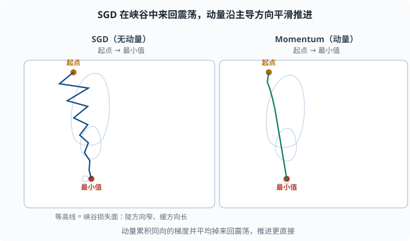

# 优化器：从朴素梯度下降到 Adam 的工程演进

> 目标：理解"梯度下降"在现代框架里是如何被工程化成稳定、快速的优化器。读完这一页，你能讲清 SGD、动量、RMSProp、Adam 各自解决的痛点，并读懂 PyTorch 里那些熟悉到麻木的超参数（lr、momentum、beta1、beta2、weight_decay）。

## 优化器到底在优化什么

反向传播（[04-02](04-02-backpropagation.md)）给了每个参数一个梯度。优化器的职责是：**决定根据这个梯度，参数该挪多大、往哪挪、要不要先看历史。**

朴素的更新是：

```text
θ ← θ - η * g
```

其中 `g` 是梯度，`η`（学习率）是步长。这个朴素版本叫**随机梯度下降 SGD**（Stochastic Gradient Descent——"随机"指每步只用一小批数据估计梯度，而不是全部数据）。它没错，但在复杂损失面上又慢又不稳。后面的优化器都是在这条更新上加"聪明"的修正。

## 损失的形状：为什么朴素 SGD 不够

真实损失面（loss surface）不平坦，有两个让朴素 SGD 难受的特征：

1. **峡谷（ravine）**：某些方向很陡、另一些方向很缓。朴素 SGD 在陡方向来回震荡（步子太大跳过头），缓方向又推进太慢。
2. **噪声**：用 batch 估计梯度有波动（mini-batch 只是全梯度的抽样），会让参数像喝醉了一样抖动。

工程师的解法不是"完全换公式"，而是**给 SGD 加记忆（动量）和自适应（逐参数学习率）**。

## 动量（Momentum）：给下降加惯性

想象一个球沿坡滚：它不会在每一点立即变向，而是带着前一段的"惯性"。动量正是把这种惯性写进公式。

维护一个"速度"变量 `v`：

```text
v ← β·v + g
θ ← θ - η·v
```

`β` 常取 0.9，`v` 是所有历史梯度的指数加权平均（带惯性方向）。

效果：

- **陡方向的震荡被平均掉**：正向的 v 和反向的 v 互相抵消，抖动减小。
- **缓方向持续累积**：只要一直朝同一方向，v 就不断变大，加快收敛。

这就是"冲量"（momentum）的中文叫法。它大概是用最小代价，把训练速度提上一个台阶的改动。



两张图都从左上角的起点滚向右下角的最小值，椭圆等高线代表一个"陡方向窄、缓方向长"的峡谷损失面。左图朴素 SGD 在陡方向来回大幅震荡，同时缓方向推进很慢；右图动量把来回方向的速度互相抵消、把同向速度不断累积，路径明显更平滑、更直接。

### Nesterov 动量

改进版"跑在前面看路"：先按当前速度"展望"一步，在那个更靠前的位置算梯度：

```text
v ← β·v + g(θ - η·β·v)
θ ← θ - η·v
```

Nesterov 收敛更快、更稳，工程里常作为 momentum 的进阶选择。

## Adagrad / RMSProp：给每个参数单独的学习率

峡谷问题的另一半是"不同参数需要不同步长"。**自适应优化器**（adaptive optimizer）的核心思想：每个参数按自己历史梯度的量级，缩放学习率——历史梯度一直很大的参数自动放慢，一直很小的自动加快，不必人工逐参数调。

### Adagrad

把每个参数历史梯度的平方累计到 `G`，用 `G` 缩放更新：

```text
θ_i ← θ_i - η / sqrt(G_i + ε) * g_i
```

历史梯度大的参数，下降步子变小；历史梯度小的参数，步子变大。**但 G 只增不减**，累积后期分母越来越大，学习率趋近 0，训练提前僵住——Adagrad 的著名缺陷。

### RMSProp：用"滑动平均"代替"累加"

RMSProp 把"全部历史平方和"改成**指数加权滑动平均**，避免分母无限增大：

```text
G ← β2·G + (1-β2)·g^2
θ ← θ - η / sqrt(G + ε) * g
```

这样分母反映的是"近期的梯度量级"，长期不会爆炸式增长，训练能持续下去。

## Adam：把动量和自适应合二为一（当今默认）

**Adam（Adaptive Moment Estimation）** 是目前应用最广的默认优化器。它同时做两件事：

- 维护**一阶矩** `m`（梯度的滑动平均，有方向，类似 momentum——"矩"就是随机变量的平均量级刻画，一阶是均值、二阶是平方均值）。
- 维护**二阶矩** `v`（平方梯度的滑动平均，类似 RMSProp，用于逐参数缩放）。

不过 Adam 有个细节：`m` 和 `v` 初始化全 0，刚开始分布偏 0，估计会被压低。所以引入**偏差修正**：

```text
m_hat = m / (1 - beta1^t)
v_hat = v / (1 - beta2^t)
θ ← θ - η * m_hat / (sqrt(v_hat) + ε)
```

其中 `t` 是迭代步数，`beta1` 常取 0.9，`beta2` 常取 0.999，`ε` 常取 `1e-8`（防止除 0）。

### Adam 超参数的直觉

| 超参数 | 默认 | 直觉 |
|---|---|---|
| lr | 1e-3 | 总体步长，最主要的旋钮 |
| beta1 | 0.9 | 动量衰减：越接近 1，动量越"念旧" |
| beta2 | 0.999 | 自适应的记忆长度：越接近 1，二阶矩看越久的平方梯度 |
| weight_decay | 0 | 权重衰减（L2 正则），抑制过拟合 |

Adam 几乎"开箱即用"，成为深度学习的事实默认。但要注意：**Adam 的自适应会掩盖"该不该调学习率"的问题**，而且它晚期有时收敛不如调好的 SGD。于是有 AdamW。

## AdamW：纠偏权重衰减

SGD 里的 `weight_decay` 就是把参数往 0 拉一步：

```text
θ ← θ - η*(g + λ·θ)
```

但传统 Adam 把权重衰减和梯度混在一起输入到 `m`、`v`，导致解耦失效。**AdamW** 把"权重衰减"从"梯度里"拿出来，单独、统一地对每个参数应用：

```text
m ← ...（只处理真正的梯度，不含 λθ）
θ ← θ - η*m_hat/(sqrt(v_hat)+ε) - η·λ·θ
```

AdamW 让 L2 正则干净、稳定，成为如今预训练时代（包括很多 LLM）的标准选择。

## 学习率调度：不只是"定一个数"

学习率不是全程一个常数。常见调度策略：

- **阶梯/按 epoch 衰减**：每若干轮乘一个小系数。
- **余弦退火（cosine annealing）**：按余弦曲线平滑降到接近 0（"退火"借自冶金：先热后慢冷，对应学习率先大后小）。
- **warmup：先升后降**：开头用很小学习率"暖身"，逐渐升到目标，再回落。这对大模型极重要（为了避免一开始梯度爆炸）。
- **Warmup + Cosine**：现代预训练的事实标配。你会在 [06 LLM 原理](../06-llm-fundamentals/README.md) 再见到它。

## 一个温习用的完整训练循环

把前面所有零件（[04-01](04-01-neural-net-intuition.md) 前向、[04-02](04-02-backpropagation.md) 反向、[04-03](04-03-activations.md) 激活、[04-04](04-04-loss-functions.md) 损失）组装成一次完整训练：

```python
import torch
import torch.nn as nn

net = nn.Sequential(
    nn.Linear(2, 8),   # 2 输入 → 8 隐藏
    nn.ReLU(),
    nn.Linear(8, 1),   # 8 → 1 输出（回归）
)
optimizer = torch.optim.AdamW(net.parameters(), lr=1e-3, weight_decay=1e-4)
loss_fn = nn.MSELoss()

# 假数据：y ≈ 3x1 - 2x2 + 噪声
torch.manual_seed(0)
X = torch.randn(200, 2)
y = 3*X[:, 0] - 2*X[:, 1] + 0.1*torch.randn(200)

for epoch in range(300):
    optimizer.zero_grad()
    pred = net(X)
    loss = loss_fn(pred.squeeze(), y)
    loss.backward()
    optimizer.step()

print("最终损失:", loss.item())
print("网络能逼近真值吗？试一组输入：")
with torch.no_grad():
    test = torch.tensor([[1.0, 1.0]])
    print(net(test).item())
```

对比真实值 `3*1 - 2*1 = 1`：训练 300 轮后输出已在 1 附近（继续训练会更贴近；学习率调度见下节）。这就是 [03-02](../03-machine-learning/03-02-linear-regression.md) 那个线性模型，在"没有公式、只有反复梯度下降"下的深度学习版本——**模型换成多层网络后，流程完全一样。**

## 选优化器：一张足够用的决策表

```text
一般深度学习任务默认：Adam / AdamW
大模型、Transformer：AdamW + warmup + cosine
追求极致泛化、数据量大、肯调学习率：调好的 SGD + momentum
压缩/嵌入学习：Adagrad 类旧方案多在历史角落
```

记住：**优化器能救"慢"，不能救"错"。** 若模型结构或损失错了，再好的优化器也无力回天。先保证前向、损失、反向正确，再谈优化器的微调。

## 思考题

1. 朴素 SGD 在"峡谷形"损失面上为什么又慢又抖？动量如何缓解？
2. Adagrad 的"只增不减"分母会导致什么问题？RMSProp 怎么修？
3. Adam 同时借鉴了哪两个旧优化器的思想？它为什么需要偏差修正？
4. AdamW 和传统 Adam 的关键区别是什么？
5. 为什么大模型常用 warmup（先升后降）？

## 参考答案

1. 峡谷里陡方向步子大、来回震荡，缓方向步子小、推进慢。动量维护历史梯度的速度 `v`，陡方向正负震荡被平均抵消、抖动变小，缓方向持续同向累积而加快推进。
2. Adagrad 的 `G` 累加全部历史平方梯度且只增不减，后期分母越来越大、学习率趋近 0，训练僵住。RMSProp 把累加换成指数加权滑动平均，分母反映近期量级、长期不爆涨，训练可持续。
3. 一阶矩 `m` 借鉴 momentum 的"方向记忆"，二阶矩 `v` 借鉴 RMSProp 的"逐参数缩放"。因为 `m`、`v` 初始为 0，早期估计被压低，所以用 `1-beta^t` 校正使其无偏。
4. 传统 Adam 把权重衰减混进梯度、再进 `m/v`，与自适应解耦失效；AdamW 把 L2 权重衰减单独对每个参数统一施加，正则更干净稳定，是预训练时代的主流选择。
5. 大模型随机初始化下早期梯度可能极大，直接大步更新易震荡或爆炸。warmup 先用很小步长"暖身"、稳定损失之后升到目标学习率，再随 cosine 平滑退火，兼顾起步稳定与后期精细收敛。

## 下一步

- 想处理"梯度爆炸/消失、归一化、过拟合"等训练稳定性 → [04-06 训练技巧](04-06-training-tricks.md)。
- 想到 [03-08](../03-machine-learning/03-08-feature-engineering.md) 复习数据预处理如何影响优化器表现。
- 想从数学上回顾梯度下降本身 → [01-07 最优化](../01-math-foundations/01-07-optimization.md)。

[返回本章目录](README.md)
