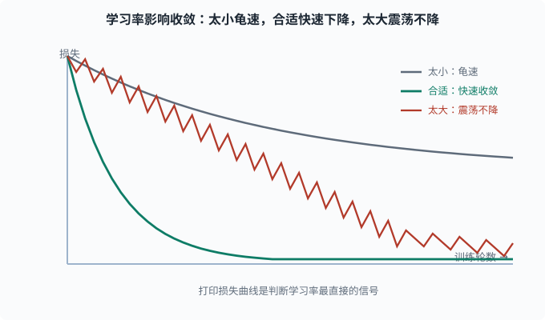

# 训练技巧：让网络稳定、收敛、不背答案

> 目标：把"训练稳定 + 防止过拟合"的工程手段讲透。读完这一页，你能讲清学习率、权重初始化、BatchNorm、dropout、早停、数据增强各自在对抗什么问题，以及它们如何协同。

## 为什么"会反向传播"还不够

有了前向、反向、损失、优化器，你已经能训练一个网络。但真实训练没那么顺，会撞上三类典型的敌人：

```text
1. 梯度爆炸/消失 → 训练发散或僵死
2. 过拟合        → 背训练集、测试很差
3. 训练不稳定    → 损失剧烈震荡、不收敛
```

这一页把对抗这三类敌人的成熟手段挨个讲清。每一招都在回答一个问题：**它修的是哪个病？**

## 学习率：最重要的一个旋钮

学习率 `η` 决定每步迈多大。它是全网络唯一的"全局步长"。

学习率的问题形态：

- **太大**：参数跨过谷底来回震荡，损失下不去，甚至发散到无穷。
- **太小**：收敛极其缓慢，需要海量步数。
- **刚合适**：平稳下降，快速收敛。

判断方法：打印损失曲线。常见坏信号：

```text
损失剧烈震荡 → 学习率可能太大
损失缓慢爬坡/抖动 → 可能太大（发散前兆）或计算 bug
损失平坦不动 → 学习率太小，或梯度消失/死了
```



三条曲线对应同一模型只改学习率的情况：学习率太小，损失下降极慢、长时间停在较高水平；合适的学习率让损失快速且稳定地收敛到很低；学习率太大，损失在较高水平来回震荡甚至发散。所以打印损失曲线是最直接的判断信号。

现代做法很少手调一个常数，而是用调度器（[04-05](04-05-optimizers.md) 讲过）：warmup 再 cosine 退火等，让"起步稳 + 后期细"。

## 权重初始化：起点决定命运

反向传播要一路把梯度乘回浅层。如果初始权重过大或过小，前向输出和反向梯度一开始就可能爆炸或消失。

常见策略：

- **Xavier（Glorot）初始化**：按每层输入输出维度缩放，保持信号方差稳定，配合 tanh/sigmoid 使用。
- **He（Kaiming）初始化**：针对 ReLU 设计，进一步补偿 ReLU 砍掉一半信号导致的方差缩小，配合 ReLU 使用。

PyTorch 里 `nn.Linear`、`nn.Conv2d` 的默认初始化就是 He 系的，通常你不需要手写。但你该知道：**"为什么我的网络初始化就炸"很多时候要怪没配好初始化和学习率的匹配。**

## 数据归一化 / 标准化

即使模型很复杂，特征尺度悬殊依然会捣乱：一个特征数值范围 0-1，另一个 0-1e6，那么梯度会被大尺度特征主导。

常见手段：

- **Standardization**：每个特征减去均值、除以标准差，变成均值 0、标准差 1。
- **Min-Max**：缩放到 0-1 或 -1-1。
- 亲测一个简单规律：**先做特征缩放再做深度模型，几乎总是更好。**

这与 [03-08](../03-machine-learning/03-08-feature-engineering.md) 里的特征缩放逻辑一致，深度模型同样受益。

## BatchNorm：把每层的分布拉回来

**Batch Normalization（批归一化，批 = mini-batch，一次同时喂给网络的那一小批样本）** 的思路很妙：不只归一化输入，而是**每层激活后都归一化一下**，缓解"训练中每层输入的分布随前面层更新而不断漂移"的问题。

给定一个 batch 里某个层的输出 `x`，BatchNorm：

```text
1. 求 batch 内均值 μ 和方差 σ²
2. 标准化：x_hat = (x - μ)/sqrt(σ² + ε)
3. 用可学习的 γ、β 缩放平移：y = γ*x_hat + β
```

作用与副作用：

- **加速收敛**：每层输入分布更稳定，能用更大学习率。
- **提供轻微正则**：batch 内依赖让样本互相影响，有噪声平滑效果。
- **依赖 batch 大小**：batch 太小，μ/σ 估计不准，BatchNorm 反而坏事。

在语言模型场景，**LayerNorm**（对每个样本单独归一化，不依赖 batch）常取代 BatchNorm，这是 [05 NLP 与 Transformer](../05-nlp-transformers/README.md) 会重点讲的前置。

## Dropout：随机"失活"来自带正则

**Dropout** 是针对过拟合的利器：训练时，以概率 `p` 随机把一些神经元输出置 0（对它们的下游暂时"隐形"，比例常 0.2-0.5）；预测时不置 0（并用 `1-p` 缩放回原来量级）。

直觉：

```text
每次都随机砍掉一部分神经元 → 网络不能依赖任何单点
→ 被迫学出冗余、鲁棒的特征，而不是共谋的"特定组合"
```

可以理解为"每次都在训练一棵不同的子树，最后相当于集成了很多子网络"（和 [03-06](../03-machine-learning/03-06-trees-ensemble.md) 集成思想同源）。

注意：**只用于训练，测试时要关**。PyTorch 里 `net.train()` / `net.eval()` 会自动切换。

## 权重衰减（L2 正则）

在损失里加一个"参数平方和"惩罚：

```text
L_total = L_data + λ·Σθ²
```

效果是让参数倾向更小、更简单，从而抑制过拟合。它在优化器里体现为 `weight_decay`（[04-05](04-05-optimizers.md) 详解了 AdamW 的解耦）。这是深度学习的"正则化第一默认"。

## 早停（Early Stopping）

训练时间也影响过拟合：训练越久，越可能背训练集。**早停**在验证集指标不再改善（或开始变差）时停止训练。

```text
训练损失：一直下降
验证损失：先降后升（过拟合开始）
→ 在验证损失最低点附近停止，保存那时的权重
```

这是最简单、最省事、收益又大的"免费正则"，强烈建议每个训练循环都配上。

## 数据增强：让样本更多样的廉价格外数据

对图像：随机旋转、裁剪、翻转、调亮度……对文本：同义词替换、回译（翻译成外语再翻回来）、随机删除……核心思想是**用合理的变换造出"语义不变但外观不同"的新样本**，扩大有效训练分布。

数据增强间接对抗过拟合：数据"变多、变多样"了，模型更难背、更能学到鲁棒特征。它是视觉领域几乎必配的手段。

## 梯度裁剪（Gradient Clipping）

当梯度爆炸不可控时，**梯度裁剪**是最后防线：把梯度的范数截断到一个上限。

```text
若 ||g|| > 阈值C：g ← g * C / ||g||（缩回 C 的大小）
```

方向不变，只是让单步更新不至于大到发散。RNN（[04-08](04-08-rnn-lstm.md)）和 Transformer 的第一层嵌入常要用它，是大模型训练里防爆的标准保险丝。

## 把这些手段串成一次"稳"训练

一张速查表：

| 敌人 | 手段 |
|---|---|
| 梯度爆炸 | 梯度裁剪、合理初始化和学习率 |
| 梯度消失 | 用 ReLU 族激活、He 初始化、BatchNorm/LayerNorm |
| 过拟合 | dropout、权重衰减、早停、数据增强、更多数据 |
| 训练不稳 | warmup、合理学习率、数据/特征缩放 |
| 收敛慢 | 动量/Adam、余弦退火、BatchNorm、适当加大 batch |

注意"调优"是有顺序的：**先保证不炸不消失、能收敛，再考虑防过拟合。** 顺序反了，你会把精力浪费在"还没学会就想着别背"上。

## 一个带全套手段的 PyTorch 训练骨架

```python
import torch
import torch.nn.functional as F

model = torch.nn.Sequential(
    torch.nn.Linear(20, 64), torch.nn.ReLU(), torch.nn.BatchNorm1d(64),
    torch.nn.Dropout(0.3),
    torch.nn.Linear(64, 32), torch.nn.ReLU(),
    torch.nn.Linear(32, 1),
)
opt = torch.optim.AdamW(model.parameters(), lr=1e-3, weight_decay=1e-4)

def step_lr(epoch):
    return 1e-3 * (0.95 ** epoch)  # 简单阶梯衰减
sched = torch.optim.lr_scheduler.LambdaLR(opt, lr_lambda=step_lr)

def train_one_pass(X, y, Xv, yv, epochs=200):
    best_val = float("inf")
    best_state = None
    for ep in range(epochs):
        model.train()
        opt.zero_grad()
        out = model(X)
        loss = F.mse_loss(out.squeeze(), y)
        loss.backward()
        torch.nn.utils.clip_grad_norm_(model.parameters(), 5.0)  # 梯度裁剪
        opt.step(); sched.step()

        model.eval()
        with torch.no_grad():
            val = F.mse_loss(model(Xv).squeeze(), yv).item()
        if val < best_val:                      # 早停
            best_val = val
            best_state = {k: v.clone() for k, v in model.state_dict().items()}
    model.load_state_dict(best_state)           # 恢复到验证最好点
    return best_val
```

这一小段里同时出现了 BatchNorm、dropout、weight_decay、梯度裁剪、学习率调度、早停——训练稳定性的重活都在这几行里。

## 思考题

1. 学习率太大和太小的典型症状分别是什么？
2. BatchNorm 的"归一化"发生在哪一级？它为什么在 batch 很小时反而有问题？
3. Dropout 在训练和测试时的行为分别是什么？为什么这样设计？
4. 梯度裁剪修改了什么、不修改什么？它专门对抗哪类问题？
5. 早停的依据是"训练损失"还是"验证损失"？为什么？

## 参考答案

1. 太大：损失剧烈震荡、不收敛甚至发散到无穷。太小：损失下降极慢、像"原地踏步"，需要海量步数才推进一点。
2. 发生在每一层的激活之后（对 batch 内该层输出求均值方差再归一化）。它依赖 batch 统计量估计 μ/σ，batch 太小时估计噪声大，归一化反而引入不稳定，甚至坏事（所以大 batch 或不依赖 batch 的 LayerNorm 适用于此类场景）。
3. 训练时以概率 p 随机置零部分神经元并参与梯度计算（强迫网络学鲁棒特征）；测试时全部保留，并把权重按 `1-p` 缩放以匹配训练时被随机砍掉造成的期望输出。前者提供正则，后者保证预测稳定。
4. 梯度裁剪把梯度范数截断到上限（超限时整体等比收缩），**保持方向不变、只改长度**。它专门对抗梯度爆炸，防止单步更新过大导致发散，是 RNN 与大模型训练的标准"保险丝"。
5. 依据是验证损失。训练损失几乎总在下降（在训练集上越来越拟合），不代表泛化；而验证损失先降后升，它变差才是过拟合开始，早停就在验证最佳点停。

## 下一步

- 想把"网格结构数据"学到更好 → [04-07 CNN](04-07-cnn.md)。
- 想处理序列数据 → [04-08 RNN/LSTM](04-08-rnn-lstm.md)。
- 想复习过拟合与偏差-方差的原理 → [03-04 偏差-方差与正则化](../03-machine-learning/03-04-bias-variance.md)。

[返回本章目录](README.md)
