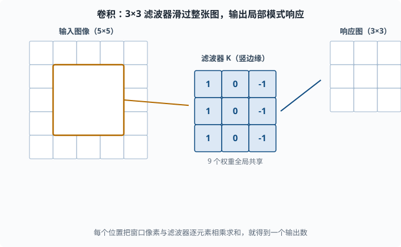
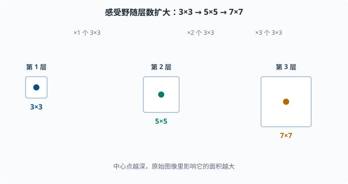

# 卷积神经网络（CNN）：专门处理网格结构的模型族

> 目标：理解卷积、池化、感受野等概念，以及它们为什么适合图像这类"密集网格"数据。读完这一页，你既能看懂经典 CNN 结构，也知道为什么它天然比全连接层"省参数、抗平移"。

## 为什么需要 CNN：全连接层对图像是浪费

把一张 224×224×3 的图片丢进一个全连接层，仅输入就是约 15 万个数字。接一个同样规模的隐层，参数量就是几百亿——训练不动又严重过拟合。更糟的是，全连接层把每个像素都当成独立、无空间关系的维度，完全浪费了图像"相邻像素高度相关"的结构。

CNN 的核心洞察：

```text
图像是网格：像素在空间上有局部相关的结构。
同样的局部模式换个位置出现，语义基本不变（平移不变性）。
→ 何不让同一套"局部检测器"在整张图上滑动复用？
```

## 卷积：用一个"小滤波器"扫描整张图

卷积操作的核心是一个**滤波器（filter / kernel，也叫卷积核）**——一个很小的权重网格，比如 3×3。它在这张图（或特征图）上从左到右、从上到下滑动，每到一个位置，把窗口里的像素和滤波器逐元素相乘再求和，输出一个数。（CNN 里的"卷积"是从信号处理借来的名字，实际算的是这种"滑动窗口点积"。）

例如一个 3×3 卷积，输出某个位置 `(i,j)` 的值：

```text
out(i,j) = Σ_{a,b} input(i+a, j+b) * K(a,b)
```

其中 `K` 是 3×3 的滤波器权重，`a,b` 遍历 3×3。

可以这样理解：

```text
每个滤波器 = 一个"局部模式探测器"（例如竖边缘、横边缘、某个纹理）
滑动扫描 = 到每个位置问"这里有没有这种模式？"
```



图中的橙色窗口是滤波器当前停留在输入图的某个位置。这个 3×3 的滤波器（以竖边缘检测器为例，权重视觉化成 `[1,0,-1]` 三行）与窗口内的像素逐元素相乘再求和，得到一个输出数。滤波器再沿行、列滑动到下一个位置重复同样的计算，最终生成一整张响应图。

关键优势：**同一个滤波器在整个图上复用，参数量只和一个滤波器一样大**（3×3 就 9 个权重加偏置），不像全连接要为每个位置单独配权重。这是"共享权重"（weight sharing）带来的参数效率。

## 多通道：一个滤波器只能看一种模式

一张图有三个颜色通道（RGB，红绿蓝三张同尺寸的叠层）。若我们想要很多种模式（竖边、横边、圆、纹理……），就放**多个滤波器**，每个负责一种模式，各自输出一张"响应图"。所有响应图叠起来就是**多个通道**的特征图（feature map，滤波器扫完整张图后得到的整张响应矩阵；一个通道 = 一个滤波器的完整输出）。

假设输入有 `C_in` 个通道、滤波器有 `F` 个，那么这层有 `C_in × F` 个卷积核，输出 `F` 个通道。现代 CNN 就是靠"一层层堆叠、每层用更多滤波器"来逐步抽象特征。

## 引入额外的超参数：stride、padding

卷积过程还受两个超参数控制：

- **Stride（步长）**：滤波器每次滑多少格。步长 1 是逐格滑；步长 2 会跳格，输出尺寸变小、同层覆盖更快。
- **Padding（填充）**：在图像边缘补一圈 0，让滤波器能扫到边缘像素，并控制输出尺寸。`same` padding 让输出大小和输入一致。

输出尺寸公式（忽略边界细节）：

```text
out = floor((input - kernel + 2*padding) / stride) + 1
```

掌握这个公式就够了：**stride 压缩、padding 补偿**，两者共同决定特征图尺寸。

## 感受野：一个输出点"看"到多大面积

卷积的层叠形成了**感受野（receptive field）**：某个输出层像素，原始输入里有哪些面积影响它。

```text
第一层 3×3：输出点看到 3×3
堆第二层 3×3：输出点看到 5×5
堆第三层 3×3：输出点看到 7×7
```

注意感受野是**线性叠加**的：每多一层 3×3，感受野只加 2 格。为了让高层看到全图，CNN 会越堆越深，或用 stride 2 / 池化加速"视野扩大"。



每个正方形代表某一层输出点能看到原始输入的面积，中心点颜色越深表示网络越深。第一层的一个 3×3 卷积只看得到 3×3；叠上第二层，视野扩到 5×5；叠上第三层，扩大到 7×7。每多一层 3×3，感受野向外只扩大一圈（2 格），所以想看全图就要堆深或用 stride 2 / 池化加速扩大。

## 池化：缩小并增加平移鲁棒性

**池化（pooling）**是另一种局部操作，常见两种：

- **Max pooling**：取窗口内最大值。
- **Average pooling**：取窗口内均值。

典型是 2×2、stride 2，把特征图尺寸减半，保留每个局部最强的响应。

作用：

- **减少空间尺寸**：参数和计算量下降。
- **轻微平移鲁棒**：物体移动一两格，窗口内的最大值基本不变。
- **增加感受野**：压缩后每层覆盖更大的原始面积。

现在的趋势是：**能用 stride 卷积达到压缩效果的，可以不额外用池化**；但理解池化仍是读懂旧架构的钥匙。

## 经典的 CNN 结构：从 LeNet 到 ResNet

一个典型 CNN 的"骨架"是：**若干个 [卷积+激活+池化] 块，然后展平，接全连接层**。

几个里程碑：

- **LeNet-5**（98 年）：最早用于手写数字识别，卷积+池化+FC 的模板。
- **AlexNet**（2012）：靠更深的卷积和 GPU，在 ImageNet 上引爆深度学习复兴。用 ReLU 和 dropout。
- **VGG**：把架构化成"统一 3×3 堆叠 + 2×2 池化"的极简模板。
- **GoogLeNet / Inception**：同一层用多尺度卷积（1×1、3×3、5×5）再拼接，讲究"网络中的网络"。
- **ResNet**：引入**残差连接（skip connection）**——让层学习"残差"而不是"完整映射"，一举让非常深的网络能训练。这是划时代的，也是后来 Transformer 用残差的先声。

### ResNet 的残差连接

普通层学习 `H(x)`；残差块让它学习 `F(x) = H(x) - x`，然后输出 `x + F(x)`（其实就是恒等加上要学的残差）。

```text
输出 = x + F(x)
```

好处：即使 `F` 学得不好，恒等 `x` 也能让梯度顺畅流过（反向传播时多一条"短路"），深层网络不再因梯度消失而难训练。**残差是新架构（包括 Transformer）反复复用的大杀器。**

## CNN 不止用于图像

卷积思想的本质是"处理网格上的局部共享模式"，所以用途远超图像：

- 音频：把声音切成时间-频率的二维图，用 2D CNN。
- 文本：把句子看成"词向量排成一行"的 1D 序列，用 1D 卷积提取局部 n-gram 模式。
- 视频：加上时间维的 3D 卷积。

它教会了深度学习一个普适原则：**在数据有明显局部结构的维度上，用"小核+共享权重"比"全连接"高效得多。**

## 一个 PyTorch 小 CNN

```python
import torch
import torch.nn as nn

class TinyCNN(nn.Module):
    def __init__(self):
        super().__init__()
        self.features = nn.Sequential(
            nn.Conv2d(1, 16, kernel_size=3, padding=1),  # 1通道→16通道
            nn.ReLU(),
            nn.MaxPool2d(2),                             # 尺寸减半
            nn.Conv2d(16, 32, kernel_size=3, padding=1),
            nn.ReLU(),
            nn.MaxPool2d(2),
        )
        self.classifier = nn.Sequential(
            nn.Flatten(),
            nn.Linear(32*7*7, 10),   # 若输入 28x28，池化两次后 7x7
        )

    def forward(self, x):
        return self.classifier(self.features(x))

net = TinyCNN()
x = torch.randn(4, 1, 28, 28)      # batch=4, 1通道, 28x28
print("输出形状:", net(x).shape)     # (4, 10)
```

注意两点：第一层卷积把 1 通道扩到 16 通道，两次池化把 28×28 缩到 7×7；分类头把 32×7×7 展平后映射到 10 类。

## 与后续的关系：为什么 LLM 不用 CNN 主导

CNN 对**局部平移模式**几乎完美，但语言不完全是"局部平移"的：一个句子的含义依赖**任意远、任意位置的词**之间的关系。CNN 的感受野要叠很多层才够长，这在长文本上很吃亏。这直接指向了第五章的动机：**注意力机制**让一个输出点能直接联系任意遥远的输入，不需要层层堆叠。你在 [05 NLP 与 Transformer](../05-nlp-transformers/README.md) 会看清这条进化路线。

## 思考题

1. 卷积的"权重共享"带来什么好处？相比全连接层省在哪？
2. 通道（channel）在卷积层里代表什么？为什么需要多个滤波器？
3. stride 和 padding 各自影响特征图尺寸的哪个方向？
4. 什么是感受野？为什么堆叠更多 3×3 卷积可以让高层"看"到更大面积？
5. ResNet 的残差连接 `y = x + F(x)` 解决了什么问题？为什么能帮梯度流通？

## 参考答案

1. 同一个滤波器在整个特征图上滑动，参数只在滤波器内计数，而不是每个位置一套权重。相比全连接层的"每像素一套参数"，参数量大幅下降，同时天然复用局部模式、具备平移不变性。
2. 通道对应"不同种类的特征响应"，一个通道就是一类模式在图上各位置的响应图。要表达多个模式（边缘、纹理、形状）就需要多个滤波器、多个输出通道，所以卷积层通常要扩通道。
3. stride 让输出更小（跳格扫描）；padding 在边缘补 0，让输出更大或被补偿到与原输入一致。二者共同满足"控制输出尺寸 + 覆盖边缘"的需求。
4. 感受野是某一输出位置在原始输入中受到影响的区域。堆叠 3×3 卷积时，每多一层，输出点对应的原始面积就向外扩一圈，所以越深覆盖越大（也可以靠 stride/池化加速扩大）。
5. ResNet 让块学习残差 `F(x)` 而非完整映射，输出 `x+F(x)`。即便 F 学不好，恒等路径 `x` 也能让梯度从深层"短路"回浅层，缓解梯度消失，使非常深的网络可训练；这也是 Transformer 复用残差的原因。

## 下一步

- 想处理"序列数据"（词、时间步）→ [04-08 RNN/LSTM](04-08-rnn-lstm.md)。
- 想知道"注意力如何克服 CNN 的长距离短板" → [05 NLP 与 Transformer](../05-nlp-transformers/README.md)。
- 想补卷积对应的线性代数/矩阵直觉 → [01-01 线性代数](../01-math-foundations/01-01-linear-algebra.md)。

[返回本章目录](README.md)
