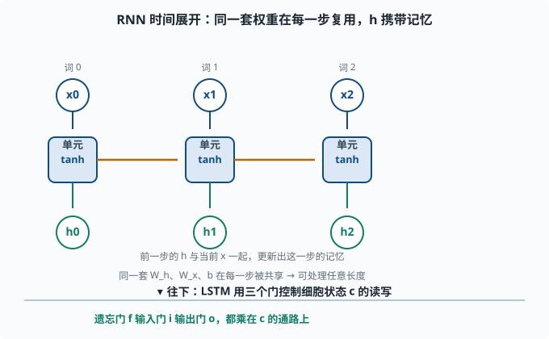

# 循环神经网络（RNN/LSTM）：为序列而生，LLM 的亲爷爷

> 目标：理解循环网络如何处理"有顺序的数据"，明白 LSTM 如何用门控对抗梯度消失。读完这一页，你能解释为什么 RNN 天然适合序列，也知道它最终为何被注意力取代——这正是第五章的伏笔。

## 为什么普通网络处理不了序列

前面所有网络（全连接、CNN）都假设输入是**定长、无序**的：你把像素顺序打乱，图片的语义就没了，但网络并不知道"顺序"这回事。

可很多数据天生是**有序序列**：

```text
文本：每个词按顺序出现，顺序决定含义
语音：音频帧按时间排列
时间序列：股价、传感器读数
```

RNN（Recurrent Neural Network，循环神经网络，"循环"指同一单元的输出会绕回自己作为下一步输入）的设计目标就是：**显式地让网络记住"读过的内容"，按顺序处理输入。**

## RNN 的核心：一个带"记忆"的单元，逐时间步重复使用

RNN 的核心想法极其简单：**同一个神经元结构在时间轴上被反复使用**，每一步输入当前数据 `x_t` 和上一步的**隐藏状态** `h_{t-1}`（hidden state——网络内部自己维护的"至今读到了什么"的摘要向量），输出新的隐藏状态 `h_t`：

```text
h_t = tanh(W·[h_{t-1}, x_t] 或 W_h·h_{t-1} + W_x·x_t + b)
```

`h_t` 就是这个时间步的"记忆摘要"，它携带了截至当前步的所有信息。处理整个序列时，网络一个词一个词地读取，不断更新这个记忆：

```text
h_0 → h_1 → h_2 → ... → h_T
```



上方把"循环"铺平来看：同一套单元在时间轴上重复，每一步接收当前的输入 `x_t` 和上一步的隐藏状态 `h_{t-1}`，输出新的 `h_t`。水平橙色箭头表示"上一步的记忆传给下一步"，这就是记忆的载体。下方是 LSTM 的升级思路：用遗忘、输入、输出三个门去控制细胞状态 `c` 该忘什么、记什么、输出什么，让旧信息能跨很长的序列持续留存。

关键点：**每一步使用同一套权重 W_h、W_x、b**（参数共享），所以 RNN 可以处理任意长度的序列。这有点像 CNN 的参数共享——CNN 在空间上共享，RNN 在时间上共享。

### 两种读法

- **多到一（sequence → one）**：只看最后一步的 `h_T` 做预测，例如"整句话是正面还是负面"。
- **多到多（sequence → sequence）**：每一步都输出一个东西，例如"每个词的词性标签"，或机器翻译的 decoder（每一步生成一个词）。

## 直接手算一个一步 RNN

为了真正"摸到"这种重复结构，手算一个单时间步：

```text
假设隐藏维度 = 2
W_h = [[0.5, -0.2], [0.6, 0.1]]
W_x = [[0.3, 1.0], [-0.4, 0.7]]
b   = [0.1, -0.2]
```

上一步隐藏状态 `h_{t-1} = [1, 0.5]`，当前输入 `x_t = [2, -1]`：

```text
W_h·h_{t-1} = [[0.5, -0.2],[0.6, 0.1]]·[1, 0.5]
             = [0.5*1 + (-0.2)*0.5,  0.6*1 + 0.1*0.5] = [0.4, 0.65]
W_x·x_t = [[0.3, 1.0],[-0.4, 0.7]]·[2, -1]
         = [0.3*2 + 1.0*(-1),  -0.4*2 + 0.7*(-1)] = [-0.4, -1.5]
总和 + b = [0.4 + (-0.4) + 0.1,  0.65 + (-1.5) + (-0.2)]
        = [0.1, -1.05]
h_t = tanh([0.1, -1.05]) ≈ [0.0997, -0.7818]
```

注意：`h_t` 同时受"过去记忆 h_{t-1}"和"当前输入 x_t"影响。同一个公式在下一个时间步重复，就形成"记住前面、结合当下"的能力。

## RNN 的三座大山：长期依赖、梯度消失/爆炸、慢

RNN 原理漂亮，但实践有几处硬伤：

1. **长期依赖（long-term dependency）困难**：信息要跨越很多时间步。第 1 个词要影响第 50 个词的输出，中间要经过 49 次非线性变换，梯度早就消失了。
2. **梯度爆炸/消失**：在时间轴上展开后，RNN 相当于一个"共享权重的深网络"，梯度在时间上反复相乘。乘的数大于 1 就爆炸（需梯度裁剪，[04-06](04-06-training-tricks.md)），小于 1 就消失（长时间步学不到）。
3. **训练慢**：时间步必须**串行**处理，后一步依赖前一步的隐藏状态，没法像 CNN 那样并行。这在大序列上非常致命。

最后一条（串行）是 RNN 被 Transformer 取代的**决定性原因**之一，第五章会细说。

## LSTM：用"门"来选择性记忆与遗忘

**LSTM（Long Short-Term Memory，长短期记忆）**针对梯度消失设计，引入了**细胞状态（cell state）** `c_t` 和三个"门"：

- **遗忘门**：决定"过去的记忆该忘多少"。
- **输入门**：决定"新信息该记住多少"。
- **输出门**：决定"把记忆的哪部分输出给 h_t"。

每个门都是一个「sigmoid 再乘」的机制（**门** = 一个 0 到 1 之间的开关比例，乘到某路信号上决定放行多少）。sigmoid 输出 0-1，表示"放行比例"：

```text
0 = 完全关闭（忘掉/不写入/不输出）
1 = 完全打开（保留/写入/输出）
```

粗略的结构：

```text
候选 c_tilde = tanh(...)                新的候选记忆
遗忘 f_t = σ(...)                      过去记忆保留比例
输入 i_t = σ(...)                      新记忆写入比例
细胞 c_t = f_t ⊙ c_{t-1} + i_t ⊙ c_tilde   线性更新记忆
输出 o_t = σ(...)                      输出比例
h_t = o_t ⊙ tanh(c_t)
```

关键是 `c_t = f_t⊙c_{t-1} + i_t⊙c_tilde`：**细胞状态是一条"线性"通路**，遗忘门决定保留多少旧记忆。正因为这条通路几乎线性，旧信息能"涓涓细流"般持续留存在很长的序列里，梯度不会在时间上被非线性地反复压扁——这极大缓解了长期依赖和梯度消失。

### GRU：LSTM 的轻量版

**GRU（Gated Recurrent Unit）**把 LSTM 简化：只有两个门（更新门、重置门），没有单独的细胞状态。效果接近 LSTM，但参数更少、更快。工程上常作为 RNN 家族的首选入门。

## RNN 家族对比

| 模型 | 记忆机制 | 门 | 长期能力 | 备注 |
|---|---|---|---|---|
| 朴素 RNN | 隐藏状态 h | 无 | 差（梯度消失） | 概念基础 |
| LSTM | h + 细胞状态 c | 遗忘/输入/输出 | 好（线性记忆通路） | 经典主力 |
| GRU | 简化隐藏状态 | 更新/重置 | 好（参数更少） | 轻量替代 |

## 用 PyTorch 搭一个句子分类 RNN

```python
import torch
import torch.nn as nn

# 简单"最后一步输出做分类"的 RNN
class SentimentRNN(nn.Module):
    def __init__(self, vocab, embed_dim=64, hidden=32, num_classes=2):
        super().__init__()
        self.embed = nn.Embedding(vocab, embed_dim)
        self.rnn = nn.GRU(embed_dim, hidden, batch_first=True)
        self.fc = nn.Linear(hidden, num_classes)

    def forward(self, x):            # x: (batch, seq_len) 词索引
        e = self.embed(x)            # (batch, seq_len, embed_dim)
        out, h = self.rnn(e)         # out: 每步输出; h: 最后一步隐藏
        last = h[-1]                 # 取最后一个时间步的隐藏
        return self.fc(last)         # (batch, num_classes)
```

流程是：每个词索引 → 查嵌入得到向量 → 喂给 GRU 按顺序处理 → 取最后一步隐藏做分类。这就是一个"读完整个句子再表态"的序列模型。

## 从 RNN 到 Transformer：为什么被取代

RNN 的"长依赖难 + 必须串行"，在需要长文本、超大模型的时代越来越难以承受。注意力机制（[05](../05-nlp-transformers/README.md)）给出两条致命优势：

```text
1. 任一位置能直接看到"任意遥远"的其他位置，没有长依赖问题
2. 所有位置并行计算，不需要逐时间步串行
```

所以现代 NLP 和 LLM 几乎不再用 RNN 做骨干。理解 RNN 的价值在于：

- 它是"序列=记忆+顺序处理"这个心智模型的来源。
- LSTM 的"门控+线性记忆通路"思想至今影响很多架构设计。
- 读旧论文、理解历史演进必需。

## 思考题

1. RNN 的参数为什么可以在不同时间步共享？这和 CNN 的共享有何类比？
2. 一步 RNN 的 `h_t` 依赖于哪些量？为什么说它"记住过去、结合当下"？
3. 朴素 RNN 处理长序列会遇到哪两个核心问题？
4. LSTM 用"三个门 + 细胞状态"解决了 RNN 的什么问题？细胞状态的"线性通路"为何关键？
5. GRU 相比 LSTM 简化了什么？

## 参考答案

1. RNN 把同一套权重在每个时间步复用，因为它处理的是"同一种顺序变换"——每个时间步的更新规律相同。这类似 CNN 在空间上共享权重的思路：CNN 空间共享、RNN 时间共享，都通过复用一套参数降参量并捕捉对应结构。
2. `h_t` 依赖当前输入 `x_t` 和上一步隐藏状态 `h_{t-1}`（经 W_h、W_x 和 tanh）。`h_{t-1}` 携带了此前所有读到内容的摘要，所以 `h_t` 兼具"记住前面 + 结合这一步"，正体现序列建模。
3. 长期依赖困难（早先信息跨大量时间步难以保留到下）和梯度爆炸/消失（时间轴展开后梯度反复相乘，>1 爆炸、<1 消失）。串行计算导致的训练慢是另一工程问题。
4. LSTM 用遗忘/输入/输出门控制记忆写入与读取，引入近乎线性的细胞状态通路 `c_t = f⊙c_{t-1} + i⊙c_tilde`，让旧信息能跨越很长的序列持续留存，缓解梯度消失和长期依赖。
5. GRU 只有更新门和重置门两个门，没有单独的细胞状态（隐藏状态直接承担记忆），参数更少、计算更快，长期记忆能力仍较好，常在资源敏感场景当首选。

## 下一步

- 想看清"为什么序列实现要转向注意力/并行" → [05 NLP 与 Transformer](../05-nlp-transformers/README.md)。
- 想回顾与 LSTM 门控同源的正则/稳定性手段 → [04-06 训练技巧](04-06-training-tricks.md)。
- 想把序列模型放到语言建模的大背景下 → [06 LLM 原理](../06-llm-fundamentals/README.md)。

[返回本章目录](README.md)
