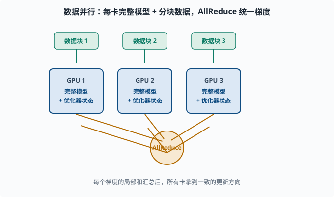

# 分布式训练基础：单卡放不下时怎么办

> 目标：理解当模型或数据超出单张 GPU 时，数据并行、模型并行、流水线并行、张量并行分别拆解什么。读完这一页，你能听懂"为什么大模型训练离不开多机多卡"，并知道各并行方式的取舍。

## 为什么单卡总是不够

训练大模型的最大敌人之一就是**硬件墙**。两个爆点：

```text
1. 内存不够：模型参数 + 梯度 + 优化器状态 + 激活值，单卡放不下
2. 算力不够：训练几十亿/千亿参数需要难以想象的计算量，单卡要几百年
```

所以必须**把训练铺到多张 GPU（甚至多台机器）上**，这就是**分布式训练**（distributed training）。它不是在单卡循环外面加个"for 多卡"，而是要设计"怎么切"和"怎么同步"。

## 四样内存大户：参数、梯度、优化器状态、激活

先分清训练时每样东西占多少内存（理解并行方式的钥匙）：

```text
参数 W：模型本身的权重
梯度 g：反向传播算出来的导数（和 W 同量级）
优化器状态：Adam 的 m、v（通常还要 2 倍 W；+momentum 还要更多）
激活值：前向传播中间结果（batch × 序列 × 隐藏维的巨大尺寸）
```

一个大致的经验（以 fp32、Adam、不开混合精度为例）：**总内存 ≈ 参数 + 梯度 + m + v + 激活 ≈ 4×参数 + 激活。** 这就是为什么"模型多大"和"训练要多大的卡"差得很远。你用 [04-05](04-05-optimizers.md) 的 Adam 公式就能推出 m、v 各一份、都和参数同等大小。

## 数据并行（Data Parallelism）：大家都拿完整模型，各分一块数据

**数据并行**是最朴素、最早用上的一招：

```text
每张卡持有一份完整的模型
把训练数据切成很多块，每张卡分一块
每张卡各自前向、反向，算出自己的梯度
把所有人的梯度做平均（AllReduce），得到一致的更新
```

优点：实现简单、能线性扩展（卡越多越快），是目前中小模型的标准选项。

缺点：**每张卡都得有完整模型 + 完整优化器状态**。如果模型本身就放不进一张卡，数据并行无从谈起。另外一个工程点是"同步"：给梯度做 AllReduce 要通信，卡的增多会引入通信瓶颈。



每张卡都持有一份完整的模型和优化器状态，数据集被切成若干块分给各卡。每卡各自前向、反向算出自己的梯度，之后中间那个 AllReduce 节点把所有卡的梯度求平均，再把一致的结果广播回每张卡，于是所有卡朝同一个方向更新。这样数据越多、卡越多，整体吞吐越高。

### AllReduce 是什么

**AllReduce（全归约）**是分布式并行里的核心通信原语：把各张卡上的梯度求和（或平均），再把完整结果广播回去，让大家拿到一致的梯度。背后常用高效的**Ring-AllReduce**（把数据切成环，逐跳累加），避免"所有卡都直接发到一张"的通信塌方。

## 模型并行（Model Parallelism）：模型放不下时把模型切开

当完整模型放不进单卡，就得**切模型**。模型并行按切法再分两类：

### 流水线并行（Pipeline Parallelism）：按"层"切

把网络按层分给不同卡：

```text
卡0：第 0-5 层   卡1：第 6-11 层   卡2：第 12-17 层
```

前向像流水线一样"接力"，每张卡只处理自己的层，再传给下一张卡。

优点：把大模型参数摊到多卡上，很简单。
缺点：同一时刻只有部分卡在忙（后继卡要等前卡算完），**出现空闲（bubble，流水线气泡）**；而且反向也要接力传。所以通常要配合微批量调度来提高利用率。著名实现如 GPipe、Megatron-LM 的 pipeline。

### 张量并行（Tensor Parallelism）：按"单个层的内部"切

流水线按"层"切，**张量并行**则把**同一层的权重矩阵**也切开，分散到多卡，每卡只算一部分矩阵乘再合并（AllReduce 汇总）。这能处理"一层就大得放不下"的情况，也是超大模型（如 GPT 千亿级）必需的手段。

代价：层内需要高频通信（每次矩阵乘都要聚合），通信开销大、实现复杂。

## 把并行组合起来：3D 并行

真实千亿级训练很少只用一种并行，而是**组合**：

```text
数据并行（扩大数据吞吐）
× 张量并行（层内拆开，单层能放下）
× 流水线并行（层间接力，摊深模型的参数）
```

这就是常说的 **3D 并行**（Megatron 风格）：既用多卡放大吞吐，又把超大单层和超深模型都拆开。加上专家并行（**MoE** 混合专家模型里按"专家"子网络切分，见 [06](../06-llm-fundamentals/README.md) 和 [07](../07-llm-engineering/README.md)），构成现代大模型训练的大盘子。


三种并行解决三个不同层面的问题：数据并行让更多卡同时处理更多数据、放大吞吐；流水线并行按"层"把超深模型摊到多卡、解决模型放不下；张量并行把单层的权重矩阵在内部切开、解决"一层就太大"。三者正交，可以组合起来同时拆吞吐、深度和宽度，这正是大模型训练的标准做法。

## 梯度累积：小"显存换大 batch"的省油技巧

一个不额外加卡就常能省内存的招是**梯度累积（gradient accumulation）**：

```text
想要大 batch，但单卡 batch 放不下
→ 把一个大 batch 拆成几个小 batch，依次前向+反向
→ 把梯度累加（不清零），攒够再统一优化器更新一次
```

这等于"用小显存模拟大 batch"，是 [04-06](04-06-training-tricks.md) 里优化器 `zero_grad` 只在"真的更新"时才调用的原因。注意梯度累积得到的优化效果**不完全等于**同大小真 batch（BN 等统计量有差异），但已足够接近。

## ZeRO：把优化器状态和梯度也"分"掉

数据并行要求每卡都有完整优化器状态（如 Adam 的 m、v）。ZeRO 的想法是：**这些状态也可以分散到各卡，需要时再取回。**

```text
ZeRO-1：分散优化器状态
ZeRO-2：再分散梯度
ZeRO-3：连参数也分散（需要时通过通信取回）
```

这样单卡内存占用大幅下降，能够用"相对小的卡"训更大的模型。它是如今大模型训练（DeepSpeed——微软开源的大模型训练库，ZeRO 的主要实现）的问世级创新。你会意识到：**"分布式"不只是并行算，更是聪明的内存分摊。**

## 一张速查表

| 并行方式 | 切什么 | 何时用 | 主要代价 |
|---|---|---|---|
| 数据并行 | 数据 | 模型能放下、想加快 | AllReduce 通信 |
| 流水线并行 | 层 | 模型太深放不下 | 流水线空闲 |
| 张量并行 | 单层权重 | 单层就放不下 | 高频通信、实现复杂 |
| ZeRO | 优化器/梯度/参数 | 内存紧张 | 需通信取回 |
| 梯度累积 | 时间（多次小 batch） | 显存不够想大 batch | BN 等统计差异 |

## 思考题

1. Adam 训练时，内存里除了参数还有哪几样？为什么"模型多大"不等于"训练要多大内存"？
2. 数据并行为什么要求"每张卡都要放下完整模型"？它用什么操作把大家的梯度统一？
3. 流水线并行和张量并行分别按什么粒度切模型？
4. 梯度累积和"直接用一个真的大 batch"有何相似与差异？
5. ZeRO 的核心洞察是什么？它把哪几类东西分散到各卡？

## 参考答案

1. 除了参数 W，还有梯度 g（反向）、优化器状态（如 Adam 的 m、v 各一份）、以及前向的激活值。Adam 下总内存常是参数的好几倍，所以"能放模型的卡"和"能训练模型的卡"两回事。
2. 因为数据并行要让每张卡都能独立前向+反向，就必须都持有完整模型和完整优化器状态。它通过 AllReduce（如 Ring-AllReduce）把所有卡的梯度求平均并广播回各卡，保持更新一致。
3. 流水线并行按"层"切（每卡负责连续若干层，接力）；张量并行按"单个层内部"切（同一层权重矩阵分散到多卡，聚合矩阵乘）。前者摊"深"，后者摊"宽/大单层"。
4. 相似：梯度累积用多次小 batch 反向后累加梯度、统一更新，数学上逼近一个大 batch 的总梯度。差异：BN 等依赖 batch 统计量的模块受小 batch 影响，且累积期间的中间统计不完全等同真大 batch。
5. ZeRO 的洞察是"数据并行不必每卡都存完整副本，优化器状态/梯度/参数可分片存"，通过通信按需取回。ZeRO-1 分优化器状态、ZeRO-2 再分梯度、ZeRO-3 连参数也分，从而大幅省内存、能用更小卡训更大模型。

## 下一步

- 想把它落地到语言模型具体怎么看 → [06 LLM 原理](../06-llm-fundamentals/README.md) 与 [07 LLM 工程](../07-llm-engineering/README.md)。
- 想在代码里体会"累计梯度"的写法 → [04-06 训练技巧](04-06-training-tricks.md)。
- 想了解分布式背后的优化器数学 → [04-05 优化器](04-05-optimizers.md)。

[返回本章目录](README.md)
