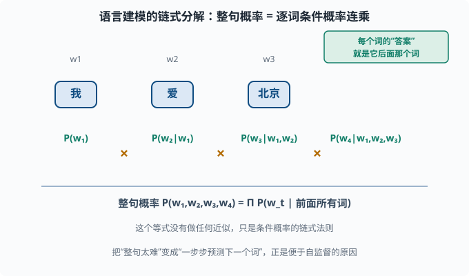
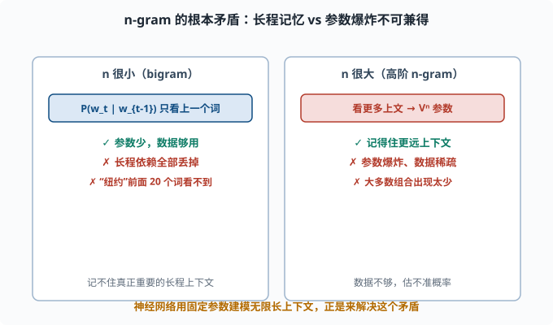
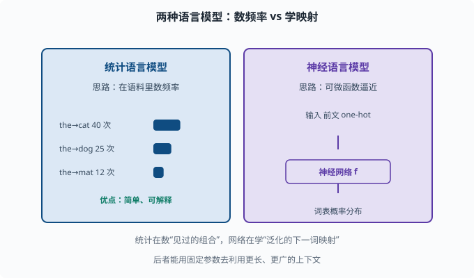
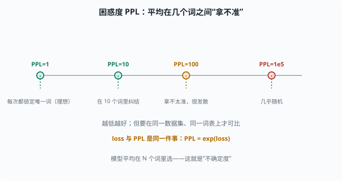

# 语言模型的起点：从统计到"预测下一个词"

> 目标：建立"语言模型 = 一键预测下一个词概率"的心智模型。读完这一页，你能从 n-gram 讲清楚语言模型的目标函数，并明白它和大语言模型（LLM）的关系。

## 一切为什么从"统计语言模型"开始

人类理解语言的能力看起来可以拆成很多子任务：语法、语义、常识、推理。但在计算机看来，这些都没法直接"喂"给模型。机器学习需要一个**明确的目标**。

统计语言模型（Statistical Language Model）给了 NLP 一个奇迹般的简洁目标：

> 给定一句话的前面一部分，模型预测下一个最可能出现的词。

也就是建模：

```text
P(下一个词 | 已经看到的词)
```

这个目标妙在：

- **自监督**：不需要人工标注。海量文本里，每个词本来就有"真实答案"（它就是紧接着出现的那个词）。
- **可扩展**：互联网上有无穷的文本，语料越大自监督数据越多。
- **一石多鸟**：要"猜对下一个词"，模型其实被迫掌握了语法、语义、常识、推理。因为只有真理解这些，才能预测得准。

你把"预测下一个词"练到极致，得到的**大语言模型（LLM）**做翻译、摘要、问答全部由此而来。这是 [06 LLM 原理](../06-llm-fundamentals/README.md) 的种子。

## 全序列概率：链式分解

一个更完整的问题是：给定一段词序列，整个序列出现的概率是多少？

用条件概率的**链式规则**把它拆成"逐词的条件概率"：

```text
P(w1, w2, ..., wT)
= P(w1) * P(w2|w1) * P(w3|w1,w2) * ... * P(wT|w1,...,wT-1)
= Π_t P(w_t | w_1 ... w_{t-1})
```

这就是"语言建模"的数学定义：**把整句概率拆成一系列"在已知前文下预测下一个词"的条件概率的连乘。** 只要能把每一个条件概率估好，整个句子就能算出来。

要注意的是：这个等式**没有做任何近似**，它只是概率论里的链式法则。它把"整句太难"的问题，变成了"一步步预测下一个词"的问题——这正是便于自监督的原因。



上图把一句话 `w₁ w₂ w₃ w₄` 的概率从左到右逐词拆开：第一项直接是 `P(w₁)`，第二项在已知 `w₁` 下预测 `w₂`，第三项在已知 `w₁,w₂` 下预测 `w₃`，依次类推。每一步的"答案"都藏在文本自身里（下一个真实的词），所以这条链天然支持自监督训练。注意绿色小字的提示：这个分解是**精确**的，不是近似。

## n-gram：马尔可夫假设的限制

先朴素地想：`P(w_t | w_1...w_{t-1})` 里依赖的词越多，参数就越多。假设词表有 `V` 个词，要估计 `P(w_t | w_{t-1}, w_{t-2})`（称 **三元组 trigram**），可能的参数组合就有 `V³` 量级。`V` 一旦上万，这就是天文数字，还要求语料里每种组合都出现足够多次才估得准。

为解决数据稀疏，n-gram 用**马尔可夫假设**做近似：只依赖最近 `n-1` 个词（即假设"未来只由最近几步决定"，[01-09](../01-math-foundations/01-09-probabilistic-graphs.md) 的马尔可夫性质是同一思想）。

```text
bigram：  P(w_t | w_{t-1})
trigram： P(w_t | w_{t-2}, w_{t-1})
```

代价是"只看最近 n-1 个词"。长距离的上下文（比如"纽约"在前面 20 个词外的地名）被丢掉，模型记不住真正重要的长程依赖。n 一旦大了，参数又爆炸。

这就是统计语言模型的**根本矛盾**：

```text
依赖太少（n 小）→ 记不住长程上下文
依赖太多（n 大）→ 参数爆炸、数据不够
```



左框是 `n` 很小的情形（bigram）：参数少、数据够用，但只记得上一个词，长程依赖被全部丢掉；右框是 `n` 很大的高阶 n-gram：记得远一些，但参数以 `Vⁿ` 量级爆炸、大多数组合在语料里出现太少、估不准。这就是"依赖太少"和"依赖太多"之间的死结。

现代神经网络语言模型解决了这个矛盾：用固定规模的参数，去建模**无限长**的上下文。这是 [05-06](05-06-transformer.md) 和 06 章的真正意义。

## 从"计数"到"学习"：神经语言模型

统计语言模型靠"在语料里数频率"来估计 `P`（最大似然估计）。神经语言模型换了个思路：**不直接数频率，而是用一个可微的函数（神经网络）去逼近"预测下一个词"的映射。**

基本形式（你已经在 [04-04 损失函数](../04-deep-learning/04-04-loss-functions.md) 见过）：

```text
给定前文 → 模型输出整个词表上的概率分布
损失 = -log(真实下一个词的预测概率)   （交叉熵）
```

训练时喂进海量文本，让模型尽量让"真实下一个词"的概率最大，这等价于最小化交叉熵。语言模型的训练和 [03-03](../03-machine-learning/03-03-logistic-regression.md) 的多分类本质完全一样——只是类别变成了"整个词表"，数据变成了"预测下一个词"。



上图把两种语言模型并排放置：左边蓝色的是统计语言模型，靠"在语料里数频率"来估计 `P`（比如 `the→cat` 出现多少次），简单、可解释，但只能记住"见过多少次"；右边紫色的是神经语言模型，它不数频率，而是用一个可微的神经网络去逼近"给定前文 → 词表概率分布"这个映射。区别的关键在于：统计模型在"数见过的组合"，网络在"学一个能泛化的下一词函数"，所以后者能用固定规模的参数去利用更长、更广的上下文。

## 困惑度：语言模型的好坏衡量

语言模型的传统质量指标是**困惑度（perplexity，PPL）**，定义为交叉熵的指数：

```text
PPL = exp(交叉熵)
```

直觉：模型平均下来在几个词之间"拿不准"。

```text
PPL = 1   → 模型每次都精确锁定下一个词（完美但不可能）
PPL = N   → 模型每次大致在 N 个词里纠结
```

困惑度越低越好，但**横向比较要在同一数据集、同一词表**上做才有意义（不同分词会让 PPL 不可比，这又是 [05-03](05-03-tokenization.md) 的伏笔）。



上图用一条数轴给你困惑度的"体感"：最左端 `PPL=1` 意味着模型每次都精确锁定唯一的下一个词（理想但几乎不可能）；随着 PPL 增大，模型平均在 10 个、100 个甚至更多候选词之间"纠结"。左下角琥珀色提示它和 loss 的关系 `PPL = exp(loss)`——两者是同一件事的两种标度。记住一点：比较 PPL 必须在同一数据集、同一词表上做，否则不同的分词方式会让数字失去可比性。

## 一个最小可运行的 bigram 模型

用最朴素的统计方法，你也能亲手"训练"一个语言模型：

```python
from collections import defaultdict, Counter

text = "the cat sat on the mat . the dog sat on the mat .".split()
bigrams = defaultdict(Counter)
for w1, w2 in zip(text[:-1], text[1:]):
    bigrams[w1][w2] += 1

def prob(w1, w2):
    total = sum(bigrams[w1].values())
    return bigrams[w1][w2] / total if total else 0

print("P(dog|the) =", prob("the", "dog"))   # 0.25
print("P(mat|the) =", prob("the", "mat"))   # 0.5
```

这就是一个完全意义上的"统计语言模型"：给定 `the`，它告诉你下一个词的概率分布。虽然笨得可以、记不住长上文，但"预测下一个词"的骨架已经立起来了。

## 这一页的长远价值

这一页可能是通向 LLM 最重要的"单点悟"：

```text
大语言模型做的一切 = 极致的"预测下一个词"。
语言理解的各种能力，是在把这个任务学到极致的过程中涌现的。
```

当你之后在 [06](../06-llm-fundamentals/README.md) 章见到"预训练目标 = next token prediction"，请回看这里——它只是一个被神经网络和海量数据放大的统计语言模型。

## 思考题

1. 语言建模的目标函数是什么？为什么它属于"自监督"而非"需要人工标注"？
2. 用链式法则把整句概率写成逐词条件概率，这个等式是否做了近似？
3. n-gram 靠什么假设来简化模型？它带来的根本矛盾是什么？
4. 神经语言模型相比"数频率"的统计模型，关键区别是什么？
5. 困惑度 PPL 为 1 和 PPL 为 1000 各代表什么？

## 参考答案

1. 目标是建模"给定前文预测下一个词"的条件概率 `P(w_t|w_1...w_{t-1})`。它的"答案"就是文本里自然紧跟着的那个词，无需人工标注，所以是自监督。
2. 没有做任何近似。它只是条件概率的链式规则，逐项把整句概率分解成条件概率连乘，严格成立。
3. 靠马尔可夫假设：只依赖最近 n-1 个词。根本矛盾是"n 太小记不住长程依赖、n 太大参数和数据都爆炸"，两者不可兼得。
4. 统计模型靠语料中数频率来估计概率；神经模型用一个可微网络去逼近"下一词分布"这个映射，能借助固定参数量去利用更长上下文、并自动学到泛化表示。
5. PPL=1 表示模型每次都能精确锁定唯一的下一个词（理想上界）；PPL=1000 表示模型大致在约 1000 个词之间纠结、非常不确定。越低越好。

## 下一步

- 想让"词"拥有可计算的语义 → [05-02 词表示](05-02-word-representation.md)。
- 想知道文本怎么被切成模型认识的 token → [05-03 子词分词](05-03-tokenization.md)。
- 想从"预测下一个词"走到真正能落地的序列模型 → [05-04 Seq2Seq](05-04-seq2seq.md)。

[返回本章目录](README.md)
