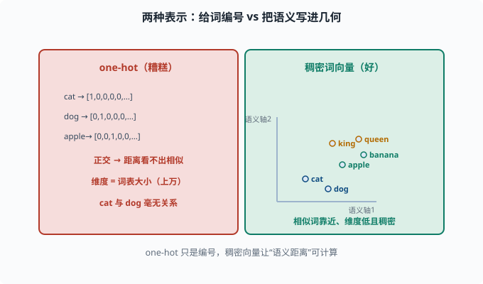
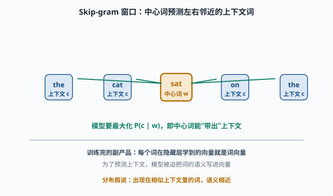
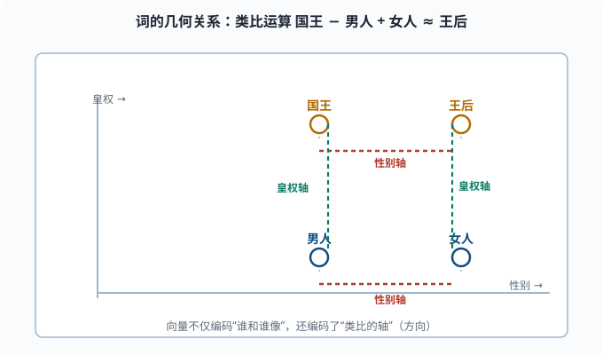
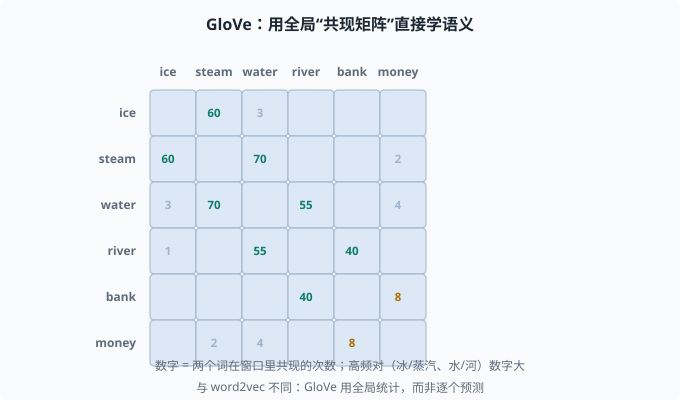

# 词表示：让词的语义进入可计算的几何世界

> 目标：理解从 one-hot 到 word2vec、GloVe 的演进。读完这一页，你能解释"词的向量"为什么能让相似词靠近，也知道这些静态词向量的局限。

## 为什么词必须变成向量

机器只能处理数字。所有 NLP 的第一步，都是**把词表里的每个词变成向量（vector）**，好喂给神经网络。这个向量就叫**词向量 / 词嵌入（word embedding）**。

但"转成向量"有高下之分。差的表示只是给词发个编号，好的表示能让词的**语义进入几何**：相似意义的词在向量空间里靠近，还能做**类比运算**（"国王 - 男人 + 女人 ≈ 王后"）。

这是 NLP 的一个根本观念转变：

```text
把词当成"离散符号" → 词之间毫无关系
把词当成"几何中的点" → 语义、相似度都可计算
```

## one-hot：最原始也最糟糕

最朴素的表示是 **one-hot（独热）编码**：词表有 `V` 个词，就给每个词一个 `V` 维向量，只有它自己那一位是 1，其余是 0。

```text
"cat" → [1,0,0,0,...,0]
"dog" → [0,1,0,0,...,0]
```

致命的缺陷：

- **维度爆炸**：词表上万，向量就上万维。
- **无语义**：`cat` 和 `dog` 的向量正交（内积为 0），距离完全无法体现它们是"相似的动物词"。
- **稀疏浪费**：绝大多数维度是 0。

one-hot 只是"给词发编号"，不是"理解词"。我们需要的是**稠密、低维、有语义**的向量。



上图左右对照两种表示：左边红色是 one-hot，每个词给一个 `V` 维向量、只有自己是 1，`cat` 和 `dog` 落在互相正交的坐标轴上，距离完全看不出它们都是"动物词"；右边绿色是稠密词向量，用一个低维的空间把词变成"几何中的点"，`cat` 和 `dog` 因为常出现在相似上下文而靠得很近，`king` 和 `queen` 也有各自的语义位置。核心区别一句话：one-hot 只是编号，稠密向量让"语义距离"变得可计算。

## 分布假说：词的语义藏在它的上下文里

把词变成有语义的向量，靠的是一条语言学观察——**分布假说（Distributional Hypothesis）**：

> 一个词的语义，由它周围的词语境决定。出现在相似语境里的词，语义相似。

比如：

```text
"我喝了一杯 tea"
"我喝了一杯 coffee"
```

"tea"和"coffee"能出现在同样的位置（"我喝了一杯 ___"），它们就是语义相近的。**上下文一致 → 语义相近**，这是几乎所有现代词向量方法的核心直觉。

## word2vec：用"预测任务"偷师语义

**Word2Vec**（2013 年 Google 提出的词向量训练法）把分布假说变成一个可训练的预测任务。有两种变体：

- **CBOW（Continuous Bag of Words）**：用上下文词，预测中心词。
- **Skip-gram**：用中心词，预测它的上下文词。

以 Skip-gram 为例：给定中心词 `w`，模型要预测它窗口内的上下文词 `c`。训练时最大化：

```text
P(c | w)
```

训练完成后的副产品就是：**每个词隐藏层学到的向量**，就是它的词向量。因为要在"预测上下文"这个任务上表现好，模型被迫让词向量编码了词的语义。



上图把窗口摊开来看：中间橙色的"中心词 w"向外发出箭头，去预测左右两侧蓝色"上下文 c"里的每一个词。模型要最大化 `P(c | w)`，也就是让中心词能"带出"它周围那些真实的邻居。因为相似的邻居意味着相似的语境，训练后的词向量自然把"语义相近"写进了几何距离。这正是不需要任何人工标注、纯靠语料就能偷师语义的原因。

word2vec 还有个美丽发现：训练出的向量空间里，词之间的**关系也是向量**：

```text
vec(国王) - vec(男人) + vec(女人) ≈ vec(王后)
```



上图把这个发现画在二维平面上：四个词各自是一个点，水平方向是"性别轴"（男人↔女人、国王↔王后），垂直方向是"皇权轴"（男人↔国王、女人↔王后）。做"国王 − 男人 + 女人"这个向量运算，等价于先沿"皇权轴"上升、再沿"性别轴"平移，正好落在王后附近。这告诉我们词向量不仅编码了"谁和谁像"，还编码了可比的"方向（语义轴）"。

这说明向量不仅编码了"谁和谁像"，还编码了"类比的轴"。

## GloVe：从"计数"的补丁视角

Word2Vec 用一个预测任务间接学语义。**GloVe（Global Vectors，全局向量）**换了个更直接的思路：不是一个个预测，而是直接用全局**共现矩阵**（co-occurrence matrix——行和列都是词，格子记两个词在同一窗口里一起出现的次数）。

它先统计共现矩阵，然后让模型尽量还原这个矩阵里含有的对数比例信息。学到的向量同样能承载类比关系。

与 word2vec 的区别：

```text
word2vec：局部窗口内逐个预测（扫描式）
GloVe：利用全局共现统计（全局矩阵）
```

实践上两者谁更优要依数据和任务而定，都属于**静态词向量**（每个词固定一个向量，不管在什么语境下都是同一个）。



上图是一张示意性的共现矩阵：行和列都是词，格子里的数字表示这两个词在同一个窗口里共现的次数。你可以看到高亮的对角带——`ice/steam`、`water/river` 这些语义相关的词共现次数特别高，而 `ice/money` 之类几乎不共现。GloVe 的目标就是让词向量尽量"还原"这张矩阵里的对数比例信息。这正是它与 word2vec 的分野：word2vec 在局部窗口里逐个预测，GloVe 直接利用全局共现统计。

## 静态词向量的一根软肋：一词多义

最大的问题："bank"可以是银行，也可以是河岸。但静态词向量给每个词**只有一个**向量，无法根据上下文区分不同的含义。

举例：

```text
"I deposited money in the bank."   (银行)
"The boat drifted to the river bank."  (河岸)
```

两种"bank"在静态词向量里是同一个向量，模型分不清。这个问题要等到**上下文相关的表示（contextualized embeddings）**解决——也就是 BERT/Transformer 时代，[05-08](05-08-pretraining.md) 会讲。

## 用 PyTorch 感受一下 Embedding 层

现代模型里，"词向量表"通常用一个 `nn.Embedding` 实现：它本质是一个 `V × d` 的矩阵，词表索引取出一行就是该词的向量。

```python
import torch
import torch.nn as nn

vocab_size, embed_dim = 1000, 64
emb = nn.Embedding(vocab_size, embed_dim)

ids = torch.tensor([3, 42, 3, 7])   # 四个词的索引
vectors = emb(ids)                   # (4, 64)
print("每个词向量:", vectors.shape)

id3 = emb(torch.tensor(3))           # 同一个索引取出同一个向量
print("同一个词两次取到同一向量:", torch.equal(id3, vectors[0]))
```

这里的 `emb` 就是一个"可学习的词向量表"。训练时它和其他参数一起被更新（[04-02](../04-deep-learning/04-02-backpropagation.md)）。**注意：这是"查表"，同一个词永远拿到同一个向量**——这正是"静态"二字的含义，也是后面 [05-08](05-08-pretraining.md) 要升级的地方。

## 一张时间线速览

```text
one-hot（离散，无语义）
  → 分布假说（上下文定语义）
    → word2vec（预测式，词向量）
      → GloVe（全局共现，词向量）
        → 上下文词向量（BERT/Transformer，一词多义）
          → 大语言模型的隐藏状态（每层都是上下文相关表示）
```

这一页讲的"静态词向量"，是理解后文"上下文相关表示"的对照——知道它好、知道它哪里不够，才能真正看懂 Transformer 做了什么。

## 思考题

1. one-hot 表示有什么致命缺陷？为什么它不能体现"cat"与"dog"的相似？
2. 分布假说的核心结论是什么？它如何支撑 word2vec？
3. Skip-gram 的预测任务是什么？训练完的"副产品"是什么？
4. word2vec 和 GloVe 在学习语义上思路有何不同？
5. 静态词向量的软肋是什么？在什么场景下会误事？

## 参考答案

1. 维度为词表大小（很高）、极度稀疏、且任意两个词向量正交（内积 0），距离完全无法反映语义相似性。它只是给词编号，不承载语义。
2. 核心结论：出现在相似上下文里的词，语义相近。word2vec 正是让模型在"用上下文预测中心词（或反向）"的任务上学习，从而把这种上下文相似性编码进向量。
3. Skip-gram 用中心词预测其窗口内的上下文词。训练完成后的"副产品"是词向量的隐藏表示——因为要预测上下文，模型被迫把语义写进这些向量。
4. word2vec 用局部的预测式任务逐个样本学习；GloVe 直接用全局共现矩阵，让向量还原共现的比例信息。前者扫描式、后者全局式。
5. 每个词只有唯一固定向量，无法区分一词多义。像"bank（银行/河岸）"这类词在不同语境下被强行压成同一个向量，模型分不清其不同含义，长距离歧义场景会误判。

## 下一步

- 想让模型"不需要完整词表"也能处理新词 → [05-03 子词分词](05-03-tokenization.md)。
- 想看词表示如何一步步变成上下文相关 → [05-08 预训练范式](05-08-pretraining.md)。
- 想补一次语言模型的整体数学目标 → [05-01 语言模型基础](05-01-lm-basics.md)。

[返回本章目录](README.md)
