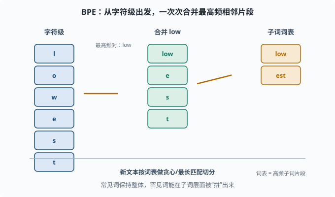
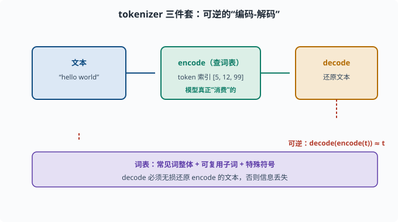
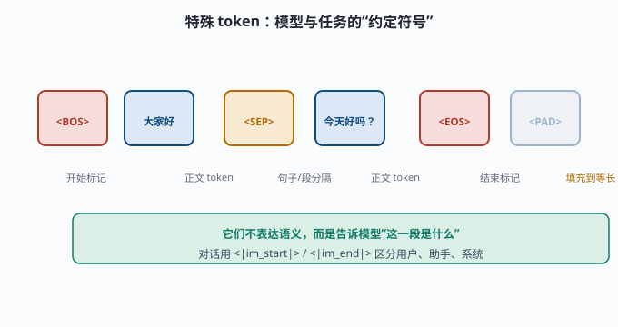

# 子词分词：文本如何变成模型认识的 token

> 目标：理解为什么"切开成词"不够、为什么子词分词成了标准。读完这一页，你能讲清 BPE、WordPiece 的原理，并知道 tokenizer 的"词表 + 编码 + 解码"三件套。

## 为什么不能简单"按空格切词"

最直觉的分词是按空格和标点切成词。但真实语言和应用场景都很不配合：

- **词表失控**：新词、人名、地名、专业术语层出不穷，词表永远不够用。
- **罕见词丢信息**："embeddingization"这种生造词，要么进不了词表，要么让它变成稀有的孤儿。
- **词形变化爆炸**：英文的 run/runs/ran/running 都是独立词，浪费大量词表位置，还损失了词干之间的联系。
- **多语言/无空格语言**：中文没有一个自然的空格分隔，"按空格切词"直接失效。
- **拼写错误**：一错就变成"没见过的词"。

能不能既保留词的语义、又不被词表困死？**子词（subword）分词**正是为这个矛盾而生。

## 核心思想：把词拆成"子词单元"

子词分词介于"按字符"和"按整词"之间：

```text
按字符：   flexibility → f-l-e-x-i-b-i-l-i-t-y（太多碎片，语义丢失）
按整词：   flexibility → [flexibility]（词表爆炸）
子词：     flexibility → [flexib, ility]（平衡）
```

理想的字典既包含高频词（作为整体），又把低频罕见词拆成可复用的子词片段。这样：

- 常见词保持整体，语义不碎。
- 罕见词能在子词层面被"拼"出来，不受词表限制。
- 相似词共享相同子词（如"un-""-able"），词形联系的显性保留。

## BPE：Byte Pair Encoding

**BPE（字节对编码）**是最常用的子词算法，直觉是"贪心合并最高频的相邻片段"。

具体步骤：

1. 从**字符级**开始：把每个词拆成单个字符（并标注词尾）。
2. 统计语料里所有"相邻两片"（字节对）的出现频率。
3. 每次把**出现最频繁的相邻对**合并成一个新片段，加入词表。
4. 重复第 2-3 步，直到词表达到目标大小。

例子（简化）：

```text
语料里 "low" "lowest" "newer" "newest"
先合并最频的 "low" → 词表多一个子词
再合并 "lowest" → "low","est"
...
最终词表里自然出现 "low","est","new","er" 等可复用子词
```

训练的产物是一个**词表**（一组子词片段）和一个**合并规则表**。编码新文本时，就按"最长/贪心匹配"把它们切成词表里的子词。



上图演示 BPE 的三步：最左边是"字符级"起点，每个词都被拆成单个字符 `l o w e s t`；中间靠"出现频率最高"的相邻对 `low` 先被合并，形成 `low + e s t`；最右边逐步合并出 `low`、`est` 这类可复用子词，组成最终词表。核心启发是：高频片段快速成词、低频罕见词在子词层面被"拼出来"，从而既控制词表规模又保留词形联系。

## WordPiece：BPE 的一种"变体"

**WordPiece**（BERT 用）和 BPE 类似，都是"从字符起、逐步合并"，但选合并对的准则不同：

- BPE：合并**出现频率最高**的相邻对。
- WordPiece：合并**能使训练数据似然提升最大**的相邻对（按语言模型的概率增益选）。

实际效果相近，记号上 WordPiece 产出用 `##` 前缀标记词中续接的子词（如 `flexi##bili##ty`）。**GPT 系列通常用 BPE，BERT 用 WordPiece**——你知道这个区别看论文时就顺了。

## 训练好的 tokenizer 是"三件套"

一个可用的 tokenizer 包含三部分：

```text
1. 词表（vocab）：所有 token（子词片段 + 特殊符号）
2. encode（编码）：把文本 → 一串 token 索引
3. decode（解码）：把 token 索引 → 文本
```

编码时，把文本按词表做最大匹配切分；切不开的罕见字符会落到"未知 token"或退到 byte 级。解码则要能无损还原（concat 子词并消除 `##`/空格约定）。

注意：**decode 必须能完美还原 encode 的文本**（可逆），否则信息就丢了。但"可逆"不等于"和原串一个字符不差的可读性"——分词常引入的微小空格约定（如英文词的词首空格）就是为了能正确还原。



上图把三件套画成一条可逆的流水线：左侧文本先经 `encode`（查词表）变成一串 token 索引，这是模型真正"消费"的原子单位；之后 `decode` 再把索引还原成文本。红色回环强调**可逆性**：`decode(encode(文本))` 应当约等于原文，否则编码和解码之间就会静默丢信息。一个可用的 tokenizer 底座就是"词表 + encode + decode"这三件套的完整闭环。

## 词表里还有哪些"特殊 token"

真实 tokenizer 的词表除了子词，还塞了一堆**特殊符号**：

```text
[UNK]  未知 token（词表外）
[CLS]  分类标记（BERT，句首）
[SEP]  句子分隔（BERT，两段之间）
PAD    填充到等长
EOS / BOS  结束/开始标记（生成模型用）
```

这些符号看似无关紧要，实则是**模型与任务约定**的一部分。你之后在 [07](../07-llm-engineering/README.md) 章和 deepseek-harness 的 prompt 流程里会一直撞见它们。



上图把一段带特殊 token 的序列摊开：`<BOS>` 标开始、正文 token 居中、`<SEP>` 隔开不同的句子或段落、`<EOS>` 标结束、末尾用 `<PAD>` 填充到等长。它们不表达语义，而是给模型"这一段是什么"的约定：对话场景则用 `<|im_start|>` / `<|im_end|>` 区分用户、助手和系统。别小看这些符号，它们是理解预训练与 prompt 编排的暗号。

## 用 HuggingFace tokenizer 感受一下

```python
from transformers import AutoTokenizer

tok = AutoTokenizer.from_pretrained("bert-base-uncased")
texts = ["Don't take this lightly", "deeplearningisawesome"]
for t in texts:
    ids = tok.encode(t)
    print(repr(t), "->", ids, "->", tok.decode(ids))
```

运行会看到英文文本被切成一串子词 token 索引，`decode` 又能拼回一句近似原文的话。这演示了"编码-解码"可逆三件套。

## 为什么分词影响一切

分词看似"预处理小技巧"，实则悄悄决定了很多大问题：

```text
词表大小 → 决定输入/输出维度（softmax 头部可大可小）
分词粒度 → 决定模型"看"到多细的语言单位
token 数 → 决定上下文长度能容纳多少内容、成本多高
```

你会发现后面 [06](../06-llm-fundamentals/README.md)、[07](../07-llm-engineering/README.md) 里"上下文窗口算多少个 token""API 按 token 计费"这些话题，全都是从这里长出来的。

## 思考题

1. 试举两个"按空格切词"会失败的真实场景。
2. 子词分词的"平衡"是什么意思？它比字符级好在哪、又比整词级好在哪？
3. BPE 从头到尾的贪心策略是什么？它最终产出什么？
4. WordPiece 与 BPE 选择"下一个要合并的相邻对"的准则有何不同？
5. 为什么 decode 必须可逆？编码成 token 索引后为什么还需要 decode？

## 参考答案

1. 中文（没有天然空格分隔）和生造/罕见英文词（如自定义术语或拼写错误）都无法靠空格切词正确处理；多语言差异也使单靠空格不可靠。
2. 在"字符级太碎、语义丢"和"整词级词表爆炸"之间取中：常见词保整体，罕见词拆成可复用子词。既控制词表规模，又保留大部分语义与词形联系。
3. BPE 从字符级出发，反复合并"当前出现频率最高的相邻字节对"进词表，直到词表达到目标大小。产物是一份子词词表 + 合并规则，可对新文本做贪心切分。
4. BPE 选"出现频率最高"的相邻对合并；WordPiece 选"使训练语料语言模型似然提升最大"的对合并。二者都是自底向上贪心，但打分准则不同。
5. 因为 decode 承担把 token 索引还原成可读文本的职责，若不可逆，训练/推理时的文本前后就对不上，信息会被静默丢弃。可逆保证"编码-解码"不损失原文，是可靠 NLP 管线的前提。

## 下一步

- 想看"任意序列到任意序列"的模型框架 → [05-04 Seq2Seq](05-04-seq2seq.md)。
- 想知道模型如何"关注"重点而非记住全部 → [05-05 注意力机制](05-05-attention.md)。
- 想对比 BPE/WordPiece 在预训练模型里的实际差异 → [05-08 预训练范式](05-08-pretraining.md)。

[返回本章目录](README.md)
