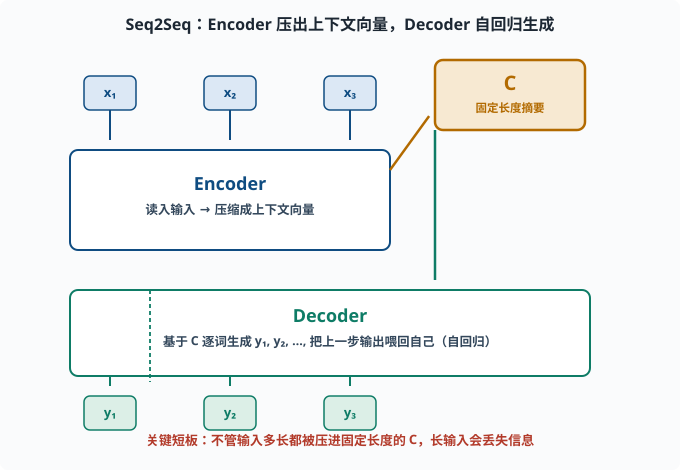
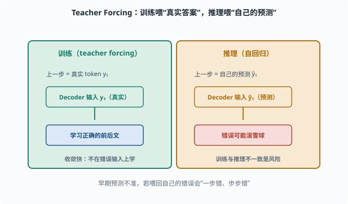
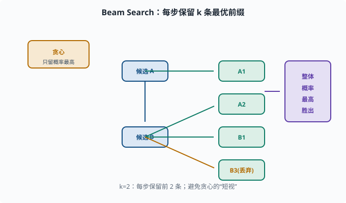

# Seq2Seq：从"一个序列到另一个序列"的通用框架

> 目标：理解编码器-解码器架构如何把"任意输入序列"变成"任意输出序列"。读完这一页，你能说清机器翻译、摘要、对话为什么都长一个样子，也知道它后期的"注意力补丁"从哪来。

## 为什么需要"序列到序列"

前几页我们处理两类任务：

- 给定前文预测下一个词（[05-01](05-01-lm-basics.md)）：输入和输出是"同一条序列"。
- 词分类：逐个输入词，给每个词一个标签。

但很多任务更自由：**输入是一串，输出是完全另一串、长度还不同。**

```text
机器翻译：  中文句子 → 英文句子
摘要：      长文章 → 短摘要
对话：      用户的话 → 助手的话
问答：      问题 + 文档 → 答案
```

这些都是**序列到序列（Sequence-to-Sequence，Seq2Seq）**问题。它需要一个能"先完整读懂输入，再逐步生成输出"的框架，这就是**编码器-解码器（Encoder-Decoder）**。

## 编码器-解码器的整体结构

```
输入序列 x1 x2 ... xT
        ↓
   [ Encoder ]
        ↓
    上下文向量 C  （对整段输入的"摘要"）
        ↓
   [ Decoder ]  ← 逐步生成 y1 y2 ...
        ↓
输出 y1 y2 ... yM
```

- **编码器（Encoder）**：把输入序列"读"成一组隐藏状态。最后（或某处的）状态被压缩成一个**上下文向量 C**，承载输入的信息。
- **解码器（Decoder）**：基于 `C`，**逐词生成**输出，每次生成一步，把上一步输出作为下一步输入（自回归）。

注意解码器的**自回归**特性：它一次只生成一个 token，把刚才生成的 token 再喂回自己，直到输出结束标记。这正是 [05-01](05-01-lm-basics.md) "预测下一个词"的生成式体现。



上图把整体结构铺开：左侧蓝色输入词 `x₁,x₂,x₃` 喂进 Encoder，Encoder 把整段输入压缩成中间琥珀色的"上下文向量 C"，再作为起点交给下方绿色 Decoder。Decoder 一次只生成一个词 `y₁,y₂,y₃`，并把上一步输出回环喂给自己（图里左下角的长箭头），直到结束标记。注意红色提示的缺点：无论输入多长，都被硬压进固定长度的 C。

## 一个经典实现：RNN Seq2Seq

在 Transformer 之前，Seq2Seq 都用 RNN（[04-08](../04-deep-learning/04-08-rnn-lstm.md)）做骨架：

- **Encoder RNN**：按顺序读取输入词，最后隐藏状态 `h_T` 就充当上下文向量 `C`。
- **Decoder RNN**：以 `C` 为起点，逐词生成，每步输出一个词并喂回下一步。

```python
import torch
import torch.nn as nn

class RNNSeq2Seq(nn.Module):
    def __init__(self, vocab, embed=64, hidden=32):
        super().__init__()
        self.emb = nn.Embedding(vocab, embed)
        self.enc = nn.GRU(embed, hidden, batch_first=True)
        self.dec = nn.GRU(embed, hidden, batch_first=True)
        self.fc = nn.Linear(hidden, vocab)

    def forward(self, src):
        e = self.emb(src)
        _, h = self.enc(e)          # h = 编码器最后隐藏状态（上下文向量）
        # 生成侧：以 EOS 为起点逐步预测（此处略去循环，示意结构）
        return h
```

不过我们知道 RNN 有长依赖弱、无法并行的毛病（[04-08](../04-deep-learning/04-08-rnn-lstm.md)），这个"朴素 Seq2Seq"很快撞墙。

## 大问题：上下文向量 "一口闷"

朴素 Seq2Seq 最大的短板在于：**无论输入多长，都要被压进一个固定长度的上下文向量 C。**

```text
输入一句话：还好（短）
输入一篇文章：很长（信息必须全塞进同一个 C）
→ C 容量固定，长输入的信息会严重丢失、遗漏
```

模型必须"记住全文"再写输出，这既难又浪费。更合理的做法是：**写某个词时，不必记全部，只需"回头看"与当前生成最相关的部分。** 这正是注意力机制要解决的，也直接引出下一页。

## 训练与推理：teacher forcing

解码器训练有个经典技巧叫 **teacher forcing（教师强制）**：

```text
训练时：把"真实上一步输出"喂给解码器（而不是模型自己上一步的预测）
推理时：把"模型自己上一步的预测"喂回去
```

为什么？因为训练早期模型预测很不准，若把错误的预测喂回去，就一步错、步步错，很难学。用真实答案喂，能让每一步都在"正确上下文"上学，收敛快得多。

（代价是训练/推理不一致的风险——模型没见过自己的错误输出，推理时可能越滚越偏。这是 [07](../07-llm-engineering/README.md) 章会深入的话题。）



上图左右对照训练与推理：左边绿色是训练时的 teacher forcing，解码器的上一步输入是**真实 token `y₁`**，让每一步都在"正确的前后文"里学，收敛快；右边琥珀色是推理时的自回归，输入是**模型自己上一步的预测 `ŷ₁`**，如果预测错了就可能滚雪球。左下角点出的风险正是"训练与推理不一致"——这是现代序列生成模型要专门处理的问题。

## Beam Search：生成多个候选再挑

解码时，每步从整个词表挑"概率最大的一个词"，这叫**贪心解码（greedy search）**。但它容易"短视"：这一步选最好的，可能导致后面整体很差。

**Beam Search（束搜索）**改进：每步保留概率最高的 `k` 个候选序列（k 叫 beam width），最后再从这些完整序列里挑整体最优的。

```text
k=3 → 每步保留 3 条最可能的前缀，最后取整体概率最高的一条
```

这明显比贪心更全面，是生成任务很长一段时间的标准解码方式（直到现代 LLM 偏好采样、top-k/top-p，[07](../07-llm-engineering/README.md) 会讲）。



上图用一棵小树演示 `k=2` 的束搜索：起点先分出候选 A、B 两条，每步不再只留"当前概率最高"的一条，而是保留前 2 条前缀（图中的绿色分支），继续往下扩展，最后从完整序列里挑选整体概率最高的一条（右侧紫色框）。左上角黄色对比了贪心：它一步只留一条，容易每一步都对、整体却很差；束搜索保留了更多可能性，牺牲一点计算换取更全局的选择。

## 一个生成循环的示意

以贪心解码演示"逐词生成"：

```python
def greedy_generate(decoder, start_id, end_id, max_len, hidden):
    ids = [start_id]
    h = hidden
    for _ in range(max_len):
        x = torch.tensor([[ids[-1]]])
        out, h = decoder(x, h)          # 解码一步
        next_id = out.argmax(dim=-1).item()   # 选概率最大词
        ids.append(next_id)
        if next_id == end_id:
            break
    return ids
```

每次把上一步生成的 token 索引喂回，重复执行，直到碰到结束 token——这就是"生成"的最朴素形态。

## 从 Seq2Seq 到 Transformer：脉络

Seq2Seq 给了深度学习一个"任意序列 → 任意序列"的通用框架，但受制于 RNN：长依赖差、C"一口闷"、无法并行。**注意力机制会同时治好"C 容量不够"和"长距离依赖"两个病**，而 Transformer 再把"无法并行"也解决掉。这正是接下来两页的内容。

## 思考题

1. 编码器-解码器分别承担什么职责？
2. 朴素 Seq2Seq 的"上下文向量 C"是"一口闷"的吗？会造成什么问题？
3. 解码器为什么是自回归的？它每次生成 token 时把什么喂回自己？
4. teacher forcing 训练和推理时喂给解码器的输入有何不同？为什么？
5. 贪心解码的潜在问题是什么？beam search 如何缓解？

## 参考答案

1. 编码器把输入序列读成一组隐藏状态并压缩成上下文向量，承载输入信息；解码器基于上下文向量逐词生成输出序列，形成"任意序列 → 任意序列"的映射。
2. 是。不管输入多长都被压进固定长度的 C，长输入信息严重丢失、易遗漏，模型被逼"全文硬记"再写输出。
3. 因为解码器一次只生成一个 token，把"上一步的输出（或预测）"作为下一步输入喂回自己，逐步推进，直到结束标记。这与语言建模"预测下一个词"一致。
4. 训练时喂真实的上一步输出（teacher forcing），让每一步都在正确上下文上学、收敛快；推理时喂模型自己的预测。否则训练早期错误的预测会导致一步错步步错。
5. 贪心每步只取局部最优，容易"短视"导致整体很差。beam search 每步保留 k 条最可能的前缀，最后选择整体概率最高的完整序列，探索到更全局的解。

## 下一步

- 想知道模型如何"只看该看的" → [05-05 注意力机制](05-05-attention.md)。
- 想看到"不依赖 RNN、还能并行"的终极架构 → [05-06 Transformer](05-06-transformer.md)。
- 想复习 RNN 的长期依赖短板 → [04-08 RNN/LSTM](../04-deep-learning/04-08-rnn-lstm.md)。

[返回本章目录](README.md)
