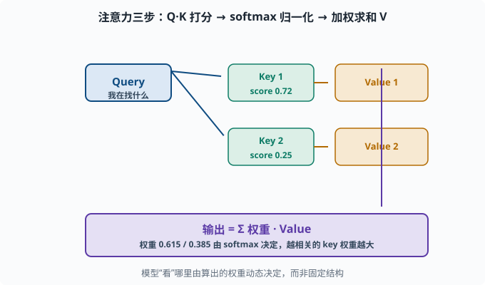
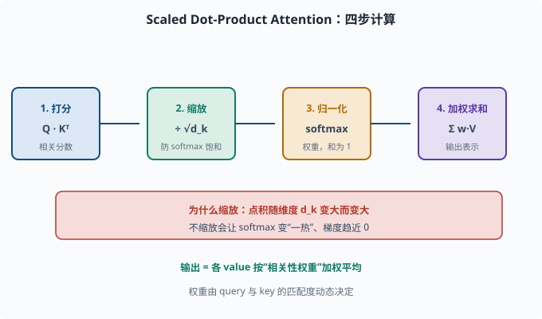
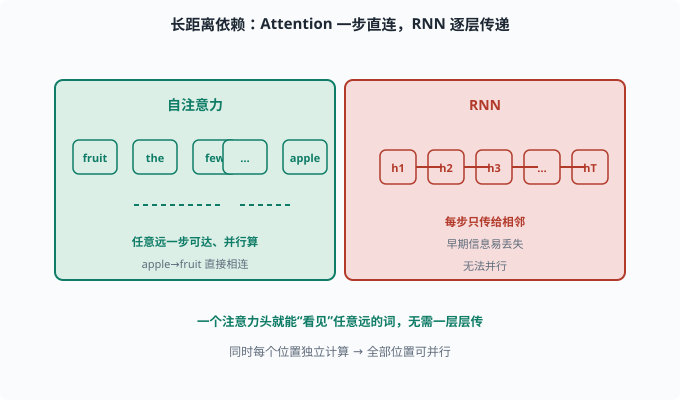
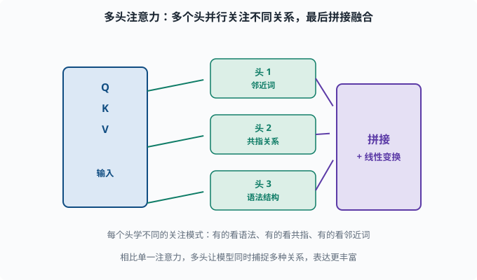

# 注意力机制：让模型动态地"只看该看的"

> 目标：吃透注意力（Attention）的数学与直觉。读完这一页，你能从 Q/K/V 讲透 scaled dot-product attention，并理解它为何同时解决"长依赖"和"C 一口闷"。

## 为什么需要注意力

上一页的痛点：

```text
Seq2Seq 把整段输入压进一个固定上下文向量 C → 长输入信息丢失
RNN 靠一步步记忆 → 早期信息走不到后文
模型被动地把所有输入一遍遍重读 → 该看哪里看哪里做不到
```

注意力机制的答案非常人性化：

> 生成/理解某个位置时，不要强迫模型记住一切，而是**动态地从输入里"检索"出此刻最相关的部分**。

就像人读英文翻译时，不会把整篇中文都背下来，而是"看到哪个词才去回看对应中文"。

## 用"查询-键-值"重新理解

注意力最通用的表述是 **QKV（Query-Key-Value）**：

- **Query（查询）Q**：当前"我在找什么"。
- **Key（键）K**：每个候选"我有什么线索"。
- **Value（值）V**：每个候选"我实际想带走的内容"。

流程三步：

```text
1. 打分：算 query 与每个 key 的相关性 → 越相关得分越高
2. 归一化：把这些得分 softmax 成权重（加起来=1）
3. 加权求和：按权重，把各个 value 加权平均成输出
```

输出 = 所有候选 value 的加权平均，权重由 query 与该候选 key 的匹配度决定。**模型"看"哪里，是由算出来的权重动态决定的**，而不是固定结构。

用数据库类比——`select * from v where q ≈ k`：Query 像搜索条件，Key 像索引字段，Value 像返回的内容。



上图把三步串起来：蓝色 Query 逐个发箭头去比对每个绿色 Key 得到相关分数（如 `0.72` 和 `0.25`），分数经过 softmax 归一化成权重，再按权重把右边琥珀色的各个 Value 加权求和，得到紫色输出。相关度越高、权重越大、输出越偏向那个 Value。这个"算权重、加权取内容"的过程，就是"动态看哪里"的全部含义。

## Scaled Dot-Product Attention：数学版

深度学习里最常用的一种注意力的公式：

```text
Attention(Q, K, V) = softmax( Q·K^T / sqrt(d_k) ) · V
```

拆开看：

- `Q·K^T`：Q 与每个 K 做点积，得到"相关分数"（形状 `len(Q) × len(K)`）。
- `/ sqrt(d_k)`：**缩放**，防止分数过大把 softmax 推成"一热"。
- `softmax(...)`：沿 key 轴归一化成权重。
- `· V`：用权重对各 value 加权求和。

为什么除以 `sqrt(d_k)`？点积大小会随维度 `d_k` 增大而变大，softmax 对这些大数值的梯度会趋近 0（饱和）。除以 `sqrt(d_k)` 让分布保持合理、梯度不消失。



上图把公式 `attention(Q,K,V) = softmax(Q·Kᵀ/√d_k)·V` 拆成四步横向流水线：先是`Q·Kᵀ`给每个 key 打分，再除以 `√d_k` 做缩放，接着 softmax 把分数归一化成"和为 1"的权重，最后按权重加权求和各个 value。底部红色条再次点出缩放的原因——点积会随维度变大，不缩放会让 softmax 变"一热"、梯度消失。四步走完，你手里就是"动态看哪里"的全部含义。

## 手算一个最小例子

给一个简化例子看清楚每一步。假设：

```text
Q = [[0.9, 0.1]]   # 1 个 query
K = [[0.8, 0.0], [0.2, 0.7]]   # 2 个 key
V = [[1.0, 0.0], [0.0, 1.0]]   # 2 个 value
```

第 1 步，点积打分：

```text
score1 = 0.9*0.8 + 0.1*0.0 = 0.72
score2 = 0.9*0.2 + 0.1*0.7 = 0.18 + 0.07 = 0.25
```

第 2 步，softmax（忽略 sqrt 缩放，为演示简洁）：

```text
exp(0.72) ≈ 2.054，exp(0.25) ≈ 1.284
总 = 3.338
w1 = 2.054/3.338 ≈ 0.615
w2 = 1.284/3.338 ≈ 0.385
```

第 3 步，加权求和 value：

```text
output = 0.615*[1.0,0.0] + 0.385*[0.0,1.0]
       ≈ [0.615, 0.385]
```

输出更接近 `value1`，因为 query 跟 `key1` 更相关（分数更高）。**权重 0.615/0.385 就是"注意力分配"，输出就是"按相关性加权的内容"。**

用代码验证：

```python
import torch
import torch.nn.functional as F

Q = torch.tensor([[0.9, 0.1]])
K = torch.tensor([[0.8, 0.0], [0.2, 0.7]])
V = torch.tensor([[1.0, 0.0], [0.0, 1.0]])
dk = K.size(-1)
scores = Q @ K.T / (dk ** 0.5)
weights = F.softmax(scores, dim=-1)
out = weights @ V
print("分数:", scores.tolist())
print("权重:", weights.tolist())
print("输出:", out.tolist())
```

用代码验证（注意：这段代码做了 `sqrt(d_k)` 缩放，所以分数和权重与上面"忽略缩放"的手算略有差异，但趋势一致：key1 分高、权重偏它——把下面的 `dk ** 0.5` 改成 `1` 就能完全复现手算的 0.615/0.385）：

## 自注意力（Self-Attention）：用 Q=K=V 让词互相"看"

上面的例子是"query 查询一堆 key"。**自注意力（self-attention）**的特殊之处是：

```text
对句子里的每个词，Q、K、V 都从"句子本身"算出来
→ 每个词都能"关注"句子里任意其它词
```

也就是输入序列里的每个位置同时扮演 query（要理解的点）和 key/value（要被关注的候选）。这样"apple"可以关注远在开头的"fruit"，**长距离依赖问题被直接瓦解**——不需要一层层传递，一个注意力头就看得到任意远的词。

而且所有位置可以**并行计算**（每个位置独立算注意力），这也是相比 RNN 无法并行的致命突破。



上图对比两种"长距离"的处理方式：左侧绿色是自注意力，`apple` 和很远的 `fruit` 之间直接拉一条注意力边，一步就能互相看见，而且所有位置都能并行算；右侧红色是 RNN，信息必须顺着 `h₁→h₂→…→hT` 一步步传过去，早期信息走到后文时可能已经被稀释或遗忘。这正是注意力"长依赖一步直达 + 可并行"的本质优势，也是它取代 RNN 的原因。

## 多头注意力：看不同的"视角"

单一注意力常不够丰富，于是**多头注意力（Multi-Head Attention）**——把注意力的输入投影切成 `h` 份（"头"），每份在更低维的子空间里独立做一遍注意力：

```text
把 Q/K/V 分成 h 份（头），每头独立算注意力
→ 每头学不同的关注模式
   （有的看语法、有的看共指（coreference："张三…他"里的"他"指谁这类指代关系）、有的看邻近词...）
最后把各头输出拼接、线性变换
```

头数 `h` 是超参。多头让模型能同时捕捉多种关系，而不只是单一视角。这是 Transformer 的核心组件（[05-06](05-06-transformer.md)）。



上图把"多头"化开：蓝色输入箱里的 Q/K/V 同时被分发到三个并行的绿色头，每个头独立算一套注意力。因为每个头的初始化与参数不同，它们会自发分化出不同的关注模式——有的关注邻近词、有的关注共指关系、有的关注语法结构。最后所有头的输出在右侧紫色箱里拼接并对特征做一次线性变换，融合成更丰富的表示。

## 注意力为什么这么重要：一句话总结

现代 NLP 的全部革命，几乎都能追溯到这一句话：

```text
一个位置可以动态地结合任意其它位置的信息，并全部并行计算。
```

它解掉了 RNN 的长依赖（任意远可直连）、Seq2Seq 的 C 容量（不用塞进固定向量）、以及串行（可并行）。下一页的 Transformer 就是把"自注意力 + 位置编码 + 前馈层"组合成完整架构。

## 思考题

1. Q、K、V 各自的作用是什么？
2. 注意力的三步流程是什么？哪一步决定了"模型看哪里"？
3. 为什么 scaled dot-product attention 要除以 `sqrt(d_k)`？
4. 自注意力如何解决"长距离依赖"？它为什么能并行？
5. 多头注意力的价值是什么？

## 参考答案

1. Q（Query）表示"我在找什么"，K（Key）表示"每个候选有什么线索"，V（Value）表示"每个候选实际想被取走的内容"。Q 与 K 相关性定权重，权重加权 V 得输出。
2. ① query 与各 key 打分；② softmax 归一化成权重；③ 按权重加权求和 value。第 2 步（归一化后的权重）直接决定了"看哪里"。
3. 因为点积大小随维度 `d_k` 增大而增大，softmax 对大数值会饱和、梯度趋近 0。除以 `sqrt(d_k)` 把分数拉回合理尺度，保持分布与梯度健康。
4. 因为任意一个位置的 query 都能直接对任意远的位置的 key/value 打分，无需像 RNN 逐层传递记忆；长距离信息一步可达。同时每个位置独立计算注意力，可并行，不受"上一步输出"串行依赖限制。
5. 让模型同时从多个子空间捕捉多种关注模式（如不同头分别关注语法、共指、邻近词），表达能力比单个注意力更丰富。各头输出再拼接、变换融合。

## 下一步

- 想把自注意力组织成完整可复用的架构 → [05-06 Transformer](05-06-transformer.md)。
- 想知道"没有 RNN 时顺序信息放哪" → [05-07 位置编码](05-07-positional-encoding.md)。
- 想回看 Seq2Seq 里"C 一口闷"的痛点 → [05-04 Seq2Seq](05-04-seq2seq.md)。

[返回本章目录](README.md)
