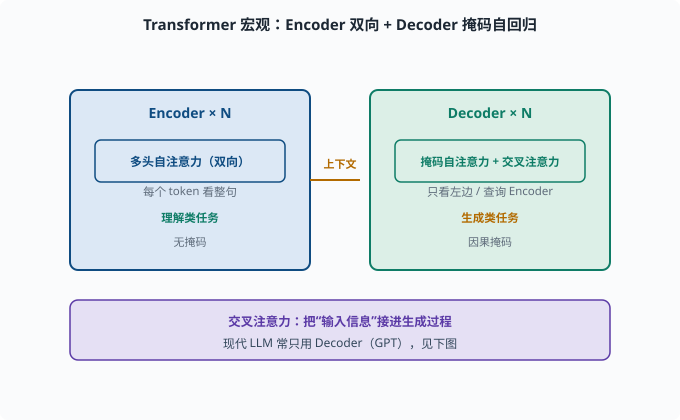
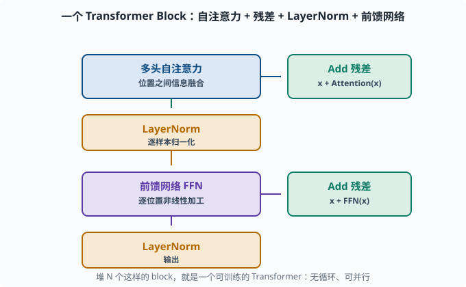
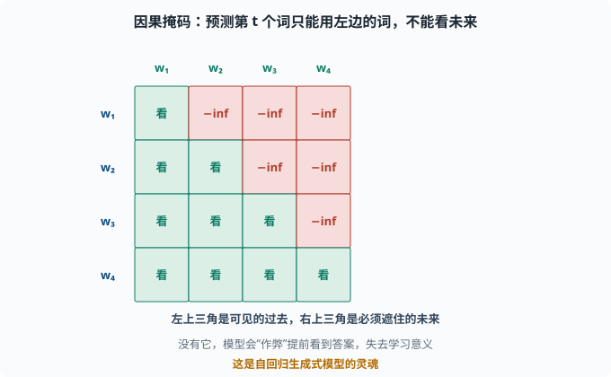
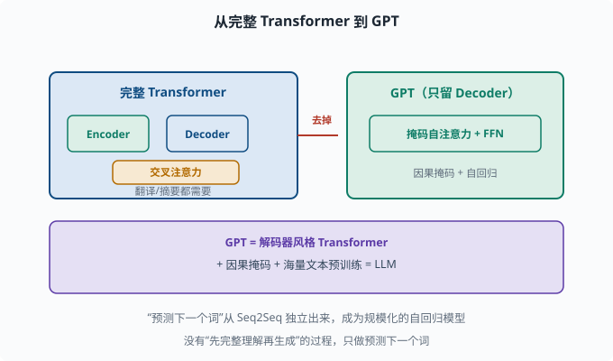

# Transformer：并行、可缩放、统治一切的架构

> 目标：拆开"Attention Is All You Need"里的完整 Transformer。读完这一页，你能讲清自注意力、多头、位置编码、前馈层、残差与 LayerNorm 如何拼成一个可训练的模块。

## Transformer 为什么是转折点

2017 年论文《Attention Is All You Need》提出了 Transformer。它把 [05-05](05-05-attention.md) 的自注意力作为核心，彻底取代 RNN。三个决定性优势：

```text
1. 并行：所有位置同时算，不再逐时间步串行
2. 长距离：任意位置一步直达，长依赖不再是难题
3. 可缩放：结构规整、无循环，天然适合 GPU/TPU 大规模并行
```

从那以后，几乎所有现代 NLP、图像、乃至多模态模型都以它为基础。LLM（[06](../06-llm-fundamentals/README.md)）就是 Transformer 的规模化与简化。

## 宏观图景：编码器-解码器

原始 Transformer 仍是 [05-04](05-04-seq2seq.md) 的编码器-解码器，但每一块都用注意力：

```text
输入 → 嵌入 + 位置编码 → [多头自注意力 + FFN] x N  (编码器)
                                                        │上下文
输出 → 嵌入 + 位置编码 → [带掩码多头自注意力 + 交叉注意力 + FFN] x N  (解码器)
                                                                    → 输出分布
```

两个关键点：

- 编码器是**双向**的（每个 token 能看到整句），适合"理解类"任务。
- 解码器用**掩码（masked）自注意力**（只看左边/自己），保证自回归生成——预测词时不能偷看未来的词；此外解码器引入**交叉注意力（cross-attention）**：解码器查询编码器的输出，把"输入信息"接进生成过程。

现代 LLM 常常只用**解码器**（GPT 风格），因为只要"预测下一个词"，不需要像翻译那样"先整个理解源句再生成"。这是 [06](../06-llm-fundamentals/README.md) 的重点。



上图把完整 Transformer 画成左右两块：左边蓝色是编码器，堆 N 层"多头自注意力"，每个 token 能看整句（双向），负责"理解类"任务；右边绿色是解码器，堆 N 层"掩码自注意力 + 交叉注意力"，每个 token 只能看左边（因果掩码），并额外通过交叉注意力去查询编码器的输出，负责"生成类"任务。中间琥珀色箭头就是这两部分交换信息的"上下文"。理解这一点，你就能看懂为什么机器翻译需要 Encoder+Decoder，而纯生成的模型可以只留 Decoder。

## 一个 Transformer Block：层层拆解

无论编码器还是解码器，核心都是**反复堆叠的 block**。一个 block 典型由几样拼成：

```text
输入
  → 多头自注意力 (Multi-Head Self-Attention)
  → + 残差连接 (Add)
  → LayerNorm
  → 前馈网络 FFN (MLP)
  → + 残差连接 (Add)
  → LayerNorm
输出
```

即**"自注意力 → 加回残差 → 归一化 → 前馈 → 加回残差 → 归一化"**，每个 block 是对输入做一次"信息融合 + 非线性变换"。



上图把单个 block 的数据流画出：蓝色"多头自注意力"负责位置之间的信息融合，右侧绿色"Add 残差"把结果加回原输入，再经过琥珀色 LayerNorm 做逐样本归一化；随后紫色"前馈网络 FFN"对每个位置做独立的非线性加工，再一次"Add 残差 + LayerNorm"。这样从左到右、自下而上，堆出可供并行训练的规整结构。

### 残差连接（Add）

`x + Attention(x)`：把自注意力的输出加回原始输入。作用是给梯度留"短路"，深层也可训练（你已在 [04-07](../04-deep-learning/04-07-cnn.md) 的 ResNet 见过相同思想）。

### LayerNorm（归一化）

对每个样本的**所有特征**做归一化（不像 BatchNorm 依赖 batch 统计，[04-06](../04-deep-learning/04-06-training-tricks.md) 讲过两者区别），让层内分布稳定，训练更稳。这是语言模型普遍偏好 LayerNorm 的原因。

### 前馈网络 FFN

每个位置独立通过一个小的两层 MLP（通常 `d_model → 4*d_model → d_model` 中间扩 4 倍 + ReLU/GELU——GELU 是 ReLU 的平滑变体，现代 Transformer 更常用）。它给每个位置的表示做一次"非线性加工"。注意：**FFN 是逐位置独立**的，位置之间的交互全靠注意力。

## 维度三件套：d_model、n_heads、n_layers

看清 Transformer 的"尺寸语言"：

```text
d_model：隐藏维度（词向量和每层表示的宽度），如 512/768/4096
n_heads：多头注意力头数，如 8/12/32
n_layers：堆叠多少层 block，如 6/12/24/48/96
```

模型"大小"主要由这三者决定。例如 GPT 系的扩张规律：`参数 ≈ 12 * n_layers * d_model²`（大致比例），你会在 [07](../07-llm-engineering/README.md) 用上这个估算。

## 一个极简的 PyTorch 多头注意力块

```python
import torch
import torch.nn as nn
import torch.nn.functional as F

class MultiHeadAttention(nn.Module):
    def __init__(self, d_model, n_heads, dropout=0.1):
        super().__init__()
        self.d_model = d_model
        self.n_heads = n_heads
        self.d_k = d_model // n_heads
        self.Wq = nn.Linear(d_model, d_model)
        self.Wk = nn.Linear(d_model, d_model)
        self.Wv = nn.Linear(d_model, d_model)
        self.out = nn.Linear(d_model, d_model)

    def transpose(self, x):
        B, T, _ = x.shape
        x = x.view(B, T, self.n_heads, self.d_k).transpose(1, 2)
        return x  # (B, n_heads, T, d_k)

    def forward(self, Q, K, V, mask=None):
        B, T, _ = Q.shape
        q, k, v = self.transpose(self.Wq(Q)), self.transpose(self.Wk(K)), self.transpose(self.Wv(V))
        scores = q @ k.transpose(-2, -1) / (self.d_k ** 0.5)   # (B,h,T,T)
        if mask is not None:
            scores = scores.masked_fill(mask == 0, float('-inf'))
        attn = F.softmax(scores, dim=-1)
        out = attn @ v                                    # (B,h,T,d_k)
        out = out.transpose(1, 2).contiguous().view(B, T, self.d_model)
        return self.out(out)

net = MultiHeadAttention(64, 8)
x = torch.randn(2, 10, 64)      # batch=2, seq=10, d_model=64
print("多头注意力输出:", net(x, x, x).shape)     # (2,10,64)
```

注意这里 Q=K=V=x，即**自注意力**；`mask` 用于解码器的"只看左边"。

## 完整 block 的组装

```python
class TransformerBlock(nn.Module):
    def __init__(self, d_model, n_heads, ff_dim=None):
        super().__init__()
        ff_dim = ff_dim or 4*d_model
        self.attn = MultiHeadAttention(d_model, n_heads)
        self.norm1 = nn.LayerNorm(d_model)
        self.ffn = nn.Sequential(
            nn.Linear(d_model, ff_dim), nn.ReLU(), nn.Linear(ff_dim, d_model))
        self.norm2 = nn.LayerNorm(d_model)

    def forward(self, x):
        x = self.norm1(x + self.attn(x, x, x))   # 自注意力 + 残差 + 归一化
        x = self.norm2(x + self.ffn(x))          # FFN + 残差 + 归一化
        return x
```

堆 N 个这样的 block，就是一个可训练的 Transformer。它没有循环、每一步都可并行——这就够了。

## Mask：为什么解码器"不能看未来"

训练 GPT 这类自回归模型时，预测第 t 个词只能用位置 `1..t-1` 的信息，不能看 `t+1..T` 的未来词。做法是在自注意力的分数矩阵上，把"未来位置"的分数置为 `-inf`，softmax 后权重就是 0：

```text
scores[i][j] = -inf  （当 j > i，即位置 j 在未来）
→ attention 权重为 0，看不到未来
```

这个**因果掩码（causal mask）**是生成式模型的灵魂。没有它，模型会"作弊"提前看到答案，失去学习意义。



上图把 4 个词的自注意力分数矩阵画成一个下三角"可见区"：绿色部分是"可以看"的过去（`j ≤ i`），红色部分是必须遮掉的未来（`j > i`），未来位置的分数被置为 `-inf`，softmax 之后权重正好归零。这样预测 `w₃` 时只能用到 `w₁,w₂`，模型无路可退地只能依赖左侧上下文。

## 从 Transformer 到 LLM

对 [06](../06-llm-fundamentals/README.md) 最关键的简化是：

```text
GPT = 只保留解码器（去掉交叉注意力）+ 因果掩码 + 海量文本预训练
```

于是"预测下一个词"从 Seq2Seq 的解码器里独立出来，成为一个庞大的自回归模型。这一页把 Transformer 的骨架讲清了，06 章的任务就是填上"预训练、损失、规模规律"这些血肉。



上图演示这条"简化"路线：左边蓝色是完整 Transformer（Encoder + Decoder + 交叉注意力），主要用于翻译、摘要这类"先理解再生成"的任务；红色箭头把需要编码器的东西"去掉"，右边绿色剩下的就是 GPT——只留解码器风格的"掩码自注意力 + FFN"，加上因果掩码做自回归。底部紫色条给出结论：GPT = 解码器风格 Transformer + 因果掩码 + 海量文本预训练 = LLM。这就是为什么"预测下一个词"能独立成一个庞大的自回归模型。

## 思考题

1. Transformer 相对 RNN 的三个决定性优势是什么？
2. 一个 Transformer block 中，哪个组件负责"位置之间的信息融合"，哪个负责"每个位置的非线性加工"？
3. 残差连接在 Transformer 里起什么作用？
4. 为什么解码器需要因果掩码？它把什么分数置为 -inf？
5. GPT 与完整 Transformer（编码器-解码器）的主要差别是什么？

## 参考答案

1. 并行（所有位置同时算）、长距离（任意位置直接互相看，无长依赖）、可缩放（结构规整、无循环，适配大规模并行硬件）。
2. 多头自注意力负责位置间信息融合（每个词关注其它词）；FFN 负责每个位置自身的非线性加工（逐位置独立 MLP，把融合后的表示做深层变换）。
3. 残差连接 `x + F(x)` 给梯度提供"短路"，让非常深的 Transformer 也可训练，避免层数加深导致梯度消失。
4. 因为自回归预测第 t 个词只能用前 1..t-1 的信息，不能偷看未来。因果掩码把"未来位置 j>i"的注意力分数置为 -inf，softmax 后权重归零。
5. GPT 只保留解码器风格（自注意力 + FFN，无编码器/交叉注意力），并施加因果掩码做纯自回归。它去掉"先完整理解再生成"的过程，只做"预测下一个词"，配合预训练成为通用 LLM。

## 下一步

- 想知道"顺序信息在没有 RNN 时怎么编码" → [05-07 位置编码](05-07-positional-encoding.md)。
- 想看 Transformer 如何通过预训练变成 BERT/GPT → [05-08 预训练范式](05-08-pretraining.md)。
- 想深入研究它的规模化与非标准实现 → [06 LLM 原理](../06-llm-fundamentals/README.md)。

[返回本章目录](README.md)
