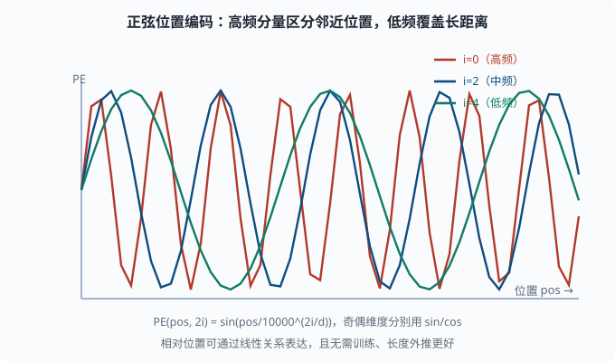
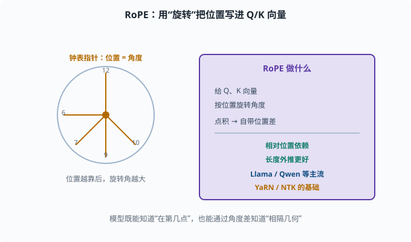
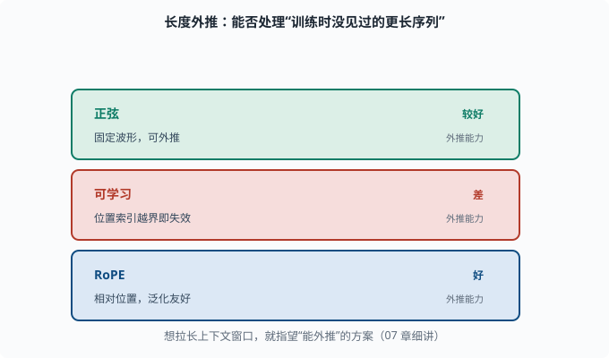

# 位置编码：没有 RNN 时，顺序信息放哪

> 目标：理解 Transformer 为什么必须显式添加位置信息，以及正弦/可学习/旋转三种常见做法。读完这一页，你能说清"自注意力是置换不变的，位置必须靠编码补上"。

## 自注意力有个"失忆"：不记得顺序

上一页提到自注意力让每个位置能看任意其它位置。但这里藏着一个隐患：

> 自注意力对"位置的顺序"是**置换不变（permutation invariant）**的——把输入顺序打乱，注意力结果完全一样。

为什么？因为注意力只算"query 与 key 的相关性"，它不在乎谁在第几个位置，只看内容匹配度。看：

```text
"我爱北京"
"北京爱我"
```

这两个句子的词一样，只是顺序不同，语义天差地别。但自注意力会认为它们的表示一样（按词匹配权重相同），模型分不清"谁先谁后"。这对语言是致命的——顺序就是语义。

所以必须**显式地把"位置信息"注入**到输入里，让每个位置的表示带上"我在第几位"的信号。

## 方案一：正弦位置编码（原始 Transformer）

论文用**正弦波（sinusoidal）**给每个位置加上一个有规律的向量。对位置 `pos`、维度 `i`：

```text
PE(pos, 2i)   = sin(pos / 10000^(2i/d_model))
PE(pos, 2i+1) = cos(pos / 10000^(2i/d_model))
```

即：奇偶维度分别用 sin/cos，频率随维度指数衰减。

为什么用正弦？几个属性：

- **相对位置可通过线性关系表达**：`PE(pos+k)` 可以写成 `PE(pos)` 的线性变换，让模型更容易学习"间距 k"的关系（比如"相隔几个词"）。
- **无需训练**：它是固定生成的，天然支持训练时没见过的更长序列。
- **有界**：sin/cos 数值恒在 [-1,1]，稳定。



上图画出三个不同频率的分量：高频分量（红色）在相邻位置间变化快，用于区分紧挨的邻居；中频（蓝色）和低频（绿色）变化慢，能覆盖更远的位置距离。因为频率随维度 `2i/d_model` 指数衰减，低维度负责"细节位置"、高维度负责"大致范围"，多分量叠加后每个位置都得到一个独一无二且有规律的向量。

## 方案二：可学习位置编码

更简单粗暴的思路：**把位置的嵌入也当一个可学习的参数表**，训练时自动学出位置向量。

```python
import torch.nn as nn

class LearnablePosEncoding(nn.Module):
    def __init__(self, max_len, d_model):
        super().__init__()
        self.pe = nn.Embedding(max_len, d_model)

    def forward(self, x):
        B, T, _ = x.shape
        positions = torch.arange(T)
        return x + self.pe(positions)   # 加到词向量上
```

训练时学到固定的位置向量（位置是整数索引）。许多早期 BERT/GPT 用这个。缺点：**不能外推**到训练时没见过的更长序列。

## 方案三：旋转位置编码 RoPE（现代 LLM 主流）

现代 GPT 系（Llama、Qwen 等）普遍用**旋转位置编码（RoPE，Rotary Position Embedding）**。

核心思想：不是把位置加到向量上，而是**给 Q、K 向量做旋转**，旋转角度由位置决定。

```text
位置越靠后，Q/K 向量旋转的角度越大
两个向量的点积（相似度）里自然带入了"位置差"
```

于是：

- 注意力分数天然包含"相对位置"信息。
- **相对位置依赖**：模型关注"距离"，而不是绝对位置，这对长文本泛化更友好。
- **长度外推更好**：许多加速与扩展技巧都基于 RoPE（如 YaRN、NTK——两种"调 RoPE 旋转频率、让短文本训练的模型能直接处理更长输入"的插值方案，[07](../07-llm-engineering/README.md) 会讲）。

理解 RoPE 有个直观抓手：把向量想成钟表指针，位置决定指到几点。模型既能知道"这个 token 在第几点"，也能通过角度差知道"两个 token 相隔几何"。



上图把 RoPE 的核心用两个抓手讲清：左半边是"钟表"类比，每个位置对应一个角度，位置越靠后旋转角越大，就像指针指向不同的"几点"；右半边紫色框是它的作用——不给向量"加"位置，而是给 Q、K 向量"做旋转"，让点积（相似度）自然携带位置差。由此带来的两点好处：注意力分数依赖**相对位置**而不是绝对位置，长度外推也更友好，因此成为 Llama、Qwen 等现代 LLM 的主流。

## 对比：三种位置编码

| 方案 | 是否可学习 | 长度外推 | 相对位置 | 主要使用 |
|---|---|---|---|---|
| 正弦 | 否（固定） | 较好 | 好（线性关系） | 原始 Transformer |
| 可学习 | 是 | 差（超出训练长度直接截断） | 一般 | 早期 BERT/GPT |
| RoPE | 否（旋转） | 好 | 好（位置差） | Llama/Qwen 等现代 LLM |

## 为什么"外推"如此重要

所谓**长度外推（length extrapolation）**指训练时没见过那么长的序列，但推理时能处理更长。对 LLM 尤其关键，因为人们总想让"上下文窗口"变长（[07](../07-llm-engineering/README.md)）。

可学习编码死板地固定在训练长度内，超出的位置没有向量可用；正弦和 RoPE 更有希望把长度"推广"出去。这正是那些"把 2k 窗口变成 128k"的技巧的底层逻辑。



上图把三种位置编码的外推能力并排列出：正弦编码（固定波形）能外推但表达相对位置要依赖线性关系；可学习编码在训练长度内表现好，但位置索引一旦越界就没有向量可用，外推能力差；RoPE 把位置写成相对关系，对长文本最友好。这就是"长度外推（length extrapolation）"的含义——它决定了一个模型能不能处理"训练时没见过的更长序列"，也是后面拉长上下文窗口技巧的底层逻辑。

## 一个让"置换不变"可见的代码实验

亲手证明"为什么需要位置编码"：

```python
import torch
import torch.nn.functional as F

def attention(Q, K, V):
    dk = K.size(-1)
    return F.softmax(Q @ K.T / dk**0.5, dim=-1) @ V

Q = torch.randn(1, 32); K = torch.randn(3, 32); V = torch.randn(3, 32)
o1 = attention(Q, K, V)

# 打乱 K/V 的顺序
perm = torch.tensor([2, 0, 1])
o2 = attention(Q, K[perm], V[perm])
print("打乱前:", o1.detach().tolist())
print("打乱后:", o2.detach().tolist())
print("完全相等:", torch.allclose(o1, o2))
```

输出说明：只要 K/V 成对一起打乱，注意力结果不变——**自注意力确实"忘了"位置**。这证明了必须靠位置编码把顺序信息塞回去。

## 思考题

1. 为什么自注意力是"置换不变"的？这对语言为什么是问题？
2. 正弦位置编码的哪个属性让它能表达"相对位置"？
3. 可学习位置编码的一个明显缺点是什么？
4. RoPE 把位置信息"藏"在哪个操作里？它带来的两个好处是什么？
5. 什么是长度外推？为什么它对 LLM 很重要？

## 参考答案

1. 因为自注意力只按"query 与 key 的内容匹配"决定权重，不在乎输入顺序，把 K/V 成对打乱结果不变。语言里顺序就是语义（"我爱北京"≠"北京爱我"），没有位置信息模型无法区分。
2. 正弦波的平移可以用原位置的线性变换表达（`PE(pos+k)` 是 `PE(pos)` 的线性函数），所以模型能学习"间距 k"的相对关系，而不仅是绝对位置。
3. 位置向量固定到训练时的最大长度，遇到更长的序列没有对应向量，长度外推能力差（超出位置索引就"越界"）。
4. 藏在"旋转 Q/K 向量"里：按位置给向量旋转角度，使点积自然携带位置差。好处是注意力分数依赖相对位置，且对长文本泛化/外推更友好。
5. 长度外推指模型能处理比训练时更长的序列。对 LLM 很关键，因为真实场景的文本常常超过训练长度（长文档、长对话），用户又总希望窗口越长越好。

## 下一步

- 想看到"自注意力 + 位置编码"如何在海量文本上预训练 → [05-08 预训练范式](05-08-pretraining.md)。
- 想研究 RoPE 的扩展与窗口拉长 → [07 LLM 工程](../07-llm-engineering/README.md)。
- 想复习自注意力数学 → [05-05 注意力机制](05-05-attention.md)。

[返回本章目录](README.md)
