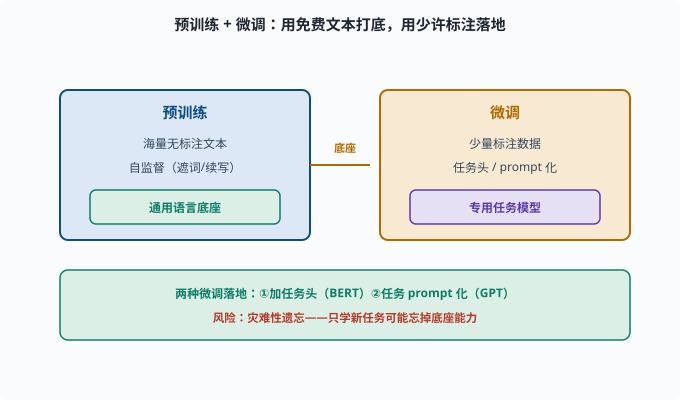
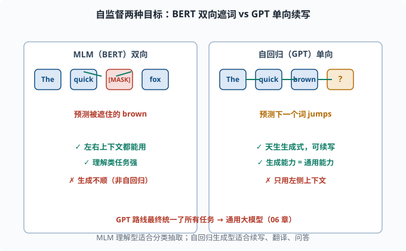

# 预训练范式：BERT 与 GPT 的两种自监督策略

> 目标：理解"预训练 + 微调"如何成为 NLP 主流。读完这一页，你能对比 BERT 的双向/掩码目标和 GPT 的自回归/next-token 目标，也知道为什么后者最终成为通用大模型的基础。

## 一个数据困境：标注很贵，文本很便宜

想让模型会"分类、抽取、问答、生成"，传统做法是给每个任务人工标大量数据。但标注贵、慢、且每个任务要重新标。与此同时，互联网上有**海量无标注文本**，几乎免费。

能不能先用免费的海量文本把模型"喂"成一个很懂语言的底座，再针对具体任务用少量标注微调？

这就是**预训练 + 微调（pretrain + finetune）**范式：

```text
预训练：用海量无标注文本 + 自监督目标，得到通用语言模型底座
微调：用少量标注数据，把底座调到具体任务
```

自监督（self-supervised）在这里指：**目标来自数据本身，无需人工标注**。文本里的每一个 token 都能自己造出"答案"。



上图把整个流程图铺开：左侧蓝色用"海量无标注文本 + 自监督"训出一个通用语言底座（会续写、懂语言），中间琥珀色箭头"底座"把它接到右侧黄的微调阶段，用"少量标注数据"通过"任务头或 prompt 化"落到具体的专用任务。底部绿色条补充两点：微调常用两种落地方式（加任务头 / 任务 prompt 化），以及风险——灾难性遗忘，只学新任务可能把底座的通用能力忘掉。这就是"预训练 + 微调"范式的全貌。

## 自监督的两种主要目标

预训练模型的差别，主要在于**用什么自监督任务**：

| 目标 | 思路 | 代表 |
|---|---|---|
| 掩码语言建模（MLM） | 随机遮住一些词，让模型根据**左右**上下文猜它 | BERT |
| 自回归语言建模（next token） | 根据**左边**上下文预测下一个词 | GPT |

这两种"看的方向"完全不同，直接决定了模型的性格。



上图左右并列两种目标。左侧 BERT 的 MLM 把某个词（[MASK]）遮住，模型可以同时看到左右两边的词来猜它，因此是"双向"的、擅长理解类任务；右侧 GPT 的自回归只允许从左往右看，看到 `The quick brown` 后预测下一个 `jumps`，因此是"单向"的、天生适合生成。箭头方向把"看的方向"画得很直观：MLM 是左右夹击，自回归是单向推进。

## MLM：双向但"非生成式"

**掩码语言建模（Masked Language Modeling，MLM）**：

```text
随机把文本里 15% 的 token 换成 [MASK]
让模型根据"左右两边"的上下文，预测被遮住的 token
```

例：

```text
原文：The quick brown fox jumps over the lazy dog
遮词：The quick [MASK] fox jumps over the lazy dog
目标：预测出 "brown"
```

MLM 的优势是**双向**：一个词能同时看左边的词和右边的词，这对"理解类"任务（判断、分类、抽取）非常有利——判断一个词的含义，左右上下文都重要。

代价：它不是"自然流畅的自回归生成式"模型。要"押下一个词"地生成新文本，BERT 并不顺（生成要靠特殊解码）。

还有一个训练细节值得知道：BERT 的 15% 遮词里其实**并非全部换成 [MASK]**——80% 换 [MASK]、10% 换成随机词、10% 保持原词。为什么搞这么复杂？因为微调/使用时输入里**不会真的出现 [MASK] 这个特殊 token**：如果预训练永远只见过"[MASK] 处要预测"，模型与真实输入之间就有一道分布裂缝；混入随机词和原词，等于逼模型学会"任何位置都可能需要纠错检查"，让预训练与下游使用保持一致。这是"预训练目标要为下游留好接口"的典型案例。

## GPT：单向但"生成式"

**自回归语言建模（autoregressive LM）**就是 [05-01](05-01-lm-basics.md) 讲的目标：给定左边上文，预测下一个词。

```text
输入：The quick brown fox
目标：预测 "jumps"（紧跟的词）
```

它用**因果掩码**（[05-06](05-06-transformer.md)），每个词只能看左边。它天生就是**生成式**的：预测完下一个词，把它接上再预测下下一个，就能源源不断地生成完整文本。

看似"浪费"了右边的上下文，其实这正是它的隐藏力量：**生成能力 = 通用能力**。翻译、摘要、问答、写代码，都可以被重新定义成"续写/生成"任务。GPT 就赌这一条路能通吃所有任务。

## 微调：从"底座"到"专用"

预训练得到的是一个"泛懂语言"的底座，还没针对具体任务。微调就是拿它做两件事之一：

1. **加一个任务头（head）**：在底座上接分类层、抽取层等输出结构，用少量标注数据微调（BERT 常用于此，处理 [05-09](05-09-nlp-tasks.md) 的各种任务）。
2. **任务 prompt 化**：把任务改写成"继续生成"的形式，继续训练或直接推理（GPT 常用于此）。

微调有个著名风险叫**灾难性遗忘（catastrophic forgetting）**：只针对新任务训练，可能把预训练学到的通用能力忘掉。于是又有各种缓解手段（如混合预训练数据、冻结底座只调小参数等，[07](../07-llm-engineering/README.md) 会展开）。

## 为什么 GPT 路线赢了：从"微调"到"提示"

早期大家都做"BERT 微调"，每个任务加个 head。GPT 路线的革命是：**去掉任务头，把任务本身描述成一句 prompt，让模型续写。**

```python
# 同一个模型，不同 prompt 就能做不同任务
transl_prompt = "把中文翻译成英文：你好 → "
qa_prompt     = "问题：中国的首都是？答案："
sum_prompt    = "请用一句话总结这段话：..."
```

模型只需要"接着写"，就能完成翻译、问答、摘要。这就是**提示工程（prompting）**的源头，也是 [07](../07-llm-engineering/README.md) 章反复出现的主题。它让一个预训练模型成了"万能"的通用底座，不必为每个任务重新微调——之后进化出 instruction tuning（指令微调：用"指令→理想回答"格式的数据继续训练，教模型听懂并执行指令）、RLHF（[06](../06-llm-fundamentals/README.md)、[11](../11-safety-governance/README.md)）。

## 规模规律：为什么"越大越好"

GPT 路线还发现一个惊人事实：**模型和数据越大，能力越强，甚至出现"涌现"**（[06](../06-llm-fundamentals/README.md) 细讲）。当参数量和数据量跨越某个门槛，模型的常识、推理、思维链等能力会显著跃升。

这背后的工程是 [04-09](../04-deep-learning/04-09-distributed.md) 的分布式训练 + 海量算力。于是行业从"刷小任务"转向"造超大底座"。

## 思考题

1. 为什么需要用"无标注文本 + 自监督"预训练？
2. BERT 的 MLM 目标是什么？它为什么是"双向"的？适合什么任务？
3. GPT 的自回归目标是什么？它是"单向"的，为什么反而在生成任务上有优势？
4. 微调常见的两种落地方式是什么？
5. 为什么 GPT 路线的"prompt 化"让一个模型可以做很多任务？

## 参考答案

1. 因为人工标注昂贵、每个任务要反复标注，而互联网上海量无标注文本几乎免费。自监督用数据本身生成"答案"（如预测被遮词/下一个词），即可在巨大语料上训练通用底座，再用少量标注微调到具体任务。
2. 随机遮住 15% 的 token，让模型根据左右两边上下文预测被遮词。因为它能同时利用左右上下文，故称双向；适合分类、判断、抽取等"理解类"任务。
3. 给定左边上文预测下一个词，用因果掩码实现单向。它天生是生成式的，能不断续写；而生成可以统一表达翻译、摘要、问答等，所以"能生成=通用"，再配合预训练与 prompt 化。
4. 一是加任务头（如分类/抽取层）用标注数据微调（BERT 风格）；二是任务 prompt 化，把任务改写成"继续生成"继续训练或直接推理（GPT 风格）。
5. 因为不同任务可以被写成不同 prompt，而模型的输出统一是"继续生成"，无需为每类任务单独加一个头或重新微调。同一底座用不同 prompt 就能切换任务，既灵活又复用预训练知识。

## 下一步

- 想知道"预训练底座能做什么具体任务、怎么建模" → [05-09 NLP 任务全景](05-09-nlp-tasks.md)。
- 想看"自回归语言模型=LLM"的规模化、涌现、指令微调 → [06 LLM 原理](../06-llm-fundamentals/README.md)。
- 想研究微调与提示工程的实际操作 → [07 LLM 工程](../07-llm-engineering/README.md)。

[返回本章目录](README.md)
