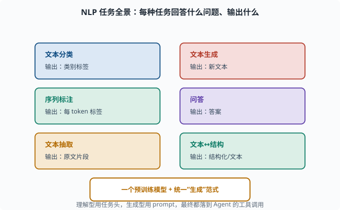
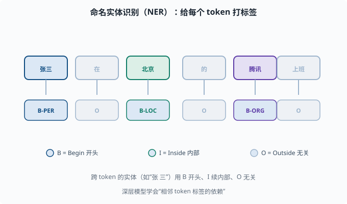

# NLP 任务全景：分类、抽取、生成与问答的建模方式

> 目标：建立"NLP 常见任务长什么样、怎么用模型建模"的地图。读完这一页，你能为文本分类、序列标注、抽取、生成、问答各自讲出典型的输入/输出与建模套路。

## 为什么需要一个"任务全景"

预训练模型（[05-08](05-08-pretraining.md)）是"泛懂语言"的底座，但真实世界要解决的是具体任务。这一页把 NLP 的主要任务归类，告诉你每类任务要模型回答什么问题、通常怎么建模。之后无论你读论文还是做产品，都能快速对号入座。



上图是一张六宫格速查地图，每个格子写一类任务和它"输出什么"：文本分类输出类别标签、序列标注输出每个 token 的标签、文本抽取输出原文片段、文本生成输出全新文本、问答输出答案、文本↔结构在结构和文本之间转换。底下琥珀色的底座提醒你：这些任务最终都可以挂在一个统一的预训练模型上，理解型用任务头、生成型用 prompt。

## 任务一：文本分类

**输入**：一段文本 **输出**：一个类别标签。

例子：

```text
情感分析：影评 → 正面/负面
垃圾邮件检测：邮件 → 垃圾/正常
主题分类：新闻 → 体育/财经/科技
```

建模方式（BERT 风格）：在文本前加 `[CLS]`，用整个序列的双向编码得到句子的综合表示，接一个分类层输出类别概率（softmax）。也可以用 LLM prompt 化"一句话回答类别"。

## 任务二：序列标注 / NER

**输入**：一段文本 **输出**：每个 token 一个标签。

例子：**命名实体识别（NER）**——找出文本里的人名、地名、机构：

```text
输入：张三 在 北京 的 腾讯 上班
标签：人名  ─   ─   地名  ─   机构  ─
```

建模：给每个 token 的表示接一个标签分类头（常用 `BIO` 标注：B = Begin 实体开头、I = Inside 实体内部、O = Outside 无关）。深层模型能学到"相邻 token 标签的依赖"。



上图把 NER 的 `BIO` 标注摊开：每个 token 上方是它本身，下方箭头指向它对应的标签。`张三` 标 `B-PER`（人名开头）、`北京` 标 `B-LOC`（地名单词）、`腾讯` 标 `B-ORG`（机构），其余无关词标 `O`。底部的图例解释这三个符号：B 表示实体开头、I 表示实体内部、O 表示与该实体无关。跨多个 token 的实体（比如"张 三"）就用 B 开头、I 续内部，配合后续组合把完整实体拼出来。

## 任务三：文本抽取

**输入**：一段文本 + 一个问题/要求 **输出**：文本里的一段/**几段关键内容**。

例子：

```text
抽取式问答：给一段文章，问"主角去了哪" → 输出文章里那句话/那一段
关系抽取：从句子中抽出 (实体1, 关系, 实体2) 三元组
```

关键：**答案是从原文里"截取"出来的**，不是模型自由发挥。这种任务对"忠实性"要求高，适合理解型底座。

## 任务四：文本生成

**输入**：一段文本（或 prompt） **输出**：全新生成的文本。

例子：机器翻译、摘要、写诗、写代码、对话回复。

建模：自回归解码（[05-04](05-04-seq2seq.md) 的 decoder、[05-06](05-06-transformer.md) 的生成式 Transformer），一个 token 一个 token 地"续写"，直到结束标记。现代 LLM 的绝大多数产品体验（包括 Agent 的输出）都属于生成。

## 任务五：问答（QA）

**输入**：问题（常带上下文/文档） **输出**：答案。

三种子类型：

```text
抽取式 QA：答案从文档里选一段（上面任务三）
开放域 QA：不给定文档，凭模型知识回答
多轮对话：结合上文的连续问答
```

现代 LLM 把"开放域 QA"和"多轮对话"统一成了"生成"：给 prompt 里塞入上下文，模型把答案当作续写生成出来。这也是 RAG（检索增强生成——先检索相关文档、再把文档塞进 prompt 让模型作答）的用武之地，[07](../07-llm-engineering/README.md) 展开。

## 任务六：文本↔结构

把文本转成结构化表示，或反之：

```text
文本 → 结构化：情感分类标签、情绪标签、意图识别、抽取三元组
结构化 → 文本：表 → 自然语言描述
```

这在 agent 场景尤其常见：从用户请求里抽出"意图 + 槽位"，或把工具的返回值整理成自然语言回复。

## 一张任务速查表

| 任务 | 输入 | 输出 | 典型建模 |
|---|---|---|---|
| 文本分类 | 一段文本 | 类别标签 | [CLS] + 分类头 / 生成 |
| 序列标注 | 文本 | 每 token 标签 | BIO + token 分类头 |
| 抽取 | 文本+要求 | 原文片段 | 抽取头 / RAG 生成 |
| 生成 | prompt/文本 | 新文本 | 自回归解码 |
| 问答 | 问题(±文档) | 答案 | 抽取或生成 |
| 文本↔结构 | 文本/表格 | 结构化/文本 | 分类头 / 生成 |

## 这些任务和 Agent 的关系

deepseek-harness 里的 agent（[08](../08-agent-foundations/README.md)）本来就是一连串 NLP 任务的产品组合：

```text
理解用户意图 → 意图分类/抽取（任务一、六）
决定调用哪个工具 → 工具选择的分类/生成
填写工具参数 → 参数抽取/结构化生成
生成最终回复 → 文本生成（任务四）
多轮对话 → 对话式问答（任务五）
```

所以"语言模型能做这些任务"是 Agent 的基础假设（[08-01 什么是 Agent](../08-agent-foundations/08-01-what-is-an-agent.md)）。

## 思考题

1. 文本分类在 BERT 风格下的典型建模是什么？
2. NER 属于哪类任务？为什么常用 BIO 标签？
3. 抽取式问答和生成式问答的核心区别是什么？
4. 为什么现代 LLM 能把"开放域问答"统一成"生成"？
5. 试举一个"文本→结构"在 Agent 场景里的例子。

## 参考答案

1. 在文本开头放 `[CLS]`，让双向编码把整句信息汇聚到该位置的表示，再接一个分类层做 softmax 输出类别概率；或用 LLM 把"判断类别"写成生成式 prompt。
2. 属于序列标注（token 级标注）。BIO（Begin/Inside/Outside）用 B 标实体开头、I 标内部、O 标无关，能把连续跨 token 的实体完整切开，也方便后续组合。
3. 抽取式从原文截取一段作为答案，忠实、可溯源、不自由发挥；生成式由模型自行组织文字，更灵活但可能"编造"（幻觉），需要更强控制。
4. 因为生成可以把"问题+可选上下文"写成 prompt，把"答案"当作续写输出，无需单独为问答设计专用结构，语法统一、模型通用。
5. 例如 Agent 从用户"帮我查北京的天气并订明天去上海的机票"里抽取出意图（天气/订票）与槽位（地点北京、时间明天、目的地上海），再转成工具调用参数。

## 下一步

- 想把任务能力装进"会思考的工具调用者" → [06 LLM 原理](../06-llm-fundamentals/README.md) 与 [08 Agent 基础](../08-agent-foundations/README.md)。
- 想研究生成质量怎么控制（采样、解码、幻觉）→ [07 LLM 工程](../07-llm-engineering/README.md)。
- 想补文本表示/分词的底子 → [05-02 词表示](05-02-word-representation.md) 与 [05-03 分词](05-03-tokenization.md)。

[返回本章目录](README.md)
