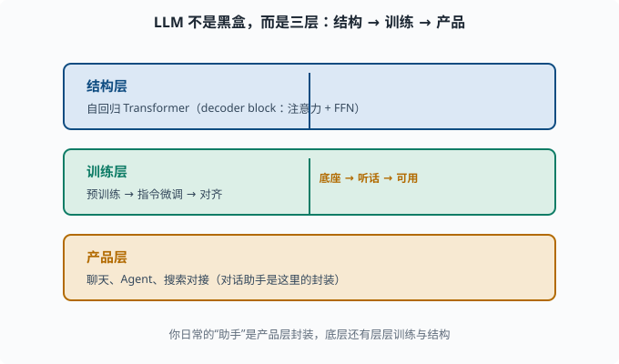
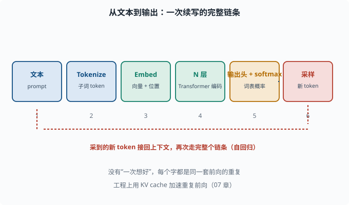
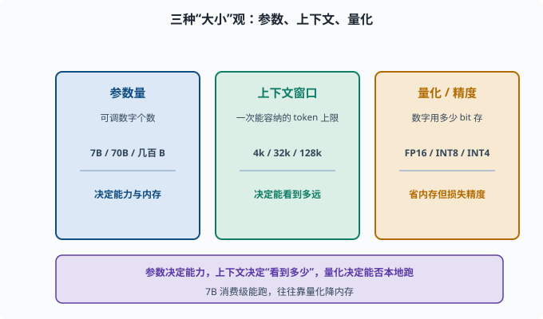
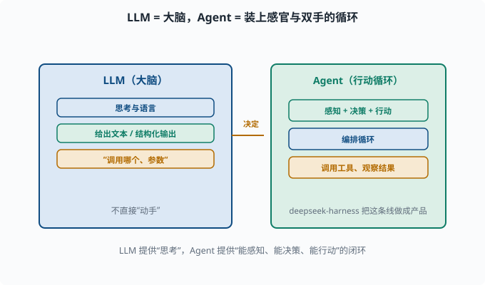

# LLM 是什么：从 Transformer 到"无所不能的续写机"

> 目标：把"大语言模型"这个名词拆成看得见的零件。读完这一页，你能清楚说出 LLM 由什么结构组成、经历哪些训练阶段、以及"对话助手"和"预训练底座"之间的区别。

## 一句话定义

**大语言模型（Large Language Model, LLM）**是一个规模巨大、在超海量文本上预训练、以"预测下一个 token"为核心目标的自回归 Transformer 模型。

拆开看每一个词：

```text
大（Large）    ：参数量常以亿/十亿计，数据量以万亿 token 计
语言（Language）：处理文本（以及 token 化的一切）
模型（Model）   ：一个从一个高维映射到另一个高维的可训练函数
```

它本质上是 [05-06](../05-nlp-transformers/05-06-transformer.md) 的自回归解码器 Transformer，被规模化（[04-09](../04-deep-learning/04-09-distributed.md)、[06-04](06-04-scaling-laws.md)）后涌现出各种惊人能力。

## 宏观图景：LLM 不是"一个黑盒"，是三层

为了不把 LLM 当玄学，先把它拆成三层看：

```text
1. 结构层：自回归 Transformer（60 层左右的 decoder block，注意力+FFN）
2. 训练层：预训练（predict next token）→ 指令微调 → 对齐
3. 产品层：聊天、Agent、搜索对接出的各种应用
```

你日常对话的"GPT-4、DeepSeek、Claude 助手"其实是**产品层**的封装：底层预训练模型 + 对齐后能"应答指令"的模型 + 各种接口/工具。它们不是"一个模型"，而是一条很长的管线。



上图自下而上堆出三层：底层是"结构层"（自回归 Transformer 的结构），中层是"训练层"（预训练 → 指令微调 → 对齐），顶层是"产品层"（聊天、Agent、搜索对接）。从左往右读这三个层级，就能明白"助手"不是单一模型，而是"结构 + 训练 + 封装"组成的一条管线。

## 从输入到输出的"半张脸"

一个 LLM 收到文本后干的事，本质是：

```text
文本 → token（子词）→ embedding（向量）→ N 层 Transformer 编码 → 每个 token 位置的表示
→ 用最后一层表示预测"下一个 token"在整个词表上的概率分布
```

每次只多生成一个 token，然后把它接回上下文，再预测下一个。这样一个字一个字地"续写"，就是你看到的完整回答。这背后每一步（tokenizer、embedding、多层 attention、输出分布）你都在 [05](../05-nlp-transformers/README.md) 里见过了。



上图把这条链从左到右画出来：文本先变成子词 token，再映射成叠加了位置信息的向量，流过 N 层 Transformer 得到上下文表示，经输出头 + softmax 变成词表概率，最后采样出一个新 token。底部红色的回环箭头表示：这个新 token 会被接回上下文、再重复整条链，直到结束。

## 三种"大小"观：参数、上下文、量化

衡量 LLM 时常用三个维度：

| 维度 | 含义 | 例子 |
|---|---|---|
| 参数量 | 模型有多少个可调数字 | 7B（70 亿）、70B、数百 B |
| 上下文窗口 | 一次能处理的 token 数上限 | 4k、32k、128k |
| 量化/精度 | 数字用多少 bit 存 | FP16、INT8、INT4 |

参数越多通常能力越强（[06-04](06-04-scaling-laws.md)），但内存、推理成本也越高。"7B 模型"在消费级显卡上能跑起来，往往是靠**量化**（把权重从 16 位浮点压到 8/4 位整数存，省内存但略损精度）实现的（[07](../07-llm-engineering/README.md) 讲）。



上图把衡量 LLM 常用的三个"大小"维度并排列出：参数量决定"有多少可调数字、能力多强、内存多大"；上下文窗口决定"一次能看到的 token 上限"；量化/精度决定"数字用多少 bit 存"。三者相互牵制——参数越多通常越强但越贵，窗口越长越贵，量化可以省内存但损失少许精度。这也是为什么"7B 模型能本地跑"常常是靠量化换来的。

## 训练三阶段（先一览）

真正"能用"的 LLM 通常经过三个阶段：

```text
1. 预训练：海量文本，学"下一个词"（给底座）
2. 指令微调：教它"按指令干活"（听人话）
3. 对齐：教它"符合人的偏好/价值观"（RLHF 等）
```

每阶段都改变模型的"行为方式"，[06-05](06-05-training-stages.md) 会逐一展开。现在只要记住：**预训练给"知识"，指令微调给"听话"，对齐给"安全"。**

## 为什么 LLM 能"学"语言但也会"编"

一个常见困惑：模型只是"预测下一个词"，凭什么会翻译、写代码、推理？答案在 [06-08](06-08-emergent-capabilities.md)：这些能力是"把预测下一个词学到极致、规模够大"之后**涌现**的副产品。模型内部学到的是"高维语义/计算路径"，不是真的"查搜索引擎"。

也因此它会**幻觉（hallucination）**——把不存在的事也当"预测下一个词"的合理续写编出来。这是 [06-09](06-09-limits-hallucination.md) 和 [11](../11-safety-governance/README.md) 的重要话题。

## LLM 与 Agent 的分工

既然这是学习"Agent 专家"的道路，值得提前划一条线：

```text
LLM：负责"思考与语言"的大脑
Agent：把 LLM 装进一个"能感知、能决策、能行动"的循环
```

LLM 给出文本或结构化输出（比如"要调用哪个工具、参数是什么"），Agent 负责编排循环、调用工具、观察结果、继续思考。这个分工你在 [08](../08-agent-foundations/README.md) 会体会得越来越深，deepseek-harness 正是把这条线做成产品。



上图直观画出分工：左边蓝色是 LLM（大脑），负责"思考与语言"，给出文本或结构化输出，比如"要调用哪个工具、参数是什么"；右边绿色是 Agent（行动循环），负责感知、决策、行动——编排循环、调用工具、观察结果、继续思考。中间的箭头表示"决定"从大脑流向执行者。deepseek-harness 正是把这条"LLM 想、Agent 动"的线做成产品。

## 思考题

1. 用你自己的话给 LLM 下个定义（包含至少三个关键定语）。
2. "预训练底座"和"对话助手"是一回事吗？差在哪？
3. 一次推理里，文本变成输出的完整链条大致是怎样的？
4. 参数量、上下文窗口、量化各指什么？
5. 为什么说 LLM"只是预测下一个 token"却好像什么都会？

## 参考答案

1. LLM 是规模巨大、在超海量文本上预训练、以预测下一个 token 为核心目标的自回归 Transformer 模型。它由 decoder 风格 Transformer、多层自注意力和全连接构成。
2. 不是。预训练底座只会"续写"，懂语言但未必"听话"；对话助手是经过指令微调和对齐后的产品封装，能按指令应答并接上实用接口。二者关系是"底座 → 对齐 → 产品"。
3. 文本 → 子词 token → embedding 向量 → 多层 Transformer 编码 → 每个位置的表示 → 用最后一层预测下一 token 的词表概率 → 采样出一个 token 再接回上下文，循环续写。
4. 参数量是模型可调数字的个数（决定能力与内存）；上下文窗口是一次能容纳的 token 上限（决定能"看到"多远）；量化是用更低位宽存参数（4/8 位）以省内存、加速，但精度略降。
5. 因为在把"预测下一个词"学到极致、规模足够大的过程中，模型内部涌现了语法、语义、常识、推理等高维表示，这些能力成为"做什么都会"的副产品，并非真的检索百科全书或推理符号系统。

## 下一步

- 想看一次推理内部确切的每一步 → [06-02 从输入到输出](06-02-token-through-model.md)。
- 想知道"规模为什么能带来能力"的定量原理 → [06-04 缩放定律](06-04-scaling-laws.md)。
- 想复习底层 Transformer → [05-06 Transformer](../05-nlp-transformers/05-06-transformer.md)。

[返回本章目录](README.md)
