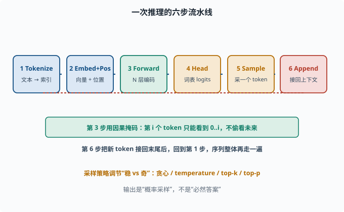
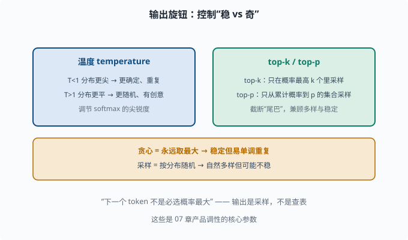

# 从输入到输出：一次推理的完整流程

> 目标：跟着一个 token 走完 LLM 推理的每一步。读完这一页，你能画出"token → embedding → 各层 → 分布 → 采样"的完整链路，并解释为什么输出是"概率采样"而非"必然答案"。

## 一次推理在做什么

给 LLM 一句 prompt，它"思考"然后吐出一段回答。听起来神奇，其实场景内每个 token 都走同一套链条：

```text
1. Tokenize：文本 → token 索引列表
2. Embed  : token 索引 → 向量 + 位置编码
3. Forward: N 层 Transformer 编码，得到每个 token 的表示
4. Head    : 用最后一层输出预测词表概率分布
5. Sample  : 从这个分布里采样出一个新 token
6. Append  : 接回上下文，再走一遍第 2-6 步（自回归；token 已存在，无需重新 tokenize）
```

直到采到"结束 token"或达到长度上限才停。下面逐步拆。



上图把六步流水线画成一条横链：先 tokenize 成索引，再 embedding + 位置编码成向量，接着 N 层 Transformer 前向编码，输出头（Head）算出词表 logits，采样出一个新 token，最后 append 接回上下文。底部绿色框提示第 3 步的因果掩码、以及第 6 步之后会回到第 1 步的自回归循环。

## 第 1 步：Tokenize

文本先被 [05-03](../05-nlp-transformers/05-03-tokenization.md) 的 tokenizer 切成 token，每个 token 查词表得到一个整数索引。

```text
"你好，世界" → [1000, 2001, 101, 3002]（示意索引）
```

这一步决定了模型真正"看"到的原子单位，也决定了长度/成本（[06-07](06-07-context-window.md)）。

## 第 2 步：Embedding + 位置编码

每个 token 索引去查 [05-02](../05-nlp-transformers/05-02-word-representation.md) 的嵌入表，得到 `d_model` 维向量；再叠上 [05-07](../05-nlp-transformers/05-07-positional-encoding.md) 的位置编码，让模型知道顺序。

```python
import torch
import torch.nn as nn

d_model, vocab = 32, 1000
emb = nn.Embedding(vocab, d_model)
pos = nn.Embedding(128, d_model)   # 可学习位置编码（示意）
x = torch.tensor([[100, 200, 300, 400]])   # (1, 4)
positions = torch.arange(x.size(1))
h = emb(x)
h = h + pos(positions)             # 词向量 + 位置向量
print("输入表示形状:", h.shape)      # (1, 4, 32)
```

`h` 的形状是 `(batch, seq_len, d_model)`，就是 Transformer 每一步的输入。

## 第 3 步：逐层编码（Forward）

`h` 依次流过 N 层 decoder block。每层做：

```text
多头自注意力（融合所有位置的信息）+ 残差 + LayerNorm
前馈网络 FFN（每个位置非线性加工）+ 残差 + LayerNorm
```

（完整 block 你已在 [05-06](../05-nlp-transformers/05-06-transformer.md) 看过。）关键：**因果掩码**保证第 i 个 token 的表示只能看到 0..i 的信息，不能偷看它右边的未来 token。

经过多层，最后一层每个位置的向量就携带了"结合上下文的、该位置的深层语义"。

## 第 4 步：输出概率分布

最关键的一步：对最后一个 token 的表示（或训练时针对要预测的下一 token 位置）过一个**输出头（LM Head）**：

```text
最后一个位置表示 → Linear(d_model → vocab) → logits
logits → softmax → 整个词表上的概率分布
```

`logits` 是词表大小的一串分数，`softmax` 后变成"每个 token 是下一个词的概率"。这就是 [06-06](06-06-loss-objective.md) 讲的那个分布。

```python
import torch.nn.functional as F

lm_head = nn.Linear(d_model, vocab)
last_h = h[:, -1, :]                    # 最后位置表示 (1,32)
logits = lm_head(last_h)                # (1, vocab)
probs = F.softmax(logits, dim=-1)       # 概率分布
print("词表概率和:", probs.sum().item())  # ≈ 1.0
```

## 第 5 步：采样一个新的 token

分布算出来了，但**下一个 token 不是"必选概率最大的"**。不同解码策略：

- **贪心（greedy）**：直接取概率最大的 token。稳定但容易单调、重复。
- **采样（sampling）**：按概率分布随机抽。更自然、多样，但可能不稳。
- **top-k / top-p**：只在概率最高的前 k 个（或累计概率到 p）里采样，兼顾多样与稳定。

这些策略（top-k、top-p、temperature）是 [07](../07-llm-engineering/README.md) 的核心参数，你现在先理解"输出 = 采样，不是查表"。

## 第 6 步：自回归循环

新采到的 token 索引**拼回原序列末尾**，整个序列再走一遍第 2-6 步：

```text
[..., 400] → 再次 forward → 新分布 → 采样 → [..., 400, 新token] → ...
```

这就是"一个字一个字蹦出来"的原因：**每个新 token 都要让整个模型重新前向一遍**（虽然工程上有 KV cache 加速——把已算过的历史 K、V 向量缓存起来不重算，[07](../07-llm-engineering/README.md) 讲），代价随序列变长而增长。

## 温度、top-k、top-p 的直觉

几个最常用的"输出旋钮"：

```text
temperature T：调 softmax 的尖锐度
   T<1 → 分布更尖，更确定、重复
   T>1 → 分布更平，更随机、有创意
top-k：只从概率最高的 k 个 token 里采样
top-p：只从累计概率达到 p 的最小集合里采样
```

这些直接控制"稳 vs 奇"，是产品调性的关键。你会反复在 [07](../07-llm-engineering/README.md) 用到。



上图把三个"输出旋钮"归纳在一起：左侧蓝色是温度 temperature，`T<1` 让分布更尖（更确定、易重复），`T>1` 让分布更平（更随机、有创意）；右侧绿色是 top-k / top-p，前者只在概率最高的前 k 个里采样，后者只从累计概率达到 p 的最小集合里采样，用来截断"低概率尾巴"。下方琥珀色再点出对照：贪心永远取最大、稳定但易单调，采样按分布随机、自然多样但可能不稳。这些参数共同决定产品是"稳"还是"奇"。

## 思考题

1. 从文本到新 token，一次推理的六步是什么？
2. 为什么第 i 个 token 的表示要受因果掩码限制？它限制什么、不限制什么？
3. 输出头（LM Head）把什么映射成什么？softmax 之后得到什么？
4. 为什么下一个 token 常常不是"必选概率最大"？采样策略在调节什么？
5. 自回归循环每生成一个新 token 要做什么事？

## 参考答案

1. ① tokenize 成索引；② embedding+位置编码成向量；③ N 层 Transformer 前向编码；④ 用输出头预测词表概率分布；⑤ 采样出一个 token；⑥ 接回上下文再循环。
2. 因果掩码把"未来位置"的注意力分数置为 -inf，softmax 后权重为 0，限制第 i 个 token 只能用 0..i 的信息。它限制"往后看"，不限制"往前往自己"，保证自回归、不偷看答案。
3. 把最后一层表示（d_model 维）线性映射成整个词表的 logits（vocab 维），softmax 后变成词表上的概率分布（和为 1）。它决定了"每个词作为下一个词的可能性"。
4. 因为"下一个词"本质是概率事件，取最大易导致单调重复；采样按分布随机抽，能产生多样、自然的文本。top-k/top-p/temperature 调节"探索与稳定"的平衡。
5. 把新 token 接回序列末端，重新对整个序列做一次 embedding、N 层前向、输出分布再采样，重复直到结束 token 或长度上限。

## 下一步

- 想深挖 tokenizer 的"非词非字"细节 → [06-03 Tokenizer 深入](06-03-tokenizer.md)。
- 想理解语言建模损失对应的数学目标 → [06-06 损失与目标](06-06-loss-objective.md)。
- 想控制采样"稳 vs 奇"的实际参数 → [07 LLM 工程](../07-llm-engineering/README.md)。

[返回本章目录](README.md)
