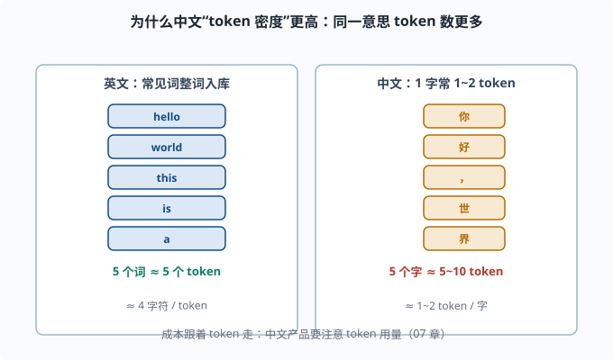
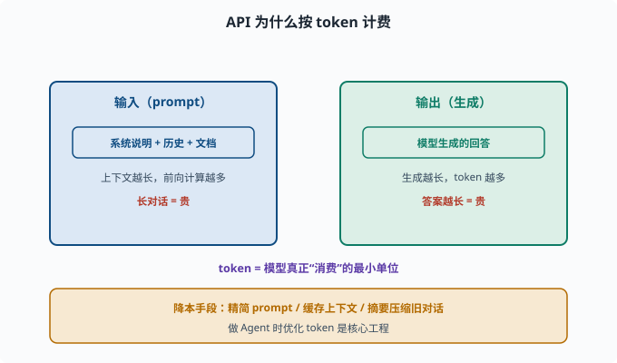

# Tokenizer 深入：为什么"token 不是字也不是词"

> 目标：搞懂 token 到底怎么算、为什么按 token 计费、为什么同一个词在不同模型里 token 数不同。读完这一页，你能估算一段文本的 token 数与成本，也能看懂为什么分词会影响模型的行为。

## 先破除一个直觉误区

很多人以为"token = 字"或"token = 词"。其实**token 是一个模型自己定义的最小编码单元**，介于字和词之间：

```text
词表里有"完整高频词"（如 the、理解）
也有"可复用的片段"（如 un、ing、##ly）
罕见词会被拆成好几个 token
```

同一段文字，不同 tokenizer 会切成不同的 token 序列。所以：

> token 不是自然语言概念，是"模型数学里的说法"。谁长得像词，取决于这个词在训练语料里的频率。

## 一个英文实例

英文里一个 token 可以是一个词：

```text
"hello" → [hello]（1 token）
```

也可以被拆分：

```text
"unhappiness" → [un, happi, ness]（3 个 token）
```

"happi"、"ness" 这种子词被复用到很多词里（happiness、unhappiness、happily），所以"一个词 = 一个 token"是**错觉**，只有常见词才常是一对一。

## 中文为什么"一字多 token"

中文在很多 tokenizer 里一个字（甚至半个字）就是 1~2 个 token。原因：

```text
英文常见词：词表里存完整词 → 一个词 1 个 token
中文：常用汉字/词入词表，但很多字词被切分成 byte 或子词 → 1 个汉字常 1-2 token
```

于是**中文文本通常"token 密度"高于英文**：表达同一段意思，中文用的 token 更多，成本也更高。这是做中文产品和 Agent 时非常实际的成本问题（[07](../07-llm-engineering/README.md)）。



上图左右对照：左边的英文，常见词（hello、world、this、is、a、test）大多整词入库，一个词基本对应一个 token，粗估约 4 个字符一个 token；右边的中文，每个汉字通常就要 1~2 个 token（很多字词被切成子词或 byte 化）。所以表达同样的意思，中文的 token 数往往更多，按 token 计费时成本也更高。

## 估算 token 数的经验法则

没有精确公式，但有粗估：

```text
英文：约 4 个字符 ≈ 1 token
中文：约 1 个汉字 ≈ 1~2 token
```

更可靠的做法是用**模型的 tokenizer 直接数**。HuggingFace 一条命令可查：

```python
from transformers import AutoTokenizer

tok = AutoTokenizer.from_pretrained("gpt2")   # 仅演示计数思路
text = "你好，世界！Hello world! This is a test."
print("token 数量:", len(tok.encode(text)))
print(tok.encode(text))
```

注意：不同模型 tokenizer 不同，**同一个文本在不同模型的 token 数不一样**。想精确知道，就用目标模型自己的 tokenizer 数。

## 为什么按 token 计费

API 计费按 token 而非"字数"，因为：

```text
算力与内存消耗由 token 数决定（上下文越长，前向计算越多）
token 是模型真正"消费"的最小单位
输入 + 输出都被计入
```

于是"你的对话历史越长、回答越长"，成本越高。做 Agent（[08](../08-agent-foundations/README.md)）时，优化 token 用量是降本的关键——这也催生了"精简 prompt、缓存上下文、摘要压缩旧对话"等手段（[07](../07-llm-engineering/README.md)）。



上图把"按 token 计费"的成本模型拆成两块：左侧蓝色是输入（prompt），包含系统说明、历史对话与文档，上下文越长前向计算越多、越贵；右侧绿色是输出（生成），模型回答越长 token 越多也越贵。中间紫色提示：token 是模型真正"消费"的最小单位。底部琥珀色给出降本手段——精简 prompt、缓存上下文、摘要压缩旧对话，这也正是做 Agent 时优化 token 的核心工程。

## Tokenizer 与模型行为的隐藏联系

分词还悄悄影响能力：

- **生僻/细分词**：被拆太碎，模型对它的"整体语义"掌握就差。
- **数字**：有的 tokenizer 把一个数拆成多个 token（如 "2024"→"20","24"），模型算算术就更难。
- **多语言**：低资源语言的词常被拆成很多 byte，模型对该语言的"整词语义"变弱。

这些工程细节解释了为什么"给模型好 token"也是一门手艺，也关乎 [06-09](06-09-limits-hallucination.md) 里的某些失败模式。

## 特殊 token 又见面

真实词表还有一堆特殊 token：

```text
<BOS> 开始、<EOS> 结束、<PAD> 填充
<unk> 未知、<|im_start|>/<|im_end|> 对话建模标记
```

这些标记不表达语义，而是**约定模型"这一段是什么"**（用户话、助手话、系统说明）。你在 [07](../07-llm-engineering/README.md) 和 deepseek-harness 的 prompt 处理里会很常见。

## 思考题

1. 为什么说 token"不是字也不是词"？决定一个 token 长什么样的关键是什么？
2. 中文相比英文，token 密度通常更高还是更低？为什么？
3. 用"4 字符≈1 token"估算，一段 800 个英文字符（含空格）的文本大约多少 token？
4. 为什么 API 按 token 计费而不是按字数？
5. tokenizer 怎样影响模型对"数字""罕见词"的表现？

## 参考答案

1. 因为 token 是模型自定的最小编码单元，常见词整体入库（像词），罕见词被拆成子词/byte（像字根）。决定一个 token 长什么样的是"该片段在训练语料里的频率"。
2. 通常更高。中文一个汉字常需要 1~2 个 token，因为很多字词并非整词入库或被 byte 化；而英文常见词常整体一个 token，所以表达同样意思中文 token 数更多。
3. 按 4 字符≈1 token，800 字符约 200 token。这只是一个粗估，实际以目标模型 tokenizer 为准。
4. 因为模型的计算量、内存、上下文消耗都由 token 决定，token 是模型真正消费的最小单位；输入输出都算 token，故按 token 计价最能反映真实成本。
5. 生僻词被拆碎时模型对整体语义掌握下降；数字在 tokenizer 里可能被拆成多个 token 导致算术变难；低资源语言被 byte 化时整词语义变弱。

## 下一步

- 想理解"规模"如何带来能力与成本 → [06-04 缩放定律](06-04-scaling-laws.md)。
- 想控制采样与 token 成本 → [07 LLM 工程](../07-llm-engineering/README.md)。
- 想复习子词分词原理 → [05-03 子词分词](../05-nlp-transformers/05-03-tokenization.md)。

[返回本章目录](README.md)
