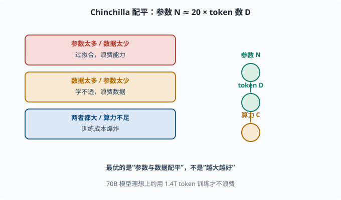
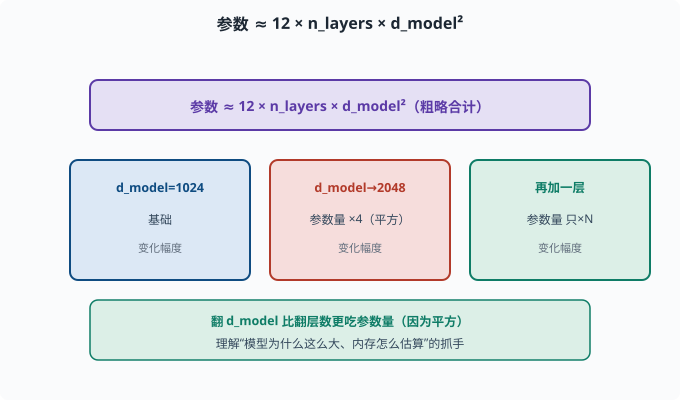

# 缩放定律：为什么"越大越好"、又有什么代价

> 目标：把"模型越大越聪明"从口号变成定量关系。读完这一页，你能说出参数、数据、算力如何共同决定性能，也能理解为什么行业疯狂追求规模与它的代价。

## 规模到底扩大什么

深度学习有个经验事实：当把三样东西一起放大时，模型变聪明的速度惊人：

```text
参数量 N（模型宽度/深度）
训练数据 token 数 D
计算量 C（训练所用算力）
```

**缩放定律（Scaling Laws，缩放=规模化）**研究的就是：在固定预算下，怎么分配 N、D、C 能得到最佳模型。

## Chinchilla 的著名结论：数据要和参数同步涨

早期大家疯狂加参数量，但 [DeepMind Chinchilla（2022）](https://arxiv.org/abs/2203.15556) 研究发现了一个"配平"规律：

```text
最优时，训练 token 数 D ≈ 20 × 参数量 N
（在固定计算预算下，约每 1 个参数配 20 个 token 最优）
```

也就是说：**不是参数越多越好，而是参数和数据要成比例。** 一个 70B 模型，理想上要用约 1.4T（万亿）token 训练才不浪费参数。这也是 2022 后行业"重新用更少参数、更多数据"训练的转向根源。

## 三个典型结论

缩放定律的一些核心观察：

```text
1. 损失随计算量幂律下降：log 损失 ≈ 对数线性下降（早期），然后饱和
2. 幂律：计算量翻倍，收益有限且递减
3. 涌现：某些能力只在规模跨过阈值后才"突然出现"
```

最重要的是一个朴素却深刻的点：

> 在给定计算预算 B 下，最佳模型不是"最大模型"，而是"参数与数据配平的那个"。

这和"越大越好的直觉"微妙不同——它强调的是**系统配平**。

## 参数、数据、算力如何互相约束

三者互相牵制：

```text
参数太多、数据太少 → 过拟合，浪费能力
数据太多、参数太少 → 学不透，浪费数据
两者都大 → 算力不够（训练时间/成本爆炸）
```



上图左边列出三组失配的情形：参数太多/数据太少会过拟合，数据太多/参数太少学不透，两者都大而算力不足则训练成本爆炸。右边则是理想状态——参数 N、token 数 D、算力 C 三者互相配平。"最优的是参数与数据配平"这句话，正是把你从"越大越好"的直觉拉回到"系统配平"的关键。

工程上理想状态是"参数、token、算力三者刚好匹配"，这在 [04-09](../04-deep-learning/04-09-distributed.md) 和 [07](../07-llm-engineering/README.md) 会落到具体成本计算。

## 一个粗略的参数量估算

对普通 Transformer，参数量可大致估算为：

```text
参数 ≈ 12 × n_layers × d_model²   （注意力 + FFN + 嵌入的粗略合计）
```

例如 32 层、d_model=4096：

```text
12 × 32 × 4096² ≈ 6.4B（约 64 亿）
```

这个公式让你看到"翻 d_model"比"翻层数"更吃参数量（因为平方），是理解 [07](../07-llm-engineering/README.md) 中"模型为什么这么大、内存怎么估算"的抓手。



上图用"翻一倍"的手感演示平方效应：顶部给出公式 `参数 ≈ 12 × n_layers × d_model²`；中间三个格子横向对比——`d_model` 从 1024 翻到 2048 时，因为平方关系，参数量大约变成原来的 4 倍；而只多加一层，参数量只按层数线性增加。底部绿色条总结：翻 `d_model` 比翻层数"贵得多"，这正是估算"模型为什么这么大、显存怎么办"的关键直觉。

## 规模带来的"涌现"与代价

规模增大虽带来能力跃升（[06-08](06-08-emergent-capabilities.md)），也带来实际代价：

```text
训练成本：几十亿到几十亿美元级算力
推理成本：参数越多每次推理越贵、越慢
内存/显存：参数×精度 决定能否本地跑
对齐难度：更大模型更难可控、更易幻觉
```

所以"越大越好"要在这三个维度上权衡，这也是为什么现实中存在 7B/70B/数百 B 的多种选择——**没有免费午餐，越大的模型越贵越难伺候。**

## 用代码体会"数据×参数"配平

灵感来自 Chinchilla 的直觉，可以做一个思想实验：训练同样预算下，固定参数而加数据，看收益递减：

```python
import numpy as np

# 模拟"训练损失随数据量幂律下降"
params = 1e9  # 示意：10 亿参数
for d in [1e8, 1e9, 1e10, 1e11, 1e12]:
    # 简化模型：数据翻倍，损失改善量递减
    loss_decrease = 1.2 * (d / params) ** -0.07
    print(f"D={d:.0e} token, 约损失水平 {loss_decrease:.4f}")
```

（这只是教学示意，不精确。）它传达的要点是：**初期加数据收益大，后期收益递减**，所以要在"参数多学得精"与"数据够覆盖"之间找平衡。

## 思考题

1. 缩放定律里的三个核心变量是什么？
2. Chinchilla 得到的"配平"关系大致是什么？
3. 为什么"更大模型"不是无条件的更好？
4. 用 `参数≈12×n_layers×d_model²` 估算一个 24 层、d_model=512 的模型约多少参数？
5. 规模化带来哪些"现实代价"？

## 参考答案

1. 参数量 N、训练 token 数 D、计算量 C（算力/预算）。
2. 最优时训练 token 数 D ≈ 20×参数量 N（固定计算预算下每参数约配 20 token），强调参数与数据要成比例，而非参数越多越好。
3. 因为参数多却数据不足会过拟合、浪费能力；只加参数不加数据收益递减；且更大模型推理更贵、更慢、更易幻觉和更难对齐。
4. `12 × 24 × 512² ≈ 12×24×262144 ≈ 7.5e7`，约 75M（7500 万）。这是只计注意力和 FFN 主项的粗估，省略了嵌入、LM Head、偏置等，真实模型会更大。
5. 训练算力/成本巨大、推理更贵更慢、显存内存需求高、对齐与可控性更难、幻觉风险更大。因此要在能力与成本间权衡，现实中存在多种规模的选择。

## 下一步

- 想了解"训练分几个阶段、每阶段改什么" → [06-05 训练三阶段](06-05-training-stages.md)。
- 想把这些估算落到成本与工程 → [07 LLM 工程](../07-llm-engineering/README.md) 与 [04-09 分布式](../04-deep-learning/04-09-distributed.md)。
- 想看"规模涌现"的能力光谱 → [06-08 能力从何而来](06-08-emergent-capabilities.md)。

[返回本章目录](README.md)
