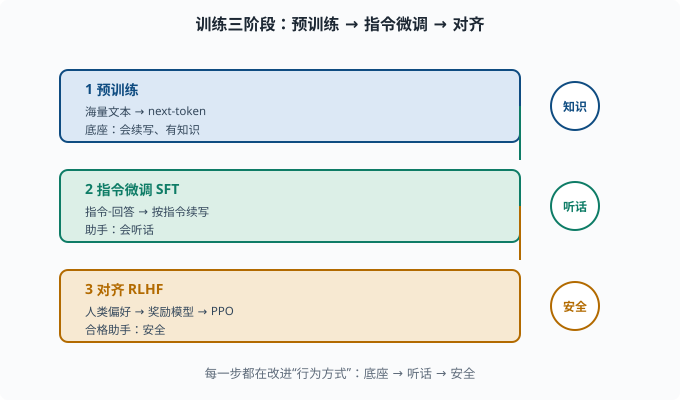
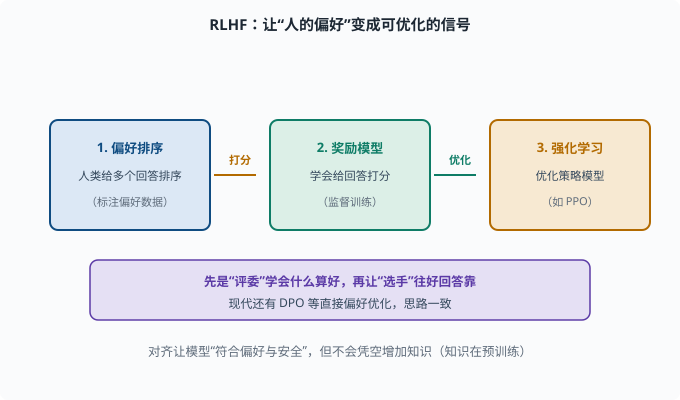

# 训练三阶段：从"会接词"到"会干活"

> 目标：把"预训练、指令微调、对齐"这三步讲清楚：每一步在改什么、为什么需要下一步。读完这一页，你能解释为什么只做预训练不能直接当"助手"用，也知道 RLHF 大概在做什么。

## 三阶段总览

一个"能用"的 LLM 不是一次训练就能造出来的，通常经历三阶段：

```text
1. 预训练（Pretraining）：海量文本 → 学"预测下一个词"
2. 指令微调（Instruct tuning / SFT）：教"按指令干活"
3. 对齐（Alignment）：教"符合人的偏好与安全"
```

一句话记忆：

```text
预训练给知识，指令微调给听话，对齐给安全。
```



上图把三个阶段纵向排开：预训练用海量文本把模型变成"会续写、有知识"的底座；指令微调（SFT）用"指令-回答"数据把它变成"会听话"的助手；对齐（RLHF）用人类偏好把它变成"安全"的合格助手。右侧每个阶段的关键词（知识、听话、安全）就是这一阶段主要改变的东西。

## 阶段一：预训练（Pretraining）

**目标**：用超海量文本（如数万亿 token），以 next-token 目标训练一个底座模型。

```text
输入：任意互联网文本
目标：预测下一个 token（语言建模损失，见 06-06）
```

这一阶段的产物是一个"续写机"：它懂语言、有很多世界知识，但**不会主动"听指令"**。你让它预测"三国演义是____"，它接"一部小说"没问题；但你想让它"给你概括一句话"，它可能只是往奇怪方向续写。

预训练特点：

- 数据海量、成本极高（需分布式训练，[04-09](../04-deep-learning/04-09-distributed.md)）。
- 损失是 [06-06](06-06-loss-objective.md) 的交叉熵。
- 学习率常用 warmup + cosine（[04-05](../04-deep-learning/04-05-optimizers.md)）。

预训练得到的是"底座（base model）"，也叫预训练模型。它还不像"助手"。

## 阶段二：指令微调（SFT）

预训练底座"会续写但不会听话"。**指令微调（Supervised Fine-Tuning, SFT）**用"指令-回答"的配对数据，教它按指令产出：

```text
数据：(指令, 期望回答)
目标：给定指令开头，让模型续写出"期望回答"（仍然用 next-token 损失）
```

例子：

```text
"给一段话写摘要：..." → "这段主要讲……"
```

SFT 本质上还是"预测下一个 token"，但**数据的形态变成了"指令→回答"**，于是模型学会"当看到指令时，应该产出一段回答，而不是随便续写"。这一步把"续写机"变成"会话助手"。

关键点：SFT 质量取决于**数据质量**，一小批高质量"指令-回答"对，往往比海量低质量数据更有效。

## 阶段三：对齐（Alignment，含 RLHF）

SFT 之后模型"会听话"了，但它可能说有害的话、编造答案、车轱辘话。**对齐**的目标是让模型的行为**符合人的期望与价值观**，不只是"会回答"。

最常见的对齐方法是 **RLHF（Reinforcement Learning from Human Feedback，基于人类反馈的强化学习；强化学习见 [01 章](../01-math-foundations/README.md) 之外的 [08](../08-agent-foundations/README.md) 语境，这里只需理解为"用奖励信号训练模型"）**，大致三步：

```text
1. 用"好回答"奖励信号：收集人类对多个回答的偏好排序
2. 训一个"奖励模型（reward model）"：学会给回答打分
3. 用强化学习（如 PPO——一种"小步更新、不让策略突变"的强化学习算法）调整模型，让它产出高奖励的回答
```

用图表示：

```text
人类偏好评级 → 奖励模型 → 强化学习优化策略模型 → 更"合格"的助手
```

RLHF 的直觉也不是玄学：**先让"评委"（奖励模型）学会"什么算好回答"，再让"选手"（策略模型）往好回答的方向靠。**

现代还有更好的替代（如 DPO 直接偏好优化），但思路一致：把"人的偏好"变成可优化的信号。安全细节在 [11](../11-safety-governance/README.md)。



上图把 RLHF 的三步串成一条流水线：第一步收集人类对多个回答的偏好排序；第二步训练一个"奖励模型"，学会给回答打分；第三步用强化学习（如 PPO）优化策略模型，让它产出高奖励、更符合偏好的回答。中间的箭头"打分""优化"标明数据怎么流动。紫色底部条点出这段话的精髓：先让"评委"学会什么算好，再让"选手"往好回答的方向靠。这也是为什么对齐能改变"行为方式"，却不会凭空增加知识。

## 三阶段的"角色分工"速记

| 阶段 | 数据 | 目标 | 得到的模型 |
|---|---|---|---|
| 预训练 | 海量无标注文本 | 预测下一个词 | 底座（会续写） |
| SFT | 指令-回答对（标注） | 按指令续写 | 助手（会听话） |
| 对齐 | 人类偏好/奖励 | 产出符合偏好的回答 | 合格助手（安全） |

## 为什么"知识"在预训练、而"听话"在对齐

一个常见误区是"对齐让模型变聪明"。其实：

```text
世界知识与推理能力主要来自预训练（海量文本）
SFT/对齐主要改变"行为方式"（要不要答、怎么表达、守不守规矩）
```

所以一个模型"知识多不多"主要看预训练，"好不好用"看后两阶段。这也是为什么"微调不能凭空造知识"——后两阶段是在"已有能力"上做行为上的引导。

## 思考题

1. 预训练的目标和产物分别是什么？
2. 为什么预训练底座不能直接当"助手"用？
3. SFT 用的数据和损失各是什么？它本质在改模型的什么？
4. RLHF 的三步大致是什么？
5. 为什么说"对齐不会让模型变聪明"？

## 参考答案

1. 目标是海量文本上的 next-token 语言建模损失；产物是一个"会续写、懂语言、有世界知识"的底座模型，但不主动按指令工作。
2. 因为底座只会"预测下一个词"，没有学"见到指令要产出一段回答"的行为。让它概括、问答，它倾向于随便续写而非按指令回应。
3. 数据是"指令-回答"配对（人工标注）；损失仍是 next-token 交叉熵，只是把"指令开头续写出期望回答"变成数据形态。它改变的是模型"见到指令如何作答"的行为方式。
4. ①收集人类对多个回答的偏好排序；②训练奖励模型把偏好变成打分；③用强化学习（如 PPO）优化策略模型，让其产出高奖励（更符合偏好）的回答。
5. 因为世界知识与推理能力主要来自预训练的海量文本；SFT/对齐改变的是"行为方式"（回答的形态、边界、安全、偏好），并不凭空增加知识。

## 下一步

- 想深挖"训练目标到底在优化什么" → [06-06 损失与目标](06-06-loss-objective.md)。
- 想把这些阶段落到实操（微调、RLHF、DPO）→ [07 LLM 工程](../07-llm-engineering/README.md)。
- 想研究对齐的安全维度 → [11 安全与治理](../11-safety-governance/README.md)。

[返回本章目录](README.md)
