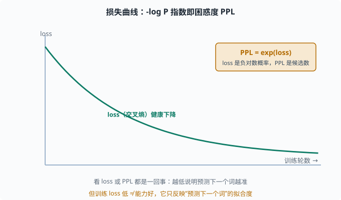
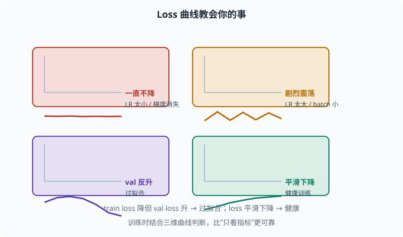

# 损失与目标：语言建模损失到底在学什么

> 目标：把 LLM 训练的目标函数从"预测下一个词"落到具体的交叉熵公式。读完这一页，你能看懂 `-log P(真实下一个 token)`、困惑度与 loss 曲线的关系，也知道"训练 loss 低"和"能力好"的区别。

## 语言建模损失就一句话

LLM 训练的核心目标不是"判断对错"，而是：

> 让模型给真实文本序列分配尽可能高的概率。

等价地（取负对数），最小化交叉熵：

```text
L = - log P(真实下一个 token | 前文)
```

它和 [04-04](../04-deep-learning/04-04-loss-functions.md) 的 softmax+交叉熵是同一回事，只是"类别"换成了整个词表、"输入"换成了前文上下文。

## 损失为什么是"负对数概率"

假设模型预测下一个词是"cat"的概率是 0.8，真实答案确实是 "cat"：

```text
L = -log(0.8) ≈ 0.22   （小，因为它预测对了）
```

如果预测正确概率只有 0.1：

```text
L = -log(0.1) ≈ 2.30   （大，因为错得很自信/不确定）
```

所以：

```text
模型越确信"真实的下一个词"，损失越小
模型越不确信（概率低），损失越大
```

这正是"让真实文本概率最大"的等价写法。

## 对整个序列累加损失

一个序列的完整损失是**每个位置**交叉熵的均值：

```text
L = (1/T) * Σ_t -log P(w_t | w_1..w_{t-1})
```

训练时，batch 里每条序列每个位置都算一遍"猜下一个词"的损失，然后平均。每个位置都是一个独立的"分类问题"，模型要处处都会"猜"，才学得好。

## 损失和困惑度的关系：PPL

损失（交叉熵）取指数就是**困惑度（Perplexity）**：

```text
PPL = exp(L)
```

回忆 [05-01](../05-nlp-transformers/05-01-lm-basics.md)：

```text
PPL = 1   → 每步都精确锁定下一个词
PPL = N   → 平均在 N 个候选词之间"拿不准"
```

所以 loss 和 PPL 是同一件事的两种标度：loss 是"平均负对数概率"，PPL 是"平均候选数"。看训练曲线时，看 loss 或 PPL 都行。



上图演示一条健康的损失曲线：随着训练推进，交叉熵 loss 平滑下降，说明模型"预测下一个词"越来越准。右上角的琥珀色小块提醒你 `PPL = exp(loss)`——两者是同一件事的两种标度，一个看"负对数概率"，一个看"平均候选数"，越低越好。

## Loss 曲线教会你的事

训练时你会看到 loss 随时间变化，它暴露很多问题：

```text
loss 一直不降     → 学习率太小、结构问题、梯度消失
loss 震荡剧烈     → 学习率太大、batch 太小、梯度不稳
train loss 降但 val loss 升 → 过拟合（数据不够/正则不足）
loss 平滑下降     → 正常的健康训练
```

这些诊断在 [03-09](../03-machine-learning/03-09-learning-curves.md)（学习曲线）和 [04-06](../04-deep-learning/04-06-training-tricks.md)（训练技巧）都铺垫过，LLM 训练也一样。



上图把四种典型的 loss 曲线画在一起：左上是"一直不降"（学习率太小或梯度消失）、右上是"剧烈震荡"（学习率太大或 batch 太小）、左下是"train 降但 val 反升"（过拟合）、右下是"平滑下降"（健康训练）。每张小图右侧都有对应的诊断。结合多维度曲线看，而不是只看单一指标，能帮你更快定位训练出的问题。

## 一个能算 loss 的最小例子

```python
import torch
import torch.nn.functional as F

logits = torch.tensor([[2.0, 1.0, 0.1]])    # 模型预测的分数（3 个词）
target = torch.tensor([0])                   # 真实下一个词是 0 号
loss = F.cross_entropy(logits, target)
print("损失:", loss.item())                  # -log softmax 第0项概率

# 手工验证
p = torch.softmax(logits, dim=-1)
print("真实词概率:", p[0, 0].item())
print("手算 -log p:", (-torch.log(p[0, 0])).item())
```

`cross_entropy(logits, target)` 内部帮你做了 softmax + 取负对数，返回的就是 `-log(真实 token 概率)`。

## 一个关键认知："loss 低 ≠ 能力好"

这是经常被误解的一课：

```text
loss 低   → 模型"预测下一个词"与训练分布高度一致
能力好   → 在任务上真正有用、可靠、不胡说
```

一个模型可以"训练 loss 很低"（背熟了训练分布），但：

- 泛化到真实场景差。
- 指令理解差。
- 爱说胡话、幻觉。

所以**训练 loss 只是"预训练拟合度"的指标，不等于"助手好不好用"**。真正好不好用要看下游评估（[07](../07-llm-engineering/README.md) 讲 benchmark、人类评测）。

## 思考题

1. 语言建模损失的目标函数本质是什么？
2. 为什么用"负对数概率"而不是直接用概率？概率大时损失如何变？
3. PPL 和 loss 的关系是什么？PPL=100 代表什么？
4. 一段序列的训练损失是怎么从每个 token 算出来的？
5. 为什么"训练 loss 低"不等于"模型能力好"？

## 参考答案

1. 本质是"让模型给真实文本分配尽可能高的概率"，等价于最小化每个位置"真实下一个 token"的负对数概率（交叉熵），覆盖整个词表的下一 token 预测。
2. 因为直接用概率在数值上不好优化（接近 0/1 时梯度微弱），且负数让"越大越好"变成"越小越好"更统一。真实词概率越大，`-log` 越小，损失越低。
3. `PPL = exp(loss)`。PPL=100 表示模型平均在约 100 个候选 token 之间拿不准，不确定度较高；越低越好。
4. 对每个位置 t 都先看 1..t-1 的上下文，预测 w_t 的概率并算 `-log P(w_t|前文)`，再把所有位置的负对数概率取平均，得到序列的整体损失。
5. 因为训练 loss 只反映"预测下一个词"与训练分布的拟合度，不代表在真实任务上的可用性、鲁棒性或可靠性。背熟训练分布可以 loss 很低但泛化差、爱幻觉、不听指令。

## 下一步

- 想理解"上下文窗口"的边界与代价 → [06-07 上下文窗口](06-07-context-window.md)。
- 想把 loss 概念落到评估与调参 → [07 LLM 工程](../07-llm-engineering/README.md)。
- 想复习困惑度的语言模型直觉 → [05-01 语言模型基础](../05-nlp-transformers/05-01-lm-basics.md)。

[返回本章目录](README.md)
