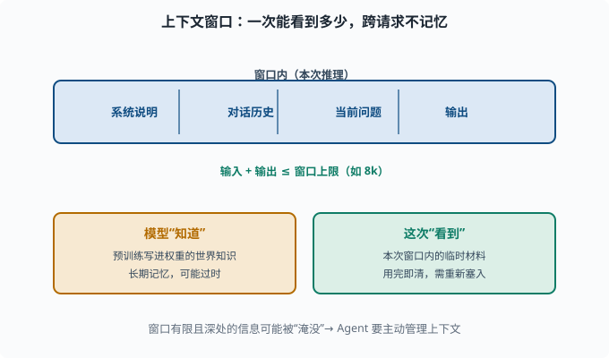
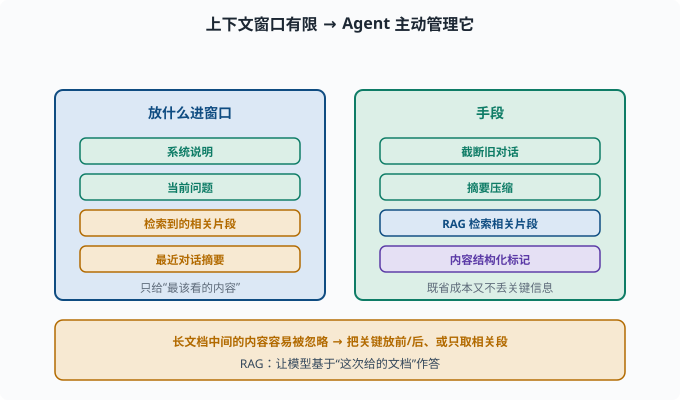

# 上下文窗口：模型"一次能看多远"与它的边界

> 目标：搞懂上下文窗口是什么、为什么有限、以及它与"模型知识"的区别。读完这一页，你能说清"为什么回答与你的对话历史有关、却不记得上上次对话"，也知道 Agent 为什么总在处理窗口被塞满的问题。

## 什么是上下文窗口

**上下文窗口（context window）**是 LLM 一次推理中能"看到"的最大 token 数。模型只能基于窗口内的内容来预测下一个词。

```text
我的窗口是 8k token
输入（prompt + 历史） + 输出 ≤ 8k
超出部分会被截断或忽略
```

这个窗口**在下一次独立推理时清零**——模型不跨请求记忆。你新开一个对话，它"忘"了上一个对话，除非你把旧内容重新放进窗口。

## 窗口与"知识"是两回事

一个常见的混淆：

```text
模型"知道"什么 = 预训练时学到的权重记忆（世界知识）
模型"能看到"什么 = 本次推理的上下文窗口（临时信息）
```

关键区别：

- **预训练知识**是"记住的常识"，但可能过时或不准确。
- **上下文窗口**是"你这次给的临时材料"，如要处理的文档、对话历史。

所以不能指望模型"自己知道"你最近的事，但要让它用某份文档，就需要**把文档塞进上下文**。这正是 RAG（检索增强）的思路（[07](../07-llm-engineering/README.md)）。



上图上方画出一条"本次推理的窗口"，里面装着系统说明、对话历史、当前问题和输出，且"输入 + 输出 ≤ 窗口上限"。下方左右两个框则区分了两个概念：模型"知道"的是预训练写进权重的世界知识（长期但可能过时），而"这次看到"的是窗口内的临时材料（用完即清、需重新塞入）。这正是 RAG 和 Agent 要管理上下文的根本原因。

## 为什么窗口会"满"

窗口有限的原因：

```text
注意力计算成本随序列长度平方或线性增长（长程 attention 成本高）
显存/内存有限
单请求的 token 预算 = prompt + 生成输出
```

所谓"上下文窗口"对产品的影响：

```text
长了：能放更长的文档、更多对话历史，但单次成本更高、更慢
短了：长文档会塞不下，需截断/摘要/检索
```

很多产品"看似记得上上次对话"，其实是通过**摘要旧对话 / 检索相关片段**，把旧信息重新塞进当前窗口，而不是模型真的"记得"。

## 找不到 / 忽略：窗口内的内容也会"漏"

即便信息在窗口内，模型也可能**忽略靠近窗口中间的"长上下文"信息**。这是个未被完美解决的现象：给模型塞 50k 个 token 的文档，问深处的一条事实，它常常"没看到"。

原因与注意力分配有关：太长上下文里，各自的注意力权重被稀释，关键信息容易被"淹没"。应对手段（[07](../07-llm-engineering/README.md)）：把关键信息放前面/后面、用 RAG 只取相关片段、内容做结构化标记。

这个现象在文献里常被叫作"迷失在中间"（lost in the middle）：对长文档做"某事实在第几段"的探针测试，准确率呈 **U 形曲线**——开头和结尾的事实记得牢，中间的明显差。两个直觉解释：训练数据天然"重要信息靠前/靠后"（开头是导语、结尾是结论），以及注意力 softmax 在超长序列上把权重摊薄。工程结论很朴素：**位置就是注意力预算**——你要模型一定看到的东西，要么放最前，要么放最后，要么干脆别让它在中段陪跑。

## KV cache：长上下文的另一笔账

理解窗口成本，还要知道推理侧有个 **KV cache（键值缓存）**：注意力计算需要每个历史 token 的 Key/Value 向量（[05-05 注意力](../05-nlp-transformers/05-05-attention.md) 的 QKV），如果每生成一个新 token 都重算全部历史的 K/V，代价是平方级的。所以推理引擎把算过的 K/V 存下来复用——这就是"为什么多轮对话越聊越慢/越贵"的机制根源：缓存随历史增长，显存和计算都随之上升。窗口上限在很大程度上就是**KV cache 的显存上限**。

## 成本模型：为什么"长上下文"贵

API 按 token 计费（[06-03](06-03-tokenizer.md)），窗口越长意味着：

```text
每次请求的输入 = prompt + 历史 + 文档
输出 = 模型生成的回答
两者都要计费
```

所以做 Agent 时，**窗口管理**是降本增效的核心：该塞的塞、该省略的省略、该检索的检索。deepseek-harness 里对工具结果、会话历史的处理都围绕这个展开（[08](../08-agent-foundations/README.md)、[10](../10-practical-lab/README.md)）。



上图把窗口管理归纳成"放进什么"和"用什么手段"两块：左侧蓝色列举应放进窗口的内容——系统说明、当前问题、检索到的相关片段、最近对话的摘要；右侧绿色列举手段——截断旧对话、摘要压缩、用 RAG 检索相关片段、对内容做结构化标记。底部琥珀色还有个重要提醒：长文档中间的内容容易被忽略，所以要把关键信息放在显眼位置、或只取相关片段。窗口管理的本质就是"只给模型最该看的内容"。

## 一个"记忆清理"的思考实验

假设你和一个 Agent 对话，第 1 问"帮我查北京的天气"，第 2 问"那后天呢？"。模型第 2 问能答对，不是因为它"记着第 1 问"，而是因为**产品把第 1 轮对话一起塞进了第 2 轮的窗口**：

```text
第 2 轮输入 = 系统说明 + 第 1 轮(用户+助手) + "那后天呢？"
```

如果第 1 轮太旧被截断，模型就不知道"那"指什么。这就是为什么 Agent 要认真管理上下文，也说明"记忆"的实现是工程，不是模型自带的魔法。

把这个实验做绝一点：一个跑了几百步的 Agent，中间满是工具输出。如果全量保留，窗口和 KV cache 都会爆；如果简单截断，早期"用户到底要什么"的原始指令可能被切掉，Agent 从此在错误的轨道上狂奔。deepseek-harness 的答案是**压缩（compaction）**：把旧历史摘要成保留要点的高密度块，替换原文再继续——既守住窗口预算，又保住任务的目标与约束。这正是 [08-04 记忆系统](../08-agent-foundations/08-04-memory-systems.md) 三层记忆的工程化形态。

## 思考题

1. 什么是上下文窗口？一次独立推理结束后它还在吗？
2. "模型知道"和"模型这次能看到"有什么区别？
3. 为什么窗口会满、长上下文贵？
4. 为什么信息在窗口内也可能被"漏掉"？
5. Agent 为什么需要主动管理上下文（摘要、截断、检索）？

## 参考答案

1. 上下文窗口是一次推理能处理的 token 数上限（输入+输出）。每次独立推理结束窗口即清空，模型不跨请求记忆，除非把旧内容重新放进窗口。
2. "知道"指预训练学进权重的世界知识；"这次能看到"指本次窗口内的临时材料。前者是长期记忆，后者是一次性输入，两者来源和生命周期不同。
3. 窗口有限一是注意力计算/显存随序列增长成本高，二是单请求 token 预算有限。越长窗口单次更贵、更慢；产品上需截断、摘要或检索来应对"塞不下"。
4. 因为长上下文中每个位置被分配的注意力会被大量内容稀释，深处的关键信息权重过低，模型可能"看到了却没注意"，导致漏答或答错。
5. 因为窗口有限、计费按 token、且长文的中间信息容易被忽略。Agent 通过摘要旧对话、截断、用 RAG 检索相关片段，把"最该看的内容"精炼地放进窗口，保证既省成本又不丢关键信息。

## 下一步

- 想搞清楚"能力从何而来 / 会凭空冒出来吗" → [06-08 能力从何而来](06-08-emergent-capabilities.md)。
- 想落地进行窗口管理 / RAG / 摘要 → [07 LLM 工程](../07-llm-engineering/README.md)。
- 想了解 Agent 如何组织记忆（工具、会话） → [08 Agent 基础](../08-agent-foundations/README.md)。

[返回本章目录](README.md)
